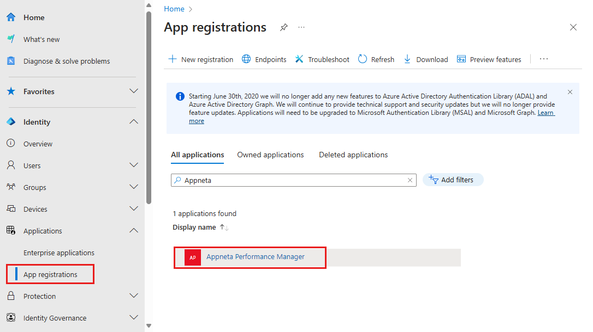

# Configure AppNeta Performance Manager for Single sign-on with Microsoft Entra ID

In this article,  you learn how to integrate AppNeta Performance Manager with Microsoft Entra ID. When you integrate AppNeta Performance Manager with Microsoft Entra ID, you can:

- Control in Microsoft Entra ID who has access to AppNeta Performance Manager.
- Enable your users to be automatically signed-in to AppNeta Performance Manager with their Microsoft Entra accounts.
- Manage your accounts in one central location.

## Prerequisites

The scenario outlined in this article assumes that you already have the following prerequisites:

[!INCLUDE [common-prerequisites.md](~/identity/saas-apps/includes/common-prerequisites.md)]
- AppNeta Performance Manager single sign-on (SSO) enabled subscription.

## Scenario description

In this article,  you configure and test Microsoft Entra SSO in a test environment.

- AppNeta Performance Manager supports **SP** initiated SSO.
- AppNeta Performance Manager supports **Just In Time** user provisioning.

> [!NOTE]
> Identifier of this application is a fixed string value so only one instance can be configured in one tenant.

## Adding AppNeta Performance Manager from the gallery

To configure the integration of AppNeta Performance Manager into Microsoft Entra ID, you need to add AppNeta Performance Manager from the gallery to your list of managed SaaS apps.

1. Sign in to the [Microsoft Entra admin center](https://entra.microsoft.com) as at least a [Cloud Application Administrator](~/identity/role-based-access-control/permissions-reference.md#cloud-application-administrator).
1. Browse to **Entra ID** > **Enterprise apps** > **New application**.
1. In the **Add from the gallery** section, type **AppNeta Performance Manager** in the search box.
1. Select **AppNeta Performance Manager** from results panel and then add the app. Wait a few seconds while the app is added to your tenant.

 [!INCLUDE [sso-wizard.md](~/identity/saas-apps/includes/sso-wizard.md)]

## Configure and test Microsoft Entra SSO for AppNeta Performance Manager

Configure and test Microsoft Entra SSO with AppNeta Performance Manager using a test user called **B.Simon**. For SSO to work, you need to establish a link relationship between a Microsoft Entra user and the related user in AppNeta Performance Manager.

To configure and test Microsoft Entra SSO with AppNeta Performance Manager, perform the following steps:

1. **[Configure Microsoft Entra SSO](#configure-azure-ad-sso)** - to enable your users to use this feature.
   1. **Create a Microsoft Entra test user** - to test Microsoft Entra single sign-on with B.Simon.
   1. **Assign the Microsoft Entra test user** - to enable B.Simon to use Microsoft Entra single sign-on.
1. **[Configure AppNeta Performance Manager SSO](#configure-appneta-performance-manager-sso)** - to configure the single sign-on settings on application side.
   1. **[Create AppNeta Performance Manager test user](#create-appneta-performance-manager-test-user)** - to have a counterpart of B.Simon in AppNeta Performance Manager that's linked to the Microsoft Entra representation of user.
1. **[Test SSO](#test-sso)** - to verify whether the configuration works.

## Configure Microsoft Entra SSO

Follow these steps to enable Microsoft Entra SSO.

1. Sign in to the [Microsoft Entra admin center](https://entra.microsoft.com) as at least a [Cloud Application Administrator](~/identity/role-based-access-control/permissions-reference.md#cloud-application-administrator).
1. Browse to **Entra ID** > **Enterprise apps** > **AppNeta Performance Manager** > **Single sign-on**.
1. On the **Select a single sign-on method** page, select **SAML**.
1. On the **Set up single sign-on with SAML** page, select the pencil icon for **Basic SAML Configuration** to edit the settings.

   

1. On the **Basic SAML Configuration** section, enter the values for the following fields:

   a. In the **Sign on URL** text box, type a URL using the following pattern:
   `https://<subdomain>.pm.appneta.com`

   b. In the Reply URL (Assertion Consumer Service URL) field, enter:
   `https://access.broadcom.com/default/saml/v1/sp/acs`

   > [!NOTE]
   > The Sign-on URL value above is an example. Update this value with the actual Sign-On URL. Contact [AppNeta Performance Manager customer support team](mailto:support@appneta.com) to get this value. You can also refer to the patterns shown in the **Basic SAML Configuration** section.

1. AppNeta Performance Manager application expects the SAML assertions in a specific format, which requires you to add custom attribute mappings to your SAML token attributes configuration. The following screenshot shows the list of default attributes:

   

1. In addition to above, AppNeta Performance Manager application expects few more attributes to be passed back in SAML response, which are shown below. These attributes are also pre populated but you can review them as per your requirement.

   | Name      | Source Attribute       |
   | --------- | ---------------------- |
   | FirstName | user.givenname         |
   | LastName  | user.surname           |
   | Email     | user.userprincipalname |
   | Groups    | user.assignedroles     |

1. In order to properly pass along your "Groups" SAML assertions, you need to configure App roles and set the value to match the role mappings that are set within AppNeta Performance Manager. Under **Entra ID** > **App registrations**, select **AppNeta Performance Manager**.

   

1. Select **App roles** in the left pane. The following screen appears:

   

1. Select **Create App role**.
1. On the **Create app role** screen, follow these steps:
   1. In the **Display name** field, enter a name for the role.
   1. In the **Allowed member types** field, select **Users/Groups**.
   1. In the **Value** field, enter the value of the security group set in your AppNeta Performance Manager role mappings.
   1. In the **Description** field, enter a description for the role.
   1. Select **Apply**.

   

1. After creating the roles, you need to map them to your users/groups. Browse to **Entra ID** > **Enterprise apps** > **Appneta Performance Manger** > **Users and groups**.
1. Select a user/group and then assign your desired App role (created in the previous step).
1. Once you have mapped the App roles, browse to **Entra ID** > **Enterprise apps** > **Appneta Performance Manager** > **Single sign-on**.
1. On the **Set up single sign-on with SAML** page, in the **SAML Signing Certificate** section, find **Federation Metadata XML** and select **Download** to download the certificate and save it on your computer.

   

[!INCLUDE [create-assign-users-sso.md](~/identity/saas-apps/includes/create-assign-users-sso.md)]

## Configure AppNeta Performance Manager SSO

To configure single sign-on on **AppNeta Performance Manager** side, you need to send the downloaded **Federation Metadata XML** to [AppNeta Performance Manager support team](mailto:support@appneta.com). They set this setting to have the SAML SSO connection set properly on both sides.

### Create AppNeta Performance Manager test user

In this section, a user called B.Simon is created in AppNeta Performance Manager. AppNeta Performance Manager supports just-in-time user provisioning, which is enabled by default. There's no action item for you in this section. If a user doesn't already exist in AppNeta Performance Manager, a new one is created after authentication.

> [!Note]
> If you need to create a user manually, contact [AppNeta Performance Manager support team](mailto:support@appneta.com).

## Test SSO

In this section, you test your Microsoft Entra single sign-on configuration with following options.

- In the Azure portal, select **Test this application**. this option redirects to AppNeta Performance Manager Sign-on URL, where you can initiate the login flow.

- Go to AppNeta Performance Manager Sign-on URL directly and initiate the login flow from there.

- You can use Microsoft My Apps. When you select the AppNeta Performance Manager tile in the My Apps portal, this option redirects to AppNeta Performance Manager Sign-on URL. For more information about the My Apps portal, see [Introduction to My Apps](https://support.microsoft.com/account-billing/sign-in-and-start-apps-from-the-my-apps-portal-2f3b1bae-0e5a-4a86-a33e-876fbd2a4510).

## Related content

After you configure AppNeta Performance Manager, you can enforce session control, which protects exfiltration and infiltration of your organization’s sensitive data in real time. Session control extends from Conditional Access. [Learn how to enforce session control with Microsoft Defender for Cloud Apps](/cloud-app-security/proxy-deployment-any-app).
