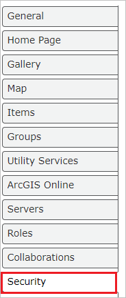
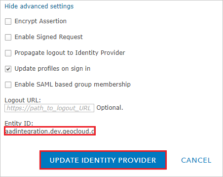

# Configure ArcGIS Enterprise for Single sign-on with Microsoft Entra ID

In this article,  you learn how to integrate ArcGIS Enterprise with Microsoft Entra ID. When you integrate ArcGIS Enterprise with Microsoft Entra ID, you can:

* Control in Microsoft Entra ID who has access to ArcGIS Enterprise.
* Enable your users to be automatically signed-in to ArcGIS Enterprise with their Microsoft Entra accounts.
* Manage your accounts in one central location.

## Prerequisites

The scenario outlined in this article assumes that you already have the following prerequisites:

[!INCLUDE [common-prerequisites.md](~/identity/saas-apps/includes/common-prerequisites.md)]
* ArcGIS Enterprise single sign-on (SSO) enabled subscription.

> [!NOTE]
> This integration is also available to use from Microsoft Entra US Government Cloud environment. You can find this application in the Microsoft Entra US Government Cloud Application Gallery and configure it in the same way as you do from public cloud.

## Scenario description

In this article,  you configure and test Microsoft Entra single sign-on in a test environment.

* ArcGIS Enterprise supports **SP and IDP** initiated SSO.
* ArcGIS Enterprise supports **Just In Time** user provisioning.

## Add ArcGIS Enterprise from the gallery

To configure the integration of ArcGIS Enterprise into Microsoft Entra ID, you need to add ArcGIS Enterprise from the gallery to your list of managed SaaS apps.

1. Sign in to the [Microsoft Entra admin center](https://entra.microsoft.com) as at least a [Cloud Application Administrator](~/identity/role-based-access-control/permissions-reference.md#cloud-application-administrator).
1. Browse to **Entra ID** > **Enterprise apps** > **New application**.
1. In the **Add from the gallery** section, type **ArcGIS Enterprise** in the search box.
1. Select **ArcGIS Enterprise** from results panel and then add the app. Wait a few seconds while the app is added to your tenant.

 [!INCLUDE [sso-wizard.md](~/identity/saas-apps/includes/sso-wizard.md)]

## Configure and test Microsoft Entra SSO for ArcGIS Enterprise

Configure and test Microsoft Entra SSO with ArcGIS Enterprise using a test user called **B.Simon**. For SSO to work, you need to establish a link relationship between a Microsoft Entra user and the related user in ArcGIS Enterprise.

To configure and test Microsoft Entra SSO with ArcGIS Enterprise, perform the following steps:

1. **[Configure Microsoft Entra SSO](#configure-azure-ad-sso)** - to enable your users to use this feature.
    1. **Create a Microsoft Entra test user** - to test Microsoft Entra single sign-on with B.Simon.
    1. **Assign the Microsoft Entra test user** - to enable B.Simon to use Microsoft Entra single sign-on.
1. **[Configure ArcGIS Enterprise SSO](#configure-arcgis-enterprise-sso)** - to configure the single sign-on settings on application side.
    1. **[Create ArcGIS Enterprise test user](#create-arcgis-enterprise-test-user)** - to have a counterpart of B.Simon in ArcGIS Enterprise that's linked to the Microsoft Entra representation of user.
1. **[Test SSO](#test-sso)** - to verify whether the configuration works.

## Configure Microsoft Entra SSO

Follow these steps to enable Microsoft Entra SSO.

1. Sign in to the [Microsoft Entra admin center](https://entra.microsoft.com) as at least a [Cloud Application Administrator](~/identity/role-based-access-control/permissions-reference.md#cloud-application-administrator).
1. Browse to **Entra ID** > **Enterprise apps** > **ArcGIS Enterprise** > **Single sign-on**.
1. On the **Select a single sign-on method** page, select **SAML**.
1. On the **Set up single sign-on with SAML** page, select the pencil icon for **Basic SAML Configuration** to edit the settings.

   

1. On the **Basic SAML Configuration** section, perform the following steps, if you wish to configure the application in **IDP** Initiated mode:

    a. In the **Identifier** text box, type a value using the following pattern:
    `<EXTERNAL_DNS_NAME>.portal`

    b. In the **Reply URL** text box, type a URL using the following pattern:
    `https://<EXTERNAL_DNS_NAME>/portal/sharing/rest/oauth2/saml/signin`

    c. Select **Set additional URLs** and perform the following step if you wish to configure the application in **SP** initiated mode:

    In the **Sign-on URL** text box, type a URL using the following pattern:
    `https://<EXTERNAL_DNS_NAME>/portal/sharing/rest/oauth2/saml/signin`

    > [!NOTE]
    > These values aren't real. Update these values with the actual Identifier, Reply URL and Sign-on URL. Contact [ArcGIS Enterprise Client support team](mailto:support@esri.com) to get these values. You gets the Identifier value from **Set Identity Provider section**, which is explained later in this article.

1. On the **Set up Single Sign-On with SAML** page, In the **SAML Signing Certificate** section, select copy button to copy **App Federation Metadata Url** and save it on your computer.

    

[!INCLUDE [create-assign-users-sso.md](~/identity/saas-apps/includes/create-assign-users-sso.md)]

## Configure ArcGIS Enterprise SSO

1. In a different web browser window, sign in to your ArcGIS Enterprise company site as an administrator

1. Select **Organization** > **Edit Settings**.

    

1. Select **Security** tab.

    

1. Scroll down to the **Enterprise Logins via SAML** section and select **SET ENTERPRISE LOGIN**.

    

1. On the **Set Identity Provider** section, perform the following steps:

    a. Kindly provide a name like **Microsoft Entra ID Test** in the **Name** textbox.

    b. In the **URL** textbox, paste the **App Federation Metadata Url** value which you copied previously.

    c. Select **Show advanced settings** and copy the **Entity ID** value and paste it into the **Identifier** textbox in the **ArcGIS Enterprise Domain and URLs** section in Azure portal.

    

    d. Select **UPDATE IDENTITY PROVIDER**.

### Create ArcGIS Enterprise test user

In this section, a user called Britta Simon is created in ArcGIS Enterprise. ArcGIS Enterprise supports just-in-time user provisioning, which is enabled by default. There's no action item for you in this section. If a user doesn't already exist in ArcGIS Enterprise, a new one is created after authentication.

> [!Note]
> If you need to create a user manually, contact [ArcGIS Enterprise support team](mailto:support@esri.com).

## Test SSO 

In this section, you test your Microsoft Entra single sign-on configuration with following options. 

#### SP initiated:

* Select **Test this application**, this option redirects to ArcGIS Enterprise Sign on URL where you can initiate the login flow.  

* Go to ArcGIS Enterprise Sign-on URL directly and initiate the login flow from there.

#### IDP initiated:

* Select **Test this application**, and you should be automatically signed in to the ArcGIS Enterprise for which you set up the SSO. 

You can also use Microsoft My Apps to test the application in any mode. When you select the ArcGIS Enterprise tile in the My Apps, if configured in SP mode you would be redirected to the application sign on page for initiating the login flow and if configured in IDP mode, you should be automatically signed in to the ArcGIS Enterprise for which you set up the SSO. For more information about the My Apps, see [Introduction to the My Apps](https://support.microsoft.com/account-billing/sign-in-and-start-apps-from-the-my-apps-portal-2f3b1bae-0e5a-4a86-a33e-876fbd2a4510).

## Related content

Once you configure ArcGIS Enterprise you can enforce session control, which protects exfiltration and infiltration of your organization’s sensitive data in real time. Session control extends from Conditional Access. [Learn how to enforce session control with Microsoft Defender for Cloud Apps](/cloud-app-security/proxy-deployment-any-app).
