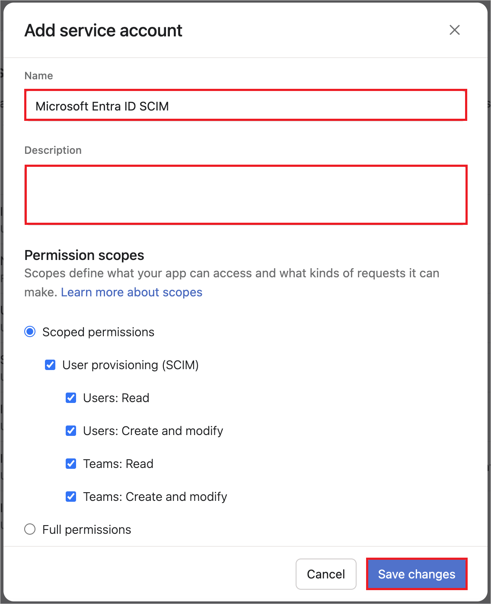

# Configure Asana for automatic user provisioning with Microsoft Entra ID

This article describes the steps you need to do in both Asana and Microsoft Entra ID to configure automatic user provisioning. When configured, Microsoft Entra ID automatically provisions and deprovisions users and groups to [Asana](https://www.asana.com/) using the Microsoft Entra provisioning service. For important details on what this service does, how it works, and frequently asked questions, see [Automate user provisioning and deprovisioning to SaaS applications with Microsoft Entra ID](~/identity/app-provisioning/user-provisioning.md). 

## Capabilities supported
> [!div class="checklist"]
> * Create users in Asana.
> * Remove users in Asana when they don't require access anymore.
> * Keep user attributes synchronized between Microsoft Entra ID and Asana.
> * Provision groups and group memberships in Asana.
> * [Single sign-on](asana-tutorial.md) to Asana (recommended).

## Prerequisites

The scenario outlined in this article assumes that you already have the following prerequisites:

[!INCLUDE [common-prerequisites.md](~/identity/saas-apps/includes/common-prerequisites.md)]
* An Asana tenant with an [Enterprise](https://www.asana.com/pricing) plan or better enabled
* A user account in Asana with admin permissions

> [!NOTE]
> Microsoft Entra provisioning integration relies on the [Asana API](https://asana.com/developers/api-reference/users), which is available to Asana.

## Step 1: Plan your provisioning deployment
1. Learn about [how the provisioning service works](~/identity/app-provisioning/user-provisioning.md).
1. Determine who is in [scope for provisioning](~/identity/app-provisioning/define-conditional-rules-for-provisioning-user-accounts.md).
1. Determine what data to [map between Microsoft Entra ID and Asana](~/identity/app-provisioning/customize-application-attributes.md). 

## Step 2: Configure Asana to support provisioning with Microsoft Entra ID
 > [!TIP]
 > To enable SAML-based single sign-on for Asana, follow the instructions provided. Single sign-on can be configured independently of automatic provisioning, although these two features complement each other.

### Generate Service Account token in Asana

1. Sign in to [Asana](https://app.asana.com/-/login) by using your admin account.
1. Select the profile photo from the top bar, and select **Admin Console**.
1. Select the Apps tab from with your admin console.
1. Select Service accounts.
1. Select **Add Service Account** and perform the following steps.

      

      1. Update **Name** and **Description** as needed. 
      1. Under the **Permission scopes** section, select **Scoped permissions** and **User provisioning (SCIM)**. Ensure the following permission scopes are selected:
            * Users: Read
            * Users: Create and modify
            * Teams: Read
            * Teams: Create and modify
      1. Select **Save Changes**.
1. Copy the token.

## Step 3: Add Asana from the Microsoft Entra application gallery

Add Asana from the Microsoft Entra application gallery to start managing provisioning to Asana. If you have previously setup Asana for SSO, you can use the same application. However it's recommended that you create a separate app when testing out the integration initially. Learn more about adding an application from the gallery [here](~/identity/enterprise-apps/add-application-portal.md). 

## Step 4: Define who is in scope for provisioning 

[!INCLUDE [create-assign-users-provisioning.md](~/identity/saas-apps/includes/create-assign-users-provisioning.md)]

## Step 5: Configure automatic user provisioning to Asana 

This section guides you through the steps to configure the Microsoft Entra provisioning service to create, update, and disable users and groups in Asana based on user and/or group assignments in Microsoft Entra ID.

### To configure automatic user provisioning for Asana in Microsoft Entra ID:

1. Sign in to the [Microsoft Entra admin center](https://entra.microsoft.com) as at least a [Cloud Application Administrator](~/identity/role-based-access-control/permissions-reference.md#cloud-application-administrator).
1. Browse to **Entra ID** > **Enterprise apps**

	

1. In the applications list, select **Asana**.

	

1. Select the **Provisioning** tab.

	

1. Set the **Provisioning Mode** to **Automatic**.

	

1. In the **Admin Credentials** section, input your Asana Tenant URL and Secret Token provided by Asana. Select **Test Connection** to ensure Microsoft Entra ID can connect to Asana. If the connection fails, contact Asana to check your account setup.

 	

1. In the **Notification Email** field, enter the email address of a person or group who should receive the provisioning error notifications and select the **Send an email notification when a failure occurs** check box.

	

1. Select **Save**.

1. In the **Mappings** section, select **Synchronize Microsoft Entra users to Asana**.

1. Review the user attributes that are synchronized from Microsoft Entra ID to Asana in the **Attribute-Mapping** section. The attributes selected as **Matching** properties are used to match the user accounts in Asana for update operations. If you choose to change the [matching target attribute](~/identity/app-provisioning/customize-application-attributes.md), you need to ensure that the Asana API supports filtering users based on that attribute. Select the **Save** button to commit any changes.

   |Attribute|Type|Supported for filtering|Required by Asana|
   |---|---|---|---|
   |userName|String|&check;|&check;|
   |active|Boolean|||
   |name.formatted|String|||
   |title|String|||
   |urn:ietf:params:scim:schemas:extension:enterprise:2.0:User:department|String|||
   |urn:ietf:params:scim:schemas:extension:enterprise:2.0:User:manager|Reference|||
   |addresses[type eq "work"].country|String|||
   |addresses[type eq "work"].region|String|||
   |addresses[type eq "work"].locality|String|||
   |phoneNumbers[type eq "work"].value|String|||
   |urn:ietf:params:scim:schemas:extension:enterprise:2.0:User:employeeNumber|String|||
   |urn:ietf:params:scim:schemas:extension:enterprise:2.0:User:costCenter|String|||
   |urn:ietf:params:scim:schemas:extension:enterprise:2.0:User:organization|String|||
   |urn:ietf:params:scim:schemas:extension:enterprise:2.0:User:division|String|||

1. Under the **Mappings** section, select **Synchronize Microsoft Entra groups to Asana**.

1. Review the group attributes that are synchronized from Microsoft Entra ID to Asana in the **Attribute-Mapping** section. The attributes selected as **Matching** properties are used to match the groups in Asana for update operations. Select the **Save** button to commit any changes.

      |Attribute|Type|Supported for filtering|Required by Asana|
      |---|---|---|---|
      |displayName|String|&check;|&check;|
      |members|Reference|||

1. To configure scoping filters, refer to the following instructions provided in the [Scoping filter  article](~/identity/app-provisioning/define-conditional-rules-for-provisioning-user-accounts.md).

1. To enable the Microsoft Entra provisioning service for Asana, change the **Provisioning Status** to **On** in the **Settings** section.

	

1. Define the users and groups that you would like to provision to Asana by choosing the appropriate values in **Scope** in the **Settings** section.

	

1. When you're ready to provision, select **Save**.

	

This operation starts the initial synchronization cycle of all users and groups defined in **Scope** in the **Settings** section. The initial cycle takes longer to execute than next cycles, which occur approximately every 40 minutes as long as the Microsoft Entra provisioning service is running. 

## Step 6: Monitor your deployment

[!INCLUDE [monitor-deployment.md](~/identity/saas-apps/includes/monitor-deployment.md)]

## Change log

* 11/06/2021 - Dropped support for **externalId, name.givenName and name.familyName**. Added support for **preferredLanguage , title and urn:ietf:params:scim:schemas:extension:enterprise:2.0:User:department**. Enabled **Group Provisioning**.
* 05/23/2023 - Dropped support for **preferredLanguage** Added support for **urn:ietf:params:scim:schemas:extension:enterprise:2.0:User:manager**.
* 09/07/2023 - Added support for **addresses[type eq "work"].locality, addresses[type eq "work"].region, addresses[type eq "work"].country, phoneNumbers[type eq "work"].value, urn:ietf:params:scim:schemas:extension:enterprise:2.0:User:employeeNumber, urn:ietf:params:scim:schemas:extension:enterprise:2.0:User:costCenter, urn:ietf:params:scim:schemas:extension:enterprise:2.0:User:organization and urn:ietf:params:scim:schemas:extension:enterprise:2.0:User:division**.

## More resources

* [Managing user account provisioning for Enterprise Apps](~/identity/app-provisioning/configure-automatic-user-provisioning-portal.md)
* [What is application access and single sign-on with Microsoft Entra ID?](~/identity/enterprise-apps/what-is-single-sign-on.md)

## Related content

* [Learn how to review logs and get reports on provisioning activity](~/identity/app-provisioning/check-status-user-account-provisioning.md)
