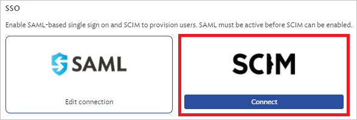
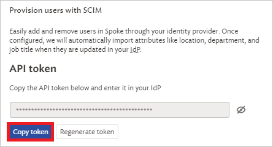

# Configure askSpoke for automatic user provisioning with Microsoft Entra ID

This article describes the steps you need to perform in both askSpoke and Microsoft Entra ID to configure automatic user provisioning. When configured, Microsoft Entra ID automatically provisions and de-provisions users and groups to askSpoke using the Microsoft Entra provisioning service. For important details on what this service does, how it works, and frequently asked questions, see [Automate user provisioning and deprovisioning to SaaS applications with Microsoft Entra ID](~/identity/app-provisioning/user-provisioning.md).

## Capabilities Supported

> [!div class="checklist"]
>
> -  Create users in askSpoke
> -  Remove users in askSpoke when they don't require access anymore
> -  Keep user attributes synchronized between Microsoft Entra ID and askSpoke
> -  Provision groups and group memberships in askSpoke
> -  [Single sign-on](./askspoke-tutorial.md) to askSpoke (recommended)

## Prerequisites

The scenario outlined in this article assumes that you already have the following prerequisites:

-  [A Microsoft Entra tenant](~/identity-platform/quickstart-create-new-tenant.md)
-  One of the following roles: [Application Administrator](/entra/identity/role-based-access-control/permissions-reference#application-administrator), [Cloud Application Administrator](/entra/identity/role-based-access-control/permissions-reference#cloud-application-administrator), or [Application Owner](/entra/fundamentals/users-default-permissions#owned-enterprise-applications)..
-  A user account in askSpoke with admin permissions.

## Step 1: Plan your provisioning deployment

1. Learn about [how the provisioning service works](~/identity/app-provisioning/user-provisioning.md).
2. Determine who is in [scope for provisioning](~/identity/app-provisioning/define-conditional-rules-for-provisioning-user-accounts.md).
3. Determine what data to [map between Microsoft Entra ID and askSpoke](~/identity/app-provisioning/customize-application-attributes.md).

## Step 2: Configure askSpoke to support provisioning with Microsoft Entra ID

1. Log in to your askSpoke admin console.

2. Navigate to **Settings**.

3. Select the **Integrations** tab.

4. Scroll to the SCIM card. Select **Connect**.

   

5. Select **Enable SCIM**.

6. Copy and save the **API Token**. This value is entered in the **Secret Token** field in the Provisioning tab of your askSpoke application.

   

7. The Tenant URL is your askSpoke URL followed by **/scim/v2**. For example: `https://example.askspoke.com/scim/v2`. This value is entered in the **Tenant URL** field in the Provisioning tab of your askSpoke application.

## Step 3: Add askSpoke from the Microsoft Entra application gallery

Add askSpoke from the Microsoft Entra application gallery to start managing provisioning to askSpoke. If you have previously setup askSpoke for SSO, you can use the same application. However it's recommended that you create a separate app when testing out the integration initially. Learn more about adding an application from the gallery [here](~/identity/enterprise-apps/add-application-portal.md).

## Step 4: Define who is in scope for provisioning

[!INCLUDE [create-assign-users-provisioning.md](~/identity/saas-apps/includes/create-assign-users-provisioning.md)]

## Step 5: Configure automatic user provisioning to askSpoke

This section guides you through the steps to configure the Microsoft Entra provisioning service to create, update, and disable users and/or groups in TestApp based on user and/or group assignments in Microsoft Entra ID.

### To configure automatic user provisioning for askSpoke in Microsoft Entra ID:

1. Sign in to the [Microsoft Entra admin center](https://entra.microsoft.com) as at least a [Cloud Application Administrator](~/identity/role-based-access-control/permissions-reference.md#cloud-application-administrator).
1. Browse to **Entra ID** > **Enterprise apps**

   

1. In the applications list, select **askSpoke**.

   

3. Select the **Provisioning** tab.

   

4. Set the **+ New configuration**.

   

5. In the **Tenant URL** field, input your askSpoke Tenant URL and Secret Token. Select **Test Connection** to ensure Microsoft Entra ID can connect to askSpoke. If the connection fails, ensure your askSpoke account  has the required admin permissions and try again.

   

1. Select **Create** to create your configuration.	

1. Select **Properties** in the **Overview** page.

1. Select the pencil to edit the properties. Enable notification emails and provide an email to receive quarantine emails. Enable accidental deletions prevention. Select **Apply** to save the changes.

1. Select **Attribute Mapping** in the left panel and select users.

9. Review the user attributes that are synchronized from Microsoft Entra ID to askSpoke in the **Attribute-Mapping** section. The attributes selected as **Matching** properties are used to match the user accounts in askSpoke for update operations. If you choose to change the [matching target attribute](~/identity/app-provisioning/customize-application-attributes.md), you need to ensure that the askSpoke API supports filtering users based on that attribute. Select the **Save** button to commit any changes.

   | Attribute                                                             | Type      | Supported For Filtering |
   | --------------------------------------------------------------------- | --------- | ----------------------- |
   | userName                                                              | String    | &check;                 |
   | emails[type eq "work"].value                                          | String    |                         |
   | active                                                                | Boolean   |                         |
   | title                                                                 | String    |                         |
   | name.givenName                                                        | String    |                         |
   | name.familyName                                                       | String    |                         |
   | name.formatted                                                        | String    |                         |
   | addresses[type eq "work"].locality                                    | String    |                         |
   | addresses[type eq "work"].country                                     | String    |                         |
   | addresses[type eq "work"].region                                      | String    |                         |
   | externalId                                                            | String    |                         |
   | urn:ietf:params:scim:schemas:extension:enterprise:2.0:User:department | String    |                         |
   | urn:ietf:params:scim:schemas:extension:enterprise:2.0:User:manager    | Reference |                         |
   | urn:ietf:params:scim:schemas:extension:SpokeCustom:2.0:User:startDate | String    |                         |

 Select **Groups**.

11.   Review the group attributes that are synchronized from Microsoft Entra ID to askSpoke in the **Attribute-Mapping** section. The attributes selected as **Matching** properties are used to match the groups in askSpoke for update operations. Select the **Save** button to commit any changes.

      | Attribute   | Type      | Supported For Filtering |
      | ----------- | --------- | ----------------------- |
      | displayName | String    | &check;                 |
      | members     | Reference |                         |

1. To configure scoping filters, refer to the following instructions provided in the [Scoping filter article](~/identity/app-provisioning/define-conditional-rules-for-provisioning-user-accounts.md) article.

1. Use [on-demand provisioning](~/identity/app-provisioning/provision-on-demand.md) to validate sync with a small number of users before deploying more broadly in your organization.

1. When you're ready to provision, select **Start Provisioning** from the **Overview** page.

## Step 6: Monitor your deployment

[!INCLUDE [monitor-deployment.md](~/identity/saas-apps/includes/monitor-deployment.md)]

## Additional resources

-  [Managing user account provisioning for Enterprise Apps](~/identity/app-provisioning/configure-automatic-user-provisioning-portal.md)
-  [What is application access and single sign-on with Microsoft Entra ID?](~/identity/enterprise-apps/what-is-single-sign-on.md)

## Related content

-  [Learn how to review logs and get reports on provisioning activity](~/identity/app-provisioning/check-status-user-account-provisioning.md)
