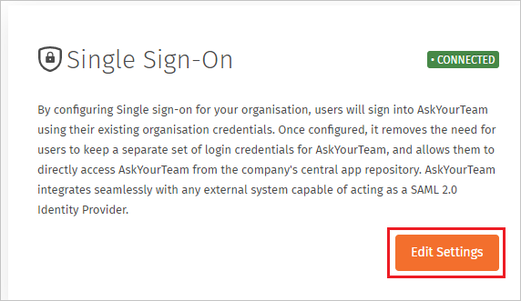
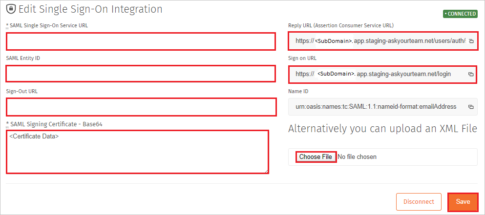
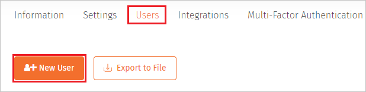
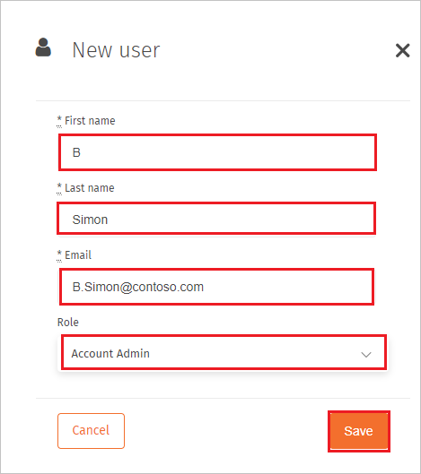

# Configure AskYourTeam for Single sign-on with Microsoft Entra ID

In this article,  you learn how to integrate AskYourTeam with Microsoft Entra ID. When you integrate AskYourTeam with Microsoft Entra ID, you can:

* Control in Microsoft Entra ID who has access to AskYourTeam.
* Enable your users to be automatically signed-in to AskYourTeam with their Microsoft Entra accounts.
* Manage your accounts in one central location.

## Prerequisites

The scenario outlined in this article assumes that you already have the following prerequisites:

[!INCLUDE [common-prerequisites.md](~/identity/saas-apps/includes/common-prerequisites.md)]
* AskYourTeam single sign-on (SSO) enabled subscription.

## Scenario description

In this article,  you configure and test Microsoft Entra SSO in a test environment.

* AskYourTeam supports **SP and IDP** initiated SSO.

## Adding AskYourTeam from the gallery

To configure the integration of AskYourTeam into Microsoft Entra ID, you need to add AskYourTeam from the gallery to your list of managed SaaS apps.

1. Sign in to the [Microsoft Entra admin center](https://entra.microsoft.com) as at least a [Cloud Application Administrator](~/identity/role-based-access-control/permissions-reference.md#cloud-application-administrator).
1. Browse to **Entra ID** > **Enterprise apps** > **New application**.
1. In the **Add from the gallery** section, type **AskYourTeam** in the search box.
1. Select **AskYourTeam** from results panel and then add the app. Wait a few seconds while the app is added to your tenant.

 [!INCLUDE [sso-wizard.md](~/identity/saas-apps/includes/sso-wizard.md)]

## Configure and test Microsoft Entra SSO for AskYourTeam

Configure and test Microsoft Entra SSO with AskYourTeam using a test user called **B.Simon**. For SSO to work, you need to establish a link relationship between a Microsoft Entra user and the related user in AskYourTeam.

To configure and test Microsoft Entra SSO with AskYourTeam, perform the following steps:

1. **[Configure Microsoft Entra SSO](#configure-azure-ad-sso)** - to enable your users to use this feature.
    1. **Create a Microsoft Entra test user** - to test Microsoft Entra single sign-on with B.Simon.
    1. **Assign the Microsoft Entra test user** - to enable B.Simon to use Microsoft Entra single sign-on.
1. **[Configure AskYourTeam SSO](#configure-askyourteam-sso)** - to configure the single sign-on settings on application side.
    1. **[Create AskYourTeam test user](#create-askyourteam-test-user)** - to have a counterpart of B.Simon in AskYourTeam that's linked to the Microsoft Entra representation of user.
1. **[Test SSO](#test-sso)** - to verify whether the configuration works.

## Configure Microsoft Entra SSO

Follow these steps to enable Microsoft Entra SSO.

1. Sign in to the [Microsoft Entra admin center](https://entra.microsoft.com) as at least a [Cloud Application Administrator](~/identity/role-based-access-control/permissions-reference.md#cloud-application-administrator).
1. Browse to **Entra ID** > **Enterprise apps** > **AskYourTeam** > **Single sign-on**.
1. On the **Select a single sign-on method** page, select **SAML**.
1. On the **Set up single sign-on with SAML** page, select the edit/pen icon for **Basic SAML Configuration** to edit the settings.

   

1. On the **Basic SAML Configuration** section, if you wish to configure the application in **IDP** initiated mode, enter the values for the following fields:

    In the **Reply URL** text box, type a URL using the following pattern:
    `https://<COMPANY>.app.askyourteam.com/users/auth/saml/callback`

1. Select **Set additional URLs** and perform the following step if you wish to configure the application in **SP** initiated mode:

    In the **Sign-on URL** text box, type a URL using the following pattern:
    `https://<COMPANY>.app.askyourteam.com/login`

	> [!NOTE]
	> These values aren't real. Update these values with the actual Reply URL and Sign-On URL values which are explained later in the article.

1. On the **Set up single sign-on with SAML** page, in the **SAML Signing Certificate** section,  find **Certificate (Base64)** and select **Download** to download the certificate and save it on your computer.

	

1. On the **Set up AskYourTeam** section, copy the appropriate URL(s) based on your requirement.

	

[!INCLUDE [create-assign-users-sso.md](~/identity/saas-apps/includes/create-assign-users-sso.md)]

## Configure AskYourTeam SSO

1. In a different web browser window, sign in to your AskYourTeam company site as an administrator

1. Select the **My Organization**.

    

1. Select **Integrations**.

    

1. Select **Edit Settings**.

    

1. On the **Edit Single Sign-On Integration** page, perform the following steps: 

    

    a. In the **SAML Single Sign-On Service URL** textbox, paste the **Login URL** value which you copied previously.

    b. In the **SAML Entity ID** textbox, paste the **Microsoft Entra Identifier** value which you copied previously.

    c. In the **Sign-Out URL** textbox, paste the **Logout URL** value which you copied previously.

    d. Open the downloaded **Certificate (Base64)** into Notepad and paste the content into the **SAML Signing Certificate - Base64** textbox.

    > [!NOTE]
    > Alternatively you can also upload the **Federation Metadata XML** file by selecting the **Choose File** option.

    e. Copy **Reply URL (Assertion Consumer Service URL)** value, paste this value into the **Reply URL** text box in the **Basic SAML Configuration** section.

    f. Copy **Sign on URL** value, paste this value into the **Sign on URL** text box in the **Basic SAML Configuration** section.

    g. Select **Save**.

### Create AskYourTeam test user

1. In a different web browser window, sign into AskYourTeam website as an administrator.

1. Select the **My Organization**.

    

1. Select **Users** and select **New User**.

    

1. On the **New user** section, perform the following steps:

    

    1. In the **First name** textbox, enter the first name of the user.

    1. In the **Last name** textbox, enter the last name of the user.

    1. In the **Email** textbox, enter the emailaddress of the user like B.Simon@contoso.com.

    1. Select the **Role** for the user according your organization requirement.

    1. Select **Save**.

## Test SSO 

In this section, you test your Microsoft Entra single sign-on configuration with following options.

#### SP initiated:

* Select **Test this application**, this option redirects to AskYourTeam Sign on URL where you can initiate the login flow.

* Go to AskYourTeam Sign-on URL directly and initiate the login flow from there.

#### IDP initiated:

* Select **Test this application**, and you should be automatically signed in to the AskYourTeam for which you set up the SSO

You can also use Microsoft My Apps to test the application in any mode. When you select the AskYourTeam tile in the My Apps, if configured in SP mode you would be redirected to the application sign on page for initiating the login flow and if configured in IDP mode, you should be automatically signed in to the AskYourTeam for which you set up the SSO. For more information about the My Apps, see [Introduction to the My Apps](https://support.microsoft.com/account-billing/sign-in-and-start-apps-from-the-my-apps-portal-2f3b1bae-0e5a-4a86-a33e-876fbd2a4510).

## Related content

Once you configure AskYourTeam you can enforce session control, which protects exfiltration and infiltration of your organization’s sensitive data in real time. Session control extends from Conditional Access. [Learn how to enforce session control with Microsoft Defender for Cloud Apps](/cloud-app-security/proxy-deployment-any-app).
