# Configure Atlassian Cloud for Single sign-on with Microsoft Entra ID

In this article,  you learn how to integrate Atlassian Cloud with Microsoft Entra ID. When you integrate Atlassian Cloud with Microsoft Entra ID, you can:

* Control in Microsoft Entra ID who has access to Atlassian Cloud.
* Enable your users to be automatically signed-in to Atlassian Cloud with their Microsoft Entra accounts.
* Manage your accounts in one central location.

## Prerequisites

The scenario outlined in this article assumes that you already have the following prerequisites:

[!INCLUDE [common-prerequisites.md](~/identity/saas-apps/includes/common-prerequisites.md)]
* Atlassian Cloud single sign-on (SSO) enabled subscription.
* To enable Security Assertion Markup Language (SAML) single sign-on for Atlassian Cloud products, you need to set up Atlassian Access. Learn more about [Atlassian Access](https://www.atlassian.com/enterprise/cloud/identity-manager).

> [!NOTE]
> This integration is also available to use from Microsoft Entra US Government Cloud environment. You can find this application in the Microsoft Entra US Government Cloud Application Gallery and configure it in the same way as you do from public cloud.

## Scenario description

In this article,  you configure and test Microsoft Entra SSO in a test environment. 

* Atlassian Cloud supports **SP and IDP** initiated SSO.
* Atlassian Cloud supports [Automatic user provisioning and deprovisioning](atlassian-cloud-provisioning-tutorial.md).

## Add Atlassian Cloud from the gallery

To configure the integration of Atlassian Cloud into Microsoft Entra ID, you need to add Atlassian Cloud from the gallery to your list of managed SaaS apps.

1. Sign in to the [Microsoft Entra admin center](https://entra.microsoft.com) as at least a [Cloud Application Administrator](~/identity/role-based-access-control/permissions-reference.md#cloud-application-administrator).
1. Browse to **Entra ID** > **Enterprise apps** > **New application**.
1. In the **Add from the gallery** section, type **Atlassian Cloud** in the search box.
1. Select **Atlassian Cloud** from results panel and then add the app. Wait a few seconds while the app is added to your tenant.

Alternatively, you can also use the [Enterprise App Configuration Wizard](https://portal.office.com/AdminPortal/home?Q=Docs#/azureadappintegration). In this wizard, you can add an application to your tenant, add users/groups to the app, assign roles, and walk through the SSO configuration as well. You can learn more about Microsoft 365 wizards [here](/microsoft-365/admin/misc/azure-ad-setup-guides?view=o365-worldwide&preserve-view=true).

## Configure and test Microsoft Entra SSO

Configure and test Microsoft Entra SSO with Atlassian Cloud using a test user called **B.Simon**. For SSO to work, you need to establish a link relationship between a Microsoft Entra user and the related user in Atlassian Cloud.

To configure and test Microsoft Entra SSO with Atlassian Cloud, perform the following steps:

1. **[Configure Microsoft Entra ID with Atlassian Cloud SSO](#configure-azure-ad-with-atlassian-cloud-sso)** - to enable your users to use Microsoft Entra ID based SAML SSO with Atlassian Cloud.
   1. **Create a Microsoft Entra test user** - to test Microsoft Entra single sign-on with B.Simon.
   1. **Assign the Microsoft Entra test user** - to enable B.Simon to use Microsoft Entra single sign-on.
1. **[Create Atlassian Cloud test user](#create-atlassian-cloud-test-user)** - to have a counterpart of B.Simon in Atlassian Cloud that's linked to the Microsoft Entra representation of user.
1. **[Test SSO](#test-sso)** - to verify whether the configuration works.

## Configure Microsoft Entra ID with Atlassian Cloud SSO

Follow these steps to enable Microsoft Entra SSO.

1. In a different web browser window, sign in to your up Atlassian Cloud company site as an administrator

1. In the **ATLASSIAN Admin** portal, navigate to **Security** > **Identity providers** > **Microsoft Entra ID**.

1. Enter the **Directory name** and select **Add** button.

1. Select **Set up SAML single sign-on** button to connect your identity provider to Atlassian organization.

   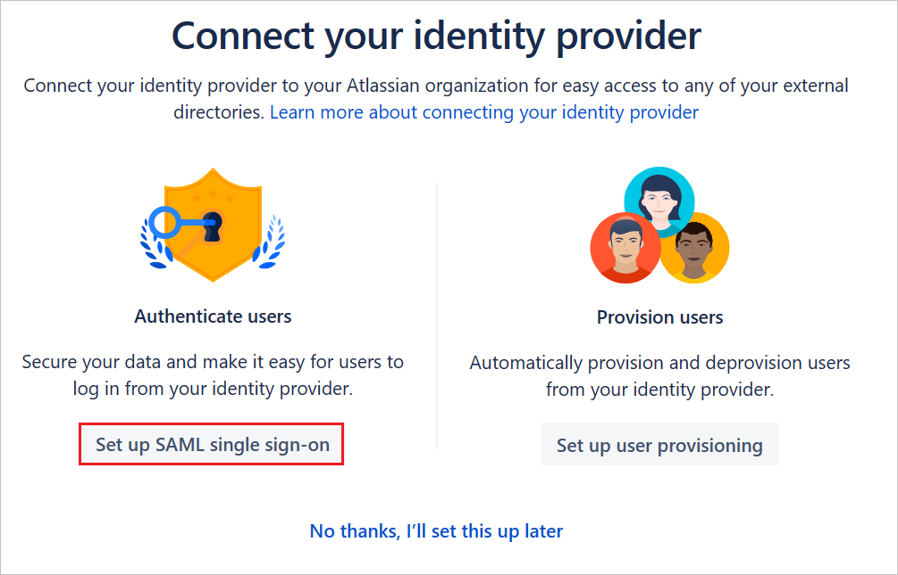

1. Sign in to the [Microsoft Entra admin center](https://entra.microsoft.com) as at least a [Cloud Application Administrator](~/identity/role-based-access-control/permissions-reference.md#cloud-application-administrator).
1. Browse to **Entra ID** > **Enterprise apps** > **Atlassian Cloud** application integration page. Find the **Manage** section. Under **Getting Started**, select **Set up single sign-on**.

1. On the **Select a Single sign-on method** page, select **SAML**.

1. On the **Set up Single Sign-On with SAML** page, scroll down to **Set up Atlassian Cloud**.
   
   a. Select **Configuration URLs**.

   b. Copy **Login URL** value from Azure portal, paste it in the **Identity provider SSO URL** textbox in Atlassian.
   
   c. Copy **Microsoft Entra Identifier** value from Azure portal, paste it in the **Identity provider Entity ID** textbox in Atlassian.

   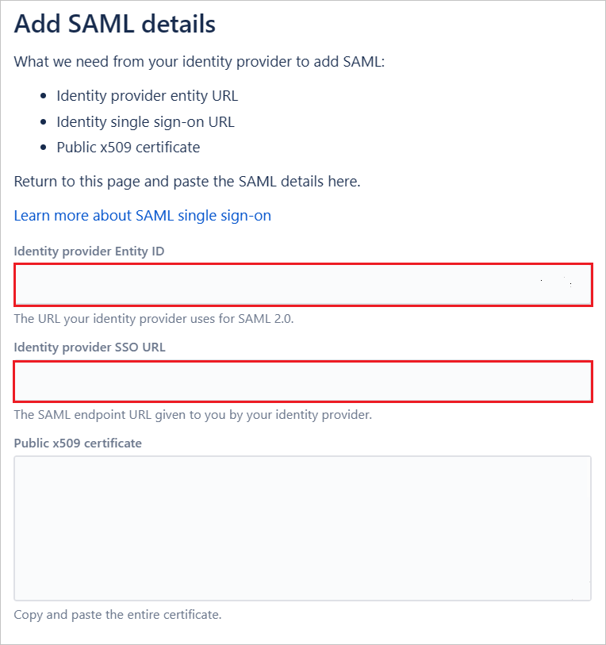

1. On the **Set up Single Sign-On with SAML** page, in the **SAML Signing Certificate** section, find **Certificate (Base64)** and select **Download** to download the certificate and save it on your computer.

   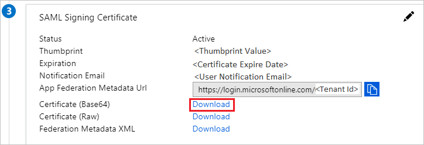

   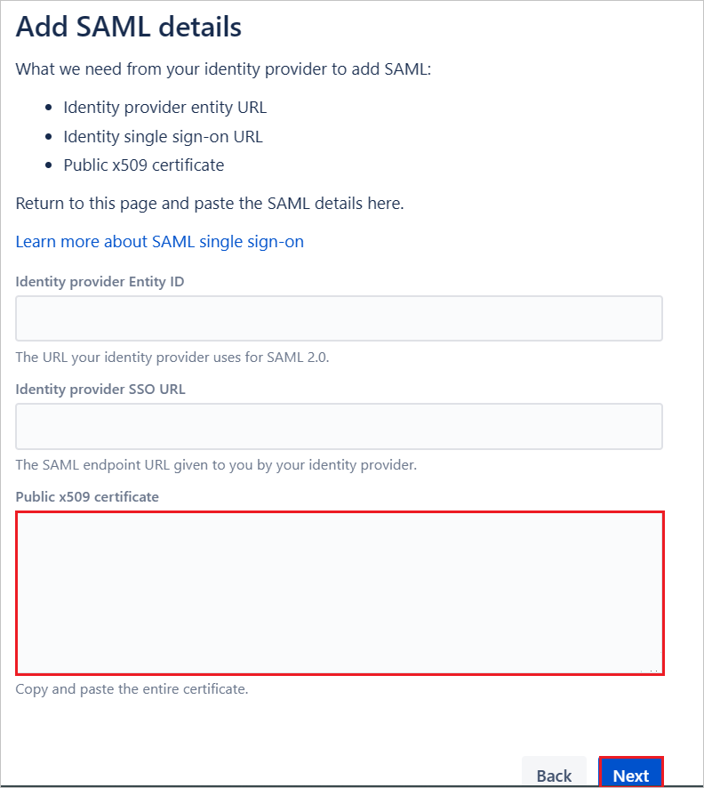

1. Save the SAML Configuration and select **Next** in Atlassian.

1. On the **Basic SAML Configuration** section, perform the following steps.

   a. Copy **Service provider entity URL** value from Atlassian, paste it in the **Identifier (Entity ID)** box in Azure and set it as default.
   
   b. Copy **Service provider assertion consumer service URL** value from Atlassian, paste it in the **Reply URL (Assertion Consumer Service URL)** box in Azure and set it as default.

   c. Select **Next**.
   
   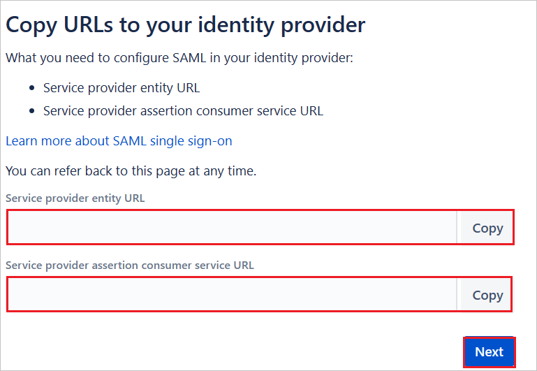

   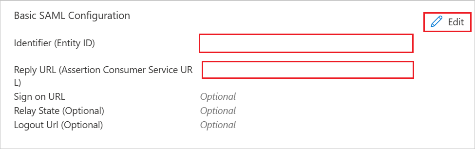
   
1. Your Atlassian Cloud application expects the SAML assertions in a specific format, which requires you to add custom attribute mappings to your SAML token attributes configuration. You can edit the attribute mapping by selecting **Edit** icon. 

   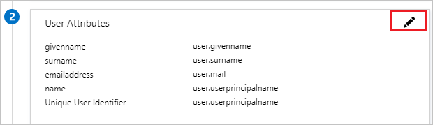
   
   1. Attribute mapping for a Microsoft Entra tenant with a Microsoft 365 license.
      
      a. Select the **Unique User Identifier (Name ID)** claim.

      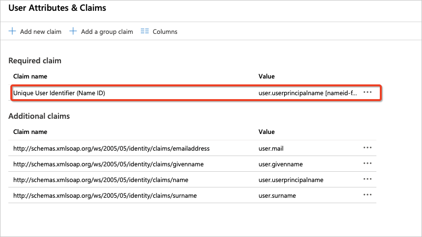
      
      b. Atlassian Cloud expects the **nameidentifier** (**Unique User Identifier**) to be mapped to the user's email (**user.mail**). Edit the **Source attribute** and change it to **user.mail**. Save the changes to the claim.

      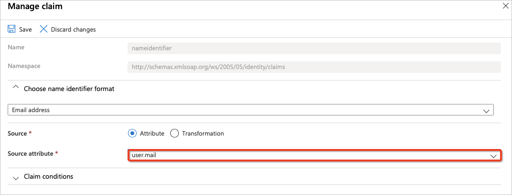
      
      c. The final attribute mappings should look as follows.

      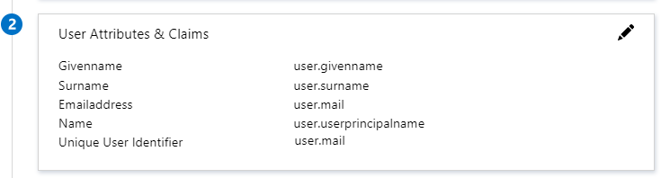
      
   1. Attribute mapping for a Microsoft Entra tenant without a Microsoft 365 license. 

      a. Select the `http://schemas.xmlsoap.org/ws/2005/05/identity/claims/emailaddress` claim.

      
         
      b. While Azure doesn't populate the **user.mail** attribute for users created in Microsoft Entra tenants without Microsoft 365 licenses and stores the email for such users in **userprincipalname** attribute. Atlassian Cloud expects the **nameidentifier** (**Unique User Identifier**) to be mapped to the user's email (**user.userprincipalname**).  Edit the **Source attribute**  and change it to **user.userprincipalname**. Save the changes to the claim.

      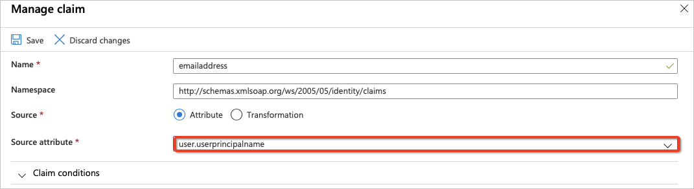
         
      c. The final attribute mappings should look as follows.

      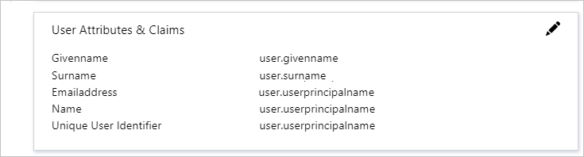

1. Select **Stop and save SAML** button.
   
   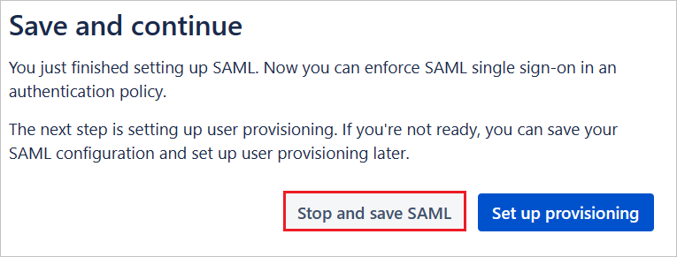

1. To enforce SAML single sign-on in an authentication policy, perform the following steps.

   a.	From the **Atlassian Admin** Portal, select **Security** tab and select **Authentication policies**.

   b.	Select **Edit** for the policy you want to enforce. 

   c.	In **Settings**, enable the **Enforce single sign-on** to their managed users for the successful SAML redirection. 

   d.	Select **Update**. 

      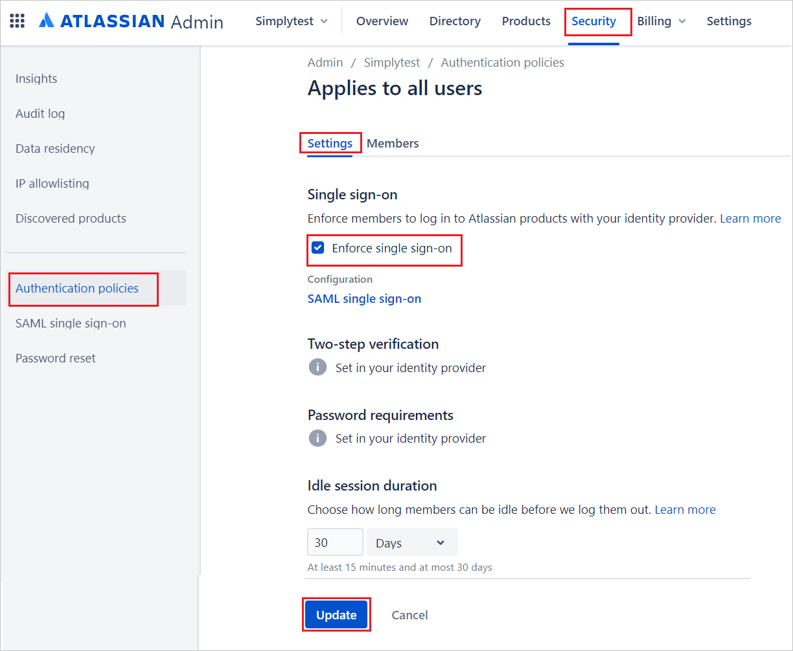 

   > [!NOTE]
   > The admins can test the SAML configuration by only enabling enforced SSO for a subset of users first on a separate authentication policy, and then enabling the policy for all users if there are no issues.

[!INCLUDE [create-assign-users-sso.md](~/identity/saas-apps/includes/create-assign-users-sso.md)]

### Create Atlassian Cloud test user

To enable Microsoft Entra users sign in to Atlassian Cloud, provision the user accounts manually in Atlassian Cloud by doing the following steps:

1. Go to **Products** tab, select **Users** and select **Invite users**.

    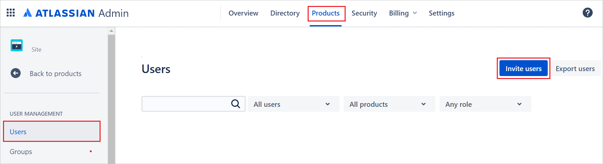

1. In the **Email address** textbox, enter the user's email address, and then select **Invite user**.

    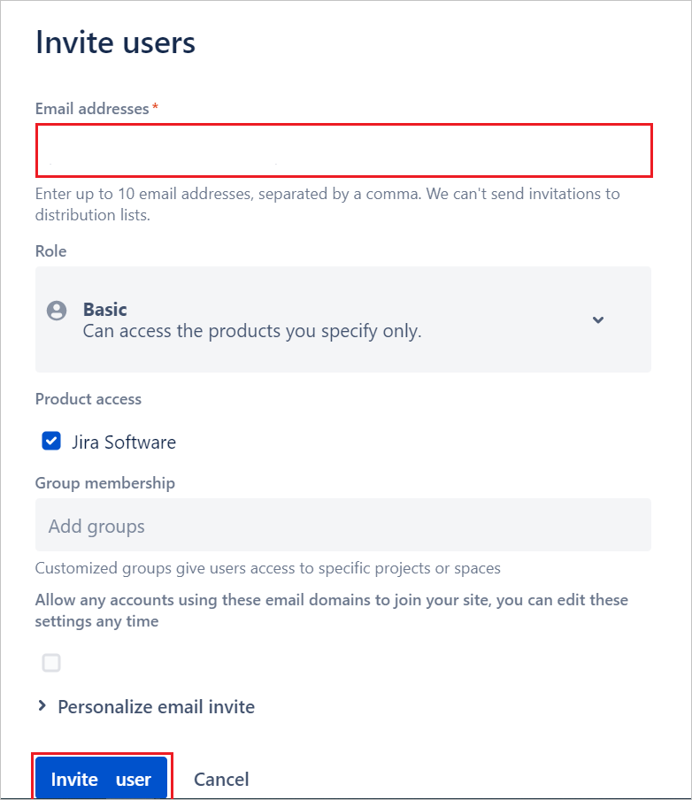

### Test SSO

In this section, you test your Microsoft Entra single sign-on configuration with following options. 

#### SP initiated:

* Select **Test this application**, this option redirects to Atlassian Cloud Sign-on URL where you can initiate the login flow.  

* Go to Atlassian Cloud Sign-on URL directly and initiate the login flow from there.

#### IDP initiated:

* Select **Test this application**, and you should be automatically signed in to the Atlassian Cloud for which you set up the SSO. 

You can also use Microsoft My Apps to test the application in any mode. When you select the Atlassian Cloud tile in the My Apps, if configured in SP mode you would be redirected to the application sign-on page for initiating the login flow and if configured in IDP mode, you should be automatically signed in to the Atlassian Cloud for which you set up the SSO. For more information about the My Apps, see [Introduction to the My Apps](https://support.microsoft.com/account-billing/sign-in-and-start-apps-from-the-my-apps-portal-2f3b1bae-0e5a-4a86-a33e-876fbd2a4510).

## Related content

Once you configure Atlassian Cloud you can enforce session control, which protects exfiltration and infiltration of your organization's sensitive data in real time. Session control extends from Conditional Access. [Learn how to enforce session control with Microsoft Defender for Cloud Apps](/cloud-app-security/proxy-deployment-any-app).
