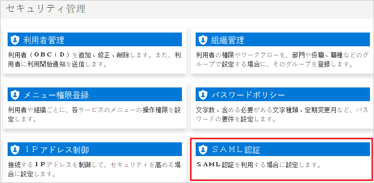
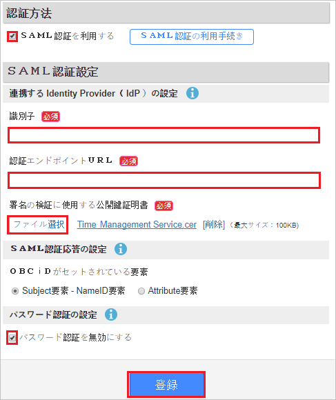
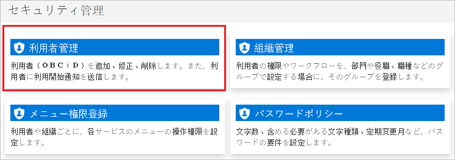
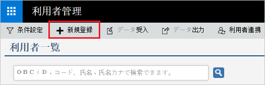
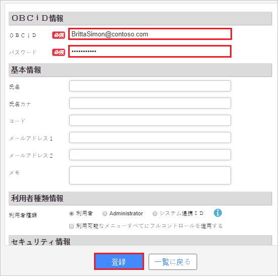

# Configure Attendance Management Services for Single sign-on with Microsoft Entra ID

In this article,  you learn how to integrate Attendance Management Services with Microsoft Entra ID. When you integrate Attendance Management Services with Microsoft Entra ID, you can:

* Control in Microsoft Entra ID who has access to Attendance Management Services.
* Enable your users to be automatically signed-in to Attendance Management Services with their Microsoft Entra accounts.
* Manage your accounts in one central location.

## Prerequisites

The scenario outlined in this article assumes that you already have the following prerequisites:

[!INCLUDE [common-prerequisites.md](~/identity/saas-apps/includes/common-prerequisites.md)]
* Attendance Management Services single sign-on enabled subscription.

## Scenario description

In this article,  you configure and test Microsoft Entra single sign-on in a test environment.

* Attendance Management Services supports **SP** initiated SSO.

## Add Attendance Management Services from the gallery

To configure the integration of Attendance Management Services into Microsoft Entra ID, you need to add Attendance Management Services from the gallery to your list of managed SaaS apps.

1. Sign in to the [Microsoft Entra admin center](https://entra.microsoft.com) as at least a [Cloud Application Administrator](~/identity/role-based-access-control/permissions-reference.md#cloud-application-administrator).
1. Browse to **Entra ID** > **Enterprise apps** > **New application**.
1. In the **Add from the gallery** section, type **Attendance Management Services** in the search box.
1. Select **Attendance Management Services** from results panel and then add the app. Wait a few seconds while the app is added to your tenant.

 [!INCLUDE [sso-wizard.md](~/identity/saas-apps/includes/sso-wizard.md)]

## Configure and test Microsoft Entra SSO for Attendance Management Services

Configure and test Microsoft Entra SSO with Attendance Management Services using a test user called **B.Simon**. For SSO to work, you need to establish a link relationship between a Microsoft Entra user and the related user in Attendance Management Services.

To configure and test Microsoft Entra SSO with Attendance Management Services, perform the following steps:

1. **[Configure Microsoft Entra SSO](#configure-azure-ad-sso)** - to enable your users to use this feature.
    1. **Create a Microsoft Entra test user** - to test Microsoft Entra single sign-on with B.Simon.
    1. **Assign the Microsoft Entra test user** - to enable B.Simon to use Microsoft Entra single sign-on.
1. **[Configure Attendance Management Services SSO](#configure-attendance-management-services-sso)** - to configure the single sign-on settings on application side.
    1. **[Create Attendance Management Services test user](#create-attendance-management-services-test-user)** - to have a counterpart of B.Simon in Attendance Management Services that's linked to the Microsoft Entra representation of user.
1. **[Test SSO](#test-sso)** - to verify whether the configuration works.

## Configure Microsoft Entra SSO

Follow these steps to enable Microsoft Entra SSO.

1. Sign in to the [Microsoft Entra admin center](https://entra.microsoft.com) as at least a [Cloud Application Administrator](~/identity/role-based-access-control/permissions-reference.md#cloud-application-administrator).
1. Browse to **Entra ID** > **Enterprise apps** > **Attendance Management Services** > **Single sign-on**.
1. On the **Select a single sign-on method** page, select **SAML**.
1. On the **Set up single sign-on with SAML** page, select the pencil icon for **Basic SAML Configuration** to edit the settings.

   

1. On the **Basic SAML Configuration** section, perform the following steps:

    a. In the **Identifier (Entity ID)** text box, type a URL using the following pattern:
    `https://id.obc.jp/<TENANT_INFORMATION>/`

	b. In the **Sign on URL** text box, type a URL using the following pattern:
    `https://id.obc.jp/<TENANT_INFORMATION>/`

	> [!NOTE]
	> These values aren't real. Update these values with the actual Identifier and Sign on URL. Contact [Attendance Management Services Client support team](https://www.obcnet.jp/) to get these values. You can also refer to the patterns shown in the **Basic SAML Configuration** section.

1. On the **Set up Single Sign-On with SAML** page, in the **SAML Signing Certificate** section, select **Download** to download the **Certificate (Base64)** from the given options as per your requirement and save it on your computer.

	

1. On the **Set up Attendance Management Services** section, copy the appropriate URL(s) as per your requirement.

	

[!INCLUDE [create-assign-users-sso.md](~/identity/saas-apps/includes/create-assign-users-sso.md)]

## Configure Attendance Management Services SSO

1. In a different browser window, sign-on to your Attendance Management Services company site as administrator.

1. Select **SAML authentication** under the **Security management section**.

	

1. Perform the following steps:

	

	a. Select **Use SAML authentication**.

	b. In the **Identifier** textbox, paste the value of **Microsoft Entra Identifier** value.

	c. In the **Authentication endpoint URL** textbox, paste the value of **Login URL** value.

	d. Select **Select a file** to upload the certificate which you downloaded from Microsoft Entra ID.

	e. Select **Disable password authentication**.

	f. Select **Registration**.

### Create Attendance Management Services test user

To enable Microsoft Entra users to sign in to Attendance Management Services, they must be provisioned into Attendance Management Services. In the case of Attendance Management Services, provisioning is a manual task.

**To provision a user account, perform the following steps:**

1. Sign in to your Attendance Management Services company site as an administrator.

1. Select **User management** under the **Security management section**.

	

1. Select **New rules login**.

    

1. In the **OBCiD information** section, perform the following steps:

	

	a. In the **OBCiD** textbox, type the email of user like `BrittaSimon@contoso.com`.

	b. In the **Password** textbox, type the password of user.

	c. Select **Registration**

## Test SSO

In this section, you test your Microsoft Entra single sign-on configuration with following options. 

* Select **Test this application**, this option redirects to Attendance Management Services Sign-on URL where you can initiate the login flow. 

* Go to Attendance Management Services Sign-on URL directly and initiate the login flow from there.

* You can use Microsoft My Apps. When you select the Attendance Management Services tile in the My Apps, this option redirects to Attendance Management Services Sign-on URL. For more information about the My Apps, see [Introduction to the My Apps](https://support.microsoft.com/account-billing/sign-in-and-start-apps-from-the-my-apps-portal-2f3b1bae-0e5a-4a86-a33e-876fbd2a4510).

## Related content

Once you configure Attendance Management Services you can enforce session control, which protects exfiltration and infiltration of your organization’s sensitive data in real time. Session control extends from Conditional Access. [Learn how to enforce session control with Microsoft Defender for Cloud Apps](/cloud-app-security/proxy-deployment-aad).
