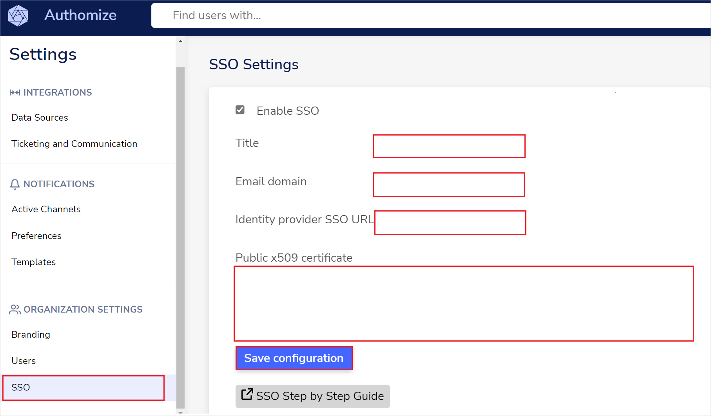

# Configure Authomize for Single sign-on with Microsoft Entra ID

In this article,  you learn how to integrate Authomize with Microsoft Entra ID. When you integrate Authomize with Microsoft Entra ID, you can:

* Control in Microsoft Entra ID who has access to Authomize.
* Enable your users to be automatically signed-in to Authomize with their Microsoft Entra accounts.
* Manage your accounts in one central location.

## Prerequisites

To get started, you need the following items:

* A Microsoft Entra subscription. If you don't have a subscription, you can get a [free account](https://azure.microsoft.com/free/).
* Authomize single sign-on (SSO) enabled subscription.
* Along with Cloud Application Administrator, Application Administrator can also add or manage applications in Microsoft Entra ID.
For more information, see [Azure built-in roles](~/identity/role-based-access-control/permissions-reference.md).

## Scenario description

In this article,  you configure and test Microsoft Entra SSO in a test environment.

* Authomize supports **SP and IDP** initiated SSO.
* Authomize supports **Just In Time** user provisioning.

## Add Authomize from the gallery

To configure the integration of Authomize into Microsoft Entra ID, you need to add Authomize from the gallery to your list of managed SaaS apps.

1. Sign in to the [Microsoft Entra admin center](https://entra.microsoft.com) as at least a [Cloud Application Administrator](~/identity/role-based-access-control/permissions-reference.md#cloud-application-administrator).
1. Browse to **Entra ID** > **Enterprise apps** > **New application**.
1. In the **Add from the gallery** section, type **Authomize** in the search box.
1. Select **Authomize** from results panel and then add the app. Wait a few seconds while the app is added to your tenant.

 [!INCLUDE [sso-wizard.md](~/identity/saas-apps/includes/sso-wizard.md)]

## Configure and test Microsoft Entra SSO for Authomize

Configure and test Microsoft Entra SSO with Authomize using a test user called **B.Simon**. For SSO to work, you need to establish a link relationship between a Microsoft Entra user and the related user in Authomize.

To configure and test Microsoft Entra SSO with Authomize, perform the following steps:

1. **[Configure Microsoft Entra SSO](#configure-azure-ad-sso)** - to enable your users to use this feature.
    1. **Create a Microsoft Entra test user** - to test Microsoft Entra single sign-on with B.Simon.
    1. **Assign the Microsoft Entra test user** - to enable B.Simon to use Microsoft Entra single sign-on.
1. **[Configure Authomize SSO](#configure-authomize-sso)** - to configure the single sign-on settings on application side.
    1. **[Create Authomize test user](#create-authomize-test-user)** - to have a counterpart of B.Simon in Authomize that's linked to the Microsoft Entra representation of user.
1. **[Test SSO](#test-sso)** - to verify whether the configuration works.

## Configure Microsoft Entra SSO

Follow these steps to enable Microsoft Entra SSO.

1. Sign in to the [Microsoft Entra admin center](https://entra.microsoft.com) as at least a [Cloud Application Administrator](~/identity/role-based-access-control/permissions-reference.md#cloud-application-administrator).
1. Browse to **Entra ID** > **Enterprise apps** > **Authomize** > **Single sign-on**.
1. On the **Select a single sign-on method** page, select **SAML**.
1. On the **Set up single sign-on with SAML** page, select the pencil icon for **Basic SAML Configuration** to edit the settings.

   

1. On the **Basic SAML Configuration** section, perform the following steps:

    a. In the **Identifier** textbox, type a URL using the following pattern:
    `https://<CustomerName>.authomize.com/api/sso/metadata.xml?domain=<DOMAIN>`

    b. In the **Reply URL** textbox, type a URL using the following pattern:
    `https://<CustomerName>.authomize.com/api/sso/assert?domain=<DOMAIN>`

1. Select **Set additional URLs** and perform the following steps if you wish to configure the application in **SP** initiated mode:
    
    a. In the **Sign-on URL** text box, type a URL using the following pattern:
    `https://<CustomerName>.authomize.com`

    b. In the **Relay State** textbox, type a URL using the following pattern:
    `https://<CustomerName>.authomize.com`

    > [!NOTE]
    > These values aren't real. Update these values with the actual Identifier, Reply URL, Sign-on URL and Relay State URL. Contact [Authomize Client support team](mailto:support@authomize.com) to get these values. You can also refer to the patterns shown in the Basic SAML Configuration section.

1. Select **Save**.

1. Authomize application expects the SAML assertions in a specific format, which requires you to add custom attribute mappings to your SAML token attributes configuration. The following screenshot shows the list of default attributes.

    

1. In addition to above, Authomize application expects few more attributes to be passed back in SAML response, which are shown below. These attributes are also pre populated but you can review them as per your requirements.

    | Name | Source Attribute|
    | ------------ | --------- |
    | user_id | user.mail |

1. On the **Set up single sign-on with SAML** page, in the **SAML Signing Certificate** section,  find **Certificate (Base64)** and select **Download** to download the certificate and save it on your computer.

    

1. On the **Set up Authomize** section, copy the appropriate URL(s) based on your requirement.

    

[!INCLUDE [create-assign-users-sso.md](~/identity/saas-apps/includes/create-assign-users-sso.md)]

## Configure Authomize SSO

1. Log in to your Authomize company site as an administrator.

1. Go to **Settings** (gear icon) > **SSO**.

1. In the **SSO Settings** page, perform the following steps:

    

    a. Select **Enable SSO** checkbox.

    b. Enter a valid name in the **Title** textbox.

    c. Enter your **Email domain** in the textbox.

    d. In the **Identity provider SSO URL** textbox, paste the **Login URL** value which you copied previously.

    e. Open the downloaded **Certificate (Base64)** into Notepad and paste the content into the **Public x509 certificate** textbox.

    f. Select **Save configuration**.

### Create Authomize test user

In this section, a user called B.Simon is created in Authomize. Authomize supports just-in-time user provisioning, which is enabled by default. There's no action item for you in this section. If a user doesn't already exist in Authomize, a new one is created after authentication.

## Test SSO

In this section, you test your Microsoft Entra single sign-on configuration with following options. 

#### SP initiated:

* Select **Test this application**, this option redirects to Authomize Sign on URL where you can initiate the login flow.  

* Go to Authomize Sign-on URL directly and initiate the login flow from there.

#### IDP initiated:

* Select **Test this application**, and you should be automatically signed in to the Authomize for which you set up the SSO. 

You can also use Microsoft My Apps to test the application in any mode. When you select the Authomize tile in the My Apps, if configured in SP mode you would be redirected to the application sign-on page for initiating the login flow and if configured in IDP mode, you should be automatically signed in to the Authomize for which you set up the SSO. For more information about the My Apps, see [Introduction to the My Apps](https://support.microsoft.com/account-billing/sign-in-and-start-apps-from-the-my-apps-portal-2f3b1bae-0e5a-4a86-a33e-876fbd2a4510).

## Related content

Once you configure Authomize you can enforce session control, which protects exfiltration and infiltration of your organization’s sensitive data in real time. Session control extends from Conditional Access. [Learn how to enforce session control with Microsoft Defender for Cloud Apps](/cloud-app-security/proxy-deployment-aad).
