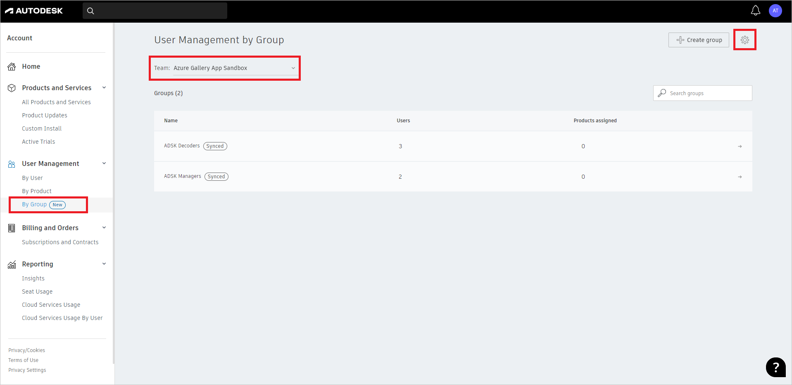
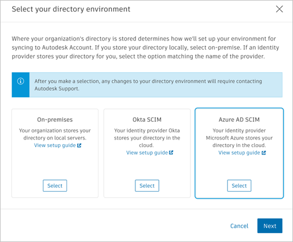
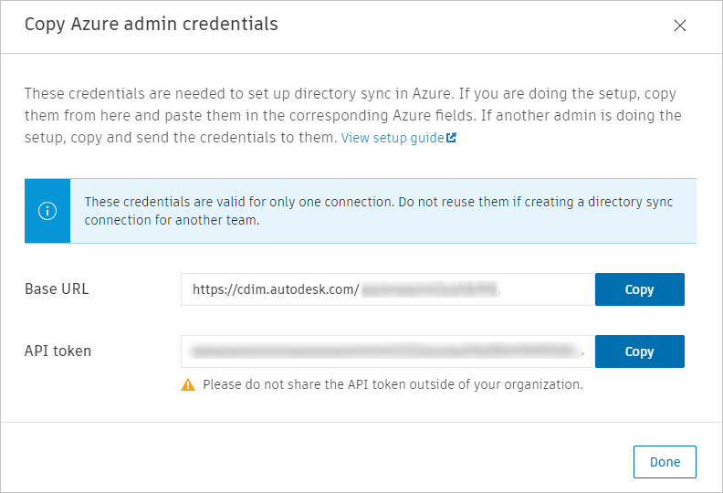

# Configure Autodesk SSO for automatic user provisioning with Microsoft Entra ID

This article describes the steps you need to do in both Autodesk SSO and Microsoft Entra ID to configure automatic user provisioning. When configured, Microsoft Entra ID automatically provisions and de-provisions users and groups to [Autodesk SSO](https://autodesk.com/) using the Microsoft Entra provisioning service. For important details on what this service does, how it works, and frequently asked questions, see [Automate user provisioning and deprovisioning to SaaS applications with Microsoft Entra ID](~/identity/app-provisioning/user-provisioning.md). 

## Capabilities Supported
> [!div class="checklist"]
> * Create users in Autodesk SSO.
> * Remove users in Autodesk SSO when they don't require access anymore.
> * Keep user attributes synchronized between Microsoft Entra ID and Autodesk SSO.
> * Provision groups and group memberships in Autodesk SSO.
> * [Single sign-on](autodesk-sso-tutorial.md) to Autodesk SSO (recommended).

## Prerequisites

The scenario outlined in this article assumes that you already have the following prerequisites:

* [A Microsoft Entra tenant](~/identity-platform/quickstart-create-new-tenant.md). 
* One of the following roles: [Application Administrator](/entra/identity/role-based-access-control/permissions-reference#application-administrator), [Cloud Application Administrator](/entra/identity/role-based-access-control/permissions-reference#cloud-application-administrator), or [Application Owner](/entra/fundamentals/users-default-permissions#owned-enterprise-applications). 
* A user account with either Primary admin or SSO admin role to access [Autodesk management portal](https://manage.autodesk.com/).

## Step 1: Plan your provisioning deployment
1. Learn about [how the provisioning service works](~/identity/app-provisioning/user-provisioning.md).
1. Determine who is in [scope for provisioning](~/identity/app-provisioning/define-conditional-rules-for-provisioning-user-accounts.md).
1. Determine what data to [map between Microsoft Entra ID and Autodesk SSO](~/identity/app-provisioning/customize-application-attributes.md). 

## Step 2: Configure Autodesk SSO to support provisioning with Microsoft Entra ID
1. Sign in to [Autodesk management portal](https://manage.autodesk.com/).
1. From the left navigation menu, navigate to **User Management > By Group**. Select the required team from the drop-down list and select the team settings gear icon.

	
	
2.  Select the Set up directory sync button and select Microsoft Entra SCIM as the directory environment. Select Next to access the Azure admin credentials. If you set up Directory Sync before, select the Access Credential instead.

	

3. Copy and save the Base URL and API token. These values are entered in the Tenant URL field and Secret Token field respectively in the Provisioning tab of your Autodesk application.

	

## Step 3: Add Autodesk SSO from the Microsoft Entra application gallery

Add Autodesk SSO from the Microsoft Entra application gallery to start managing provisioning to Autodesk SSO. If you have previously setup Autodesk SSO for SSO, you can use the same application. However it's recommended that you create a separate app when testing out the integration initially. Learn more about adding an application from the gallery [here](~/identity/enterprise-apps/add-application-portal.md). 

## Step 4: Define who is in scope for provisioning 

[!INCLUDE [create-assign-users-provisioning.md](~/identity/saas-apps/includes/create-assign-users-provisioning.md)]

## Step 5: Configure automatic user provisioning to Autodesk SSO 

This section guides you through the steps to configure the Microsoft Entra provisioning service to create, update, and disable users and/or groups in Autodesk SSO based on user and/or group assignments in Microsoft Entra ID. 

### To configure automatic user provisioning for Autodesk SSO in Microsoft Entra ID:

1. Sign in to the [Microsoft Entra admin center](https://entra.microsoft.com) as at least an app owner or [Cloud Application Administrator](~/identity/role-based-access-control/permissions-reference.md#cloud-application-administrator).
1. Browse to **Entra ID** > **Enterprise apps**

	

1. In the applications list, select **Autodesk SSO**.

	

1. Select the **Provisioning** tab.

	

1. Select **+ New configuration**.

	

1. In the **Tenant URL** field, input your Autodesk SSO Tenant URL and Secret Token. Select **Test Connection** to ensure Microsoft Entra ID can connect to Autodesk SSO. If the connection fails, ensure your Autodesk SSO account has the required admin permissions and try again.

   

1. Select **Create** to create your configuration.	

1. Select **Properties** in the **Overview** page. 

1. Select the pencil to edit the properties. Enable notification emails and provide an email to receive quarantine emails. Enable accidental deletions prevention. Select **Apply** to save the changes.

   

1. Select **Attribute Mapping** in the left panel and select **users**.

1. Review the user attributes that are synchronized from Microsoft Entra ID to Autodesk SSO in the **Attribute-Mapping** section. The attributes selected as **Matching** properties are used to match the user accounts in Autodesk SSO for update operations. If you choose to change the [matching target attribute](~/identity/app-provisioning/customize-application-attributes.md), you need to ensure that the Autodesk SSO API supports filtering users based on that attribute. Select the **Save** button to commit any changes.

   |Attribute|Type|Supported for filtering|Required by Autodesk SSO|
   |---|---|---|---|
   |userName|String|&check;|&check;|   
   |active|Boolean||&check;|
   |name.givenName|String||&check;|
   |name.familyName|String||&check;|
   |urn:ietf:params:scim:schemas:extension:AdskUserExt:2.0:User:objectGUID|String||&check;|

1. Select **groups**. 

1. Review the group attributes that are synchronized from Microsoft Entra ID to Autodesk SSO in the **Attribute-Mapping** section. The attributes selected as **Matching** properties are used to match the groups in Autodesk SSO for update operations. Select the **Save** button to commit any changes.

      |Attribute|Type|Supported for filtering|Required by Autodesk SSO|
      |---|---|---|---|
      |displayName|String|&check;|&check;|
      |members|Reference|||

1. To configure scoping filters, refer to the instructions provided in the [Scoping filter article](~/identity/app-provisioning/define-conditional-rules-for-provisioning-user-accounts.md).

1. Use [on-demand provisioning](~/identity/app-provisioning/provision-on-demand.md) to validate sync with a small number of users before deploying more broadly in your organization.  

1. When you're ready to provision, select **Start Provisioning** from the **Overview** page.
## Step 6: Monitor your deployment

[!INCLUDE [monitor-deployment.md](~/identity/saas-apps/includes/monitor-deployment.md)]

## More resources

* [Managing user account provisioning for Enterprise Apps](~/identity/app-provisioning/configure-automatic-user-provisioning-portal.md)
* [What is application access and single sign-on with Microsoft Entra ID?](~/identity/enterprise-apps/what-is-single-sign-on.md)

## Related content

* [Learn how to review logs and get reports on provisioning activity](~/identity/app-provisioning/check-status-user-account-provisioning.md)
