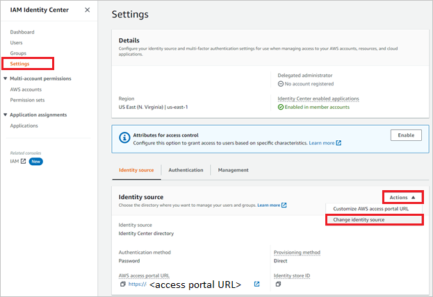
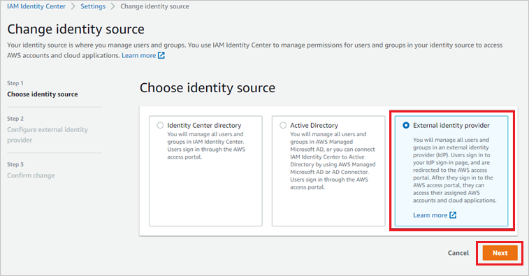
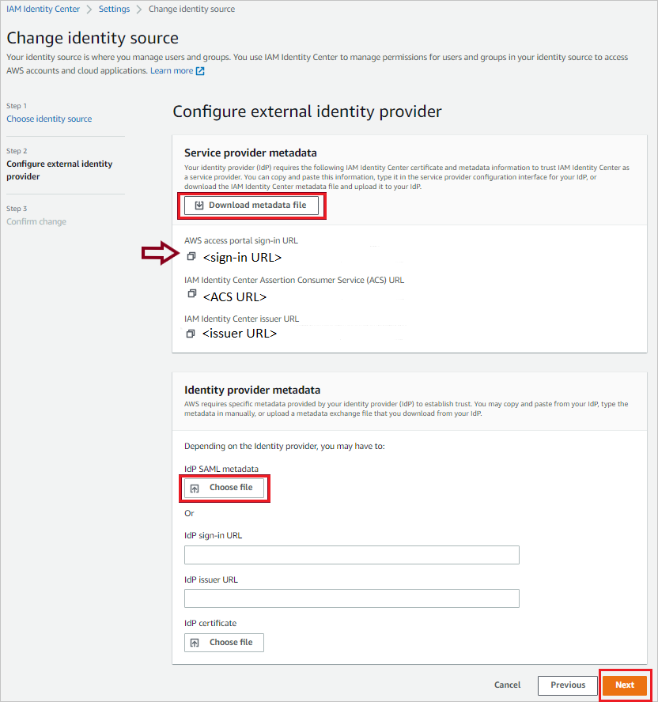
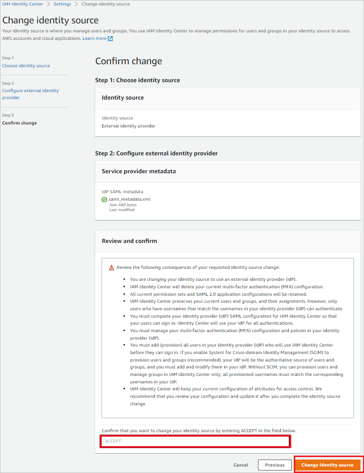

# Configure AWS IAM Identity Center (successor to AWS Single Sign-On) for Single sign-on with Microsoft Entra ID

In this article,  you learn how to integrate AWS IAM Identity Center (successor to AWS Single Sign-On) with Microsoft Entra ID. When you integrate AWS IAM Identity Center with Microsoft Entra ID, you can:

* Control in Microsoft Entra ID who has access to AWS IAM Identity Center.
* Enable your users to be automatically signed-in to AWS IAM Identity Center with their Microsoft Entra accounts.
* Manage your accounts in one central location.

**Note:** When using AWS Organizations, it's important to delegate another account as the Identity Center Administration account, enable the IAM Identity Center on it, and set up the Entra ID SSO with that account, not the root management account. This ensures a more secure and manageable setup.

## Prerequisites

The scenario outlined in this article assumes that you already have the following prerequisites:

[!INCLUDE [common-prerequisites.md](~/identity/saas-apps/includes/common-prerequisites.md)]
* An AWS Organizations setup with another account delegated as the Identity Center Administration account.
* AWS IAM Identity Center enabled on the delegated Identity Center Administration account.

## Scenario description

In this article,  you configure and test Microsoft Entra SSO in a test environment.

**Note:** Ensure you delegated another account as the Identity Center Administration account and enabled IAM Identity Center on it before proceeding with the following steps.

* AWS IAM Identity Center supports **SP and IDP** initiated SSO.

* AWS IAM Identity Center supports [**Automated user provisioning**](./aws-single-sign-on-provisioning-tutorial.md).

## Add AWS IAM Identity Center from the gallery

To configure the integration of AWS IAM Identity Center into Microsoft Entra ID, you need to add AWS IAM Identity Center from the gallery to your list of managed SaaS apps.

1. Sign in to the [Microsoft Entra admin center](https://entra.microsoft.com) as at least a [Cloud Application Administrator](~/identity/role-based-access-control/permissions-reference.md#cloud-application-administrator).
1. Browse to **Entra ID** > **Enterprise apps** > **New application**.
1. In the **Add from the gallery** section, type **AWS IAM Identity Center** in the search box.
1. Select **AWS IAM Identity Center** from results panel and then add the app. Wait a few seconds while the app is added to your tenant.

 Alternatively, you can also use the [Enterprise App Configuration Wizard](https://portal.office.com/AdminPortal/home?Q=Docs#/azureadappintegration). In this wizard, you can add an application to your tenant, add users/groups to the app, assign roles and walk through the SSO configuration as well. [Learn more about Microsoft 365 wizards.](/microsoft-365/admin/misc/azure-ad-setup-guides)

## Configure and test Microsoft Entra SSO for AWS IAM Identity Center

Configure and test Microsoft Entra SSO with AWS IAM Identity Center using a test user called **B.Simon**. For SSO to work, you need to establish a link relationship between a Microsoft Entra user and the related user in AWS IAM Identity Center.

To configure and test Microsoft Entra SSO with AWS IAM Identity Center, perform the following steps:

1. **[Configure Microsoft Entra SSO](#configure-azure-ad-sso)** - to enable your users to use this feature.
    1. **Create a Microsoft Entra test user** - to test Microsoft Entra single sign-on with B.Simon.
    1. **Assign the Microsoft Entra test user** - to enable B.Simon to use Microsoft Entra single sign-on.
1. **[Configure AWS IAM Identity Center SSO](#configure-aws-iam-identity-center-sso)** - to configure the single sign-on settings on application side.
    1. **[Create AWS IAM Identity Center test user](#create-aws-iam-identity-center-test-user)** - to have a counterpart of B.Simon in AWS IAM Identity Center that's linked to the Microsoft Entra representation of user.
1. **[Test SSO](#test-sso)** - to verify whether the configuration works.

## Configure Microsoft Entra SSO

Follow these steps to enable Microsoft Entra SSO.

1. Sign in to the [Microsoft Entra admin center](https://entra.microsoft.com) as at least a [Cloud Application Administrator](~/identity/role-based-access-control/permissions-reference.md#cloud-application-administrator).
1. Browse to **Entra ID** > **Enterprise apps** > **AWS IAM Identity Center** > **Single sign-on**.
1. On the **Select a single sign-on method** page, select **SAML**.
1. On the **Set up single sign-on with SAML** page, select the pencil icon for **Basic SAML Configuration** to edit the settings.

   

1. If you have **Service Provider metadata file**, on the **Basic SAML Configuration** section, perform the following steps:

	a. Select **Upload metadata file**.

	b. Select **folder logo**  to select the metadata file which is explained to download in **[Configure AWS IAM Identity Center SSO](#configure-aws-iam-identity-center-sso)** section and select **Add**.

	

	c. Once the metadata file is successfully uploaded, the **Identifier** and **Reply URL** values get auto populated in Basic SAML Configuration section.

	> [!Note]
	> If the **Identifier** and **Reply URL** values aren't getting auto populated, then fill in the values manually according to your requirement.

    > [!Note]
    > When changing identity provider in AWS (that is, from AD to external provider such as Microsoft Entra ID) the AWS metadata changes and need to be reuploaded to Azure for SSO to function correctly.

1. If you don't have **Service Provider metadata file**, perform the following steps on the **Basic SAML Configuration** section, if you wish to configure the application in **IDP** initiated mode, perform the following steps:

    a. In the **Identifier** text box, type a URL using the following pattern:
    `https://<REGION>.signin.aws.amazon.com/platform/saml/<ID>`

    b. In the **Reply URL** text box, type a URL using the following pattern:
    `https://<REGION>.signin.aws.amazon.com/platform/saml/acs/<ID>`

1. Select **Set additional URLs** and perform the following step if you wish to configure the application in **SP** initiated mode:

    In the **Sign-on URL** text box, type a URL using the following pattern:
    `https://portal.sso.<REGION>.amazonaws.com/saml/assertion/<ID>`

	> [!NOTE]
	> These values aren't real. Update these values with the actual Identifier, Reply URL and Sign-on URL. Contact [AWS IAM Identity Center Client support team](mailto:aws-sso-partners@amazon.com) to get these values. You can also refer to the patterns shown in the **Basic SAML Configuration** section.

1. AWS IAM Identity Center application expects the SAML assertions in a specific format, which requires you to add custom attribute mappings to your SAML token attributes configuration. The following screenshot shows the list of default attributes.

	

    > [!NOTE]
    > If ABAC is enabled in AWS IAM Identity Center, the additional attributes may be passed as session tags directly into AWS accounts.

1. On the **Set-up single sign-on with SAML** page, in the **SAML Signing Certificate** section, find **Federation Metadata XML** and select **Download** to download the certificate and save it on your computer.

    

1. On the **Set up AWS IAM Identity Center** section, copy the appropriate URL(s) based on your requirement.

	

[!INCLUDE [create-assign-users-sso.md](~/identity/saas-apps/includes/create-assign-users-sso.md)]

## Configure AWS IAM Identity Center SSO

1. In a different web browser window, sign in to your AWS IAM Identity Center company site as an administrator

1. Go to the **Services -> Security, Identity, & Compliance -> AWS IAM Identity Center**.
2. In the left navigation pane, choose **Settings**.
3. On the **Settings** page, find **Identity source**, select **Actions** pull-down menu, and select Change **identity source**.

    

4. On the Change identity source page, choose **External identity provider**.

    
    

1. Perform the below steps in the **Configure external identity provider** section:

    

    a. In the **Service provider metadata** section, find **AWS SSO SAML metadata**, select **Download metadata file** to download the metadata file and save it on your computer and use this metadata file to upload on Azure portal.

    b. Copy **AWS access portal sign-in URL** value, paste this value into the **Sign on URL** text box in the **Basic SAML Configuration section**.

    c. In the **Identity provider metadata** section, select **Choose file** to upload the metadata file that you downloaded.

    d. Choose **Next: Review**.

8. In the text box, type **ACCEPT** to change the identity source.

    

9. Select **Change identity source**.

### Create AWS IAM Identity Center test user

1. Open the **AWS IAM Identity Center console**.

2. In the left navigation pane, choose **Users**.

3. On the Users page, choose **Add user**.

4. On the Add user page, follow these steps:

    a. In the **Username** field, enter B.Simon.

    b. In the **Email address** field, enter the `username@companydomain.extension`. For example, `B.Simon@contoso.com`.

    c. In the **Confirmed email address** field, reenter the email address from the previous step.

    d. In the First name field, enter `Britta`.

    e. In the Last name field, enter `Simon`.

    f. In the Display name field, enter `B.Simon`.

    g. Choose **Next**, and then **Next** again.

    > [!NOTE]
    > Make sure the username and email address entered in AWS IAM Identity Center  matches the user’s Microsoft Entra sign-in name. This helps you avoid any authentication problems.

5. Choose **Add user**.
6. Next, you assign the user to your AWS account. To do so, in the left navigation pane of the AWS IAM Identity Center console, choose **AWS accounts**.
7. On the AWS Accounts page, select the AWS organization tab, check the box next to the AWS account you want to assign to the user. Then choose **Assign users**.
8. On the Assign Users page, find, and check the box next to the user B.Simon. Then choose **Next:
Permission sets**.
9. Under the select permission sets section, check the box next to the permission set you want to assign to the user B.Simon. If you don’t have an existing permission set, choose **Create new permission set**.

    > [!NOTE]
    > Permission sets define the level of access that users and groups have to an AWS account. To learn more
about permission sets, see the **AWS IAM Identity Center Multi Account Permissions** page.
10. Choose **Finish**.

> [!NOTE]
> AWS IAM Identity Center also supports automatic user provisioning, you can find more details [here](./aws-single-sign-on-provisioning-tutorial.md) on how to configure automatic user provisioning.

## Test SSO 

In this section, you test your Microsoft Entra single sign-on configuration with following options. 

#### SP initiated:

* Select **Test this application**, this option redirects to AWS IAM Identity Center sign-in URL where you can initiate the login flow. 

* Go to AWS IAM Identity Center sign-in URL directly and initiate the login flow from there.

#### IDP initiated:

* Select **Test this application**, and you should be automatically signed in to the AWS IAM Identity Center for which you set up the SSO. 

You can also use Microsoft My Apps to test the application in any mode. When you select the AWS IAM Identity Center tile in the My Apps, if configured in SP mode you would be redirected to the application sign on page for initiating the login flow and if configured in IDP mode, you should be automatically signed in to the AWS IAM Identity Center for which you set up the SSO. For more information about the My Apps, see [Introduction to the My Apps](https://support.microsoft.com/account-billing/sign-in-and-start-apps-from-the-my-apps-portal-2f3b1bae-0e5a-4a86-a33e-876fbd2a4510).

## Related content

Once you configure AWS IAM Identity Center you can enforce session control, which protects exfiltration and infiltration of your organization’s sensitive data in real time. Session control extends from Conditional Access. [Learn how to enforce session control with Microsoft Defender for Cloud Apps](/cloud-app-security/proxy-deployment-any-app).
