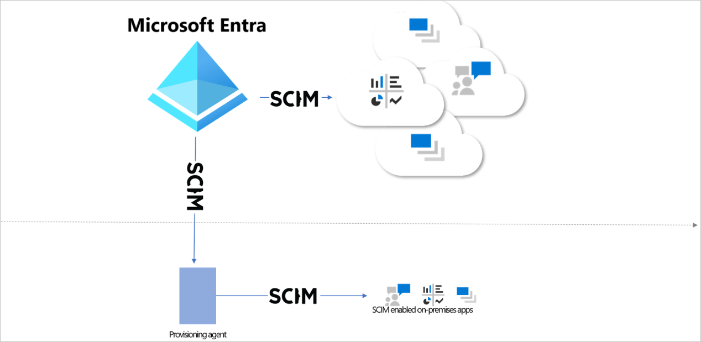
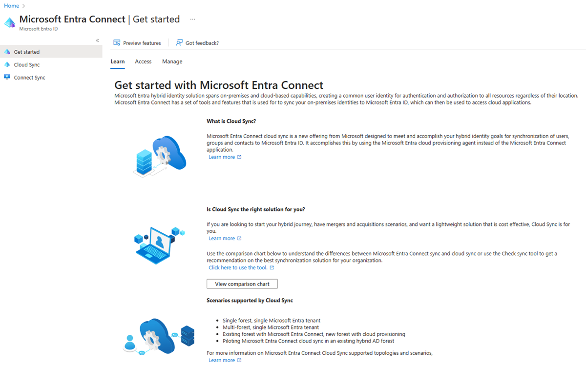
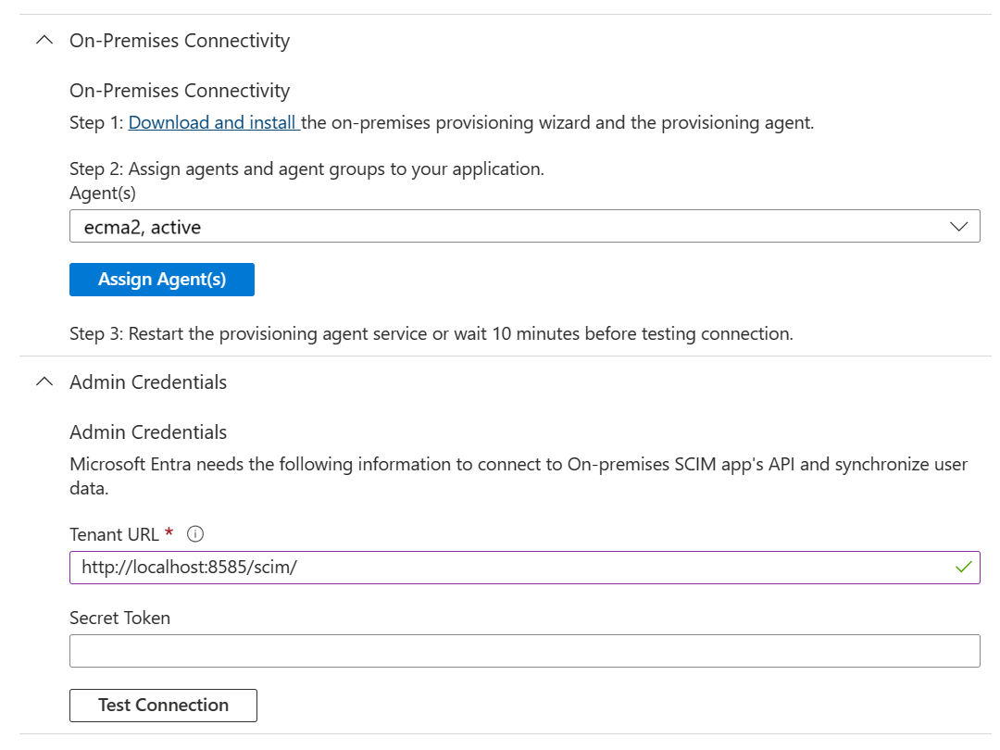

# Microsoft Entra Application Provisioning to Azure Databricks with Private Link Workspace

The Microsoft Entra provisioning service supports a [SCIM 2.0](https://techcommunity.microsoft.com/t5/identity-standards-blog/provisioning-with-scim-getting-started/ba-p/880010) client that can be used to automatically provision users into cloud or on-premises applications. This article outlines how you can use the Microsoft Entra provisioning service to provision users into Azure Databricks workspaces with no public access.

## Prerequisites
[!INCLUDE [common-prerequisites.md](~/identity/saas-apps/includes/common-prerequisites.md)] with Microsoft Entra ID Governance and Microsoft Entra ID P1 or Premium P2 (or EMS E3 or E5). To find the right license for your requirements, see [Compare generally available features of Microsoft Entra ID](https://www.microsoft.com/security/business/microsoft-entra-pricing).
* Administrator role for installing the agent. This task is a one-time effort and should be an account with at least the [Hybrid Identity Administrator](/entra/identity/role-based-access-control/permissions-reference#hybrid-identity-administrator) role. 
* Administrator role for configuring the application in the cloud [Application Administrator](/entra/identity/role-based-access-control/permissions-reference#application-administrator), [Cloud Application Administrator](/entra/identity/role-based-access-control/permissions-reference#cloud-application-administrator), or [Application Owner](/entra/fundamentals/users-default-permissions#owned-enterprise-applications).
* A computer with at least 3 GB of RAM, to host a provisioning agent. The computer should have Windows Server 2016 or a later version of Windows Server, with connectivity to the target application, and with outbound connectivity to login.microsoftonline.com, other Microsoft Online Services and Azure domains. An example is a Windows Server 2016 virtual machine hosted in Azure IaaS or behind a proxy.

## Download, install, and configure the Microsoft Entra Connect Provisioning Agent Package

If you have already downloaded the provisioning agent and configured it for another on-premises application, then continue reading in the next section.

1. Sign in to the [Microsoft Entra admin center](https://entra.microsoft.com) as at least a [Hybrid Identity Administrator](~/identity/role-based-access-control/permissions-reference.md#hybrid-identity-administrator).
1. Browse to **Entra ID** > **Entra Connect** > **Cloud sync**.

   

1.  On the left, select **Agent**.
1.  Select **Download on-premises agent**, and select **Accept terms & download**.  

   > [!NOTE]
   > Please use different provisioning agents for on-premises application provisioning and Microsoft Entra Connect cloud sync / HR-driven provisioning. All three scenarios shouldn't be managed on the same agent.
  
1.  Open the provisioning agent installer, agree to the terms of service, and select **next**.
1.  When the provisioning agent wizard opens, continue to the **Select Extension** tab and select **On-premises application provisioning** when prompted for the extension you want to enable.
1.  The provisioning agent uses the operating system's web browser to display a popup window for you to authenticate to Microsoft Entra ID, and potentially also your organization's identity provider.  If you're using Internet Explorer as the browser on Windows Server, then you may need to add Microsoft web sites to your browser's trusted site list to allow JavaScript to run correctly.
1.  Provide credentials for a Microsoft Entra administrator when you're prompted to authorize. The user is required to have at least the [Hybrid Identity Administrator](/entra/identity/role-based-access-control/permissions-reference#hybrid-identity-administrator) role.
1.  Select **Confirm** to confirm the setting. Once installation is successful, you can select **Exit**, and also close the Provisioning Agent Package installer.
 
## Provisioning to SCIM-enabled Workspace
Once the agent is installed, no further configuration is necessary on-premises, and all provisioning configurations are then managed. 
 
1. Sign in to the [Microsoft Entra admin center](https://entra.microsoft.com) as at least a [Cloud Application Administrator](~/identity/role-based-access-control/permissions-reference.md#cloud-application-administrator).
1. Browse to **Entra ID** > **Enterprise apps** > **New application**.
1. Add the **On-premises SCIM app** from the [gallery](~/identity/enterprise-apps/add-application-portal.md).
1. From the left hand menu, navigate to the **Provisioning** option and select **Get started**.
1. Select **Automatic** from the dropdown list and expand the **On-Premises Connectivity** option.
1. Select the agent that you installed from the dropdown list and select **Assign Agent(s)**.
1. Now either wait 10 minutes or restart the **Microsoft Entra Connect Provisioning Agent** before proceeding to the next step & testing the connection.
1. In the **Tenant URL** field, provide the SCIM endpoint URL for your application. The URL is typically unique to each target application and must be resolvable by DNS. An example for a scenario where the agent is installed on the same host as the application is `https://localhost:8585/scim`

   

1.  Create an Admin Token in Azure Databricks User Settings Console and enter the same in the **Secret Token** field
1.  Select **Test Connection**, and save the credentials. The application SCIM endpoint must be actively listening for inbound provisioning requests, otherwise the test fails. Use the steps [here](~/identity/app-provisioning/on-premises-ecma-troubleshoot.md#troubleshoot-test-connection-issues) if you run into connectivity issues. 

   >[!NOTE]
   > If the test connection fails, you see the request made. Please note that while the URL in the test connection error message is truncated, the actual request sent to the application contains the entire URL provided above. 

1.  Configure any [attribute mappings](~/identity/app-provisioning/customize-application-attributes.md) or [scoping](~/identity/app-provisioning/define-conditional-rules-for-provisioning-user-accounts.md) rules required for your application.
1.  Add users to scope by [assigning users and groups](~/identity/enterprise-apps/add-application-portal-assign-users.md) to the application.
1.  Test provisioning a few users [on demand](~/identity/app-provisioning/provision-on-demand.md).
1.  Add more users into scope by assigning them to your application.
1.  Go to the **Provisioning** pane, and select **Start provisioning**.
1.  Monitor using the [provisioning logs](~/identity/monitoring-health/concept-provisioning-logs.md).

The following video provides an overview of on-premises provisioning.
> [!VIDEO https://www.youtube.com/embed/QdfdpaFolys]

## More requirements
* Ensure your [SCIM](https://techcommunity.microsoft.com/t5/identity-standards-blog/provisioning-with-scim-getting-started/ba-p/880010) implementation meets the [Microsoft Entra SCIM requirements](~/identity/app-provisioning/use-scim-to-provision-users-and-groups.md).  
  Microsoft Entra ID offers open-source [reference code](https://github.com/AzureAD/SCIMReferenceCode/wiki) that developers can use to bootstrap their SCIM implementation.
* Support the /schemas endpoint to reduce configuration required. 

## Related content

* [App provisioning](~/identity/app-provisioning/user-provisioning.md)
* [Generic SQL connector](~/identity/app-provisioning/on-premises-sql-connector-configure.md)
* [Tutorial: ECMA Connector Host generic SQL connector](~/identity/app-provisioning/tutorial-ecma-sql-connector.md)
* [Known issues](~/identity/app-provisioning/known-issues.md)
