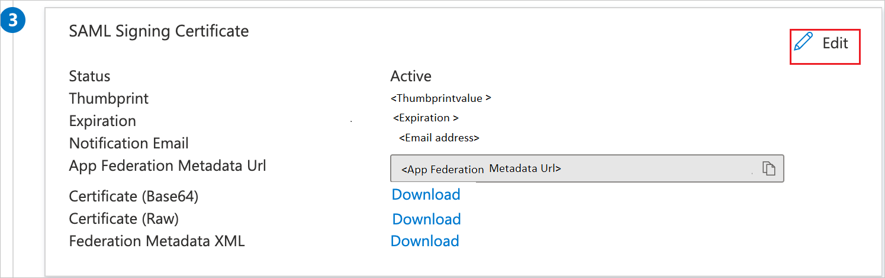

# Configure Baldwin Safety and Compliance for Single sign-on with Microsoft Entra ID

In this article,  you learn how to integrate Baldwin Safety and Compliance with Microsoft Entra ID. When you integrate Baldwin Safety and Compliance with Microsoft Entra ID, you can:

* Control in Microsoft Entra ID who has access to Baldwin Safety and Compliance.
* Enable your users to be automatically signed-in to Baldwin Safety and Compliance with their Microsoft Entra accounts.
* Manage your accounts in one central location.

## Prerequisites

The scenario outlined in this article assumes that you already have the following prerequisites:

[!INCLUDE [common-prerequisites.md](~/identity/saas-apps/includes/common-prerequisites.md)]
* Baldwin Safety and Compliance single sign-on (SSO) enabled subscription.

## Scenario description

In this article,  you configure and test Microsoft Entra SSO in a test environment.

* Baldwin Safety and Compliance supports **IDP** initiated SSO.

## Add Baldwin Safety and Compliance from the gallery

To configure the integration of Baldwin Safety and Compliance into Microsoft Entra ID, you need to add Baldwin Safety and Compliance from the gallery to your list of managed SaaS apps.

1. Sign in to the [Microsoft Entra admin center](https://entra.microsoft.com) as at least a [Cloud Application Administrator](~/identity/role-based-access-control/permissions-reference.md#cloud-application-administrator).
1. Browse to **Entra ID** > **Enterprise apps** > **New application**.
1. In the **Add from the gallery** section, type **Baldwin Safety and Compliance** in the search box.
1. Select **Baldwin Safety and Compliance** from results panel and then add the app. Wait a few seconds while the app is added to your tenant.

 [!INCLUDE [sso-wizard.md](~/identity/saas-apps/includes/sso-wizard.md)]

## Configure and test Microsoft Entra SSO for Baldwin Safety and Compliance

Configure and test Microsoft Entra SSO with Baldwin Safety and Compliance using a test user called **B.Simon**. For SSO to work, you need to establish a link relationship between a Microsoft Entra user and the related user in Baldwin Safety and Compliance.

To configure and test Microsoft Entra SSO with Baldwin Safety and Compliance, perform the following steps:

1. **[Configure Microsoft Entra SSO](#configure-azure-ad-sso)** - to enable your users to use this feature.
    1. **Create a Microsoft Entra test user** - to test Microsoft Entra single sign-on with B.Simon.
    1. **Assign the Microsoft Entra test user** - to enable B.Simon to use Microsoft Entra single sign-on.
1. **[Configure Baldwin Safety and Compliance SSO](#configure-baldwin-safety-and-compliance-sso)** - to configure the single sign-on settings on application side.
    1. **[Create Baldwin Safety and Compliance test user](#create-baldwin-safety-and-compliance-test-user)** - to have a counterpart of B.Simon in Baldwin Safety and Compliance that's linked to the Microsoft Entra representation of user.
1. **[Test SSO](#test-sso)** - to verify whether the configuration works.

## Configure Microsoft Entra SSO

Follow these steps to enable Microsoft Entra SSO.

1. Sign in to the [Microsoft Entra admin center](https://entra.microsoft.com) as at least a [Cloud Application Administrator](~/identity/role-based-access-control/permissions-reference.md#cloud-application-administrator).
1. Browse to **Entra ID** > **Enterprise apps** > **Baldwin Safety and Compliance** > **Single sign-on**.
1. On the **Select a single sign-on method** page, select **SAML**.
1. On the **Set up single sign-on with SAML** page, select the pencil icon for **Basic SAML Configuration** to edit the settings.

   

1. On the **Basic SAML Configuration** section the application is pre-configured in **IDP** initiated mode and the necessary URLs are already pre-populated with Azure. The user needs to save the configuration by selecting the **Save** button.

1. In the **SAML Signing Certificate** section, select **Edit** button to open **SAML Signing Certificate** dialog.

	

1. In the **SAML Signing Certificate** section, copy the **Thumbprint Value** and save it on your computer.

    

1. On the **Set up Baldwin Safety and Compliance** section, copy the appropriate URL(s) based on your requirement.

	

[!INCLUDE [create-assign-users-sso.md](~/identity/saas-apps/includes/create-assign-users-sso.md)]

## Configure Baldwin Safety and Compliance SSO

To configure single sign-on on **Baldwin Safety and Compliance** side, you need to send the **Thumbprint Value** and appropriate copied URLs from the application configuration to [Baldwin Safety and Compliance support team](mailto:support@baldwinaviation.com). They set this setting to have the SAML SSO connection set properly on both sides.

### Create Baldwin Safety and Compliance test user

In this section, you create a user called Britta Simon in Baldwin Safety and Compliance. Work with [Baldwin Safety and Compliance support team](mailto:support@baldwinaviation.com) to add the users in the Baldwin Safety and Compliance platform. Users must be created and activated before you use single sign-on.

## Test SSO 

In this section, you test your Microsoft Entra single sign-on configuration with following options.

* Select **Test this application**, and you should be automatically signed in to the Baldwin Safety and Compliance for which you set up the SSO.

* You can use Microsoft My Apps. When you select the Baldwin Safety and Compliance tile in the My Apps, you should be automatically signed in to the Baldwin Safety and Compliance for which you set up the SSO. For more information about the My Apps, see [Introduction to the My Apps](https://support.microsoft.com/account-billing/sign-in-and-start-apps-from-the-my-apps-portal-2f3b1bae-0e5a-4a86-a33e-876fbd2a4510).

## Related content

Once you configure Baldwin Safety and Compliance you can enforce session control, which protects exfiltration and infiltration of your organization’s sensitive data in real time. Session control extends from Conditional Access. [Learn how to enforce session control with Microsoft Defender for Cloud Apps](/cloud-app-security/proxy-deployment-aad).
