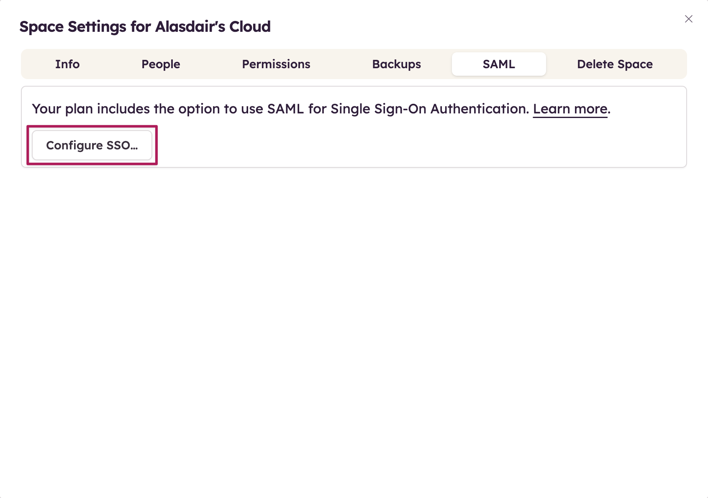

# Configure Balsamiq Wireframes for Single sign-on with Microsoft Entra ID

In this article,  you learn how to integrate Balsamiq Wireframes with Microsoft Entra ID. When you integrate Balsamiq Wireframes with Microsoft Entra ID, you can:

* Control in Microsoft Entra ID who has access to Balsamiq Wireframes.
* Enable your users to be automatically signed-in to Balsamiq Wireframes with their Microsoft Entra accounts.
* Manage your accounts in one central location.

## Prerequisites

The scenario outlined in this article assumes that you already have the following prerequisites:

[!INCLUDE [common-prerequisites.md](~/identity/saas-apps/includes/common-prerequisites.md)]
* Balsamiq Wireframes single sign-on (SSO) enabled subscription.

> [!NOTE]
> This feature is only available for users on the 200-projects Space plan.

## Scenario description

In this article,  you configure and test Microsoft Entra SSO in a test environment.

* Balsamiq Wireframes supports **SP and IDP** initiated SSO.
* Balsamiq Wireframes supports **Just In Time** user provisioning.

## Add Balsamiq Wireframes from the gallery

To configure the integration of Balsamiq Wireframes into Microsoft Entra ID, you need to add Balsamiq Wireframes from the gallery to your list of managed SaaS apps.

1. Sign in to the [Microsoft Entra admin center](https://entra.microsoft.com) as at least a [Cloud Application Administrator](~/identity/role-based-access-control/permissions-reference.md#cloud-application-administrator).
1. Browse to **Entra ID** > **Enterprise apps** > **New application**.
1. In the **Add from the gallery** section, type **Balsamiq Wireframes** in the search box.
1. Select **Balsamiq Wireframes** from results panel and then add the app. Wait a few seconds while the app is added to your tenant.

 [!INCLUDE [sso-wizard.md](~/identity/saas-apps/includes/sso-wizard.md)]

## Configure and test Microsoft Entra SSO for Balsamiq Wireframes

Configure and test Microsoft Entra SSO with Balsamiq Wireframes using a test user called **B.Simon**. For SSO to work, you need to establish a link relationship between a Microsoft Entra user and the related user in Balsamiq Wireframes.

To configure and test Microsoft Entra SSO with Balsamiq Wireframes, perform the following steps:

1. **[Configure Microsoft Entra SSO](#configure-azure-ad-sso)** - to enable your users to use this feature.
    1. **Create a Microsoft Entra test user** - to test Microsoft Entra single sign-on with B.Simon.
    1. **Assign the Microsoft Entra test user** - to enable B.Simon to use Microsoft Entra single sign-on.
1. **[Configure Balsamiq Wireframes SSO](#configure-balsamiq-wireframes-sso)** - to configure the single sign-on settings on application side.
    1. **[Create Balsamiq Wireframes test user](#create-balsamiq-wireframes-test-user)** - to have a counterpart of B.Simon in Balsamiq Wireframes that's linked to the Microsoft Entra representation of user.
1. **[Test SSO](#test-sso)** - to verify whether the configuration works.

## Configure Microsoft Entra SSO

Follow these steps to enable Microsoft Entra SSO.

1. Sign in to the [Microsoft Entra admin center](https://entra.microsoft.com) as at least a [Cloud Application Administrator](~/identity/role-based-access-control/permissions-reference.md#cloud-application-administrator).
1. Browse to **Entra ID** > **Enterprise apps** > **Balsamiq Wireframes** > **Single sign-on**.
1. On the **Select a single sign-on method** page, select **SAML**.
1. On the **Set up single sign-on with SAML** page, select the pencil icon for **Basic SAML Configuration** to edit the settings.

   

1. On the **Basic SAML Configuration** section, perform the following steps:

    a. In the **Identifier** text box, type a URL using the following pattern:
    `https://balsamiq.cloud/samlsso/<ID>`

    b. In the **Reply URL** text box, type a URL using the following pattern:
    `https://balsamiq.cloud/samlsso/<ID>`

    c. In the **Sign-on URL** text box, type a URL using the following pattern:
    `https://balsamiq.cloud/samlsso/<ID>`

    d. In the **Relay State** text box, type a URL using the following pattern:
    `https://balsamiq.cloud/<ID>/projects`

	> [!NOTE]
	> These values aren't real. Update these values with the actual Identifier, Reply URL, Sign-on URL and Relay State. Contact [Balsamiq Wireframes Client support team](mailto:support@balsamiq.com) to get these values. You can also refer to the patterns shown in the **Basic SAML Configuration** section.

1. Balsamiq Wireframes application expects the SAML assertions in a specific format, which requires you to add custom attribute mappings to your SAML token attributes configuration. The following screenshot shows the list of default attributes.

	

1. In addition to above, Balsamiq Wireframes application expects few more attributes to be passed back in SAML response which are shown below. These attributes are also pre populated but you can review them as per your requirements.
	
	| Name | Source Attribute|
	| ----------| --------- |
	| Email | user.mail |
    | firstName | user.givenname |
    | lastName | user.surname |

1. On the **Set up single sign-on with SAML** page, in the **SAML Signing Certificate** section,  find **Federation Metadata XML** and select **Download** to download the certificate and save it on your computer.

	

1. On the **Set up Balsamiq Wireframes** section, copy the appropriate URL(s) based on your requirement.

	

[!INCLUDE [create-assign-users-sso.md](~/identity/saas-apps/includes/create-assign-users-sso.md)]

## Configure Balsamiq Wireframes SSO

1. Log in to your Balsamiq Wireframes company site as an administrator.

1. Go to **Settings** > **Space Settings** and select **Configure SSO** under Single Sign-On Authentication.

     

1. Copy all the required values and paste it in **Basic SAML Configuration** section in the Azure portal and select **Next**.

    

1. In the **Configure IDp** section, perform the following steps:

    

    1. In the **SAML 2.0 Endpoint(HTTP)** textbox, paste the value of **Login URL**, which you copied previously.

    1. In the **Identity Provider Issuer** textbox, paste the value of **Microsoft Entra Identifier**, which you copied previously.

    1. Open the downloaded **Federation Metadata XML** file and **Upload** the file into **Public Certificate** section.
    
    1. Select **Next**.

    > [!Note]
    > If you have an IdP Metadata file to upload, the fields are automatically populated.

1. Verify your SAML configuration, select **Test SAML Login** button and select **Next**.

    

1. After the successful test configuration, select **Turn on SAML SSO Now**.

    

### Create Balsamiq Wireframes test user

In this section, a user called Britta Simon is created in Balsamiq Wireframes. Balsamiq Wireframes supports just-in-time user provisioning, which is enabled by default. There's no action item for you in this section. If a user doesn't already exist in Balsamiq Wireframes, a new one is created after authentication.

## Test SSO 

In this section, you test your Microsoft Entra single sign-on configuration with following options. 

#### SP initiated:

* Select **Test this application**, this option redirects to Balsamiq Wireframes Sign on URL where you can initiate the login flow.  

* Go to Balsamiq Wireframes Sign-on URL directly and initiate the login flow from there.

#### IDP initiated:

* Select **Test this application**, and you should be automatically signed in to the Balsamiq Wireframes for which you set up the SSO. 

You can also use Microsoft My Apps to test the application in any mode. When you select the Balsamiq Wireframes tile in the My Apps, if configured in SP mode you would be redirected to the application sign on page for initiating the login flow and if configured in IDP mode, you should be automatically signed in to the Balsamiq Wireframes for which you set up the SSO. For more information, see [Microsoft Entra My Apps](/azure/active-directory/manage-apps/end-user-experiences#azure-ad-my-apps).

## Related content

Once you configure Balsamiq Wireframes you can enforce session control, which protects exfiltration and infiltration of your organization’s sensitive data in real time. Session control extends from Conditional Access. [Learn how to enforce session control with Microsoft Cloud App Security](/cloud-app-security/proxy-deployment-aad).
