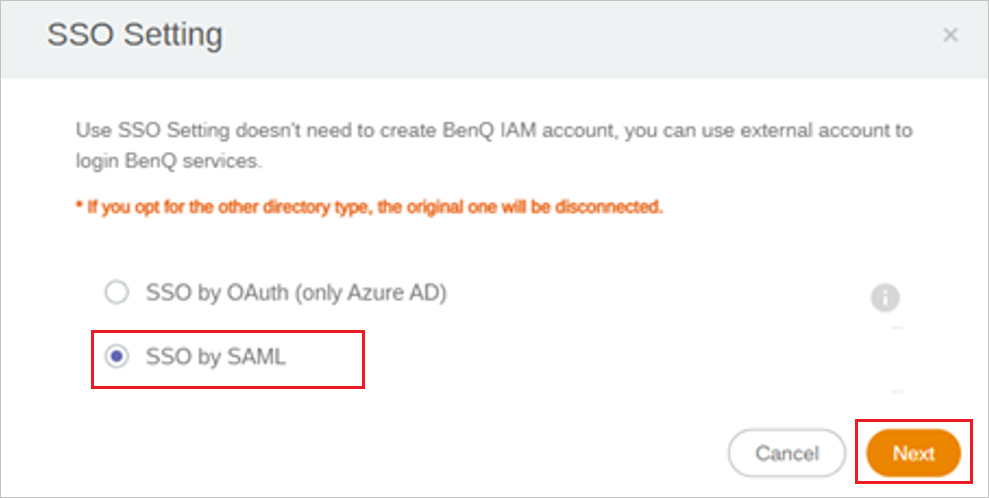
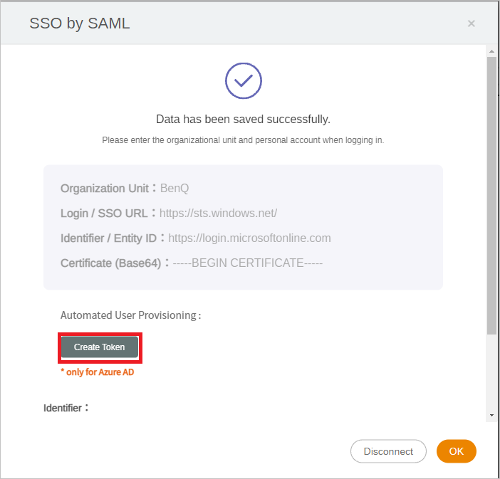
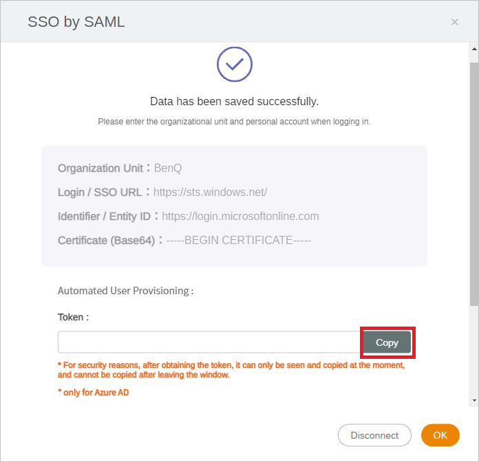

# Configure BenQ IAM for automatic user provisioning with Microsoft Entra ID

This article describes the steps you need to perform in both BenQ IAM and Microsoft Entra ID to configure automatic user provisioning. When configured, Microsoft Entra ID automatically provisions and de-provisions users and groups to [BenQ IAM](https://service-portal.benq.com/login) using the Microsoft Entra provisioning service. For important details on what this service does, how it works, and frequently asked questions, see [Automate user provisioning and deprovisioning to SaaS applications with Microsoft Entra ID](~/identity/app-provisioning/user-provisioning.md). 

## Supported capabilities
> [!div class="checklist"]
> * Create users in BenQ IAM
> * Remove users in BenQ IAM when they don't require access anymore
> * Keep user attributes synchronized between Microsoft Entra ID and BenQ IAM
> * [Single sign-on](benq-iam-tutorial.md) to BenQ IAM (recommended)

## Prerequisites

The scenario outlined in this article assumes that you already have the following prerequisites:

* [A Microsoft Entra tenant](~/identity-platform/quickstart-create-new-tenant.md) 
* A user account in Microsoft Entra ID with [permission](~/identity/role-based-access-control/permissions-reference.md) to configure provisioning (like [Application Administrator](/entra/identity/role-based-access-control/permissions-reference#application-administrator), [Cloud Application Administrator](/entra/identity/role-based-access-control/permissions-reference#cloud-application-administrator), or [Application Owner](/entra/fundamentals/users-default-permissions#owned-enterprise-applications)).
* An administrator account with BenQ IAM. You can register for a BenQ admin account at [BenQ IAM](https://service-portaltest.benq.com/login).

## Step 1: Plan your provisioning deployment
1. Learn about [how the provisioning service works](~/identity/app-provisioning/user-provisioning.md).
2. Determine who's in [scope for provisioning](~/identity/app-provisioning/define-conditional-rules-for-provisioning-user-accounts.md).
3. Determine what data to [map between Microsoft Entra ID and BenQ IAM](~/identity/app-provisioning/customize-application-attributes.md).

## Step 2: Configure BenQ IAM to support provisioning with Microsoft Entra ID

1. Sign in to the [BenQ IAM](https://service-portaltest.benq.com/login) with BenQ administrator account, select **SSO Setting** in the Account Management section.
	

2. Select **SSO by SAML** as SSO Setting in the pop up and select Next. 
	

3. Follow [the article for Microsoft Entra SSO integration with BenQ IAM](benq-iam-tutorial.md) to complete the required settings.

4. After finishing the settings for SSO by SAML, you see a success message as shown in the image below. Select **Create Token** in the Automated User Provisioning section.
	

5. Copy the token to a safe place. This token is used in Azure portal in **Step 5**.
	

## Step 3: Add BenQ IAM from the Microsoft Entra application gallery

Add BenQ IAM from the Microsoft Entra application gallery to start managing provisioning to BenQ IAM. If you have previously setup BenQ IAM for SSO you can use the same application. However, we recommend that you create a separate app when testing out the integration initially. Learn more about adding an application from the gallery [here](~/identity/enterprise-apps/add-application-portal.md). 

## Step 4: Define who is in scope for provisioning 

[!INCLUDE [create-assign-users-provisioning.md](~/identity/saas-apps/includes/create-assign-users-provisioning.md)]

## Step 5: Configure automatic user provisioning to BenQ IAM 

This section guides you through the steps to configure the Microsoft Entra provisioning service to create, update, and disable users and/or groups in TestApp based on user and/or group assignments in Microsoft Entra ID.

### To configure automatic user provisioning for BenQ IAM in Microsoft Entra ID:

1. Sign in to the [Microsoft Entra admin center](https://entra.microsoft.com) as at least a [Cloud Application Administrator](~/identity/role-based-access-control/permissions-reference.md#cloud-application-administrator).
1. Browse to **Entra ID** > **Enterprise apps**

	

1. In the applications list, select **BenQ IAM**.

	

3. Select the **Provisioning** tab.

	

4. Set the **Provisioning Mode** to **Automatic**.

	

5. Under the **Admin Credentials** section, input your BenQ IAM Tenant URL and Secret Token. Select **Test Connection** to ensure Microsoft Entra ID can connect to BenQ IAM. If the connection fails, ensure your BenQ IAM account has Admin permissions and try again.

 	

6. In the **Notification Email** field, enter the email address of a person or group who should receive the provisioning error notifications and select the **Send an email notification when a failure occurs** check box.

	

7. Select **Save**.

8. Under the **Mappings** section, select **Synchronize Microsoft Entra users to BenQ IAM**.

9. Review the user attributes that are synchronized from Microsoft Entra ID to BenQ IAM in the **Attribute-Mapping** section. The attributes selected as **Matching** properties are used to match the user accounts in BenQ IAM for update operations. If you choose to change the [matching target attribute](~/identity/app-provisioning/customize-application-attributes.md), you need to ensure that the BenQ IAM API supports filtering users based on that attribute. Select the **Save** button to commit any changes.

   |Attribute|Type|Supported for filtering|
   |---|---|---|
   |userName|String|&check;|
   |externalId|String||
   |active|Boolean||
   |displayName|String||

10. To configure scoping filters, refer to the following instructions provided in the [Scoping filter  article](~/identity/app-provisioning/define-conditional-rules-for-provisioning-user-accounts.md).

11. To enable the Microsoft Entra provisioning service for BenQ IAM, change the **Provisioning Status** to **On** in the **Settings** section.

	

12. Define the users and/or groups that you would like to provision to BenQ IAM by choosing the desired values in **Scope** in the **Settings** section.

	

13. When you're ready to provision, select **Save**.

	

This operation starts the initial synchronization cycle of all users and groups defined in **Scope** in the **Settings** section. The initial cycle takes longer to perform than subsequent cycles, which occur approximately every 40 minutes as long as the Microsoft Entra provisioning service is running. 

## Step 6: Monitor your deployment

[!INCLUDE [monitor-deployment.md](~/identity/saas-apps/includes/monitor-deployment.md)]

## Additional resources

* [Managing user account provisioning for Enterprise Apps](~/identity/app-provisioning/configure-automatic-user-provisioning-portal.md)
* [What is application access and single sign-on with Microsoft Entra ID?](~/identity/enterprise-apps/what-is-single-sign-on.md)

## Related content

* [Learn how to review logs and get reports on provisioning activity](~/identity/app-provisioning/check-status-user-account-provisioning.md)
