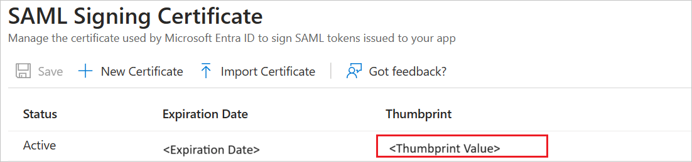
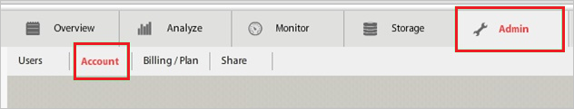
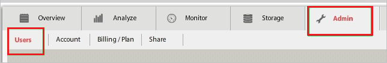
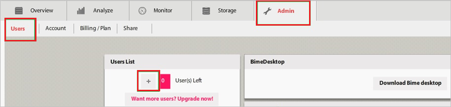
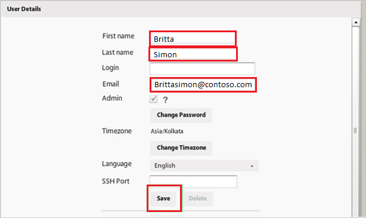

# Configure Bime for Single sign-on with Microsoft Entra ID

In this article,  you learn how to integrate Bime with Microsoft Entra ID. When you integrate Bime with Microsoft Entra ID, you can:

* Control in Microsoft Entra ID who has access to Bime.
* Enable your users to be automatically signed-in to Bime with their Microsoft Entra accounts.
* Manage your accounts in one central location.

## Prerequisites

The scenario outlined in this article assumes that you already have the following prerequisites:

[!INCLUDE [common-prerequisites.md](~/identity/saas-apps/includes/common-prerequisites.md)]
* Bime single sign-on (SSO) enabled subscription.

## Scenario description

In this article,  you configure and test Microsoft Entra single sign-on in a test environment.

* Bime supports **SP** initiated SSO.

## Add Bime from the gallery

To configure the integration of Bime into Microsoft Entra ID, you need to add Bime from the gallery to your list of managed SaaS apps.

1. Sign in to the [Microsoft Entra admin center](https://entra.microsoft.com) as at least a [Cloud Application Administrator](~/identity/role-based-access-control/permissions-reference.md#cloud-application-administrator).
1. Browse to **Entra ID** > **Enterprise apps** > **New application**.
1. In the **Add from the gallery** section, type **Bime** in the search box.
1. Select **Bime** from results panel and then add the app. Wait a few seconds while the app is added to your tenant.

 [!INCLUDE [sso-wizard.md](~/identity/saas-apps/includes/sso-wizard.md)]

## Configure and test Microsoft Entra SSO for Bime

Configure and test Microsoft Entra SSO with Bime using a test user called **B.Simon**. For SSO to work, you need to establish a link relationship between a Microsoft Entra user and the related user in Bime.

To configure and test Microsoft Entra SSO with Bime, perform the following steps:

1. **[Configure Microsoft Entra SSO](#configure-azure-ad-sso)** - to enable your users to use this feature.
    1. **Create a Microsoft Entra test user** - to test Microsoft Entra single sign-on with B.Simon.
    1. **Assign the Microsoft Entra test user** - to enable B.Simon to use Microsoft Entra single sign-on.
1. **[Configure Bime SSO](#configure-bime-sso)** - to configure the single sign-on settings on application side.
    1. **[Create Bime test user](#create-bime-test-user)** - to have a counterpart of B.Simon in Bime that's linked to the Microsoft Entra representation of user.
1. **[Test SSO](#test-sso)** - to verify whether the configuration works.

## Configure Microsoft Entra SSO

Follow these steps to enable Microsoft Entra SSO.

1. Sign in to the [Microsoft Entra admin center](https://entra.microsoft.com) as at least a [Cloud Application Administrator](~/identity/role-based-access-control/permissions-reference.md#cloud-application-administrator).
1. Browse to **Entra ID** > **Enterprise apps** > **Bime** > **Single sign-on**.
1. On the **Select a single sign-on method** page, select **SAML**.
1. On the **Set up single sign-on with SAML** page, select the pencil icon for **Basic SAML Configuration** to edit the settings.

   

1. On the **Basic SAML Configuration** section, perform the following steps:

    a. In the **Identifier (Entity ID)** text box, type a URL using the following pattern:
    `https://<tenant-name>.Bimeapp.com`

    b. In the **Sign on URL** text box, type a URL using the following pattern:
    `https://<tenant-name>.Bimeapp.com`

    > [!NOTE]
    > These values aren't real. Update these values with the actual Identifier and Sign on URL. Contact [Bime Client support team](https://bime.zendesk.com/hc/categories/202604307-Support-tech-notes-and-tips-) to get these values. You can also refer to the patterns shown in the **Basic SAML Configuration** section.

5. In the **SAML Signing Certificate** section, select **Edit** button to open **SAML Signing Certificate** dialog.

    

6. In the **SAML Signing Certificate** section, copy the **THUMBPRINT** and save it on your computer.

    

7. On the **Set up Bime** section, copy the appropriate URL(s) as per your requirement.

    

[!INCLUDE [create-assign-users-sso.md](~/identity/saas-apps/includes/create-assign-users-sso.md)]

## Configure Bime SSO

1. In a different web browser window, log into your Bime company site as an administrator.

2. In the toolbar, select **Admin**, and then **Account**.

    

3. On the account configuration page, perform the following steps:

    

    a. Select **Enable SAML authentication**.

    b. In the **Remote Login URL** textbox, paste the value of **Login URL**.

    c. In the **Certificate Fingerprint** textbox, paste the **THUMBPRINT** value..

    d. Select **Save**.

### Create Bime test user

In order to enable Microsoft Entra users to log in to Bime, they must be provisioned into Bime. In the case of Bime, provisioning is a manual task.

**To configure user provisioning, perform the following steps:**

1. Log in to your **Bime** tenant.

2. In the toolbar, select **Admin**, and then **Users**.

    

3. In the **Users List**, select **Add New User** (“+”).

    

4. On the **User Details** dialog page, perform the following steps:

    

    a. In the **First name** textbox, enter the first name of user like **Britta**.

    b. In the **Last name** textbox, enter the last name of user like **Simon**.

    c. In the **Email** textbox, enter the email of user like **brittasimon\@contoso.com**.

    d. Select **Save**.

> [!NOTE]
> You can use any other Bime user account creation tools or APIs provided by Bime to provision Microsoft Entra user accounts.

## Test SSO

In this section, you test your Microsoft Entra single sign-on configuration with following options. 

* Select **Test this application**, this option redirects to Bime Sign-on URL where you can initiate the login flow. 

* Go to Bime Sign-on URL directly and initiate the login flow from there.

* You can use Microsoft My Apps. When you select the Bime tile in the My Apps, this option redirects to Bime Sign-on URL. For more information, see [Microsoft Entra My Apps](/azure/active-directory/manage-apps/end-user-experiences#azure-ad-my-apps).

## Related content

Once you configure Bime you can enforce session control, which protects exfiltration and infiltration of your organization’s sensitive data in real time. Session control extends from Conditional Access. [Learn how to enforce session control with Microsoft Defender for Cloud Apps](/cloud-app-security/proxy-deployment-aad).
