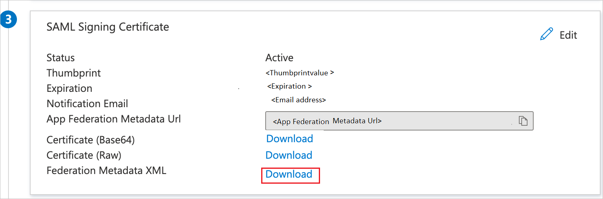

# Configure BIS for Single sign-on with Microsoft Entra ID

In this article, you learn how to integrate BIS with Microsoft Entra ID. When you integrate BIS with Microsoft Entra ID, you can:

* Control in Microsoft Entra ID who has access to BIS.
* Enable your users to be automatically signed-in to BIS with their Microsoft Entra accounts.
* Manage your accounts in one central location.

## Prerequisites

The scenario outlined in this article assumes that you already have the following prerequisites:

[!INCLUDE [common-prerequisites.md](~/identity/saas-apps/includes/common-prerequisites.md)]
* BIS single sign-on (SSO) enabled subscription.

## Scenario description

In this article, you configure and test Microsoft Entra SSO in a test environment.

* BIS supports **SP** initiated SSO.

* BIS supports **Just In Time** user provisioning.

> [!NOTE]
> Identifier of this application is a fixed string value so only one instance can be configured in one tenant.

## Add BIS from the gallery

To configure the integration of BIS into Microsoft Entra ID, you need to add BIS from the gallery to your list of managed SaaS apps.

1. Sign in to the [Microsoft Entra admin center](https://entra.microsoft.com) as at least a [Cloud Application Administrator](~/identity/role-based-access-control/permissions-reference.md#cloud-application-administrator).
1. Browse to **Entra ID** > **Enterprise apps** > **New application**.
1. In the **Add from the gallery** section, type **BIS** in the search box.
1. Select **BIS** from the results panel and then add the app. Wait a few seconds while the app is added to your tenant.

 [!INCLUDE [sso-wizard.md](~/identity/saas-apps/includes/sso-wizard.md)]

## Configure and test Microsoft Entra SSO for BIS

Configure and test Microsoft Entra SSO with BIS using a test user called **B.Simon**. For SSO to work, you need to establish a link relationship between a Microsoft Entra user and the related user in BIS.

To configure and test Microsoft Entra SSO with BIS, perform the following steps:

1. **[Configure BIS SSO](#configure-bis-sso)** - to configure the single sign-on settings on the application side.
    1. Initialize SSO configuration.
1. **[Configure Microsoft Entra SSO](#configure-azure-ad-sso)** - to enable your users to use this feature.
    1. **Create a Microsoft Entra test user** - to test Microsoft Entra single sign-on with B.Simon.
    1. **Assign the Microsoft Entra test user** - to enable B.Simon to use Microsoft Entra single sign-on.
1. **[Complete the SSO configuration on BIS side](#complete-the-sso-configuration-on-bis-side)** - to complete the configuration on the application side.
1. **[Test SSO](#test-sso)** - to verify whether the configuration works.

## Configure BIS SSO

To configure single sign-on on **BIS** side, you need a **Client Security Admin** role user in BIS with access to the Integrations page. Follow the steps below:

1. Sign in to BIS.
2. Navigate to Company Settings and open the Integrations page.
3. Under the SSO section, click **Initiate SSO** button.
4. Copy the Sign-on URL, Entity ID, and Reply URL.

### Create BIS test user if necessary

BIS supports just-in-time user provisioning, which is enabled by default. There's no action item for you in this section. If a user doesn't already exist in BIS, a new one is created after authentication.

## Configure Microsoft Entra SSO

Follow these steps to enable Microsoft Entra SSO.

1. Sign in to the [Microsoft Entra admin center](https://entra.microsoft.com) as at least a [Cloud Application Administrator](~/identity/role-based-access-control/permissions-reference.md#cloud-application-administrator).
1. Browse to **Entra ID** > **Enterprise apps** > **BIS** > **Single sign-on**.
1. On the **Select a single sign-on method** page, select **SAML**.
1. On the **Set up single sign-on with SAML** page, select the pencil icon for **Basic SAML Configuration** to edit the settings.

   

1. On the **Basic SAML Configuration** section, perform the following steps:

    1. In the **Identifier (Entity ID)** text box, type or paste the Entity ID copied from BIS. Pattern: `https://<www.bissafety.app|custom-domainname>/<tenant-name>`
    1. In the **Sign-on URL** text box, type or paste the Sign-on URL copied from BIS. Pattern: `https://<www.bissafety.app|custom-domainname>/sso/<tenant-name>cr.cfm`
    1. In the **Reply URL** text box, type or paste the Reply URL copied from BIS. Pattern: `https://<www.bissafety.app|custom-domainname>/sso/<tenant-name>.cfm`

1. On the **Set up single sign-on with SAML** page, in the **SAML Signing Certificate** section, find **Federation Metadata XML** and select **Download** to download the certificate and save it on your computer.

	

1. On the **Set up BIS** section, copy the appropriate URL(s) based on your requirements.

	

[!INCLUDE [create-assign-users-sso.md](~/identity/saas-apps/includes/create-assign-users-sso.md)]

## Complete the SSO configuration on BIS side

To complete the SSO configuration on the BIS side:

1. Sign in to BIS.
2. Navigate to Company Settings and open the Integrations page.
3. Under the SSO section, click **Initiate SSO**.
4. Under Step 3, upload the downloaded **Federation Metadata XML** file and click **Update Metadata**.
5. Select the claim attributes in the next section.
6. Click **Save** to complete the SSO configuration.

## Test SSO

In this section, you test your Microsoft Entra single sign-on configuration with the following options.

#### SP initiated

* Select **Test this application**; this redirects to the BIS Sign-on URL where you can initiate the login flow.
* Go to the BIS Sign-on URL directly and initiate the login flow from there.

#### IDP initiated

* Select **Test this application**; you should be automatically signed in to the BIS instance for which you set up SSO.

You can also use Microsoft My Apps to test the application in any mode. When you select the BIS tile in My Apps, if configured in SP mode you are redirected to the application sign-on page to initiate the login flow; if configured in IDP mode, you are automatically signed in to the BIS instance for which you set up SSO. For more information about the My Apps, see [Introduction to the My Apps](https://support.microsoft.com/account-billing/sign-in-and-start-apps-from-the-my-apps-portal-2f3b1bae-0e5a-4a86-a33e-876fbd2a4510).

## Related content

Once you configure BIS you can enforce session control, which protects exfiltration and infiltration of your organization's sensitive data in real time. Session control extends from Conditional Access. [Learn how to enforce session control with Microsoft Defender for Cloud Apps](/cloud-app-security/proxy-deployment-aad).
