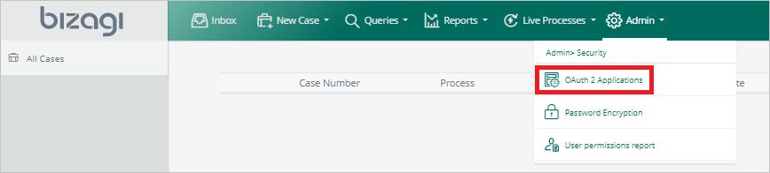
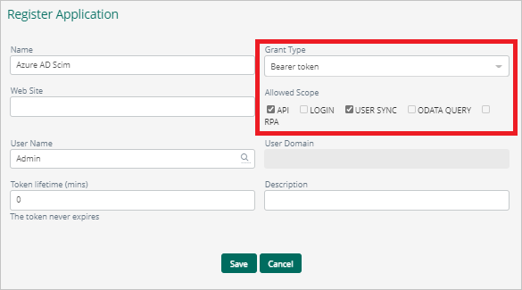
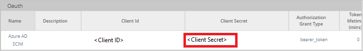
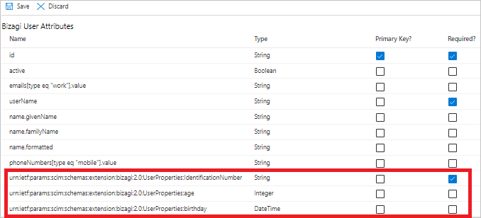

# Tutorial: Configure Bizagi Studio for Digital Process Automation for automatic user provisioning

This tutorial describes the steps you need to perform in both Bizagi Studio for Digital Process Automation and Microsoft Entra ID to configure automatic user provisioning. When configured to do so, Microsoft Entra ID automatically provisions and deprovisions users and groups to [Bizagi Studio for Digital Process Automation](https://www.bizagi.com/) by using the Microsoft Entra provisioning service. For important details on what this service does, how it works, and frequently asked questions, see [Automate user provisioning and deprovisioning to SaaS applications with Microsoft Entra ID](~/identity/app-provisioning/user-provisioning.md). 

## Capabilities supported
> [!div class="checklist"]
> * Create users in Bizagi Studio for Digital Process Automation
> * Remove users in Bizagi Studio for Digital Process Automation when they don't require access anymore
> * Keep user attributes synchronized between Microsoft Entra ID and Bizagi Studio for Digital Process Automation
> * [Single sign-on](./bizagi-studio-for-digital-process-automation-tutorial.md) to Bizagi Studio for Digital Process Automation (recommended)

## Prerequisites

The scenario outlined in this tutorial assumes that you already have the following:

* [A Microsoft Entra tenant](~/identity-platform/quickstart-create-new-tenant.md). 
* One of the following roles: [Application Administrator](/entra/identity/role-based-access-control/permissions-reference#application-administrator), [Cloud Application Administrator](/entra/identity/role-based-access-control/permissions-reference#cloud-application-administrator), or [Application Owner](/entra/fundamentals/users-default-permissions#owned-enterprise-applications).
* Bizagi Studio for Digital Process Automation version 11.2.4.2X or later.

## Plan your provisioning deployment
Follow these steps for planning:

1. Learn about [how the provisioning service works](~/identity/app-provisioning/user-provisioning.md).
2. Determine who will be [in scope for provisioning](~/identity/app-provisioning/define-conditional-rules-for-provisioning-user-accounts.md).
3. Determine what data to [map between Microsoft Entra ID and Bizagi Studio for Digital Process Automation](~/identity/app-provisioning/customize-application-attributes.md). 

## Configure to support provisioning with Microsoft Entra ID
To configure Bizagi Studio for Digital Process Automation to support provisioning with Microsoft Entra ID, follow these steps:

1. Sign in to your work portal as a user with **Admin permissions**.

2. Go to **Admin** > **Security** > **OAuth 2 Applications**.

   

3. Select **Add**.
4. For **Grant Type**, select **Bearer token**. For **Allowed Scope**, select **API** and **USER SYNC**. Then select **Save**.

   

5. Copy and save the **Client Secret**. In the Azure portal, for your Bizagi Studio for Digital Process Automation application, on the **Provisioning** tab, the client secret value is entered in the **Secret Token** field.

   

## Add the application from the Microsoft Entra gallery

To start managing provisioning to Bizagi Studio for Digital Process Automation, add the app from the Microsoft Entra application gallery. If you have previously set up Bizagi Studio for Digital Process Automation for single sign-on, you can use the same application. When you're initially testing the integration, however, you should create a separate app. For more information, see [Quickstart: Add an application to your Microsoft Entra tenant](~/identity/enterprise-apps/add-application-portal.md). 

## Define who is in scope for provisioning 

With the Microsoft Entra provisioning service, you can scope who is provisioned based on assignment to the application, based on attributes of the user and group, or both. If you scope based on assignment, see the steps in [Assign or unassign users, and groups, for an app using the Graph API](~/identity/enterprise-apps/assign-user-or-group-access-portal.md) to assign users and groups to the application. If you scope based solely on attributes of the user or group, you can use a scoping filter. For more information, see [Attribute-based application provisioning with scoping filters](~/identity/app-provisioning/define-conditional-rules-for-provisioning-user-accounts.md). 

Note the following points about scoping:

* Start small. Test with a small set of users and groups before rolling out to everyone. When scope for provisioning is set to assigned users and groups, you can control this by assigning one or two users or groups to the app. When scope is set to all users and groups, you can specify an [attribute based scoping filter](~/identity/app-provisioning/define-conditional-rules-for-provisioning-user-accounts.md).
* If you need additional roles, you can [update the application manifest](~/identity-platform/howto-add-app-roles-in-apps.md) to add new roles.

## Configure automatic user provisioning 

This section guides you through the steps to configure the Microsoft Entra provisioning service to create, update, and disable users and groups. You're doing this in your test app, based on user and group assignments in Microsoft Entra ID.

### Configure automatic user provisioning for Bizagi Studio for Digital Process Automation in Microsoft Entra ID

1. Sign in to the [Microsoft Entra admin center](https://entra.microsoft.com) as at least a [Cloud Application Administrator](~/identity/role-based-access-control/permissions-reference.md#cloud-application-administrator).
1. Browse to **Identity** > **Applications** > **Enterprise applications**.

	

1. In the applications list, select **Bizagi Studio for Digital Process Automation**.

3. Select the **Provisioning** tab.

	

4. Set **Provisioning Mode** to **Automatic**.

	

5. In the **Admin Credentials** section, enter your tenant URL and secret token for Bizagi Studio for Digital Process Automation. 

      * **Tenant URL:** Enter the Bizagi SCIM endpoint, with the following structure:  `<Your_Bizagi_Project>/scim/v2/`.
         For example: `https://my-company.bizagi.com/scim/v2/`.

      * **Secret token:** This value is retrieved from the step discussed earlier in this article.

      To ensure that Microsoft Entra ID can connect to Bizagi Studio for Digital Process Automation, select **Test Connection**. If the connection fails, ensure that your Bizagi Studio for Digital Process Automation account has administrator permissions, and try again.

   

6. For **Notification Email**, enter the email address of a person or group who should receive the provisioning error notifications. Select the option to **Send an email notification when a failure occurs**.

	

7. Select **Save**.

8. In the **Mappings** section, select **Synchronize Microsoft Entra users to Bizagi Studio for Digital Process Automation**.

9. In the **Attribute-Mapping** section, review the user attributes that are synchronized from Microsoft Entra ID to Bizagi Studio for Digital Process Automation. The attributes selected as **Matching** properties are used to match the user accounts in Bizagi Studio for Digital Process Automation for update operations. If you change the [matching target attribute](~/identity/app-provisioning/customize-application-attributes.md), you must ensure that the Bizagi Studio for Digital Process Automation API supports filtering users based on that attribute. Select **Save** to commit any changes.

   |Attribute|Type|Supported for filtering|
   |---|---|---|
   |userName|String|&check;|
   |active|Boolean|
   |emails[type eq "work"].value|String|
   |name.givenName|String|
   |name.familyName|String|
   |name.formatted|String|
   |phoneNumbers[type eq "mobile"].value|String|

   Custom extension attributes can be added by navigating to **Show advanced options > Edit attribute list for Bizagi**. The custom extension attributes must be prefixed with **urn:ietf:params:scim:schemas:extension:bizagi:2.0:UserProperties:**. For example, if custom extension attribute is **IdentificationNumber**, the attribute must be added as **urn:ietf:params:scim:schemas:extension:bizagi:2.0:UserProperties:IdentificationNumber**. Select **Save** to commit any changes.
   
	  

   More information on how to add custom attributes can be found in [Customize Application Attributes](~/identity/app-provisioning/customize-application-attributes.md).

> [!NOTE]
> Only basic type properties are supported (for example, String, Integer, Boolean, DateTime, and so on). The properties linked to parametric tables or multiple types are not supported yet.

10. To configure scoping filters, see the [Scoping filter tutorial](~/identity/app-provisioning/define-conditional-rules-for-provisioning-user-accounts.md).

11. To enable the Microsoft Entra provisioning service for Bizagi Studio for Digital Process Automation, in the **Settings** section, change the **Provisioning Status** to **On**.

	

12. Define the users and groups that you want to provision to Bizagi Studio for Digital Process Automation. In the **Settings** section, choose the desired values in **Scope**.

	

13. When you're ready to provision, select **Save**.

	

This operation starts the initial synchronization cycle of all users and groups defined in **Scope** in the **Settings** section. The initial cycle takes longer to perform than subsequent cycles, which occur approximately every 40 minutes as long as the Microsoft Entra provisioning service is running. 

## Monitor your deployment
After you've configured provisioning, use the following resources to monitor your deployment:

- Use the [provisioning logs](~/identity/monitoring-health/concept-provisioning-logs.md) to determine which users have been provisioned successfully or unsuccessfully.
- Check the [progress bar](~/identity/app-provisioning/application-provisioning-when-will-provisioning-finish-specific-user.md) to see the status of the provisioning cycle, and how close it is to completion.
- If the provisioning configuration is in an unhealthy state, the application will go into quarantine. For more information, see [Application provisioning in quarantine status](~/identity/app-provisioning/application-provisioning-quarantine-status.md).  

## Additional resources

* [Managing user account provisioning for Enterprise Apps](~/identity/app-provisioning/configure-automatic-user-provisioning-portal.md)
* [What is application access and single sign-on with Microsoft Entra ID?](~/identity/enterprise-apps/what-is-single-sign-on.md)

## Next steps

* [Learn how to review logs and get reports on provisioning activity](~/identity/app-provisioning/check-status-user-account-provisioning.md)
