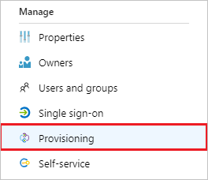

# Configure Blinq for automatic user provisioning with Microsoft Entra ID

This article describes the steps you need to do in both Blinq and Microsoft Entra ID to configure automatic user provisioning. When configured, Microsoft Entra ID automatically provisions and de-provisions users and groups to [Blinq](https://blinq.me/) using the Microsoft Entra provisioning service. For important details on what this service does, how it works, and frequently asked questions, see [Automate user provisioning and deprovisioning to SaaS applications with Microsoft Entra ID](~/identity/app-provisioning/user-provisioning.md). 

## Capabilities supported
> [!div class="checklist"]
> * Create users in Blinq.
> * Remove users in Blinq when they don't require access anymore.
> * Keep user attributes synchronized between Microsoft Entra ID and Blinq.

## Prerequisites

The scenario outlined in this article assumes that you already have the following prerequisites:

* [A Microsoft Entra tenant](~/identity-platform/quickstart-create-new-tenant.md) 
* One of the following roles: [Application Administrator](/entra/identity/role-based-access-control/permissions-reference#application-administrator), [Cloud Application Administrator](/entra/identity/role-based-access-control/permissions-reference#cloud-application-administrator), or [Application Owner](/entra/fundamentals/users-default-permissions#owned-enterprise-applications).
* A user account in Blinq with Admin permission

## Step 1: Plan your provisioning deployment
1. Learn about [how the provisioning service works](~/identity/app-provisioning/user-provisioning.md).
1. Determine who's in [scope for provisioning](~/identity/app-provisioning/define-conditional-rules-for-provisioning-user-accounts.md).
1. Determine what data to [map between Microsoft Entra ID and Blinq](~/identity/app-provisioning/customize-application-attributes.md). 

## Step 2: Configure Blinq to support provisioning with Microsoft Entra ID

1. Navigate to [Blinq Admin Console](https://dash.blinq.me) in a separate browser tab.
1. If you aren't logged in to Blinq you need to do so.
1. Select your workspace in the top left hand corner of the screen and select **Settings** in the dropdown menu.

   	

1. Under the **Integrations** page you should see **Team Card Provisioning** which contains a URL and Token. You need to generate the token by selecting **Generate**.
Copy the **URL** and **Token**. The URL and the Token are to be inserted into the **Tenant URL** and **Secret Token** field in the Azure portal respectively.

   	

## Step 3: Add Blinq from the Microsoft Entra application gallery

Add Blinq from the Microsoft Entra application gallery to start managing provisioning to Blinq. If you have previously setup Blinq for SSO, you can use the same application. However it's recommended you create a separate app when testing out the integration initially. Learn more about adding an application from the gallery [here](~/identity/enterprise-apps/add-application-portal.md). 

## Step 4: Define who is in scope for provisioning 

[!INCLUDE [create-assign-users-provisioning.md](~/identity/saas-apps/includes/create-assign-users-provisioning.md)]

## Step 5: Configure automatic user provisioning to Blinq 

This section guides you through the steps to configure the Microsoft Entra provisioning service to create, update, and disable users and groups in Blinq based on user and group assignments in Microsoft Entra ID.

### To configure automatic user provisioning for Blinq in Microsoft Entra ID:

1. Sign in to the [Microsoft Entra admin center](https://entra.microsoft.com) as at least a [Cloud Application Administrator](~/identity/role-based-access-control/permissions-reference.md#cloud-application-administrator).
1. Browse to **Entra ID** > **Enterprise apps**

	

1. In the applications list, select **Blinq**.

	

1. Select the **Provisioning** tab.

	

1. Set the **Provisioning Mode** to **Automatic**.

	

1. In the **Admin Credentials** section, input your Blinq Tenant URL and Secret Token. Select **Test Connection** to ensure Microsoft Entra ID can connect to Blinq. If the connection fails, ensure your Blinq account has Admin permissions and try again.

	

1. In the **Notification Email** field, enter the email address of a person or group who should receive the provisioning error notifications and select the **Send an email notification when a failure occurs** check box.

	

1. Select **Save**.

1. In the **Mappings** section, select **Synchronize Microsoft Entra users to Blinq**.

1. Review the user attributes that are synchronized from Microsoft Entra ID to Blinq in the **Attribute-Mapping** section. The attributes selected as **Matching** properties are used to match the user accounts in Blinq for update operations. If you choose to change the [matching target attribute](~/identity/app-provisioning/customize-application-attributes.md), you need to ensure that the Blinq API supports filtering users based on that attribute. Select the **Save** button to commit any changes.

   |Attribute|Type|Supported for filtering|Required by Blinq|
   |---|---|---|---|
   |userName|String|&check;|&check;|
   |active|Boolean|||
   |displayName|String|||
   |nickName|String|||
   |title|String|||
   |preferredLanguage|String|||
   |locale|String|||
   |timezone|String|||
   |name.givenName|String|||
   |name.familyName|String|||
   |name.formatted|String|||
   |name.middleName|String|||
   |name.honorificPrefix|String|||
   |name.honorificSuffix|String|||
   |externalId|String|||
   |emails[type eq "work"].value|String|||
   |emails[type eq "home"].value|String|||
   |emails[type eq "other"].value|String|||
   |phoneNumbers[type eq "work"].value|String|||
   |phoneNumbers[type eq "mobile"].value|String|||
   |phoneNumbers[type eq "fax"].value|String|||
   |phoneNumbers[type eq "home"].value|String|||
   |phoneNumbers[type eq "other"].value|String|||
   |phoneNumbers[type eq "pager"].value|String|||
   |addresses[type eq "work"].formatted|String|||
   |addresses[type eq "work"].streetAddress|String|||
   |addresses[type eq "work"].locality|String|||
   |addresses[type eq "work"].region|String|||
   |addresses[type eq "work"].postalCode|String|||
   |addresses[type eq "work"].country|String|||
   |addresses[type eq "home"].formatted|String|||
   |addresses[type eq "home"].streetAddress|String|||
   |addresses[type eq "home"].locality|String|||
   |addresses[type eq "home"].region|String|||
   |addresses[type eq "home"].postalCode|String|||
   |addresses[type eq "home"].country|String|||
   |addresses[type eq "other"].formatted|String|||
   |addresses[type eq "other"].streetAddress|String|||
   |addresses[type eq "other"].locality|String|||
   |addresses[type eq "other"].region|String|||
   |addresses[type eq "other"].postalCode|String|||
   |addresses[type eq "other"].country|String|||
   |urn:ietf:params:scim:schemas:extension:enterprise:2.0:User:employeeNumber|String|||
   |urn:ietf:params:scim:schemas:extension:enterprise:2.0:User:organization|String|||
   |urn:ietf:params:scim:schemas:extension:enterprise:2.0:User:division|String|||
   |urn:ietf:params:scim:schemas:extension:enterprise:2.0:User:department|String|||

1. To configure scoping filters, refer to the following instructions provided in the [Scoping filter article](~/identity/app-provisioning/define-conditional-rules-for-provisioning-user-accounts.md).

1. To enable the Microsoft Entra provisioning service for Blinq, change the **Provisioning Status** to **On** in the **Settings** section.

	

1. Define the users and groups that you would like to provision to Blinq by choosing the desired values in **Scope** in the **Settings** section.

	

1. When you're ready to provision, select **Save**.

	

This operation starts the initial synchronization cycle of all users and groups defined in **Scope** in the **Settings** section. The initial cycle takes longer to complete than next cycles, which occur approximately every 40 minutes as long as the Microsoft Entra provisioning service is running. 

## Step 6: Monitor your deployment

[!INCLUDE [monitor-deployment.md](~/identity/saas-apps/includes/monitor-deployment.md)]

## Change Logs
* 05/25/2022 - **Schema Discovery** feature enabled on this app.
* 12/22/2022 - The source attribute of **addresses[type eq "work"].formatted** ha been changed to **Join("", [streetAddress], IIF(IsPresent([city]),", ",""), [city], IIF(IsPresent([state]),", ",""), [state], IIF(IsPresent([postalCode])," ",""), [postalCode]) --> addresses[type eq "work"].formatted**.

## More resources

* [Managing user account provisioning for Enterprise Apps](~/identity/app-provisioning/configure-automatic-user-provisioning-portal.md)
* [What is application access and single sign-on with Microsoft Entra ID?](~/identity/enterprise-apps/what-is-single-sign-on.md)

## Related content

* [Learn how to review logs and get reports on provisioning activity](~/identity/app-provisioning/check-status-user-account-provisioning.md)
