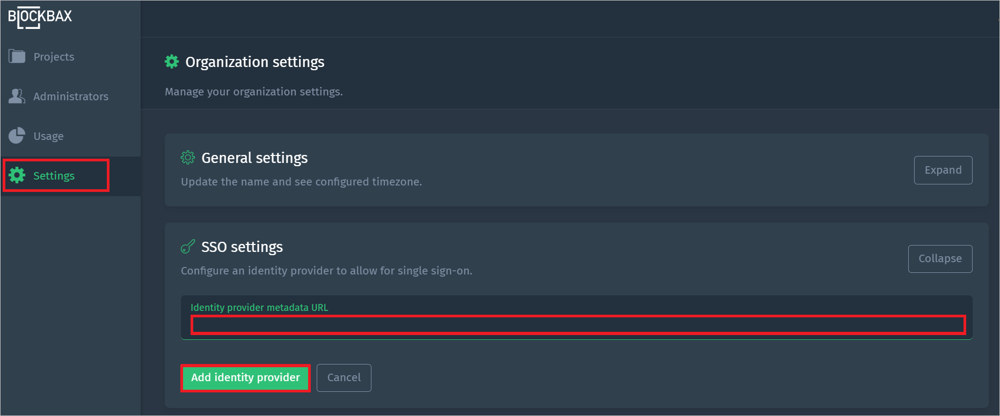

# Configure Blockbax for Single sign-on with Microsoft Entra ID

In this article,  you learn how to integrate Blockbax with Microsoft Entra ID. When you integrate Blockbax with Microsoft Entra ID, you can:

* Control in Microsoft Entra ID who has access to Blockbax.
* Enable your users to be automatically signed-in to Blockbax with their Microsoft Entra accounts.
* Manage your accounts in one central location.

## Prerequisites

The scenario outlined in this article assumes that you already have the following prerequisites:

[!INCLUDE [common-prerequisites.md](~/identity/saas-apps/includes/common-prerequisites.md)]
* Blockbax single sign-on (SSO) enabled subscription.

## Scenario description

In this article,  you configure and test Microsoft Entra SSO in a test environment.

* Blockbax supports **SP** and **IDP** initiated SSO.

* Blockbax supports **Just In Time** user provisioning.

## Add Blockbax from the gallery

To configure the integration of Blockbax into Microsoft Entra ID, you need to add Blockbax from the gallery to your list of managed SaaS apps.

1. Sign in to the [Microsoft Entra admin center](https://entra.microsoft.com) as at least a [Cloud Application Administrator](~/identity/role-based-access-control/permissions-reference.md#cloud-application-administrator).
1. Browse to **Entra ID** > **Enterprise apps** > **New application**.
1. In the **Add from the gallery** section, type **Blockbax** in the search box.
1. Select **Blockbax** from results panel and then add the app. Wait a few seconds while the app is added to your tenant.

 [!INCLUDE [sso-wizard.md](~/identity/saas-apps/includes/sso-wizard.md)]

## Configure and test Microsoft Entra SSO for Blockbax

Configure and test Microsoft Entra SSO with Blockbax using a test user called **B.Simon**. For SSO to work, you need to establish a link relationship between a Microsoft Entra user and the related user in Blockbax.

To configure and test Microsoft Entra SSO with Blockbax, perform the following steps:

1. **[Configure Microsoft Entra SSO](#configure-azure-ad-sso)** - to enable your users to use this feature.
    1. **Create a Microsoft Entra test user** - to test Microsoft Entra single sign-on with B.Simon.
    1. **Assign the Microsoft Entra test user** - to enable B.Simon to use Microsoft Entra single sign-on.
1. **[Configure Blockbax SSO](#configure-blockbax-sso)** - to configure the single sign-on settings on application side.
    1. **[Create Blockbax test user](#create-blockbax-test-user)** - to have a counterpart of B.Simon in Blockbax that's linked to the Microsoft Entra representation of user.
1. **[Test SSO](#test-sso)** - to verify whether the configuration works.

## Configure Microsoft Entra SSO

Follow these steps to enable Microsoft Entra SSO.

1. Sign in to the [Microsoft Entra admin center](https://entra.microsoft.com) as at least a [Cloud Application Administrator](~/identity/role-based-access-control/permissions-reference.md#cloud-application-administrator).
1. Browse to **Entra ID** > **Enterprise apps** > **Blockbax** > **Single sign-on**.
1. On the **Select a single sign-on method** page, select **SAML**.
1. On the **Set up single sign-on with SAML** page, select the pencil icon for **Basic SAML Configuration** to edit the settings.

   

1. On the **Basic SAML Configuration** section, perform the following steps:

    a. In the **Identifier (Entity ID)** text box, type a URL using the following pattern:
    `https://login.blockbax.com/saml2/service-provider-metadata/<CustomerName>`

	b. In the **Reply URL** text box, type a URL using the following pattern:
    `https://login.blockbax.com/login/saml2/sso/<CustomerName>`
    
    c. In the **Sign on URL** text box, type the URL:
    `https://login.blockbax.com/sso`

    > [!NOTE]
	> These values aren't real. Update these values with the actual Identifier and Reply URL. Contact [Blockbax support team](mailto:support@blockbax.com) to get these values. You can also refer to the patterns shown in the **Basic SAML Configuration** section.    

1. On the **Set up single sign-on with SAML** page, In the **SAML Signing Certificate** section, select copy button to copy **App Federation Metadata Url** and save it on your computer.

	

[!INCLUDE [create-assign-users-sso.md](~/identity/saas-apps/includes/create-assign-users-sso.md)]

## Configure Blockbax SSO

1. Log in to your Blockbax company site as an administrator.

1. Go to **Settings** and expand **SSO Settings**.

    

1. In the **Identity provider metadata URL** textbox, paste the **App Federation Metadata Url** value which you copied previously.

1. Select **Add identity provider**.

### Create Blockbax test user

In this section, a user called Britta Simon is created in Blockbax. Blockbax supports just-in-time user provisioning, which is enabled by default. There's no action item for you in this section. If a user doesn't already exist in Blockbax, a new one is created after authentication.

## Test SSO 

In this section, you test your Microsoft Entra single sign-on configuration with following options. 

#### SP initiated:

* Select **Test this application**, this option redirects to Blockbax Sign on URL where you can initiate the login flow.  

* Go to Blockbax Sign-on URL directly and initiate the login flow from there.

#### IDP initiated:

* Select **Test this application**, and you should be automatically signed in to the Blockbax for which you set up the SSO. 

You can also use Microsoft My Apps to test the application in any mode. When you select the Blockbax tile in the My Apps, if configured in SP mode you would be redirected to the application sign on page for initiating the login flow and if configured in IDP mode, you should be automatically signed in to the Blockbax for which you set up the SSO. For more information, see [Microsoft Entra My Apps](/azure/active-directory/manage-apps/end-user-experiences#azure-ad-my-apps).

## Related content

Once you configure Blockbax you can enforce session control, which protects exfiltration and infiltration of your organization’s sensitive data in real time. Session control extends from Conditional Access. [Learn how to enforce session control with Microsoft Cloud App Security](/cloud-app-security/proxy-deployment-aad).
