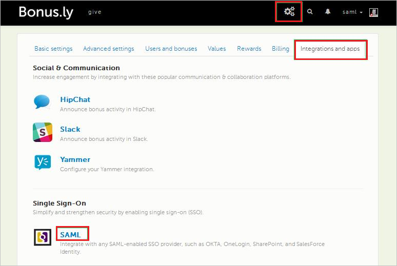

# Configure Bonusly for Single sign-on with Microsoft Entra ID

In this article,  you learn how to integrate Bonusly with Microsoft Entra ID. When you integrate Bonusly with Microsoft Entra ID, you can:

* Control in Microsoft Entra ID who has access to Bonusly.
* Enable your users to be automatically signed-in to Bonusly with their Microsoft Entra accounts.
* Manage your accounts in one central location.

## Prerequisites

The scenario outlined in this article assumes that you already have the following prerequisites:

[!INCLUDE [common-prerequisites.md](~/identity/saas-apps/includes/common-prerequisites.md)]
* Bonusly single sign-on enabled subscription.

## Scenario description

In this article,  you configure and test Microsoft Entra single sign-on in a test environment.

* Bonusly supports **IDP** initiated SSO.
* Bonusly supports [Automated user provisioning](bonusly-provisioning-tutorial.md).

> [!NOTE]
> Identifier of this application is a fixed string value so only one instance can be configured in one tenant.

## Add Bonusly from the gallery

To configure the integration of Bonusly into Microsoft Entra ID, you need to add Bonusly from the gallery to your list of managed SaaS apps.

1. Sign in to the [Microsoft Entra admin center](https://entra.microsoft.com) as at least a [Cloud Application Administrator](~/identity/role-based-access-control/permissions-reference.md#cloud-application-administrator).
1. Browse to **Entra ID** > **Enterprise apps** > **New application**.
1. In the **Add from the gallery** section, type **Bonusly** in the search box.
1. Select **Bonusly** from results panel and then add the app. Wait a few seconds while the app is added to your tenant.

 [!INCLUDE [sso-wizard.md](~/identity/saas-apps/includes/sso-wizard.md)]

## Configure and test Microsoft Entra SSO for Bonusly

Configure and test Microsoft Entra SSO with Bonusly using a test user called **B.Simon**. For SSO to work, you need to establish a link relationship between a Microsoft Entra user and the related user in Bonusly.

To configure and test Microsoft Entra SSO with Bonusly, perform the following steps:

1. **[Configure Microsoft Entra SSO](#configure-azure-ad-sso)** - to enable your users to use this feature.
    1. **Create a Microsoft Entra test user** - to test Microsoft Entra single sign-on with B.Simon.
    1. **Assign the Microsoft Entra test user** - to enable B.Simon to use Microsoft Entra single sign-on.
1. **[Configure Bonusly SSO](#configure-bonusly-sso)** - to configure the single sign-on settings on application side.
    1. **[Create Bonusly test user](#create-bonusly-test-user)** - to have a counterpart of B.Simon in Bonusly that's linked to the Microsoft Entra representation of user.
1. **[Test SSO](#test-sso)** - to verify whether the configuration works.

## Configure Microsoft Entra SSO

Follow these steps to enable Microsoft Entra SSO.

1. Sign in to the [Microsoft Entra admin center](https://entra.microsoft.com) as at least a [Cloud Application Administrator](~/identity/role-based-access-control/permissions-reference.md#cloud-application-administrator).
1. Browse to **Entra ID** > **Enterprise apps** > **Bonusly** > **Single sign-on**.
1. On the **Select a single sign-on method** page, select **SAML**.
1. On the **Set up single sign-on with SAML** page, select the pencil icon for **Basic SAML Configuration** to edit the settings.

   

1. On the **Basic SAML Configuration** section, perform the following step:

    In the **Reply URL** text box, type a URL using the following pattern:
    `https://Bonus.ly/saml/<TENANT_NAME>`

	> [!NOTE]
	> The value isn't real. Update the value with the actual Reply URL. Contact [Bonusly Client support team](https://bonus.ly/contact) to get the value. You can also refer to the patterns shown in the **Basic SAML Configuration** section.

5. In the **SAML Signing Certificate** section, select **Edit** button to open **SAML Signing Certificate** dialog.

	

6. In the **SAML Signing Certificate** section, copy the **THUMBPRINT** and save it on your computer.

    

7. On the **Set up Bonusly** section, copy the appropriate URL(s) as per your requirement.

	

[!INCLUDE [create-assign-users-sso.md](~/identity/saas-apps/includes/create-assign-users-sso.md)]

## Configure Bonusly SSO

1. In a different browser window, sign in to your **Bonusly** tenant.

1. In the toolbar on the top, select **Settings** and then select **Integrations and apps**.

    
1. Under **Single Sign-On**, select **SAML**.

1. On the **SAML** dialog page, perform the following steps:

    

    a. In the **IdP SSO target URL** textbox, paste the value of **Login URL**.

    b. In the **IdP Login URL** textbox, paste the value of **Login URL**.

    c. In the **IdP Issuer** textbox, paste the value of **Microsoft Entra Identifier**.
    
    d. Paste the **Thumbprint** value into the **Cert Fingerprint** textbox.
    
    e. Select **Save**.

### Create Bonusly test user

In order to enable Microsoft Entra users to sign in to Bonusly, they must be provisioned into Bonusly. In the case of Bonusly, provisioning is a manual task.

> [!NOTE]
> You can use any other Bonusly user account creation tools or APIs provided by Bonusly to provision Microsoft Entra user accounts. 

**To configure user provisioning, perform the following steps:**

1. In a web browser window, sign in to your Bonusly tenant.

1. Select **Settings**.

    

1. Select the **Users and bonuses** tab.

    

1. Select **Manage Users**.

    

1. Select **Add User**.

    

1. On the **Add User** dialog, perform the following steps:

      

    a. In the **First name** textbox, enter the first name of user like **Britta**.

    b. In the **Last name** textbox, enter the last name of user like **Simon**.

    c. In the **Email** textbox, enter the email of user like `brittasimon@contoso.com`.

    d. Select **Save**.

    > [!NOTE]
    > The Microsoft Entra account holder receives an email that includes a link to confirm the account before it becomes active.

> [!NOTE]
>Bonusly also supports automatic user provisioning, you can find more details [here](./bonusly-provisioning-tutorial.md) on how to configure automatic user provisioning.

## Test SSO

In this section, you test your Microsoft Entra single sign-on configuration with following options.

* Select **Test this application**, and you should be automatically signed in to the Bonusly for which you set up the SSO.

* You can use Microsoft My Apps. When you select the Bonusly tile in the My Apps, you should be automatically signed in to the Bonusly for which you set up the SSO. For more information about the My Apps, see [Introduction to the My Apps](https://support.microsoft.com/account-billing/sign-in-and-start-apps-from-the-my-apps-portal-2f3b1bae-0e5a-4a86-a33e-876fbd2a4510).

## Related content

Once you configure Bonusly you can enforce session control, which protects exfiltration and infiltration of your organization’s sensitive data in real time. Session control extends from Conditional Access. [Learn how to enforce session control with Microsoft Defender for Cloud Apps](/cloud-app-security/proxy-deployment-aad).
