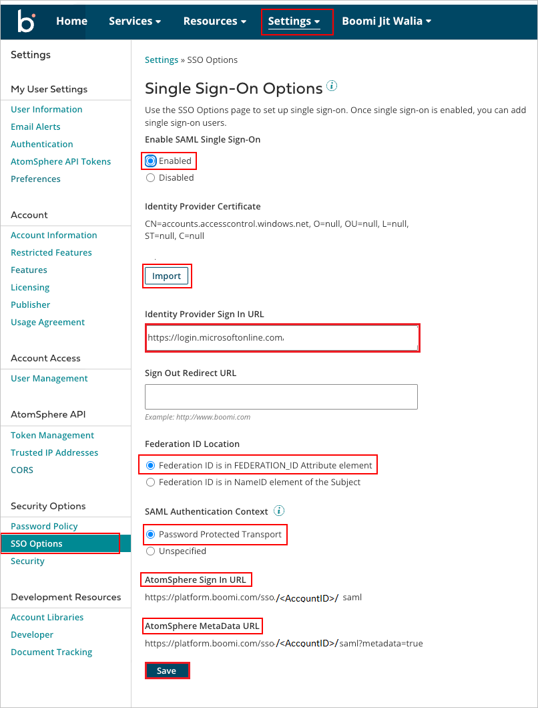

# Configure Boomi for Single sign-on with Microsoft Entra ID

In this article,  you learn how to integrate Boomi with Microsoft Entra ID. When you integrate Boomi with Microsoft Entra ID, you can:

* Control in Microsoft Entra ID who has access to Boomi.
* Enable your users to be automatically signed-in to Boomi with their Microsoft Entra accounts.
* Manage your accounts in one central location.

## Prerequisites

The scenario outlined in this article assumes that you already have the following prerequisites:

[!INCLUDE [common-prerequisites.md](~/identity/saas-apps/includes/common-prerequisites.md)]
* Boomi single sign-on (SSO) enabled subscription.

## Scenario description

In this article,  you configure and test Microsoft Entra SSO in a test environment.

* Boomi supports **IDP** initiated SSO.

## Add Boomi from the gallery

To configure the integration of Boomi into Microsoft Entra ID, you need to add Boomi from the gallery to your list of managed SaaS apps.

1. Sign in to the [Microsoft Entra admin center](https://entra.microsoft.com) as at least a [Cloud Application Administrator](~/identity/role-based-access-control/permissions-reference.md#cloud-application-administrator).
1. Browse to **Entra ID** > **Enterprise apps** > **New application**.
1. In the **Add from the gallery** section, type **Boomi** in the search box.
1. Select **Boomi** from results panel and then add the app. Wait a few seconds while the app is added to your tenant.

 [!INCLUDE [sso-wizard.md](~/identity/saas-apps/includes/sso-wizard.md)]

## Configure and test Microsoft Entra SSO for Boomi

Configure and test Microsoft Entra SSO with Boomi using a test user called **B.Simon**. For SSO to work, you need to establish a link relationship between a Microsoft Entra user and the related user in Boomi.

To configure and test Microsoft Entra SSO with Boomi, perform the following steps:

1. **[Configure Microsoft Entra SSO](#configure-azure-ad-sso)** - to enable your users to use this feature.
    * **Create a Microsoft Entra test user** - to test Microsoft Entra single sign-on with B.Simon.
    * **Assign the Microsoft Entra test user** - to enable B.Simon to use Microsoft Entra single sign-on.
1. **[Configure Boomi SSO](#configure-boomi-sso)** - to configure the single sign-on settings on application side.
    * **[Create Boomi test user](#create-boomi-test-user)** - to have a counterpart of B.Simon in Boomi that's linked to the Microsoft Entra representation of user.
1. **[Test SSO](#test-sso)** - to verify whether the configuration works.

## Configure Microsoft Entra SSO

Follow these steps to enable Microsoft Entra SSO.

1. Sign in to the [Microsoft Entra admin center](https://entra.microsoft.com) as at least a [Cloud Application Administrator](~/identity/role-based-access-control/permissions-reference.md#cloud-application-administrator).
1. Browse to **Entra ID** > **Enterprise apps** > **Boomi** > **Single sign-on**.
1. On the **Select a single sign-on method** page, select **SAML**.
1. On the **Set up single sign-on with SAML** page, select the pencil icon for **Basic SAML Configuration** to edit the settings.

   

1. On the **Basic SAML Configuration** section, if you have **Service Provider metadata file** and wish to configure in **IDP** initiated mode, perform the following steps:

	a. Select **Upload metadata file**.

    

	b. Select **folder logo** to select the metadata file and select **Upload**.

	

	c. After the metadata file is successfully uploaded, the **Identifier** and **Reply URL** values get auto populated in Basic SAML Configuration section.

	d. Enter the **Sign-on URL**, such as `https://platform.boomi.com/AtomSphere.html#build;accountId={your-accountId}`.

	> [!Note]
	> You get the **Service Provider metadata file** from the **Configure Boomi SSO** section, which is explained later in the article. If the **Identifier** and **Reply URL** values don't get auto populated, then fill in the values manually according to your requirement.

1. Boomi application expects the SAML assertions in a specific format, which requires you to add custom attribute mappings to your SAML token attributes configuration. The following screenshot shows the list of default attributes.

	

1. In addition to above, Boomi application expects few more attributes to be passed back in SAML response which are shown below. These attributes are also pre populated but you can review them as per your requirements.

	| Name |  Source Attribute|
	| ---------------|  --------- |
	| FEDERATION_ID | user.mail |

1. On the **Set up single sign-on with SAML** page, in the **SAML Signing Certificate** section,  find **Certificate (Base64)** and select **Download** to download the certificate and save it on your computer.

	

1. On the **Set up Boomi** section, copy the appropriate URL(s) based on your requirement.

	

[!INCLUDE [create-assign-users-sso.md](~/identity/saas-apps/includes/create-assign-users-sso.md)]

## Configure Boomi SSO

1. In a different web browser window, sign in to your Boomi company site as an administrator.

1. Go to the **Settings**, select the **SSO Options** in the security options and perform the below steps.

	

	a. Select **Enabled** in **Enable SAML Single Sign-On**.

	b. Select **Import** to upload the downloaded certificate from Microsoft Entra ID to **Identity Provider Certificate**.

	c. In the **Identity Provider Sign In URL** textbox, paste the value of **Login URL** from Microsoft Entra application configuration window.

	d. For **Federation Id Location**, select the **Federation Id is in FEDERATION_ID Attribute element** radio button.

	e. For **SAML Authentication Context**, select the **Password Protected Transport** radio button.

	f. Copy the **AtomSphere Sign In URL**, paste this value into the **Sign on URL** text box in the **Basic SAML Configuration** section.

	g. Copy the **AtomSphere MetaData URL**, go to the **MetaData URL** via the browser of your choice, and save the output to a file. Upload the **MetaData URL** in the **Basic SAML Configuration** section.

	h. Select **Save** button.

### Create Boomi test user

In order to enable Microsoft Entra users to sign in to Boomi, they must be provisioned into Boomi. In the case of Boomi, provisioning is a manual task.

### To provision a user account, perform the following steps:

1. Sign in to your Boomi company site as an administrator.

1. After logging in, navigate to **User Management** ->**Users**.

1. Select **+**  icon and the **Add/Maintain User Roles** dialog opens.

	

	a. In the **User e-mail address** textbox, type the email of user like B.Simon@contoso.com.

	b. In the **First name** textbox, type the First name of user like B.

	c. In the **Last name** textbox, type the Last name of user like Simon.

	d. Enter the user's **Federation ID**. Each user must have a Federation ID that uniquely identifies the user within the account.

	e. Assign the **Standard User** role to the user. don't assign the Administrator role because that would give them normal Atmosphere access and single sign-on access.

	f. Select **OK**.

	> [!NOTE]
	> The user doesn't receive a welcome notification email containing a password that can be used to log in to the AtomSphere account because their password is managed through the identity provider. You may use any other Boomi user account creation tools or APIs provided by Boomi to provision Microsoft Entra user accounts.

## Test SSO

In this section, you test your Microsoft Entra single sign-on configuration with following options.

* Select **Test this application**, and you should be automatically signed in to the Boomi for which you set up the SSO.

* You can use Microsoft My Apps. When you select the Boomi tile in the My Apps, you should be automatically signed in to the Boomi for which you set up the SSO. For more information about the My Apps, see [Introduction to the My Apps](https://support.microsoft.com/account-billing/sign-in-and-start-apps-from-the-my-apps-portal-2f3b1bae-0e5a-4a86-a33e-876fbd2a4510).

## Related content

Once you configure Boomi you can enforce session control, which protects exfiltration and infiltration of your organization’s sensitive data in real time. Session control extends from Conditional Access. [Learn how to enforce session control with Microsoft Defender for Cloud Apps](/cloud-app-security/proxy-deployment-any-app).
