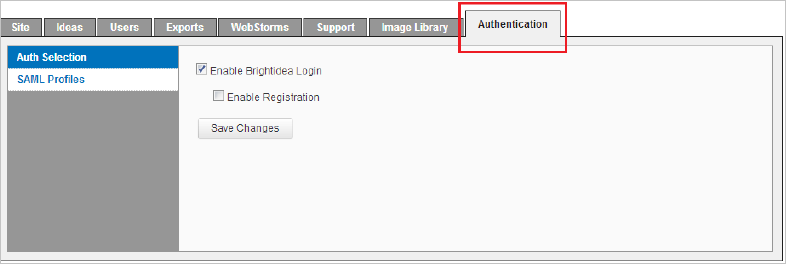

# Configure Brightidea for Single sign-on with Microsoft Entra ID

In this article,  you learn how to integrate Brightidea with Microsoft Entra ID. When you integrate Brightidea with Microsoft Entra ID, you can:

* Control in Microsoft Entra ID who has access to Brightidea.
* Enable your users to be automatically signed-in to Brightidea with their Microsoft Entra accounts.
* Manage your accounts in one central location.

## Prerequisites

The scenario outlined in this article assumes that you already have the following prerequisites:

[!INCLUDE [common-prerequisites.md](~/identity/saas-apps/includes/common-prerequisites.md)]
* Brightidea single sign-on (SSO) enabled subscription.

## Scenario description

In this article,  you configure and test Microsoft Entra single sign-on in a test environment.

* Brightidea supports **SP and IDP** initiated SSO.
* Brightidea supports **Just In Time** user provisioning.

> [!NOTE]
> Identifier of this application is a fixed string value so only one instance can be configured in one tenant.

## Add Brightidea from the gallery

To configure the integration of Brightidea into Microsoft Entra ID, you need to add Brightidea from the gallery to your list of managed SaaS apps.

1. Sign in to the [Microsoft Entra admin center](https://entra.microsoft.com) as at least a [Cloud Application Administrator](~/identity/role-based-access-control/permissions-reference.md#cloud-application-administrator).
1. Browse to **Entra ID** > **Enterprise apps** > **New application**.
1. In the **Add from the gallery** section, type **Brightidea** in the search box.
1. Select **Brightidea** from results panel and then add the app. Wait a few seconds while the app is added to your tenant.

 [!INCLUDE [sso-wizard.md](~/identity/saas-apps/includes/sso-wizard.md)]

## Configure and test Microsoft Entra SSO for Brightidea

Configure and test Microsoft Entra SSO with Brightidea using a test user called **B.Simon**. For SSO to work, you need to establish a link relationship between a Microsoft Entra user and the related user in Brightidea.

To configure and test Microsoft Entra SSO with Brightidea, perform the following steps:

1. **[Configure Microsoft Entra SSO](#configure-azure-ad-sso)** - to enable your users to use this feature.
    1. **Create a Microsoft Entra test user** - to test Microsoft Entra single sign-on with B.Simon.
    1. **Assign the Microsoft Entra test user** - to enable B.Simon to use Microsoft Entra single sign-on.
1. **[Configure Brightidea SSO](#configure-brightidea-sso)** - to configure the single sign-on settings on application side.
    1. **[Create Brightidea test user](#create-brightidea-test-user)** - to have a counterpart of B.Simon in Brightidea that's linked to the Microsoft Entra representation of user.
1. **[Test SSO](#test-sso)** - to verify whether the configuration works.

## Configure Microsoft Entra SSO

Follow these steps to enable Microsoft Entra SSO.

1. Sign in to the [Microsoft Entra admin center](https://entra.microsoft.com) as at least a [Cloud Application Administrator](~/identity/role-based-access-control/permissions-reference.md#cloud-application-administrator).
1. Browse to **Entra ID** > **Enterprise apps** > **Brightidea** > **Single sign-on**.
1. On the **Select a single sign-on method** page, select **SAML**.
1. On the **Set up single sign-on with SAML** page, select the pencil icon for **Basic SAML Configuration** to edit the settings.

   

1. On the **Basic SAML Configuration** section, if you have **Service Provider metadata file** and wish to configure in **IDP** initiated mode perform the following steps:

    a. Select **Upload metadata file**.

    

    b. Select **folder logo** to select the metadata file and select **Upload**.

    

    c. After the metadata file is successfully uploaded, the **Identifier** and **Reply URL** values get auto populated in Brightidea section textbox:

    > [!Note]
    > If the **Identifier** and **Reply URL** values don't get auto populated, then fill in the values manually according to your requirement.

1. Select **Set additional URLs** and perform the following step if you wish to configure the application in **SP** initiated mode:

    In the **Sign-on URL** text box, type a URL using the following pattern:
    `https://<SUBDOMAIN>.brightidea.com`

1. On the **Set-up Single Sign-On with SAML** page, in the **SAML Signing Certificate** section, select **Download** to download the **Federation Metadata XML** from the given options as per your requirement and save it on your computer.

    

1. On the **Set up Brightidea** section, copy the appropriate URL(s) as per your requirement.

     

[!INCLUDE [create-assign-users-sso.md](~/identity/saas-apps/includes/create-assign-users-sso.md)]

## Configure Brightidea SSO

1. In a different web browser window, sign in to Brightidea using the administrator credentials.

2. To get to the SSO feature in your Brightidea system, navigate to **Enterprise Setup** > **Authentication Tab**. There you see two sub tabs: Auth Selection & SAML Profiles.

    

3. Select **Auth Selection**. By default, it only shows two standard methods: Brightidea Login & Registration. When an SSO method added, it will show up in the list.

    

4. Select **SAML Profiles** and perform the following steps:

    

    a. Select the **Download Metadata** and upload at the **Basic SAML Configuration** section.

    b. Select the **Add New** button under the **Identity Provider Setting** and perform the following steps:

    

   * Enter the **SAML Profile Name**, such as `Microsoft Entra SSO`.

   * For **Upload Metadata**, select choose file and upload the downloaded metadata file.

     > [!NOTE]
     > After uploading the metadata file, the remaining fields **Single Sign-on Service, Identity Provider Issuer, Upload Public Key** will populate automatically.

   * In the **Email** textbox, enter the value as `mail`.

   * In the **Screen Name** textbox, enter the value as `givenName`.

   * Select **Save Changes**. 

### Create Brightidea test user

In this section, a user called Britta Simon is created in Brightidea. Brightidea supports just-in-time user provisioning, which is enabled by default. There's no action item for you in this section. If a user doesn't already exist in Brightidea, a new one is created after authentication.

## Test SSO

In this section, you test your Microsoft Entra single sign-on configuration with following options. 

#### SP initiated:

* Select **Test this application**, this option redirects to Brightidea Sign on URL where you can initiate the login flow.  

* Go to Brightidea Sign-on URL directly and initiate the login flow from there.

#### IDP initiated:

* Select **Test this application**, and you should be automatically signed in to the Brightidea for which you set up the SSO. 

You can also use Microsoft My Apps to test the application in any mode. When you select the Brightidea tile in the My Apps, if configured in SP mode you would be redirected to the application sign on page for initiating the login flow and if configured in IDP mode, you should be automatically signed in to the Brightidea for which you set up the SSO. For more information about the My Apps, see [Introduction to the My Apps](https://support.microsoft.com/account-billing/sign-in-and-start-apps-from-the-my-apps-portal-2f3b1bae-0e5a-4a86-a33e-876fbd2a4510).

## Related content

Once you configure Brightidea you can enforce session control, which protects exfiltration and infiltration of your organization’s sensitive data in real time. Session control extends from Conditional Access. [Learn how to enforce session control with Microsoft Defender for Cloud Apps](/cloud-app-security/proxy-deployment-aad).
