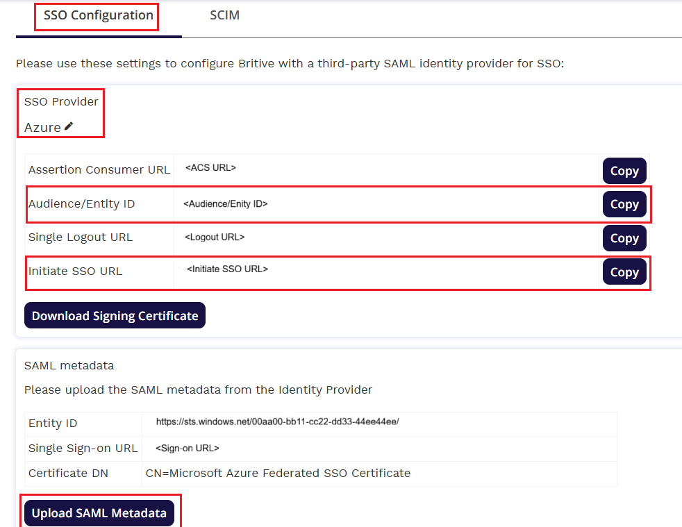

# Configure Britive for Single sign-on with Microsoft Entra ID

In this article,  you learn how to integrate Britive with Microsoft Entra ID. When you integrate Britive with Microsoft Entra ID, you can:

* Control in Microsoft Entra ID who has access to Britive.
* Enable your users to be automatically signed-in to Britive with their Microsoft Entra accounts.
* Manage your accounts in one central location.

## Prerequisites

The scenario outlined in this article assumes that you already have the following prerequisites:

[!INCLUDE [common-prerequisites.md](~/identity/saas-apps/includes/common-prerequisites.md)]
* Britive single sign-on (SSO) enabled subscription.

## Scenario description

In this article,  you configure and test Microsoft Entra SSO in a test environment.

* Britive supports **SP** initiated SSO.
* Britive supports [Automated user provisioning](britive-provisioning-tutorial.md).

## Adding Britive from the gallery

To configure the integration of Britive into Microsoft Entra ID, you need to add Britive from the gallery to your list of managed SaaS apps.

1. Sign in to the [Microsoft Entra admin center](https://entra.microsoft.com) as at least a [Cloud Application Administrator](~/identity/role-based-access-control/permissions-reference.md#cloud-application-administrator).
1. Browse to **Entra ID** > **Enterprise apps** > **New application**.
1. In the **Add from the gallery** section, type **Britive** in the search box.
1. Select **Britive** from results panel and then add the app. Wait a few seconds while the app is added to your tenant.

 [!INCLUDE [sso-wizard.md](~/identity/saas-apps/includes/sso-wizard.md)]

## Configure and test Microsoft Entra SSO for Britive

Configure and test Microsoft Entra SSO with Britive using a test user called **B.Simon**. For SSO to work, you need to establish a link relationship between a Microsoft Entra user and the related user in Britive.

To configure and test Microsoft Entra SSO with Britive, perform the following steps:

1. **[Configure Microsoft Entra SSO](#configure-azure-ad-sso)** - to enable your users to use this feature.
    1. **Create a Microsoft Entra test user** - to test Microsoft Entra single sign-on with B.Simon.
    1. **Assign the Microsoft Entra test user** - to enable B.Simon to use Microsoft Entra single sign-on.
1. **[Configure Britive SSO](#configure-britive-sso)** - to configure the single sign-on settings on application side.
    1. **[Create Britive test user](#create-britive-test-user)** - to have a counterpart of B.Simon in Britive that's linked to the Microsoft Entra representation of user.
1. **[Test SSO](#test-sso)** - to verify whether the configuration works.

## Configure Microsoft Entra SSO

Follow these steps to enable Microsoft Entra SSO.

1. Sign in to the [Microsoft Entra admin center](https://entra.microsoft.com) as at least a [Cloud Application Administrator](~/identity/role-based-access-control/permissions-reference.md#cloud-application-administrator).
1. Browse to **Entra ID** > **Enterprise apps** > **Britive** > **Single sign-on**.
1. On the **Select a single sign-on method** page, select **SAML**.
1. On the **Set up single sign-on with SAML** page, select the pencil icon for **Basic SAML Configuration** to edit the settings.

   

1. On the **Basic SAML Configuration** section, enter the values for the following fields:

	a. In the **Sign on URL** text box, type a URL using the following pattern:
    `https://<TENANTNAME>.britive-app.com/sso`

    b. In the **Identifier (Entity ID)** text box, type a URL using the following pattern:
    `urn:amazon:cognito:sp:<UNIQUE_ID>`

	> [!NOTE]
	> These values aren't real. Update these values with the actual Sign on URL and Identifier, which are explained later in this article. You can also refer to the patterns shown in the **Basic SAML Configuration** section.

1. On the **Set up single sign-on with SAML** page, in the **SAML Signing Certificate** section,  find **Federation Metadata XML** and select **Download** to download the certificate and save it on your computer.

	

1. On the **Set up Britive** section, copy the appropriate URL(s) based on your requirement.

	

[!INCLUDE [create-assign-users-sso.md](~/identity/saas-apps/includes/create-assign-users-sso.md)]

## Configure Britive SSO

1. Log in to the Britive application with administrator privileges in a different web browser window.

1. Select **Admin->Identity Management->Identity Providers** from the navigation menu.

1. Select **ADD IDENTITY PROVIDER**. Enter the name and description. Select the **Add** button.

    

1. Select **Manage** for the Azure identity provider and select **SSO Configuration**.
   
   

   1. Copy **Audience/Entity ID** value and paste it into the **Identifier (Entity ID)** text box in the **Basic SAML Configuration** section.
   1. Copy **Initiate SSO URL** value and paste it into the **Sign on URL** text box in the **Basic SAML Configuration** section.
   1. Change the **SSO Provider** from **Generic** to **Azure**.
   1. Copy the **Audience/Entity ID** value and paste it into the Identifier (Entity ID) text box in the Basic SAML Configuration section in the Azure portal.
   1. Copy the **Initiate SSO URL** value and paste it into the Sign on URL text box in the Basic SAML Configuration section in the Azure portal.
   1. Select **UPLOAD SAML METADATA** to upload the downloaded **metadata XML** file from the Azure portal. After uploading the metadata file the above values are auto- populated and save changes.

### Create Britive test user

1. Log in to the Britive with administrator privileges in a different web browser window.

2. Select **Admin** Settings Icon and select **Identity Management**.

3. Select **ADD USER** from the **Users** tab.

4. Fill in all the necessary details of the user according to your organization's requirements and select **Add**. Make sure to select Azure from the **Identity Providers** list.

> [!NOTE]
>Britive also supports automatic user provisioning, you can find more details [here](./britive-provisioning-tutorial.md) on how to configure automatic user provisioning.

## Test SSO

In this section, you test your Microsoft Entra single sign-on configuration with following options. 

* Select **Test this application**, this option redirects to Britive Sign-on URL where you can initiate the login flow. 

* Go to Britive Sign-on URL directly and initiate the login flow from there.

* You can use Microsoft My Apps. When you select the Britive tile in the My Apps, this option redirects to Britive Sign-on URL. For more information, see [Microsoft Entra My Apps](/azure/active-directory/manage-apps/end-user-experiences#azure-ad-my-apps).

## Related content

Once you configure Britive you can enforce session control, which protects exfiltration and infiltration of your organization’s sensitive data in real time. Session control extends from Conditional Access. [Learn how to enforce session control with Microsoft Defender for Cloud Apps](/cloud-app-security/proxy-deployment-aad).
