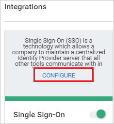
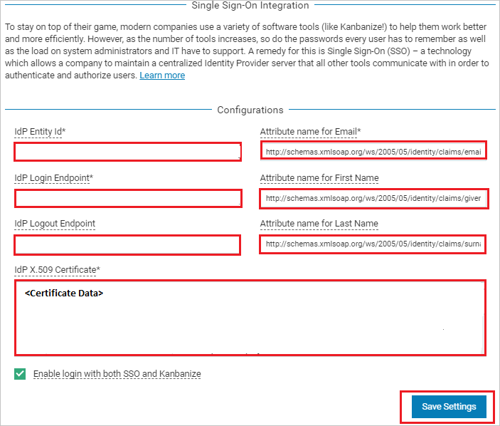

# Configure Businessmap for Single sign-on with Microsoft Entra ID

In this article,  you learn how to integrate Businessmap with Microsoft Entra ID. When you integrate Businessmap with Microsoft Entra ID, you can:

* Control in Microsoft Entra ID who has access to Businessmap.
* Enable your users to be automatically signed-in to Businessmap with their Microsoft Entra accounts.
* Manage your accounts in one central location.

## Prerequisites

The scenario outlined in this article assumes that you already have the following prerequisites:

[!INCLUDE [common-prerequisites.md](~/identity/saas-apps/includes/common-prerequisites.md)]
* Businessmap single sign-on (SSO) enabled subscription.

## Scenario description

In this article,  you configure and test Microsoft Entra SSO in a test environment.

* Businessmap supports **SP and IDP** initiated SSO.
* Businessmap supports **Just In Time** user provisioning.

## Add Businessmap from the gallery

To configure the integration of Businessmap into Microsoft Entra ID, you need to add Businessmap from the gallery to your list of managed SaaS apps.

1. Sign in to the [Microsoft Entra admin center](https://entra.microsoft.com) as at least a [Cloud Application Administrator](~/identity/role-based-access-control/permissions-reference.md#cloud-application-administrator).
1. Browse to **Entra ID** > **Enterprise apps** > **New application**.
1. In the **Add from the gallery** section, type **Businessmap** in the search box.
1. Select **Businessmap** from results panel and then add the app. Wait a few seconds while the app is added to your tenant.

 [!INCLUDE [sso-wizard.md](~/identity/saas-apps/includes/sso-wizard.md)]

## Configure and test Microsoft Entra SSO for Businessmap

Configure and test Microsoft Entra SSO with Businessmap using a test user called **B.Simon**. For SSO to work, you need to establish a link relationship between a Microsoft Entra user and the related user in Businessmap.

To configure and test Microsoft Entra SSO with Businessmap, perform the following steps:

1. **[Configure Microsoft Entra SSO](#configure-azure-ad-sso)** - to enable your users to use this feature.
    1. **Create a Microsoft Entra test user** - to test Microsoft Entra single sign-on with B.Simon.
    1. **Assign the Microsoft Entra test user** - to enable B.Simon to use Microsoft Entra single sign-on.
1. **[Configure Businessmap SSO](#configure-businessmap-sso)** - to configure the single sign-on settings on application side.
    1. **[Create Businessmap test user](#create-businessmap-test-user)** - to have a counterpart of B.Simon in Businessmap that's linked to the Microsoft Entra representation of user.
1. **[Test SSO](#test-sso)** - to verify whether the configuration works.

## Configure Microsoft Entra SSO

Follow these steps to enable Microsoft Entra SSO.

1. Sign in to the [Microsoft Entra admin center](https://entra.microsoft.com) as at least a [Cloud Application Administrator](~/identity/role-based-access-control/permissions-reference.md#cloud-application-administrator).
1. Browse to **Entra ID** > **Enterprise apps** > **Businessmap** > **Single sign-on**.
1. On the **Select a single sign-on method** page, select **SAML**.
1. On the **Set up single sign-on with SAML** page, select the pencil icon for **Basic SAML Configuration** to edit the settings.

   

1. On the **Basic SAML Configuration** section, if you wish to configure the application in **IDP** initiated mode, perform the following steps:

     a. In the **Identifier** text box, type a URL using the following pattern:
    `https://<subdomain>.kanbanize.com/`

    b. In the **Reply URL** text box, type a URL using the following pattern:
    `https://<subdomain>.kanbanize.com/saml/acs`

	c. Select **Set additional URLs**.

    d. In the **Relay State** textbox, type the value: `/ctrl_login/saml_login`

1. Select **Set additional URLs** and perform the following step if you wish to configure the application in **SP** initiated mode:

    In the **Sign-on URL** text box, type a URL using the following pattern:
    `https://<subdomain>.kanbanize.com`

	> [!NOTE]
	> These values aren't real. Update these values with the actual Identifier, Reply URL, and Sign-on URL. Contact [Businessmap Client support team](mailto:support@businessmap.io) to get these values. You can also refer to the patterns shown in the **Basic SAML Configuration** section.

1. Businessmap application expects the SAML assertions in a specific format, which requires you to add custom attribute mappings to your SAML token attributes configuration. The following screenshot shows the list of default attributes, whereas nameidentifier is mapped with **user.userprincipalname**. Businessmap application expects nameidentifier to be mapped with **user.mail**, so you need to edit the attribute mapping by selecting Edit icon and change the attribute mapping.

	

1. On the **Set up single sign-on with SAML** page, in the **SAML Signing Certificate** section,  find **Certificate (Base64)** and select **Download** to download the certificate and save it on your computer.

	

1. On the **Set up Businessmap** section, copy the appropriate URL(s) based on your requirement.

	

[!INCLUDE [create-assign-users-sso.md](~/identity/saas-apps/includes/create-assign-users-sso.md)]

## Configure Businessmap SSO

1. In a different web browser window, sign in to your Businessmap company site as an administrator

4. Go to top  right of the page, select **Settings** logo.

	

5. On the Administration panel page, from the left side of menu select **Integrations** and then enable **Single Sign-On**.

	

6. Under Integrations section, select **CONFIGURE** to open **Single Sign-On Integration** page.

	

7. On the **Single Sign-On Integration** page under **Configurations**, perform the following steps:

	

	a. In the **Idp Entity ID** textbox, paste the value of **Microsoft Entra Identifier**, which you copied previously.

	b. In the **Idp Login Endpoint** textbox, paste the value of **Login URL**, which you copied previously.

	c. In the **Idp Logout Endpoint** textbox, paste the value of **Logout URL**, which you copied previously.

	d. In **Attribute name for Email** textbox, enter this value `http://schemas.xmlsoap.org/ws/2005/05/identity/claims/emailaddress`

	e. In **Attribute name for First Name** textbox, enter this value `http://schemas.xmlsoap.org/ws/2005/05/identity/claims/givenname`

	f. In **Attribute name for Last Name** textbox, enter this value `http://schemas.xmlsoap.org/ws/2005/05/identity/claims/surname`

	> [!Note]
	> You can get these values by combining namespace and name values of the respective attribute from the User attributes section in Azure portal.

	g. In Notepad, open the base-64 encoded certificate that you downloaded, copy its content (without the start and end markers), and then paste it into the **Idp X.509 Certificate** box.

	h. Check **Enable login with both SSO and Businessmap**.

	i. Select **Save Settings**.

### Create Businessmap test user

In this section, a user called B.Simon is created in Businessmap. Businessmap supports just-in-time user provisioning, which is enabled by default. There's no action item for you in this section. If a user doesn't already exist in Businessmap, a new one is created after authentication. If you need to create a user manually, contact [Businessmap Client support team](mailto:support@businessmap.io).

## Test SSO 

In this section, you test your Microsoft Entra single sign-on configuration with following options. 

#### SP initiated:

* Select **Test this application**, this option redirects to Businessmap Sign on URL where you can initiate the login flow.  

* Go to Businessmap Sign-on URL directly and initiate the sign-in flow from there.

#### IDP initiated:

* Select **Test this application**, and you should be automatically signed in to the Businessmap for which you set up the SSO. 

You can also use Microsoft My Apps to test the application in any mode. When you select the Businessmap tile in the My Apps, if configured in SP mode you would be redirected to the application sign-on page for initiating the sign-in flow and if configured in IDP mode, you should be automatically signed in to the Businessmap for which you set up the SSO. For more information, see [Microsoft Entra My Apps](/azure/active-directory/manage-apps/end-user-experiences#azure-ad-my-apps).

## Related content

Once you configure Businessmap you can enforce session control, which protects exfiltration and infiltration of your organization’s sensitive data in real time. Session control extends from Conditional Access. [Learn how to enforce session control with Microsoft Defender for Cloud Apps](/cloud-app-security/proxy-deployment-aad).
