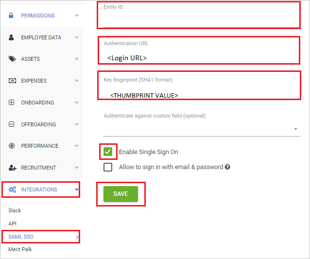
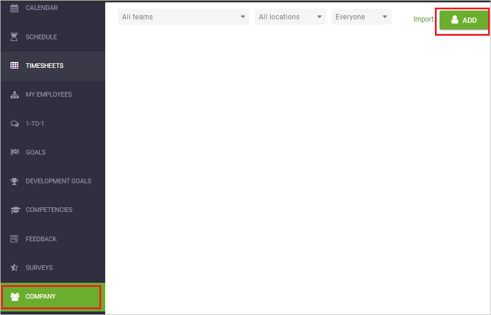
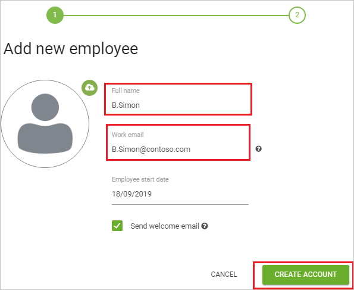

# Configure CakeHR for Single sign-on with Microsoft Entra ID

In this article,  you learn how to integrate CakeHR with Microsoft Entra ID. When you integrate CakeHR with Microsoft Entra ID, you can:

* Control in Microsoft Entra ID who has access to CakeHR.
* Enable your users to be automatically signed-in to CakeHR with their Microsoft Entra accounts.
* Manage your accounts in one central location.

## Prerequisites

The scenario outlined in this article assumes that you already have the following prerequisites:

[!INCLUDE [common-prerequisites.md](~/identity/saas-apps/includes/common-prerequisites.md)]
* CakeHR single sign-on (SSO) enabled subscription.

## Scenario description

In this article,  you configure and test Microsoft Entra SSO in a test environment.

* CakeHR supports **SP** initiated SSO.

> [!NOTE]
> Identifier of this application is a fixed string value so only one instance can be configured in one tenant.

## Add CakeHR from the gallery

To configure the integration of CakeHR into Microsoft Entra ID, you need to add CakeHR from the gallery to your list of managed SaaS apps.

1. Sign in to the [Microsoft Entra admin center](https://entra.microsoft.com) as at least a [Cloud Application Administrator](~/identity/role-based-access-control/permissions-reference.md#cloud-application-administrator).
1. Browse to **Entra ID** > **Enterprise apps** > **New application**.
1. In the **Add from the gallery** section, type **CakeHR** in the search box.
1. Select **CakeHR** from results panel and then add the app. Wait a few seconds while the app is added to your tenant.

 [!INCLUDE [sso-wizard.md](~/identity/saas-apps/includes/sso-wizard.md)]

## Configure and test Microsoft Entra SSO for CakeHR

Configure and test Microsoft Entra SSO with CakeHR using a test user called **B.Simon**. For SSO to work, you need to establish a link relationship between a Microsoft Entra user and the related user in CakeHR.

To configure and test Microsoft Entra SSO with CakeHR, perform the following steps:

1. **[Configure Microsoft Entra SSO](#configure-azure-ad-sso)** - to enable your users to use this feature.
    1. **Create a Microsoft Entra test user** - to test Microsoft Entra single sign-on with B.Simon.
    1. **Assign the Microsoft Entra test user** - to enable B.Simon to use Microsoft Entra single sign-on.
1. **[Configure CakeHR SSO](#configure-cakehr-sso)** - to configure the single sign-on settings on application side.
    1. **[Create CakeHR test user](#create-cakehr-test-user)** - to have a counterpart of B.Simon in CakeHR that's linked to the Microsoft Entra representation of user.
1. **[Test SSO](#test-sso)** - to verify whether the configuration works.

## Configure Microsoft Entra SSO

Follow these steps to enable Microsoft Entra SSO.

1. Sign in to the [Microsoft Entra admin center](https://entra.microsoft.com) as at least a [Cloud Application Administrator](~/identity/role-based-access-control/permissions-reference.md#cloud-application-administrator).
1. Browse to **Entra ID** > **Enterprise apps** > **CakeHR** > **Single sign-on**.
1. On the **Select a single sign-on method** page, select **SAML**.
1. On the **Set up single sign-on with SAML** page, select the pencil icon for **Basic SAML Configuration** to edit the settings.

   

1. On the **Basic SAML Configuration** section, perform the following steps:

    a. In the **Sign-on URL** text box, type a URL using the following pattern:
    `https://<CAKE_DOMAIN>.cake.hr/`

    b. In the **Reply URL** text box, type a URL using the following pattern:
    `https://<CAKE_DOMAIN>.cake.hr/services/saml/consume`
    
	> [!NOTE]
	> These values aren't real. Update these values with the actual Sign-On URL and Reply URL. Contact [CakeHR Client support team](mailto:info@cake.hr) to get these values. You can also refer to the patterns shown in the **Basic SAML Configuration** section.

1. In the **SAML Signing Certificate** section, select **Edit** button to open **SAML Signing Certificate** dialog.

	

1. In the **SAML Signing Certificate** section, copy the **THUMBPRINT** value and save it on your Notepad.

    

1. On the **Set up CakeHR** section, copy the appropriate URL(s) based on your requirement.

	

[!INCLUDE [create-assign-users-sso.md](~/identity/saas-apps/includes/create-assign-users-sso.md)]

## Configure CakeHR SSO

1. In a different web browser window, sign in to your CakeHR company site as an administrator

1. On the top-right corner of the page, select **Profile** and then navigate to **Settings**.

    

1. From the left side of the menu bar, select **INTEGRATIONS** > **SAML SSO** and perform the following steps:

    

    a. In the **Entity ID** text box, type `cake.hr`.

    b. In the **Authentication URL** text box, paste the value of **Login URL**.

    c. In the **Key fingerprint (SHA1 format)** text box, paste the **THUMBPRINT** value.

    d. Check the **Enable Single Sign on** box.

    e. Select **Save**.

### Create CakeHR test user

To enable Microsoft Entra users to sign in to CakeHR, they must be provisioned into CakeHR. In CakeHR, provisioning is a manual task.

**To provision a user account, perform the following steps:**

1. Sign in to CakeHR as a Security Administrator.

2. From the left side of the menu bar, select **COMPANY** > **ADD**.

    

3. On the **Add new employee** pop-up, perform the following steps:

     

    a. In **Full name** text box, enter the name of user like B.Simon.

    b. In **Work email** text box, enter the email of user like `B.Simon@contoso.com`.

    c. Select **CREATE ACCOUNT**.

## Test SSO 

In this section, you test your Microsoft Entra single sign-on configuration with following options. 

* Select **Test this application**, this option redirects to CakeHR Sign-on URL where you can initiate the login flow. 

* Go to CakeHR Sign-on URL directly and initiate the login flow from there.

* You can use Microsoft My Apps. When you select the CakeHR tile in the My Apps, this option redirects to CakeHR Sign-on URL. For more information about the My Apps, see [Introduction to the My Apps](https://support.microsoft.com/account-billing/sign-in-and-start-apps-from-the-my-apps-portal-2f3b1bae-0e5a-4a86-a33e-876fbd2a4510).

## Related content

Once you configure CakeHR you can enforce session control, which protects exfiltration and infiltration of your organization’s sensitive data in real time. Session control extends from Conditional Access. [Learn how to enforce session control with Microsoft Defender for Cloud Apps](/cloud-app-security/proxy-deployment-aad).
