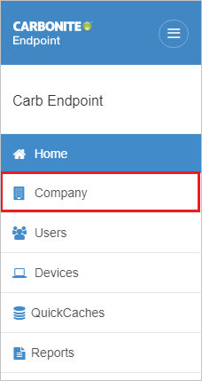
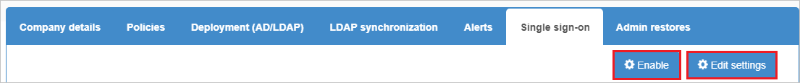

# Configure Carbonite Endpoint Backup for Single sign-on with Microsoft Entra ID

In this article,  you learn how to integrate Carbonite Endpoint Backup with Microsoft Entra ID. When you integrate Carbonite Endpoint Backup with Microsoft Entra ID, you can:

* Control in Microsoft Entra ID who has access to Carbonite Endpoint Backup.
* Enable your users to be automatically signed-in to Carbonite Endpoint Backup with their Microsoft Entra accounts.
* Manage your accounts in one central location.

## Prerequisites

The scenario outlined in this article assumes that you already have the following prerequisites:

[!INCLUDE [common-prerequisites.md](~/identity/saas-apps/includes/common-prerequisites.md)]
* Carbonite Endpoint Backup single sign-on (SSO) enabled subscription.

## Scenario description

In this article,  you configure and test Microsoft Entra SSO in a test environment.

* Carbonite Endpoint Backup supports **SP and IDP** initiated SSO.

> [!NOTE]
> Identifier of this application is a fixed string value so only one instance can be configured in one tenant.

## Add Carbonite Endpoint Backup from the gallery

To configure the integration of Carbonite Endpoint Backup into Microsoft Entra ID, you need to add Carbonite Endpoint Backup from the gallery to your list of managed SaaS apps.

1. Sign in to the [Microsoft Entra admin center](https://entra.microsoft.com) as at least a [Cloud Application Administrator](~/identity/role-based-access-control/permissions-reference.md#cloud-application-administrator).
1. Browse to **Entra ID** > **Enterprise apps** > **New application**.
1. In the **Add from the gallery** section, type **Carbonite Endpoint Backup** in the search box.
1. Select **Carbonite Endpoint Backup** from results panel and then add the app. Wait a few seconds while the app is added to your tenant.

 [!INCLUDE [sso-wizard.md](~/identity/saas-apps/includes/sso-wizard.md)]

<a name='configure-and-test-azure-ad-sso-for-carbonite-endpoint-backup'></a>

## Configure and test Microsoft Entra SSO for Carbonite Endpoint Backup

Configure and test Microsoft Entra SSO with Carbonite Endpoint Backup using a test user called **B.Simon**. For SSO to work, you need to establish a link relationship between a Microsoft Entra user and the related user in Carbonite Endpoint Backup.

To configure and test Microsoft Entra SSO with Carbonite Endpoint Backup, perform the following steps:

1. **[Configure Microsoft Entra SSO](#configure-azure-ad-sso)** - to enable your users to use this feature.
    1. **Create a Microsoft Entra test user** - to test Microsoft Entra single sign-on with B.Simon.
    1. **Assign the Microsoft Entra test user** - to enable B.Simon to use Microsoft Entra single sign-on.
1. **[Configure Carbonite Endpoint Backup SSO](#configure-carbonite-endpoint-backup-sso)** - to configure the single sign-on settings on application side.
    1. **[Create Carbonite Endpoint Backup test user](#create-carbonite-endpoint-backup-test-user)** - to have a counterpart of B.Simon in Carbonite Endpoint Backup that's linked to the Microsoft Entra representation of user.
1. **[Test SSO](#test-sso)** - to verify whether the configuration works.

<a name='configure-azure-ad-sso'></a>

## Configure Microsoft Entra SSO

Follow these steps to enable Microsoft Entra SSO.

1. Sign in to the [Microsoft Entra admin center](https://entra.microsoft.com) as at least a [Cloud Application Administrator](~/identity/role-based-access-control/permissions-reference.md#cloud-application-administrator).
1. Browse to **Entra ID** > **Enterprise apps** > **Carbonite Endpoint Backup** application integration page, find the **Manage** section and select **Single sign-on**.
1. On the **Select a Single sign-on method** page, select **SAML**.
1. On the **Set up Single Sign-On with SAML** page, select the pencil icon for **Basic SAML Configuration** to edit the settings.

   

1. On the **Basic SAML Configuration** section, if you wish to configure the application in **IDP** initiated mode, enter the values for the following fields:

    a. In the **Identifier** text box, type one of the following URLs:

    ```http
    https://red-us.mysecuredatavault.com
    https://red-apac.mysecuredatavault.com
    https://red-fr.mysecuredatavault.com
    https://red-emea.mysecuredatavault.com
    https://kamino.mysecuredatavault.com
    ```

    b. In the **Reply URL** text box, type one of the following URLs:

    ```http
    https://red-us.mysecuredatavault.com/AssertionConsumerService.aspx
    https://red-apac.mysecuredatavault.com/AssertionConsumerService.aspx
    https://red-fr.mysecuredatavault.com/AssertionConsumerService.aspx
    https://red-emea.mysecuredatavault.com/AssertionConsumerService.aspx
    ```

1. Select **Set additional URLs** and perform the following step if you wish to configure the application in **SP** initiated mode:

    In the **Sign-on URL** text box, type one of the following URLs:

    ```http
    https://red-us.mysecuredatavault.com/
    https://red-apac.mysecuredatavault.com/
    https://red-fr.mysecuredatavault.com/
    https://red-emea.mysecuredatavault.com/
    ```

1. On the **Set up Single Sign-On with SAML** page, in the **SAML Signing Certificate** section,  find **Certificate (Base64)** and select **Download** to download the certificate and save it on your computer.

	

1. On the **Set up Carbonite Endpoint Backup** section, copy the appropriate URL(s) based on your requirement.

	

<a name='create-an-azure-ad-test-user'></a>

[!INCLUDE [create-assign-users-sso.md](~/identity/saas-apps/includes/create-assign-users-sso.md)]

## Configure Carbonite Endpoint Backup SSO


1. In a different web browser window, sign in to your Carbonite Endpoint Backup company site as an administrator

4. Select the **Company** from the left pane.

    

5. Select **Single sign-on**.

6. Select **Enable** and then select **Edit settings** to configure.

    

7. On the **Single sign-on** settings page, perform the following steps:

    

    1. In the **Identity provider name** textbox, paste the **Microsoft Entra Identifier** value, which you copied previously.

    1. In the **Identity provider URL** textbox, paste the **Login URL** value, which you copied previously.

    1. Select **Choose file** to upload the downloaded **Certificate(Base64)** file.

    1. Select **Save**.

### Create Carbonite Endpoint Backup test user

1. In a different web browser window, sign in to your Carbonite Endpoint Backup company site as an administrator.

1. Select the **Users** from the left pane and then select **Add user**.

    

1. On the **Add user** page, perform the following steps:

    1. Enter the **Email**, **First name**, **Last name** of the user and provide the required permissions to the user according to the Organizational requirements.

    1. Select **Add user**.

## Test SSO

In this section, you test your Microsoft Entra single sign-on configuration with following options. 

#### SP initiated:

* Select **Test this application**, this option redirects to Carbonite Endpoint Backup Sign on URL where you can initiate the login flow.  

* Go to Carbonite Endpoint Backup Sign-on URL directly and initiate the login flow from there.

#### IDP initiated:

* Select **Test this application**, and you should be automatically signed in to the Carbonite Endpoint Backup for which you set up the SSO. 

You can also use Microsoft My Apps to test the application in any mode. When you select the Carbonite Endpoint Backup tile in the My Apps, if configured in SP mode you would be redirected to the application sign on page for initiating the login flow and if configured in IDP mode, you should be automatically signed in to the Carbonite Endpoint Backup for which you set up the SSO. For more information about the My Apps, see [Introduction to the My Apps](https://support.microsoft.com/account-billing/sign-in-and-start-apps-from-the-my-apps-portal-2f3b1bae-0e5a-4a86-a33e-876fbd2a4510).

## Related content

Once you configure Carbonite Endpoint Backup you can enforce session control, which protects exfiltration and infiltration of your organization’s sensitive data in real time. Session control extends from Conditional Access. [Learn how to enforce session control with Microsoft Defender for Cloud Apps](/cloud-app-security/proxy-deployment-any-app).
