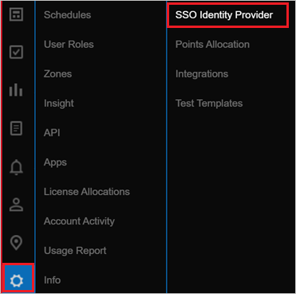
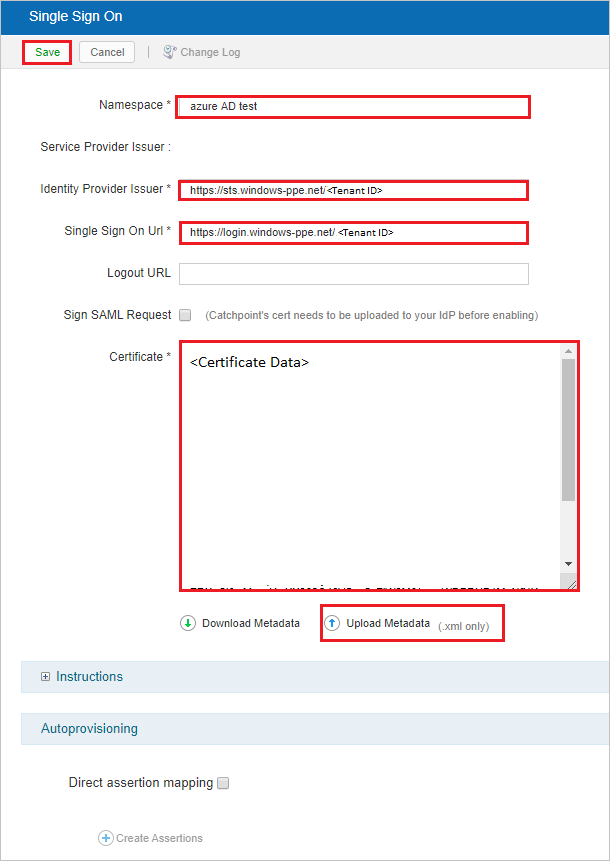
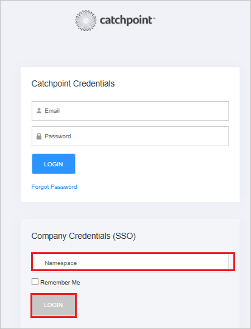

# Configure Catchpoint for Single sign-on with Microsoft Entra ID

In this article,  you learn how to integrate Catchpoint with Microsoft Entra ID. When you integrate Catchpoint with Microsoft Entra ID, you can:

- Control user access to Catchpoint from Microsoft Entra ID.
- Enable automatic Catchpoint sign-in for users with Microsoft Entra accounts.
- Manage your accounts in one central location: the Azure portal.

## Prerequisites

The scenario outlined in this article assumes that you already have the following prerequisites:

[!INCLUDE [common-prerequisites.md](~/identity/saas-apps/includes/common-prerequisites.md)]
- A Catchpoint subscription with single sign-on (SSO) enabled.

## Scenario description

In this article,  you configure and test Microsoft Entra SSO in a test environment.

- Catchpoint supports SP-initiated and IDP-initiated SSO.
- Catchpoint supports just-in-time (JIT) user provisioning.

## Add Catchpoint from the gallery

To configure the integration of Catchpoint into Microsoft Entra ID, add Catchpoint to your list of managed SaaS apps.

1. Sign in to the [Microsoft Entra admin center](https://entra.microsoft.com) as at least a [Cloud Application Administrator](~/identity/role-based-access-control/permissions-reference.md#cloud-application-administrator).
1. Browse to **Entra ID** > **Enterprise apps** > **New application**.
1. In the **Add from the gallery** section, type **Catchpoint** in the search box.
1. Select **Catchpoint** from the results panel and then add the app. Wait a few seconds while the app is added to your tenant.

 [!INCLUDE [sso-wizard.md](~/identity/saas-apps/includes/sso-wizard.md)]

## Configure and test Microsoft Entra SSO for Catchpoint

For SSO to work, you need to link a Microsoft Entra user with a user in Catchpoint. For this article,  we configure a test user called **B.Simon**.

Complete the following sections:

1. [Configure Microsoft Entra SSO](#configure-azure-ad-sso), to enable this feature for your users.
   - Create a Microsoft Entra test user, to test Microsoft Entra single sign-on with B.Simon.
   - Assign the Microsoft Entra test user, to enable B.Simon to use Microsoft Entra single sign-on.
1. [Configure Catchpoint SSO](#configure-catchpoint-sso), to configure the single sign-on settings on the application side.
   - [Create Catchpoint test user](#create-a-catchpoint-test-user), to allow linking of the B.Simon Microsoft Entra test account to a similar user account in Catchpoint.
1. [Test SSO](#test-sso), to verify that the configuration works.

## Configure Microsoft Entra SSO

Follow these steps in the Azure portal to enable Microsoft Entra SSO:

1. Sign in to the [Microsoft Entra admin center](https://entra.microsoft.com) as at least a [Cloud Application Administrator](~/identity/role-based-access-control/permissions-reference.md#cloud-application-administrator).
1. Browse to **Entra ID** > **Enterprise apps** > **Catchpoint** > **Single sign-on**.
1. On the **Select a single sign-on method** page, select **SAML**.
1. On the **Set Up Single Sign-On with SAML** page, select the pencil icon to edit the **Basic SAML Configuration** settings.

   

1. Configure the initiated mode for Catchpoint:

   - For **IDP**-initiated mode, enter the values for the following fields:
     - For **Identifier**: `https://portal.catchpoint.com/SAML2`
     - For **Reply URL**: `https://portal.catchpoint.com/ui/Entry/SingleSignOn.aspx`
   - For **SP**-initiated mode, select **Set additional URLs** and enter the following value:
     - For **Sign-on URL**: `https://portal.catchpoint.com/ui/Entry/SingleSignOn.aspx`

1. The Catchpoint application expects the SAML assertions in a specific format. Add custom attribute mappings to your configuration of SAML token attributes. The following table contains the list of default attributes:

   | Name                   | Source attribute       |
   | ---------------------- | ---------------------- |
   | Givenname              | user.givenneame        |
   | Surname                | user.surname           |
   | Emailaddress           | user.mail              |
   | Name                   | user.userprincipalname |
   | Unique User Identifier | user.userprincipalname |

   

1. Also, the Catchpoint application expects another attribute to be passed in a SAML response. See the following table. This attribute is also pre-populated, but you can review and update it to fit your requirements.

   | Name      | Source attribute  |
   | --------- | ----------------- |
   | namespace | user.assignedrole |

   > [!NOTE]
   > The `namespace` claim needs to be mapped with the account name. This account name should be set up with a role in Microsoft Entra ID to be passed back in SAML response. For more information about roles in Microsoft Entra ID, see [Configure the role claim issued in the SAML token for enterprise applications](~/identity-platform/howto-add-app-roles-in-apps.md#app-roles-ui).

1. Go to the **Set Up Single Sign-On with SAML** page. In the **SAML Signing Certificate** section, find **Certificate (Base64)**. Select **Download** to save the certificate to your computer.

   

1. In the **Set up Catchpoint** section, copy the URLs that you need in a later step.

   

[!INCLUDE [create-assign-users-sso.md](~/identity/saas-apps/includes/create-assign-users-sso.md)]

## Configure Catchpoint SSO

1. In a different web browser window, sign in to the Catchpoint application as an administrator.

1. Select the **Settings** icon and then **SSO Identity Provider**.

   

1. On the **Single Sign On** page, enter the following fields:

   

   | Field                        | Value                                                                                                           |
   | ---------------------------- | --------------------------------------------------------------------------------------------------------------- |
   | **Namespace**                | A valid namespace value.                                                                                        |
   | **Identity Provider Issuer** | The `Azure AD Identifier` value.                                                          |
   | **Single Sign On Url**       | The `Login URL` value.                                                                    |
   | **Certificate**              | The contents of the downloaded `Certificate (Base64)` file. Use Notepad to view and copy. |

   You might also upload the **Federation Metadata XML** by selecting the **Upload Metadata** option.

1. Select **Save**.

### Create a Catchpoint test user

Catchpoint supports just-in-time user provisioning, which is enabled by default. You have no action items in this section. If B.Simon doesn't already exist as a user in Catchpoint, it's created after authentication.

## Test SSO

In this section, you test your Microsoft Entra single sign-on configuration with following options.

#### SP initiated:

- Select **Test this application**, this option redirects to Catchpoint Sign on URL where you can initiate the login flow.

- Go to Catchpoint Sign-on URL directly and initiate the login flow from there.

#### IDP initiated:

- Select **Test this application**, and you should be automatically signed in to the Catchpoint for which you set up the SSO

You can also use Microsoft My Apps to test the application in any mode. When you select the Catchpoint tile in the My Apps, if configured in SP mode you would be redirected to the application sign on page for initiating the login flow and if configured in IDP mode, you should be automatically signed in to the Catchpoint for which you set up the SSO. For more information about the My Apps, see [Introduction to the My Apps](https://support.microsoft.com/account-billing/sign-in-and-start-apps-from-the-my-apps-portal-2f3b1bae-0e5a-4a86-a33e-876fbd2a4510).

> [!NOTE]
> When you're signed in to the Catchpoint application through the login page, after providing **Catchpoint Credentials**, enter the valid **Namespace** value in the **Company Credentials(SSO)** field and select **Login**.
>
> 

## Related content

After you configure Catchpoint, you can enforce session control. This precaution protects against exfiltration and infiltration of your organization's sensitive data in real time. Session control is an extension of Conditional Access. [Learn how to enforce session control with Microsoft Defender for Cloud Apps](/cloud-app-security/proxy-deployment-any-app).
