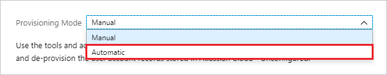

# Configure Cerner Central for automatic user provisioning

The objective of this article is to show you the steps you need to perform in Cerner Central and Microsoft Entra ID to automatically provision and de-provision user accounts from Microsoft Entra ID to a user roster in Cerner Central.

## Prerequisites

The scenario outlined in this article assumes that you already have the following items:

[!INCLUDE [common-prerequisites.md](~/identity/saas-apps/includes/common-prerequisites.md)]
* A Cerner Central tenant

> [!NOTE]
> Microsoft Entra ID integrates with Cerner Central using the SCIM protocol.

## Assigning users to Cerner Central

Microsoft Entra ID uses a concept called "assignments" to determine which users should receive access to selected apps. In the context of automatic user account provisioning, only the users and groups that have been "assigned" to an application in Microsoft Entra ID are synchronized. 

Before configuring and enabling the provisioning service, you should decide what users and/or groups in Microsoft Entra ID represent the users who need access to Cerner Central. Once decided, you can assign these users to Cerner Central by following the instructions here:

[Assign a user or group to an enterprise app](~/identity/enterprise-apps/assign-user-or-group-access-portal.md)

### Important tips for assigning users to Cerner Central

* It's recommended that a single Microsoft Entra user be assigned to Cerner Central to test the provisioning configuration. Additional users and/or groups may be assigned later.

* Once initial testing is complete for a single user, Cerner Central recommends assigning the entire list of users intended to access any Cerner solution (not just Cerner Central) to be provisioned to Cerner’s user roster.  Other Cerner solutions leverage this list of users in the user roster.

* When assigning a user to Cerner Central, you must select the **User** role in the assignment dialog. Users with the "Default Access" role are excluded from provisioning.

## Configuring user provisioning to Cerner Central

This section guides you through connecting your Microsoft Entra ID to Cerner Central’s User Roster using Cerner's SCIM user account provisioning API, and configuring the provisioning service to create, update, and disable assigned user accounts in Cerner Central based on user and group assignment in Microsoft Entra ID.

> [!TIP]
> You may also choose to enable SAML-based single sign-on for Cerner Central, following the instructions provided in the [Azure portal](https://portal.azure.com). Single sign-on can be configured independently of automatic provisioning, though these two features complement each other. For more information, see the [Cerner Central single sign-on  article](cernercentral-tutorial.md).

<a name='to-configure-automatic-user-account-provisioning-to-cerner-central-in-azure-ad'></a>

### To configure automatic user account provisioning to Cerner Central in Microsoft Entra ID:

In order to provision user accounts to Cerner Central, you’ll need to request a Cerner Central system account from Cerner, and generate an OAuth bearer token that Microsoft Entra ID can use to connect to Cerner's SCIM endpoint. It's also recommended that the integration be performed in a Cerner sandbox environment before deploying to production.

1. The first step is to ensure the people managing the Cerner and Microsoft Entra integration have a CernerCare account, which is required to access the documentation necessary to complete the instructions. If necessary, use the URLs below to create CernerCare accounts in each applicable environment.

   * Sandbox:  https://sandboxcernercare.com/accounts/create

   * Production:  https://cernercare.com/accounts/create  

1. Next, a system account must be created for Microsoft Entra ID. Use the instructions below to request a System Account for your sandbox and production environments.

   * Instructions: https://wiki.cerner.com/display/public/CernerCentral/Requesting+a+System+Account+in+System+Account+Management

   * Sandbox: https://sandboxcernercentral.com/system-accounts/

   * Production:  https://cernercentral.com/system-accounts/

1. Next, generate an OAuth bearer token for each of your system accounts. To do this, follow the instructions below.

   * Instructions:  https://wiki.ucern.com/display/public/reference/Accessing+Cerner%27s+Web+Services+Using+A+System+Account+Bearer+Token

   * Sandbox: https://sandboxcernercentral.com/system-accounts/

   * Production:  https://cernercentral.com/system-accounts/

1. Finally, you need to acquire User Roster Realm IDs for both the sandbox and production environments in Cerner to complete the configuration. For information on how to acquire this, see: https://wiki.ucern.com/display/public/reference/Publishing+Identity+Data+Using+SCIM. 

1. Now you can configure Microsoft Entra ID to provision user accounts to Cerner. Sign in to the [Microsoft Entra admin center](https://entra.microsoft.com) as at least a [Cloud Application Administrator](~/identity/role-based-access-control/permissions-reference.md#cloud-application-administrator).
1. Browse to **Entra ID** > **Enterprise apps** > **All applications**.

1. If you have already configured Cerner Central for single sign-on, search for your instance of Cerner Central using the search field. Otherwise, select **Add** and search for **Cerner Central** in the application gallery. Select Cerner Central from the search results, and add it to your list of applications.

1. Select your instance of Cerner Central, then select the **Provisioning** tab.

1. Set **+ New configuration**.

	

	

1. Fill in the following fields under **Admin Credentials**:

   * In the **Tenant URL** field, enter a URL in the format below, replacing "User-Roster-Realm-ID" with the realm ID you acquired in step #4.

    > Sandbox:
    > ```https://user-roster-api.sandboxcernercentral.com/scim/v1/Realms/User-Roster-Realm-ID/```
    > 
    > Production:
    > ```https://user-roster-api.cernercentral.com/scim/v1/Realms/User-Roster-Realm-ID/``` 

   * In the **Secret Token** field, enter the OAuth bearer token you generated in step #3 and select **Test Connection**.

   * You should see a success notification on the upper-right side of your portal.

1. Select **Create** to create your configuration.	

1. Select **Properties** in the **Overview** page. 

1. Select the pencil to edit the properties. Enable notification emails and provide an email to receive quarantine emails. Enable accidental deletions prevention. Select **Apply** to save the changes.

   

1. Select **Attribute Mapping** in the left panel and select **users**.

1. Review the user and group attributes to be synchronized from Microsoft Entra ID to Cerner Central. The attributes selected as **Matching** properties are used to match the user accounts and groups in Cerner Central for update operations. Select the Save button to commit any changes.

1. To configure scoping filters, refer to the following instructions provided in the [Scoping filter article](~/identity/app-provisioning/define-conditional-rules-for-provisioning-user-accounts.md).

1. Use [on-demand provisioning](~/identity/app-provisioning/provision-on-demand.md) to validate sync with a small number of users before deploying more broadly in your organization.  

1. When you're ready to provision, select **Start Provisioning** from the **Overview** page. 

## Step 6: Monitor your deployment

[!INCLUDE [monitor-deployment.md](~/identity/saas-apps/includes/monitor-deployment.md)]

## Additional resources

* [Cerner Central: Publishing identity data using Microsoft Entra ID](https://wiki.ucern.com/display/public/reference/Publishing+Identity+Data+Using+Azure+AD)
* [Tutorial: Configuring Cerner Central for single sign-on with Microsoft Entra ID](cernercentral-tutorial.md)
* [Managing user account provisioning for Enterprise Apps](~/identity/app-provisioning/configure-automatic-user-provisioning-portal.md)
* [What is application access and single sign-on with Microsoft Entra ID?](~/identity/enterprise-apps/what-is-single-sign-on.md)

## Related content

* [Learn how to review logs and get reports on provisioning activity](~/identity/app-provisioning/check-status-user-account-provisioning.md).
