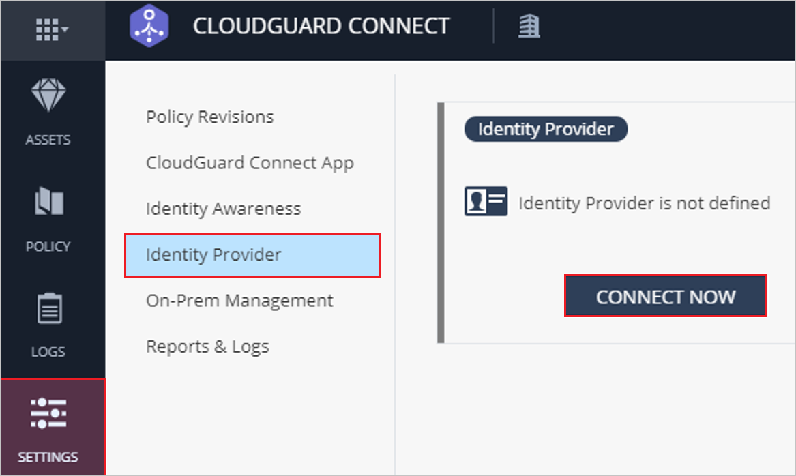
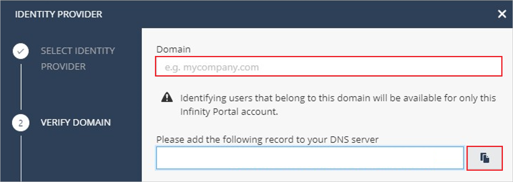
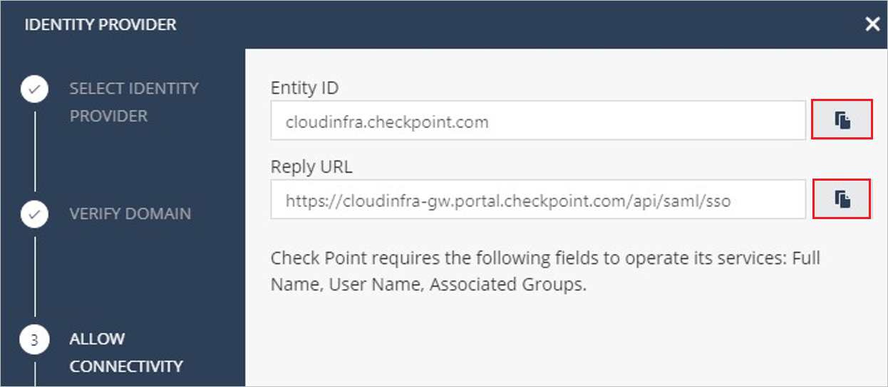
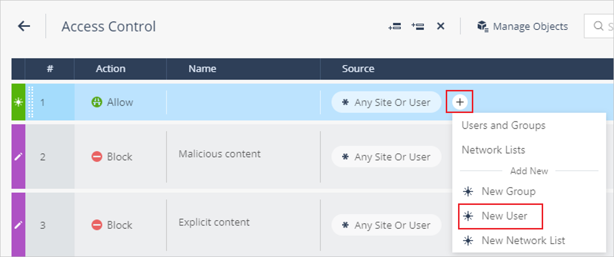
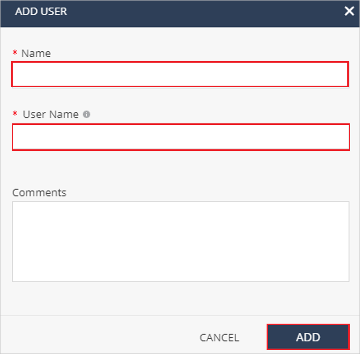

# Configure Check Point Harmony Connect for Single sign-on with Microsoft Entra ID

In this article,  you learn how to integrate Check Point Harmony Connect with Microsoft Entra ID. When you integrate Check Point Harmony Connect with Microsoft Entra ID, you can:

* Control in Microsoft Entra ID who has access to Check Point Harmony Connect.
* Enable your users to be automatically signed-in to Check Point Harmony Connect with their Microsoft Entra accounts.
* Manage your accounts in one central location.

## Prerequisites

The scenario outlined in this article assumes that you already have the following prerequisites:

[!INCLUDE [common-prerequisites.md](~/identity/saas-apps/includes/common-prerequisites.md)]
* Check Point Harmony Connect single sign-on (SSO) enabled subscription.

## Scenario description

In this article,  you configure and test Microsoft Entra SSO in a test environment.

* Check Point Harmony Connect supports **SP** initiated SSO.
> [!NOTE]
> Identifier of this application is a fixed string value so only one instance can be configured in one tenant.

## Adding Check Point Harmony Connect from the gallery

To configure the integration of Check Point Harmony Connect into Microsoft Entra ID, you need to add Check Point Harmony Connect from the gallery to your list of managed SaaS apps.

1. Sign in to the [Microsoft Entra admin center](https://entra.microsoft.com) as at least a [Cloud Application Administrator](~/identity/role-based-access-control/permissions-reference.md#cloud-application-administrator).
1. Browse to **Entra ID** > **Enterprise apps** > **New application**.
1. In the **Add from the gallery** section, type **Check Point Harmony Connect** in the search box.
1. Select **Check Point Harmony Connect** from results panel and then add the app. Wait a few seconds while the app is added to your tenant.

 [!INCLUDE [sso-wizard.md](~/identity/saas-apps/includes/sso-wizard.md)]

## Configure and test Microsoft Entra SSO for Check Point Harmony Connect

Configure and test Microsoft Entra SSO with Check Point Harmony Connect using a test user called **B.Simon**. For SSO to work, you need to establish a link relationship between a Microsoft Entra user and the related user in Check Point Harmony Connect.

To configure and test Microsoft Entra SSO with Check Point Harmony Connect, perform the following steps:

1. **[Configure Microsoft Entra SSO](#configure-azure-ad-sso)** - to enable your users to use this feature.
    1. **Create a Microsoft Entra test user** - to test Microsoft Entra single sign-on with B.Simon.
    1. **Assign the Microsoft Entra test user** - to enable B.Simon to use Microsoft Entra single sign-on.
1. **[Configure Check Point Harmony Connect SSO](#configure-check-point-harmony-connect-sso)** - to configure the single sign-on settings on application side.
    1. **[Create Check Point Harmony Connect test user](#create-check-point-harmony-connect-test-user)** - to have a counterpart of B.Simon in Check Point Harmony Connect that's linked to the Microsoft Entra representation of user.
1. **[Test SSO](#test-sso)** - to verify whether the configuration works.

## Configure Microsoft Entra SSO

Follow these steps to enable Microsoft Entra SSO.

1. Sign in to the [Microsoft Entra admin center](https://entra.microsoft.com) as at least a [Cloud Application Administrator](~/identity/role-based-access-control/permissions-reference.md#cloud-application-administrator).
1. Browse to **Entra ID** > **Enterprise apps** > **Check Point Harmony Connect** > **Single sign-on**.
1. On the **Select a single sign-on method** page, select **SAML**.
1. On the **Set up single sign-on with SAML** page, select the pencil icon for **Basic SAML Configuration** to edit the settings.

   

1. On the **Basic SAML Configuration** section, enter the values for the following fields:

	In the **Sign on URL** text box, type the URL:
    `https://cloudinfra-gw.portal.checkpoint.com/api/saml/sso`

1. Check Point Harmony Connect application expects the SAML assertions in a specific format, which requires you to add custom attribute mappings to your SAML token attributes configuration. The following screenshot shows the list of default attributes.

	

1. In addition to above, Check Point Harmony Connect application expects few more attributes to be passed back in SAML response which are shown below. These attributes are also pre populated but you can review them as per your requirements.
	
	| Name |  Source Attribute|
	| ---------------- | --------- |
	| groups | user.groups |

1. On the **Set up single sign-on with SAML** page, in the **SAML Signing Certificate** section,  find **Federation Metadata XML** and select **Download** to download the certificate and save it on your computer.

	

1. On the **Set up Check Point Harmony Connect** section, copy the appropriate URL(s) based on your requirement.

	

[!INCLUDE [create-assign-users-sso.md](~/identity/saas-apps/includes/create-assign-users-sso.md)]

## Configure Check Point Harmony Connect SSO

1. Log in to your Check Point Harmony Connect website as an administrator.

1. Select **SETTINGS**, then go to the **Identity Provider** and select **CONNECT NOW**.

	

1. Select **Microsoft Entra ID** as your identity provider and select **NEXT**.

1. On the **Verify Domain** page, enter your organization domain and enter this generated DNS record to your DNS server as TXT record, select **NEXT**.

	

1. In the Allow Connectivity page, perform the following steps:

	

	a. Copy **ENTITY ID** value, paste this value into the **Identifier** text box in the **Basic SAML Configuration** section.

	b. Copy **REPLY URL** value, paste this value into the **Reply URL** text box in the **Basic SAML Configuration** section.

	c. Select **NEXT**.

1. In the **Configure Metadata** page, upload the **Federation Metadata XML** that you downloaded from your Azure portal.

1. In the **CONFIRM IDENTITY PROVIDER** page, select **Add** to complete the configuration.

### Create Check Point Harmony Connect test user

1. Log in to your Check Point Harmony Connect website as an administrator.

1. Go to the **Policy** > **Access Control** and create a **new rule** and select **(+)** to add **New User**. 

	

1. In the **ADD USER** window, enter the Name and User Name in their respective text boxes and select **ADD**.

	

## Test SSO 

To test the Check Point Harmony Connect, go to their Authentication service and authenticate using test account which you have created in the **Create a Microsoft Entra test user** section.

## Related content

Once you configure Check Point Harmony Connect you can enforce session control, which protects exfiltration and infiltration of your organization’s sensitive data in real time. Session control extends from Conditional Access. [Learn how to enforce session control with Microsoft Defender for Cloud Apps](/cloud-app-security/proxy-deployment-any-app).
