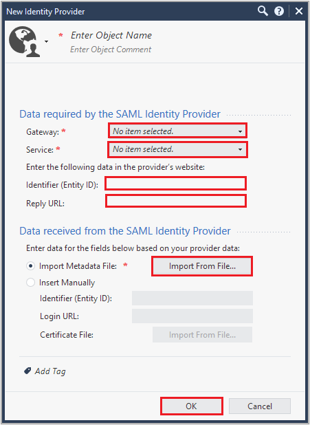

# Configure Check Point Identity Awareness for Single sign-on with Microsoft Entra ID

In this article,  you learn how to integrate Check Point Identity Awareness with Microsoft Entra ID. When you integrate Check Point Identity Awareness with Microsoft Entra ID, you can:

* Control in Microsoft Entra ID who has access to Check Point Identity Awareness.
* Enable your users to be automatically signed-in to Check Point Identity Awareness with their Microsoft Entra accounts.
* Manage your accounts in one central location.

## Prerequisites

The scenario outlined in this article assumes that you already have the following prerequisites:

[!INCLUDE [common-prerequisites.md](~/identity/saas-apps/includes/common-prerequisites.md)]
* Check Point Identity Awareness single sign-on (SSO) enabled subscription.

## Scenario description

In this article,  you configure and test Microsoft Entra SSO in a test environment.

* Check Point Identity Awareness supports **SP** initiated SSO.

## Adding Check Point Identity Awareness from the gallery

To configure the integration of Check Point Identity Awareness into Microsoft Entra ID, you need to add Check Point Identity Awareness from the gallery to your list of managed SaaS apps.

1. Sign in to the [Microsoft Entra admin center](https://entra.microsoft.com) as at least a [Cloud Application Administrator](~/identity/role-based-access-control/permissions-reference.md#cloud-application-administrator).
1. Browse to **Entra ID** > **Enterprise apps** > **New application**.
1. In the **Add from the gallery** section, type **Check Point Identity Awareness** in the search box.
1. Select **Check Point Identity Awareness** from results panel and then add the app. Wait a few seconds while the app is added to your tenant.

 [!INCLUDE [sso-wizard.md](~/identity/saas-apps/includes/sso-wizard.md)]

## Configure and test Microsoft Entra SSO for Check Point Identity Awareness

Configure and test Microsoft Entra SSO with Check Point Identity Awareness using a test user called **B.Simon**. For SSO to work, you need to establish a link relationship between a Microsoft Entra user and the related user in Check Point Identity Awareness.

To configure and test Microsoft Entra SSO with Check Point Identity Awareness, perform the following steps:

1. **[Configure Microsoft Entra SSO](#configure-azure-ad-sso)** - to enable your users to use this feature.
    1. **Create a Microsoft Entra test user** - to test Microsoft Entra single sign-on with B.Simon.
    1. **Assign the Microsoft Entra test user** - to enable B.Simon to use Microsoft Entra single sign-on.
1. **[Configure Check Point Identity Awareness SSO](#configure-check-point-identity-awareness-sso)** - to configure the single sign-on settings on application side.
    1. **[Create Check Point Identity Awareness test user](#create-check-point-identity-awareness-test-user)** - to have a counterpart of B.Simon in Check Point Identity Awareness that's linked to the Microsoft Entra representation of user.
1. **[Test SSO](#test-sso)** - to verify whether the configuration works.

## Configure Microsoft Entra SSO

Follow these steps to enable Microsoft Entra SSO.

1. Sign in to the [Microsoft Entra admin center](https://entra.microsoft.com) as at least a [Cloud Application Administrator](~/identity/role-based-access-control/permissions-reference.md#cloud-application-administrator).
1. Browse to **Entra ID** > **Enterprise apps** > **Check Point Identity Awareness** > **Single sign-on**.
1. On the **Select a single sign-on method** page, select **SAML**.
1. On the **Set up single sign-on with SAML** page, select the pencil icon for **Basic SAML Configuration** to edit the settings.

   

1. On the **Basic SAML Configuration** section, enter the values for the following fields:

    a. In the **Identifier (Entity ID)** text box, type a URL using the following pattern:
    `https://<GATEWAY_IP>/connect/spPortal/ACS/ID/<IDENTIFIER_UID>`

    b. In the **Reply URL** text box, type a URL using the following pattern:
    `https://<GATEWAY_IP>/connect/spPortal/ACS/Login/<IDENTIFIER_UID>`

    c. In the **Sign on URL** text box, type a URL using the following pattern:
    `https://<GATEWAY_IP>/connect`

	> [!NOTE]
	> These values aren't real. Update these values with the actual Identifier, Reply URL and Sign on URL. Contact [Check Point Identity Awareness Client support team](mailto:support@checkpoint.com) to get these values. You can also refer to the patterns shown in the **Basic SAML Configuration** section.

1. On the **Set up single sign-on with SAML** page, in the **SAML Signing Certificate** section,  find **Federation Metadata XML** and select **Download** to download the certificate and save it on your computer.

	

1. On the **Set up Check Point Identity Awareness** section, copy the appropriate URL(s) based on your requirement.

	

[!INCLUDE [create-assign-users-sso.md](~/identity/saas-apps/includes/create-assign-users-sso.md)]

## Configure Check Point Identity Awareness SSO

1. Sign in to the Check Point Identity Awareness company site as an administrator.

1. In SmartConsole > **Gateways & Servers** view, select **New > More > User/Identity > Identity Provider**.

1. Perform the following steps in **New Identity Provider** window.

    

    a. In the **Gateway** field, select the Security Gateway, which needs to perform the SAML authentication.

    b. In the **Service** field, select the **Identity Awareness** from the dropdown.

    c. Copy **Identifier(Entity ID)** value, paste this value into the **Identifier** text box in the **Basic SAML Configuration** section.

    d. Copy **Reply URL** value, paste this value into the **Reply URL** text box in the **Basic SAML Configuration** section.

    e. Select **Import Metadata File** to upload the downloaded **Federation Metadata XML**.

    > [!NOTE]
    > Alternatively you can also select **Insert Manually** to paste manually the **Entity ID** and **Login URL** values into the corresponding fields, and to upload the **Certificate File**.

    f. Select **OK**.

### Create Check Point Identity Awareness test user

In this section, you create a user called Britta Simon in Check Point Identity Awareness. Work with [Check Point Identity Awareness support team](mailto:support@checkpoint.com) to add the users in the Check Point Identity Awareness platform. Users must be created and activated before you use single sign-on.

## Test SSO 

In this section, you test your Microsoft Entra single sign-on configuration with following options. 

* Select **Test this application**, this option redirects to Check Point Identity Awareness Sign-on URL where you can initiate the login flow. 

* Go to Check Point Identity Awareness Sign-on URL directly and initiate the login flow from there.

* You can use Microsoft My Apps. When you select the Check Point Identity Awareness tile in the My Apps, this option redirects to Check Point Identity Awareness Sign-on URL. For more information about the My Apps, see [Introduction to the My Apps](https://support.microsoft.com/account-billing/sign-in-and-start-apps-from-the-my-apps-portal-2f3b1bae-0e5a-4a86-a33e-876fbd2a4510).

## Related content

Once you configure Check Point Identity Awareness you can enforce session control, which protects exfiltration and infiltration of your organization’s sensitive data in real time. Session control extends from Conditional Access. [Learn how to enforce session control with Microsoft Defender for Cloud Apps](/cloud-app-security/proxy-deployment-any-app).
