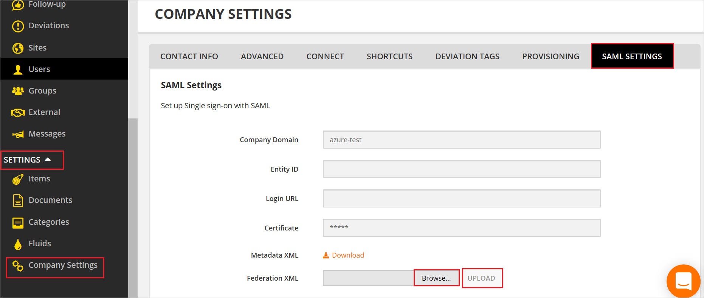
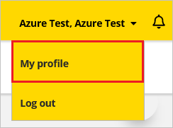
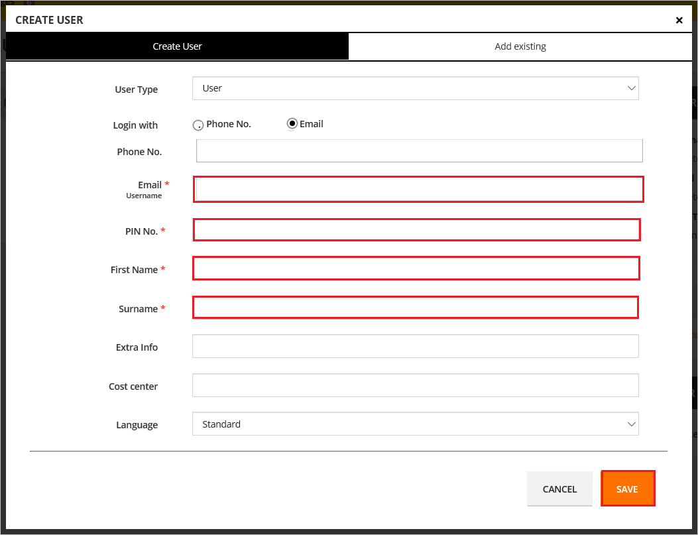

# Configure CheckProof for Single sign-on with Microsoft Entra ID

In this article,  you learn how to integrate CheckProof with Microsoft Entra ID. When you integrate CheckProof with Microsoft Entra ID, you can:

* Control in Microsoft Entra ID who has access to CheckProof.
* Enable your users to be automatically signed-in to CheckProof with their Microsoft Entra accounts.
* Manage your accounts in one central location.

## Prerequisites

The scenario outlined in this article assumes that you already have the following prerequisites:

[!INCLUDE [common-prerequisites.md](~/identity/saas-apps/includes/common-prerequisites.md)]
* CheckProof single sign-on (SSO) enabled subscription.

## Scenario description

In this article,  you configure and test Microsoft Entra SSO in a test environment.

* CheckProof supports **IDP** initiated SSO.
* CheckProof supports [Automated user provisioning](checkproof-provisioning-tutorial.md).

## Add CheckProof from the gallery

To configure the integration of CheckProof into Microsoft Entra ID, you need to add CheckProof from the gallery to your list of managed SaaS apps.

1. Sign in to the [Microsoft Entra admin center](https://entra.microsoft.com) as at least a [Cloud Application Administrator](~/identity/role-based-access-control/permissions-reference.md#cloud-application-administrator).
1. Browse to **Entra ID** > **Enterprise apps** > **New application**.
1. In the **Add from the gallery** section, type **CheckProof** in the search box.
1. Select **CheckProof** from results panel and then add the app. Wait a few seconds while the app is added to your tenant.

 [!INCLUDE [sso-wizard.md](~/identity/saas-apps/includes/sso-wizard.md)]

## Configure and test Microsoft Entra SSO for CheckProof

Configure and test Microsoft Entra SSO with CheckProof using a test user called **B.Simon**. For SSO to work, you need to establish a link relationship between a Microsoft Entra user and the related user in CheckProof.

To configure and test Microsoft Entra SSO with CheckProof, perform the following steps:

1. **[Configure Microsoft Entra SSO](#configure-azure-ad-sso)** - to enable your users to use this feature.
    1. **Create a Microsoft Entra test user** - to test Microsoft Entra single sign-on with B.Simon.
    1. **Assign the Microsoft Entra test user** - to enable B.Simon to use Microsoft Entra single sign-on.
1. **[Configure CheckProof SSO](#configure-checkproof-sso)** - to configure the single sign-on settings on application side.
    1. **[Create CheckProof test user](#create-checkproof-test-user)** - to have a counterpart of B.Simon in CheckProof that's linked to the Microsoft Entra representation of user.
1. **[Test SSO](#test-sso)** - to verify whether the configuration works.

## Configure Microsoft Entra SSO

Follow these steps to enable Microsoft Entra SSO.

1. Sign in to the [Microsoft Entra admin center](https://entra.microsoft.com) as at least a [Cloud Application Administrator](~/identity/role-based-access-control/permissions-reference.md#cloud-application-administrator).
1. Browse to **Entra ID** > **Enterprise apps** > **CheckProof** > **Single sign-on**.
1. On the **Select a single sign-on method** page, select **SAML**.
1. On the **Set up single sign-on with SAML** page, select the pencil icon for **Basic SAML Configuration** to edit the settings.

   

1. On the **Set up single sign-on with SAML** page, perform the following steps:

    a. In the **Identifier** text box, type a URL using the following pattern:
    `https://api.checkproof.com/api/v1/saml/<ID>/metadata`

    b. In the **Reply URL** text box, type a URL using the following pattern:
    `https://api.checkproof.com/api/v1/saml/<ID>/acs`

	> [!NOTE]
	> These values aren't real. Update these values with the actual Identifier and Reply URL. Contact [CheckProof Client support team](mailto:support@checkproof.com) to get these values. You can also refer to the patterns shown in the **Basic SAML Configuration** section.

1. On the **Set up single sign-on with SAML** page, in the **SAML Signing Certificate** section,  find **Federation Metadata XML** and select **Download** to download the certificate and save it on your computer.

	

1. On the **Set up CheckProof** section, copy the appropriate URL(s) based on your requirement.

	

[!INCLUDE [create-assign-users-sso.md](~/identity/saas-apps/includes/create-assign-users-sso.md)]

## Configure CheckProof SSO

1. In a different web browser window, sign into CheckProof website as an administrator.

1. Go to the **Settings > Company Settings > SAML SETTINGS** page and Upload the **Federation Metadata XML** in **Federation XML** textbox.

    

### Create CheckProof test user

1. In a different web browser window, sign into CheckProof website as an administrator.

1. Select **Profile** and select **My profile**.

    

1. Select **CREATE USER**.

1. In the **CREATE USER** page, fill the required fields and select **SAVE**.

    

> [!NOTE]
>CheckProof also supports automatic user provisioning, you can find more details [here](./checkproof-provisioning-tutorial.md) on how to configure automatic user provisioning.

## Test SSO 

In this section, you test your Microsoft Entra single sign-on configuration with following options.

* Select **Test this application**, and you should be automatically signed in to the CheckProof for which you set up the SSO.

* You can use Microsoft My Apps. When you select the CheckProof tile in the My Apps, you should be automatically signed in to the CheckProof for which you set up the SSO. For more information about the My Apps, see [Introduction to the My Apps](https://support.microsoft.com/account-billing/sign-in-and-start-apps-from-the-my-apps-portal-2f3b1bae-0e5a-4a86-a33e-876fbd2a4510).

## Related content

Once you configure CheckProof you can enforce session control, which protects exfiltration and infiltration of your organization’s sensitive data in real time. Session control extends from Conditional Access. [Learn how to enforce session control with Microsoft Defender for Cloud Apps](/cloud-app-security/proxy-deployment-aad).
