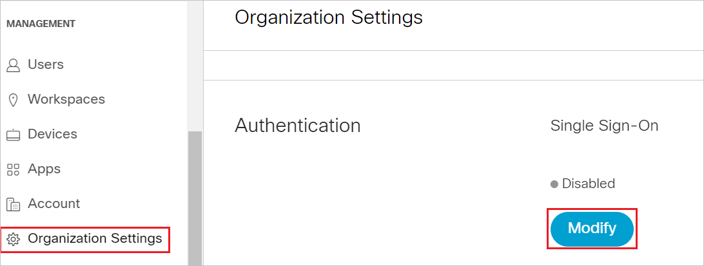
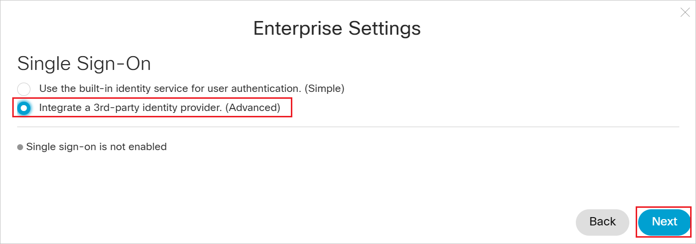
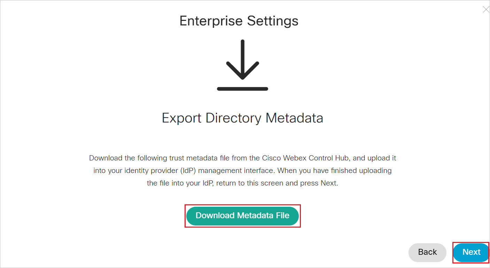
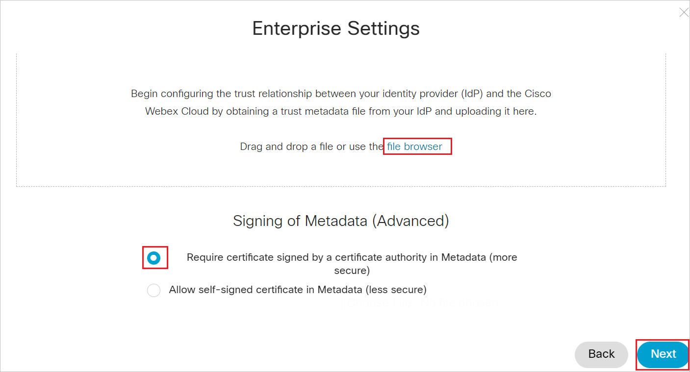
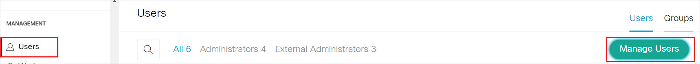
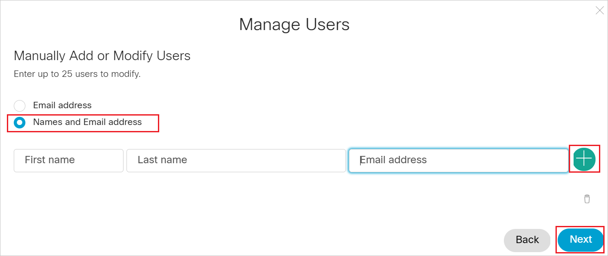

# Configure Cisco Webex for Single sign-on with Microsoft Entra ID

In this article,  you learn how to integrate Cisco Webex with Microsoft Entra ID. When you integrate Cisco Webex with Microsoft Entra ID, you can:

* Control in Microsoft Entra ID who has access to Cisco Webex.
* Enable your users to be automatically signed-in to Cisco Webex with their Microsoft Entra accounts.
* Manage your accounts in one central location.

## Prerequisites

The scenario outlined in this article assumes that you already have the following prerequisites:

[!INCLUDE [common-prerequisites.md](~/identity/saas-apps/includes/common-prerequisites.md)]
* Cisco Webex single sign-on (SSO) enabled subscription.
*  Service Provider Metadata file from Cisco Webex.

## Scenario description

In this article,  you configure and test Microsoft Entra SSO in a test environment.

* Cisco Webex supports **SP** initiated SSO.
* Cisco Webex supports [**Automated user provisioning**](./cisco-webex-provisioning-tutorial.md).

> [!NOTE]
> Identifier of this application is a fixed string value so only one instance can be configured in one tenant.

## Adding Cisco Webex from the gallery

To configure the integration of Cisco Webex into Microsoft Entra ID, you need to add Cisco Webex from the gallery to your list of managed SaaS apps.

1. Sign in to the [Microsoft Entra admin center](https://entra.microsoft.com) as at least a [Cloud Application Administrator](~/identity/role-based-access-control/permissions-reference.md#cloud-application-administrator).
1. Browse to **Entra ID** > **Enterprise apps** > **New application**.
1. In the **Add from the gallery** section, type **Cisco Webex** in the search box.
1. Select **Cisco Webex** from results panel and then add the app. Wait a few seconds while the app is added to your tenant.

 [!INCLUDE [sso-wizard.md](~/identity/saas-apps/includes/sso-wizard.md)]

## Configure and test Microsoft Entra SSO for Cisco Webex

Configure and test Microsoft Entra SSO with Cisco Webex using a test user called **B.Simon**. For SSO to work, you need to establish a link relationship between a Microsoft Entra user and the related user in Cisco Webex.

To configure and test Microsoft Entra SSO with Cisco Webex, perform the following steps:

1. **[Configure Microsoft Entra SSO](#configure-azure-ad-sso)** to enable your users to use this feature.
	1. **Create a Microsoft Entra test user** to test Microsoft Entra single sign-on with B.Simon.
	1. **Assign the Microsoft Entra test user** to enable B.Simon to use Microsoft Entra single sign-on.
2. **[Configure Cisco Webex SSO](#configure-cisco-webex-sso)** to configure the SSO settings on application side.
	1. **[Create Cisco Webex test user](#create-cisco-webex-test-user)** to have a counterpart of B.Simon in Cisco Webex that's linked to the Microsoft Entra representation of user.
3. **[Test SSO](#test-sso)** to verify whether the configuration works.

## Configure Microsoft Entra SSO

Follow these steps to enable Microsoft Entra SSO.

1. Sign in to the [Microsoft Entra admin center](https://entra.microsoft.com) as at least a [Cloud Application Administrator](~/identity/role-based-access-control/permissions-reference.md#cloud-application-administrator).
1. Browse to **Entra ID** > **Enterprise apps** > **Cisco Webex** application integration page, find the **Manage** section and select **Single sign-on**.
1. On the **Select a Single sign-on method** page, select **SAML**.
1. On the **Set up Single Sign-On with SAML** page, select the pencil icon for **Basic SAML Configuration** to edit the settings.

   

1. On the **Basic SAML Configuration** section, upload the downloaded **Service Provider metadata** file and configure the application by performing the following steps:

	>[!Note]
	>You get the Service Provider Metadata file from the **Configure Cisco Webex** section, which is explained later in the article. 

	a. Select **Upload metadata file**.

	b. Select **folder logo** to select the metadata file and select **Upload**.

	c. After successful completion of uploading Service Provider metadata file the **Identifier** and **Reply URL** values get auto populated in **Basic SAML Configuration** section:

	d. In the **Sign on URL** textbox, type a URL using the following pattern:
	`https://web.ciscospark.com/idb/Consumer/metaAlias/<ID>/sp`
	
	> [!NOTE]
	> This value isn't real. Copy the literal Reply URL value and add this value to the `https://web.ciscospark.com/` to formulate the actual Sign on URL value.

1. Cisco Webex application expects the SAML assertions in a specific format, which requires you to add custom attribute mappings to your SAML token attributes configuration. The following screenshot shows the list of default attributes.

	

1. In addition to above, Cisco Webex application expects few more attributes to be passed back in SAML response which are shown below. These attributes are also pre populated but you can review them as per your requirements.
  
	| Name |  Source Attribute|
	| ---------------|--------- |
	| uid | user.userprincipalname |

	> [!NOTE]
	>  The source attribute value is by default mapped to userprincipalname. This can be changed to user.mail or user.onpremiseuserprincipalname or any other value as per the setting in Webex.

1. On the **Set up Single Sign-On with SAML** page, in the **SAML Signing Certificate** section, find **Federation Metadata XML** and select **Download** to download the certificate and save it on your computer.

   

[!INCLUDE [create-assign-users-sso.md](~/identity/saas-apps/includes/create-assign-users-sso.md)]

## Configure Cisco Webex SSO

1. Sign in to Cisco Webex with your administrator credentials.

1. Select **Organization Settings** and under the **Authentication** section, select **Modify**.

    
  
1. Select **Integrate a 3rd-party identity provider. (Advanced)** and select **Next**.

	

1. Select **Download Metadata File** to download the **Service Provider Metadata file** and save it in your computer, select **Next**.

	

1. Select **file browser** option to locate and upload the Microsoft Entra metadata file. Then, select **Require certificate signed by a certificate authority in Metadata (more secure)** and select **Next**.

	

1. Select **Test SSO Connection**, and when a new browser tab opens, authenticate with Microsoft Entra ID by signing in.

1. Return to the **Cisco Cloud Collaboration Management** browser tab. If the test was successful, select **This test was successful. Enable Single Sign-On option** and select **Next**.

1. Select **Save**.

> [!NOTE]
> To know more about how to configure the Cisco Webex, please refer to [this](https://help.webex.com/WBX000022701/How-Do-I-Configure-Microsoft-Azure-Active-Directory-Integration-with-Cisco-Webex-Through-Site-Administration#:~:text=In%20the%20Azure%20portal%2C%20select,in%20the%20Add%20Assignment%20dialog) page.

### Create Cisco Webex test user

In this section, a user called B.Simon is created in Cisco Webex.This application supports automatic user provisioning, which enables automatic provisioning and deprovisioning based on your business rules.  Microsoft recommends using automatic provisioning whenever possible. See how to enable auto provisioning for [Cisco Webex](./cisco-webex-provisioning-tutorial.md).

If you need to create a user manually, perform the following steps:

1. Sign in to Cisco Webex with your administrator credentials.

2. Select **Users** and then **Manage Users**.
   
     

3. In the **Manage Users** window, select **Manually Add or Modify Users**.

4. Select **Names and Email address**. Then, fill out the textbox as follows:

     

	a. In the **First Name** textbox, type first name of user like **B**.

	b. In the **Last Name** textbox, type last name of user like **Simon**.

	c. In the **Email address** textbox, type email address of user like b.simon@contoso.com.

5. Select the plus sign to add B.Simon. Then, select **Next**.

6. In the **Add Services for Users** window, select **Add Users** and then **Finish**.

## Test SSO

In this section, you test your Microsoft Entra single sign-on configuration with following options. 

* Select **Test this application**, this option redirects to Cisco Webex Sign-on URL where you can initiate the login flow. 

* Go to Cisco Webex Sign-on URL directly and initiate the login flow from there.

* You can use Microsoft My Apps. When you select the Cisco Webex tile in the My Apps, this option redirects to Cisco Webex Sign-on URL. For more information about the My Apps, see [Introduction to the My Apps](https://support.microsoft.com/account-billing/sign-in-and-start-apps-from-the-my-apps-portal-2f3b1bae-0e5a-4a86-a33e-876fbd2a4510).

## Related content

Once you configure Cisco Webex you can enforce Session Control, which protects exfiltration and infiltration of your organization’s sensitive data in real time. Session Control extends from Conditional Access. [Learn how to enforce session control with Microsoft Defender for Cloud Apps](/cloud-app-security/proxy-deployment-aad).
