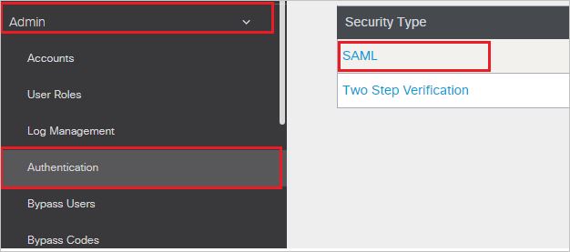
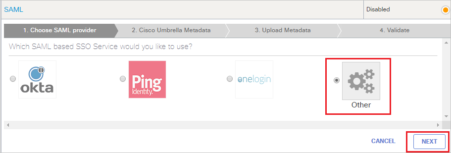
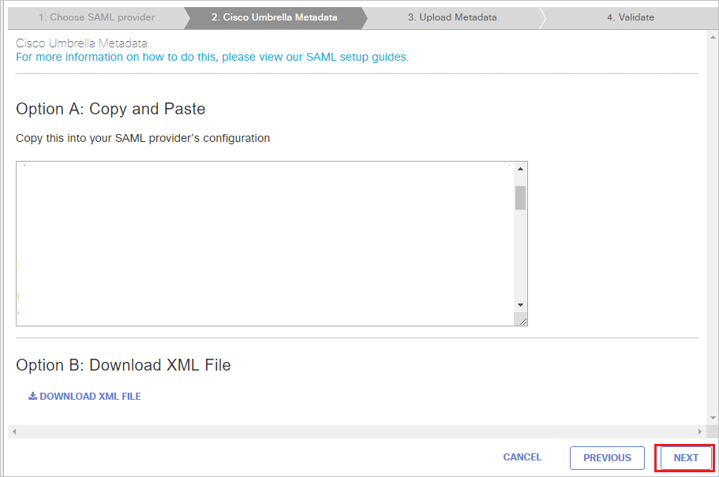
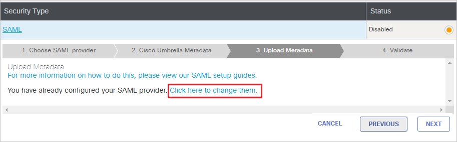
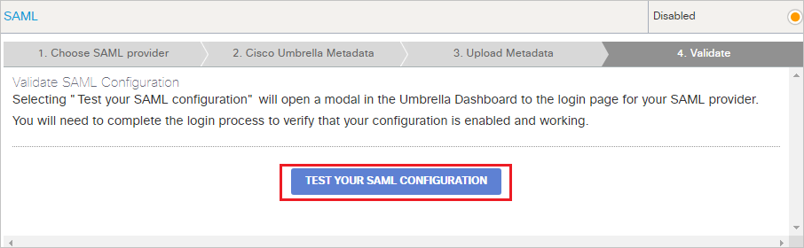
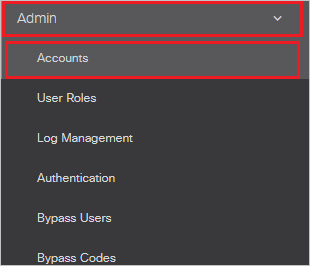
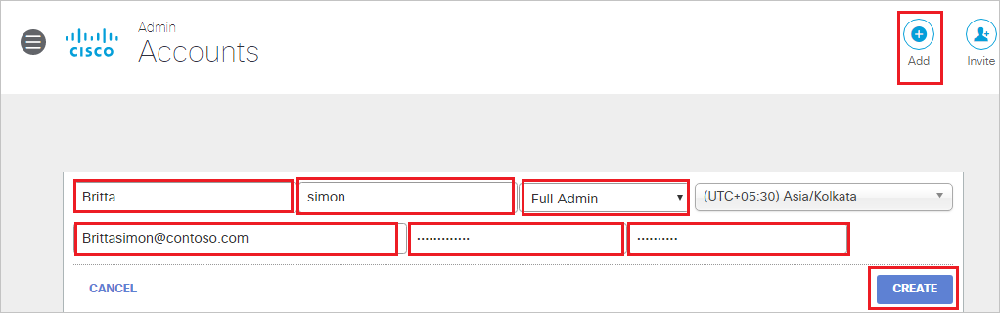

# Configure Cisco Umbrella Admin SSO for Single sign-on with Microsoft Entra ID

In this article,  you learn how to integrate Cisco Umbrella Admin SSO with Microsoft Entra ID. When you integrate Cisco Umbrella Admin SSO with Microsoft Entra ID, you can:

* Control in Microsoft Entra ID who has access to Cisco Umbrella Admin SSO.
* Enable your users to be automatically signed-in to Cisco Umbrella Admin SSO with their Microsoft Entra accounts.
* Manage your accounts in one central location.

## Prerequisites

The scenario outlined in this article assumes that you already have the following prerequisites:

[!INCLUDE [common-prerequisites.md](~/identity/saas-apps/includes/common-prerequisites.md)]
* Cisco Umbrella Admin SSO single sign-on (SSO) enabled subscription.

> [!NOTE]
> This integration is also available to use from Microsoft Entra US Government Cloud environment. You can find this application in the Microsoft Entra US Government Cloud Application Gallery and configure it in the same way as you do from public cloud.

## Scenario description

In this article,  you configure and test Microsoft Entra single sign-on in a test environment.

* Cisco Umbrella Admin SSO supports **SP and IDP** initiated SSO.

## Add Cisco Umbrella Admin SSO from the gallery

To configure the integration of Cisco Umbrella Admin SSO into Microsoft Entra ID, you need to add Cisco Umbrella Admin SSO from the gallery to your list of managed SaaS apps.

1. Sign in to the [Microsoft Entra admin center](https://entra.microsoft.com) as at least a [Cloud Application Administrator](~/identity/role-based-access-control/permissions-reference.md#cloud-application-administrator).
1. Browse to **Entra ID** > **Enterprise apps** > **New application**.
1. In the **Add from the gallery** section, type **Cisco Umbrella Admin SSO** in the search box.
1. Select **Cisco Umbrella Admin SSO** from results panel and then add the app. Wait a few seconds while the app is added to your tenant.

 [!INCLUDE [sso-wizard.md](~/identity/saas-apps/includes/sso-wizard.md)]

## Configure and test Microsoft Entra SSO for Cisco Umbrella Admin SSO

Configure and test Microsoft Entra SSO with Cisco Umbrella Admin SSO using a test user called **B.Simon**. For SSO to work, you need to establish a link relationship between a Microsoft Entra user and the related user in Cisco Umbrella Admin SSO.

To configure and test Microsoft Entra SSO with Cisco Umbrella Admin SSO, perform the following steps:

1. **[Configure Microsoft Entra SSO](#configure-azure-ad-sso)** - to enable your users to use this feature.
    1. **Create a Microsoft Entra test user** - to test Microsoft Entra single sign-on with B.Simon.
    1. **Assign the Microsoft Entra test user** - to enable B.Simon to use Microsoft Entra single sign-on.
1. **[Configure Cisco Umbrella Admin SSO SSO](#configure-cisco-umbrella-admin-sso-sso)** - to configure the single sign-on settings on application side.
    1. **[Create Cisco Umbrella Admin SSO test user](#create-cisco-umbrella-admin-sso-test-user)** - to have a counterpart of B.Simon in Cisco Umbrella Admin SSO that's linked to the Microsoft Entra representation of user.
1. **[Test SSO](#test-sso)** - to verify whether the configuration works.

## Configure Microsoft Entra SSO

Follow these steps to enable Microsoft Entra SSO.

1. Sign in to the [Microsoft Entra admin center](https://entra.microsoft.com) as at least a [Cloud Application Administrator](~/identity/role-based-access-control/permissions-reference.md#cloud-application-administrator).
1. Browse to **Entra ID** > **Enterprise apps** > **Cisco Umbrella Admin SSO** > **Single sign-on**.
1. On the **Select a single sign-on method** page, select **SAML**.
1. On the **Set up single sign-on with SAML** page, select the pencil icon for **Basic SAML Configuration** to edit the settings.

    

1. On the **Basic SAML Configuration** section, the user doesn't have to perform any step as the app is already pre-integrated with Azure.

    a. If you wish to configure the application in **SP** initiated mode, perform the following steps:

    b. Select **Set additional URLs**.

    c. In the **Sign-on URL** textbox, type the URL: `https://login.umbrella.com/sso`

1. On the **Set up Single Sign-On with SAML** page, in the **SAML Signing Certificate** section, select **Download** to download the **Metadata XML** from the given options as per your requirement and save it on your computer.

    

6. On the **Set up Cisco Umbrella Admin SSO** section, copy the appropriate URL(s) as per your requirement.

    

[!INCLUDE [create-assign-users-sso.md](~/identity/saas-apps/includes/create-assign-users-sso.md)]

## Configure Cisco Umbrella Admin SSO SSO

1. In a different browser window, sign-on to your Cisco Umbrella Admin SSO company site as administrator.

2. From the left side of menu, select **Admin** and navigate to **Authentication** and then select **SAML**.

    

3. Choose **Other** and select **NEXT**.

    

4. On the **Cisco Umbrella Admin SSO Metadata**, page, select **NEXT**.

    

5. On the **Upload Metadata** tab, if you had pre-configured SAML, select **Select here to change them** option and follow the below steps.

    

6. In the **Option A: Upload XML file**,  upload the **Federation Metadata XML** file that you downloaded and after uploading metadata the below values get auto populated automatically then select **NEXT**.

    

7. Under **Validate SAML Configuration** section, select **TEST YOUR SAML CONFIGURATION**.

    

8. Select **SAVE**.

### Create Cisco Umbrella Admin SSO test user

To enable Microsoft Entra users to log in to Cisco Umbrella Admin SSO, they must be provisioned into Cisco Umbrella Admin SSO.  
In the case of Cisco Umbrella Admin SSO, provisioning is a manual task.

**To provision a user account, perform the following steps:**

1. In a different browser window, sign-on to your Cisco Umbrella Admin SSO company site as administrator.

2. From the left side of menu, select **Admin** and navigate to **Accounts**.

    

3. On the **Accounts** page, select **Add** on the top right side of the page and perform the following steps.

    

    a. In the **First Name** field, enter the firstname like **Britta**.

    b. In the **Last Name** field, enter the lastname like **simon**.

    c. From the **Choose Delegated Admin Role**, select your role.

    d. In the **Email Address** field, enter the emailaddress of user like **brittasimon\@contoso.com**.

    e. In the **Password** field, enter your password.

    f. In the **Confirm Password** field, re-enter your password.

    g. Select **CREATE**.

## Test SSO

In this section, you test your Microsoft Entra single sign-on configuration with following options. 

#### SP initiated:

* Select **Test this application**, this option redirects to Cisco Umbrella Admin SSO Sign on URL where you can initiate the login flow.  

* Go to Cisco Umbrella Admin SSO Sign-on URL directly and initiate the login flow from there.

#### IDP initiated:

* Select **Test this application**, and you should be automatically signed in to the Cisco Umbrella Admin SSO for which you set up the SSO. 

You can also use Microsoft My Apps to test the application in any mode. When you select the Cisco Umbrella Admin SSO tile in the My Apps, if configured in SP mode you would be redirected to the application sign on page for initiating the login flow and if configured in IDP mode, you should be automatically signed in to the Cisco Umbrella Admin SSO for which you set up the SSO. For more information about the My Apps, see [Introduction to the My Apps](https://support.microsoft.com/account-billing/sign-in-and-start-apps-from-the-my-apps-portal-2f3b1bae-0e5a-4a86-a33e-876fbd2a4510).

## Related content

Once you configure Cisco Umbrella Admin SSO you can enforce session control, which protects exfiltration and infiltration of your organization’s sensitive data in real time. Session control extends from Conditional Access. [Learn how to enforce session control with Microsoft Defender for Cloud Apps](/cloud-app-security/proxy-deployment-any-app).
