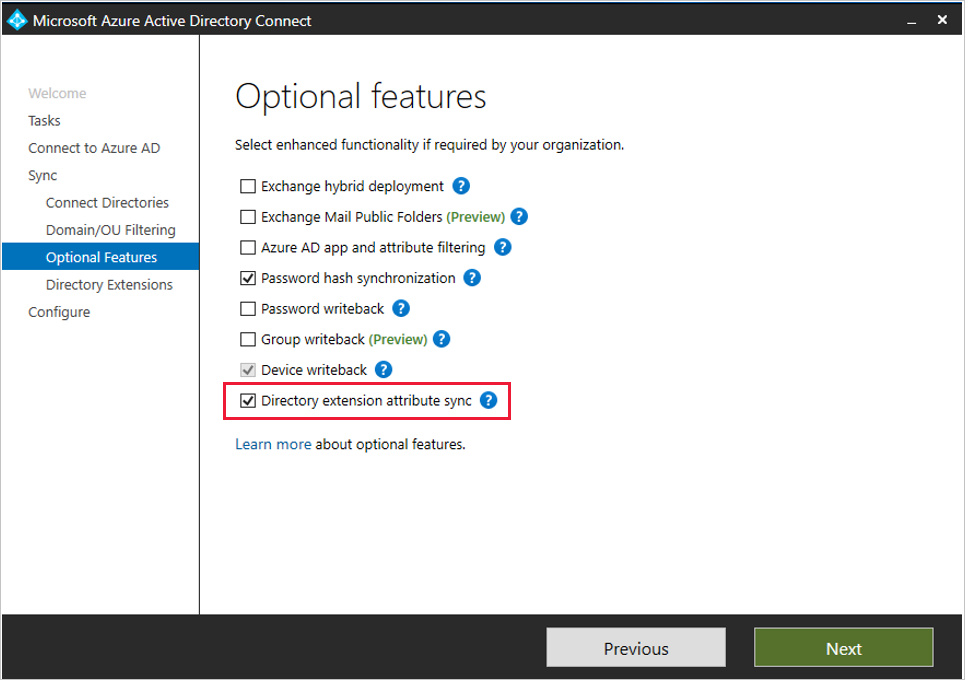
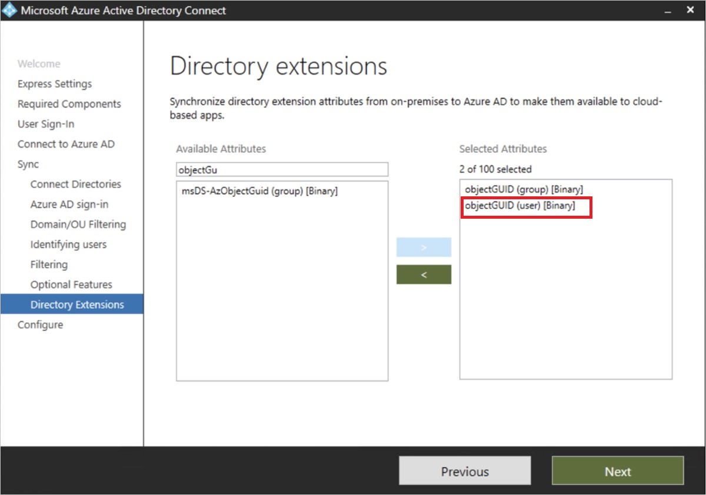
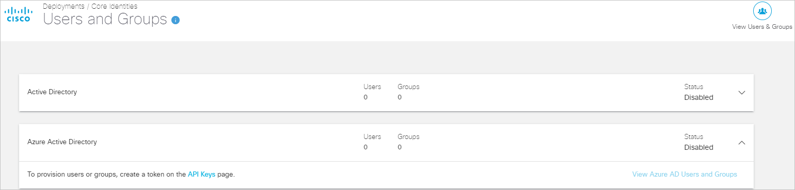
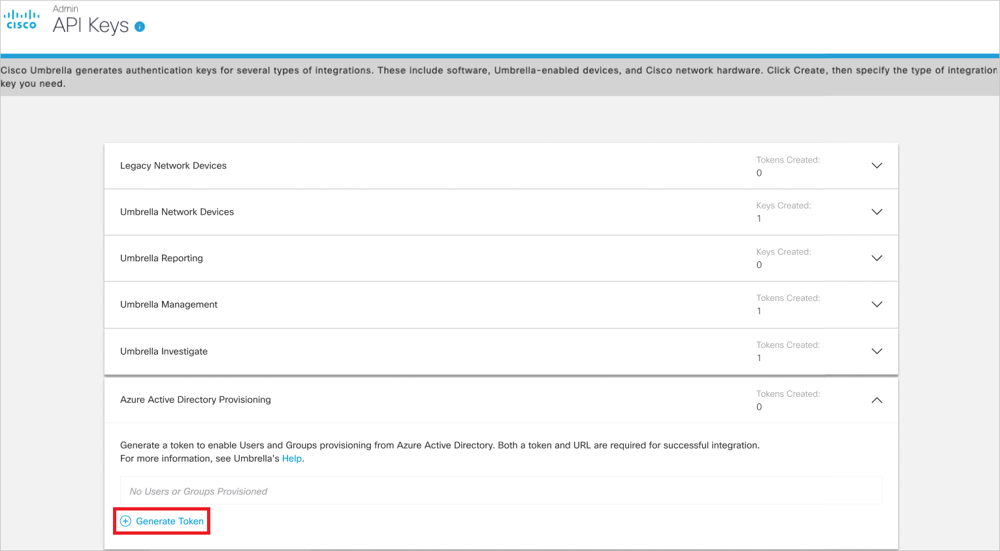

# Configure Cisco User Management for Secure Access for automatic user provisioning with Microsoft Entra ID

This article describes the steps you need to perform in both Cisco User Management for Secure Access and Microsoft Entra ID to configure automatic user provisioning. When configured, Microsoft Entra ID automatically provisions and de-provisions users and groups to [Cisco User Management for Secure Access](https://www.cisco.com) using the Microsoft Entra provisioning service. For important details on what this service does, how it works, and frequently asked questions, see [Automate user provisioning and deprovisioning to SaaS applications with Microsoft Entra ID](~/identity/app-provisioning/user-provisioning.md).

## Capabilities Supported
> [!div class="checklist"]
> * Create users in Cisco User Management for Secure Access
> * Remove users in Cisco User Management for Secure Access when they don't require access anymore
> * Keep user attributes synchronized between Microsoft Entra ID and Cisco User Management for Secure Access
> * Provision groups and group memberships in Cisco User Management for Secure Access

## Prerequisites

The scenario outlined in this article assumes that you already have the following prerequisites:

[!INCLUDE [common-prerequisites.md](~/identity/saas-apps/includes/common-prerequisites.md)].
* A [Cisco Umbrella subscription](https://signup.umbrella.com).
* A user account in Cisco Umbrella with full admin permissions.

## Step 1: Plan your provisioning deployment
1. Learn about [how the provisioning service works](~/identity/app-provisioning/user-provisioning.md).
1. Determine who's in [scope for provisioning](~/identity/app-provisioning/define-conditional-rules-for-provisioning-user-accounts.md).
1. Determine what data to [map between Microsoft Entra ID and Cisco User Management for Secure Access](~/identity/app-provisioning/customize-application-attributes.md).

## Step 2: Import ObjectGUID attribute via Microsoft Entra Connect (Optional)
If your endpoints are running AnyConnect or the Cisco Secure Client version 4.10 MR5 or earlier, you need to synchronize the ObjectGUID attribute for user identity attribution. You need to reconfigure any Umbrella policy on groups after importing groups from Microsoft Entra ID.

> [!NOTE]
> The on-premises Umbrella AD Connector should be turned off before importing the ObjectGUID attribute.

When using Microsoft Entra Connect, the ObjectGUID attribute of users isn't synchronized from on-premises AD to Microsoft Entra ID by default. To synchronize this attribute, enable the optional **Directory Extension attribute sync** and select the objectGUID attributes for users.

   

> [!NOTE]
> The search under **Available Attributes** is case sensitive.

   

> [!NOTE]
> This step isn't required if all your endpoints are running Cisco Secure Client or AnyConnect version 4.10 MR6 or higher.

## Step 3: Configure Cisco User Management for Secure Access to support provisioning with Microsoft Entra ID

1. Log in to [Cisco Umbrella dashboard](https://login.umbrella.com). Navigate to **Deployments** > **Core Identities** > **Users and Groups**.

1. Expand the Microsoft Entra card and select the **API Keys page**.

   

1. Expand the Microsoft Entra card on the API Keys page and select **Generate Token**.

   

1. The generated token is displayed only once. Copy and save the URL and the token. These values are entered in the **Tenant URL** and **Secret Token** fields respectively in the Provisioning tab of your Cisco User Management for Secure Access application.

## Step 4: Add Cisco User Management for Secure Access from the Microsoft Entra application gallery

Add Cisco User Management for Secure Access from the Microsoft Entra application gallery to start managing provisioning to Cisco User Management for Secure Access. Learn more about adding an application from the gallery [here](~/identity/enterprise-apps/add-application-portal.md).

## Step 5: Define who's in scope for provisioning

The Microsoft Entra provisioning service allows you to scope who's provisioned based on assignment to the application and or based on attributes of the user / group. If you choose to scope who's provisioned to your app based on assignment, you can use the following [steps](~/identity/enterprise-apps/assign-user-or-group-access-portal.md) to assign users and groups to the application. If you choose to scope who's provisioned based solely on attributes of the user or group, you can use a scoping filter as described [here](~/identity/app-provisioning/define-conditional-rules-for-provisioning-user-accounts.md).

* Start small. Test with a small set of users and groups before rolling out to everyone. When scope for provisioning is set to assigned users and groups, you can control this by assigning one or two users or groups to the app. When scope is set to all users and groups, you can specify an [attribute based scoping filter](~/identity/app-provisioning/define-conditional-rules-for-provisioning-user-accounts.md).

* If you need additional roles, you can [update the application manifest](~/identity-platform/howto-add-app-roles-in-apps.md) to add new roles.

## Step 6: Configure automatic user provisioning to Cisco User Management for Secure Access

This section guides you through the steps to configure the Microsoft Entra provisioning service to create, update, and disable users and/or groups in Cisco User Management for Secure Access based on user and/or group assignments in Microsoft Entra ID.

### To configure automatic user provisioning for Cisco User Management for Secure Access in Microsoft Entra ID:

1. Sign in to the [Microsoft Entra admin center](https://entra.microsoft.com) as at least a [Cloud Application Administrator](~/identity/role-based-access-control/permissions-reference.md#cloud-application-administrator).
1. Browse to **Entra ID** > **Enterprise apps**

	

1. In the applications list, select **Cisco User Management for Secure Access**.

	

1. Select the **Provisioning** tab.

	

1. Set the **Provisioning Mode** to **Automatic**.

	

1. Under the **Admin Credentials** section, input your Cisco User Management for Secure Access Tenant URL and Secret Token. Select **Test Connection** to ensure Microsoft Entra ID can connect to Cisco User Management for Secure Access. If the connection fails, ensure your Cisco User Management for Secure Access account has Admin permissions and try again.

 	

1. In the **Notification Email** field, enter the email address of a person or group who should receive the provisioning error notifications and select the **Send an email notification when a failure occurs** check box.

	

1. Select **Save**.

1. Under the **Mappings** section, select **Synchronize Microsoft Entra users to Cisco User Management for Secure Access**.

1. Review the user attributes that are synchronized from Microsoft Entra ID to Cisco User Management for Secure Access in the **Attribute-Mapping** section. The attributes selected as **Matching** properties are used to match the user accounts in Cisco User Management for Secure Access for update operations. If you choose to change the [matching target attribute](~/identity/app-provisioning/customize-application-attributes.md), you need to ensure that the Cisco User Management for Secure Access API supports filtering users based on that attribute. Select the **Save** button to commit any changes.

   |Attribute|Type|Supported for Filtering|
   |---|---|---|
   |userName|String|&check;|
   |externalId|String||
   |active|Boolean||
   |displayName|String||
   |name.givenName|String||
   |name.familyName|String||
   |name.formatted|String||
   |urn:ietf:params:scim:schemas:extension:ciscoumbrella:2.0:User:nativeObjectId|String||

> [!NOTE]
> If you have imported the objectGUID attribute for users via Microsoft Entra Connect (refer Step 2), add a mapping from objectGUID to urn:ietf:params:scim:schemas:extension:ciscoumbrella:2.0:User:nativeObjectId.

1. Under the **Mappings** section, select **Synchronize Microsoft Entra groups to Cisco User Management for Secure Access**.

1. Review the group attributes that are synchronized from Microsoft Entra ID to Cisco User Management for Secure Access in the **Attribute-Mapping** section. The attributes selected as **Matching** properties are used to match the groups in Cisco User Management for Secure Access for update operations. Select the **Save** button to commit any changes.

      |Attribute|Type|Supported for Filtering|
      |---|---|---|
      |displayName|String|&check;|
      |externalId|String||
      |members|Reference||

1. To configure scoping filters, refer to the following instructions provided in the [Scoping filter article](~/identity/app-provisioning/define-conditional-rules-for-provisioning-user-accounts.md).

1. To enable the Microsoft Entra provisioning service for Cisco User Management for Secure Access, change the **Provisioning Status** to **On** in the **Settings** section.

	

1. Define the users and/or groups that you would like to provision to Cisco User Management for Secure Access by choosing the desired values in **Scope** in the **Settings** section.

	

1. When you're ready to provision, select **Save**.

	

This operation starts the initial synchronization cycle of all users and groups defined in **Scope** in the **Settings** section. The initial cycle takes longer to perform than subsequent cycles, which occur approximately every 40 minutes as long as the Microsoft Entra provisioning service is running.

## Step 7: Monitor your deployment
Once you've configured provisioning, use the following resources to monitor your deployment:

* Use the [provisioning logs](~/identity/monitoring-health/concept-provisioning-logs.md) to determine which users have been provisioned successfully or unsuccessfully
* Check the [progress bar](~/identity/app-provisioning/application-provisioning-when-will-provisioning-finish-specific-user.md) to see the status of the provisioning cycle and how close it's to completion
* If the provisioning configuration seems to be in an unhealthy state, the application will go into quarantine. Learn more about quarantine states [here](~/identity/app-provisioning/application-provisioning-quarantine-status.md).

## Connector Limitations
* Cisco User Management for Secure Access supports provisioning a maximum of 200 groups. Any groups beyond this number that are in scope can't be provisioned to Cisco Umbrella.

## Additional resources

* [Managing user account provisioning for Enterprise Apps](~/identity/app-provisioning/configure-automatic-user-provisioning-portal.md)
* [What is application access and single sign-on with Microsoft Entra ID?](~/identity/enterprise-apps/what-is-single-sign-on.md)

## Related content

* [Learn how to review logs and get reports on provisioning activity](~/identity/app-provisioning/check-status-user-account-provisioning.md)
