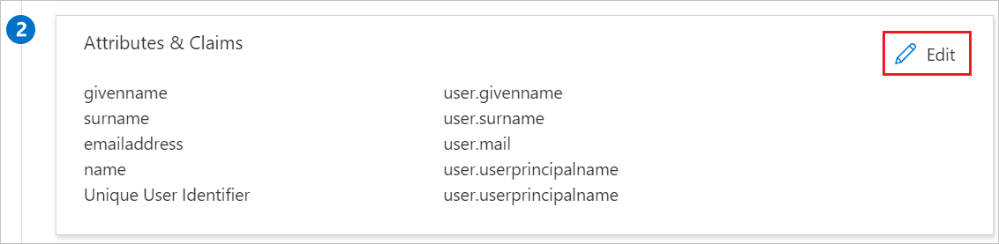
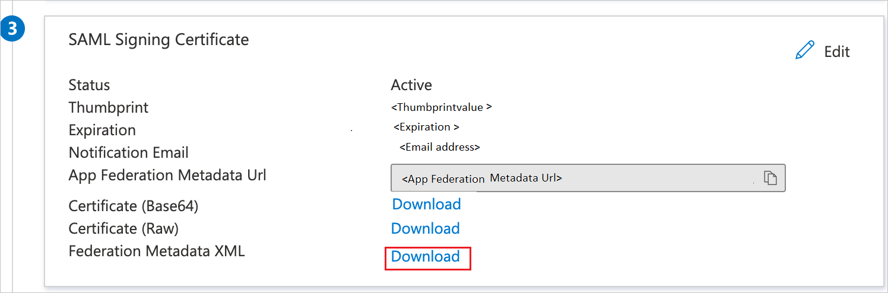
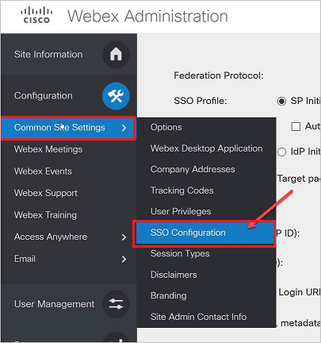
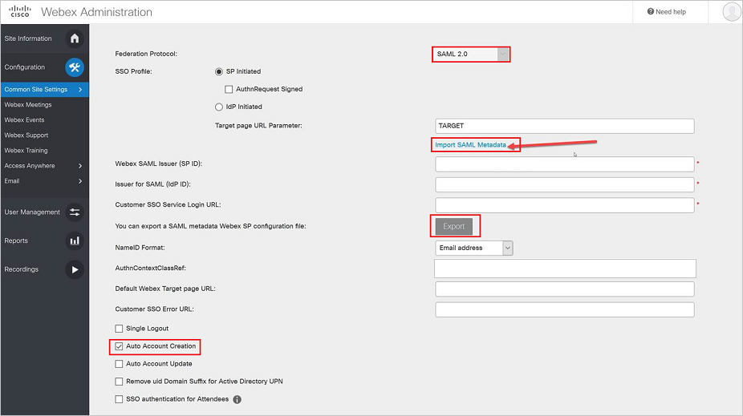

# Configure Cisco Webex Meetings for Single sign-on with Microsoft Entra ID

In this article,  you learn how to integrate Cisco Webex Meetings with Microsoft Entra ID. When you integrate Cisco Webex Meetings with Microsoft Entra ID, you can:

* Control in Microsoft Entra ID who has access to Cisco Webex Meetings.
* Enable your users to be automatically signed-in to Cisco Webex Meetings with their Microsoft Entra accounts.
* Manage your accounts in one central location.

## Prerequisites

To get started, you need the following items:

* A Microsoft Entra subscription. If you don't have a subscription, you can get a [free account](https://azure.microsoft.com/free/).
* Cisco Webex Meetings single sign-on (SSO) enabled subscription.
*  Service Provider Metadata file from Cisco Webex Meetings.
* Along with Cloud Application Administrator, Application Administrator can also add or manage applications in Microsoft Entra ID.
For more information, see [Azure built-in roles](~/identity/role-based-access-control/permissions-reference.md).

> [!NOTE]
> This integration is also available to use from Microsoft Entra US Government Cloud environment. You can find this application in the Microsoft Entra US Government Cloud Application Gallery and configure it in the same way as you do from public cloud.

## Scenario description

In this article,  you configure and test Microsoft Entra SSO in a test environment.

* Cisco Webex Meetings supports **SP and IDP** initiated SSO.
* Cisco Webex Meetings supports [**Automated** user provisioning and deprovisioning](cisco-webex-provisioning-tutorial.md) (recommended).
* Cisco Webex Meetings supports **Just In Time** user provisioning.

## Add Cisco Webex Meetings from the gallery

To configure the integration of Cisco Webex Meetings into Microsoft Entra ID, you need to add Cisco Webex Meetings from the gallery to your list of managed SaaS apps.

1. Sign in to the [Microsoft Entra admin center](https://entra.microsoft.com) as at least a [Cloud Application Administrator](~/identity/role-based-access-control/permissions-reference.md#cloud-application-administrator).
1. Browse to **Entra ID** > **Enterprise apps** > **New application**.
1. In the **Add from the gallery** section, type **Cisco Webex Meetings** in the search box.
1. Select **Cisco Webex Meetings** from results panel and then add the app. Wait a few seconds while the app is added to your tenant.

 [!INCLUDE [sso-wizard.md](~/identity/saas-apps/includes/sso-wizard.md)]

## Configure and test Microsoft Entra SSO for Cisco Webex Meetings

Configure and test Microsoft Entra SSO with Cisco Webex Meetings using a test user called **B.Simon**. For SSO to work, you need to establish a link relationship between a Microsoft Entra user and the related user in Cisco Webex Meetings.

To configure and test Microsoft Entra SSO with Cisco Webex Meetings, perform the following steps:

1. **[Configure Microsoft Entra SSO](#configure-azure-ad-sso)** - to enable your users to use this feature.
   1. **Create a Microsoft Entra test user** - to test Microsoft Entra single sign-on with B.Simon.
   1. **Assign the Microsoft Entra test user** - to enable B.Simon to use Microsoft Entra single sign-on.
1. **[Configure Cisco Webex Meetings SSO](#configure-cisco-webex-meetings-sso)** - to configure the single sign-on settings on application side.
   1. **[Create Cisco Webex Meetings test user](#create-cisco-webex-meetings-test-user)** - to have a counterpart of B.Simon in Cisco Webex Meetings that's linked to the Microsoft Entra representation of user.   
1. **[Test SSO](#test-sso)** - to verify whether the configuration works.

## Configure Microsoft Entra SSO

Follow these steps to enable Microsoft Entra SSO.

1. Sign in to the [Microsoft Entra admin center](https://entra.microsoft.com) as at least a [Cloud Application Administrator](~/identity/role-based-access-control/permissions-reference.md#cloud-application-administrator).
1. Browse to **Entra ID** > **Enterprise apps** > **Cisco Webex Meetings** > **Single sign-on**.
1. On the **Select a single sign-on method** page, select **SAML**.
1. On the **Set up Single Sign-On with SAML** page, you can configure the application in **IDP** initiated mode by uploading the **Service Provider metadata** file as follows:
   1. Select **Upload metadata file**.
   1. Select **folder logo** to select the metadata file and select **Upload**.
   1. After successful completion of uploading Service Provider metadata file the **Identifier** and **Reply URL** values get auto populated in **Basic SAML Configuration** section.
   
      > [!Note]
      > You get the Service Provider Metadata file from **Configure Cisco Webex Meetings SSO** section, which is explained later in the article. 

1. If you wish to configure the application in **SP** initiated mode, perform the following steps:	
   1. On the **Basic SAML Configuration** section, select the pencil icon.

      

   1. In the **Sign on URL** textbox, type the URL using the following pattern: `https://<customername>.my.webex.com`

1. Cisco Webex Meetings application expects the SAML assertions in a specific format, which requires you to add custom attribute mappings to your SAML token attributes configuration. The following screenshot shows the list of default attributes. Select **Edit** icon to open User Attributes dialog.

   

1. In addition to above, Cisco Webex Meetings application expects few more attributes to be passed back in SAML response. In the User Claims section on the User Attributes dialog, perform the following steps to add SAML token attribute as shown in the below table: 

   | Name | Source Attribute|
   | ---------------|  --------- |
   |   firstname    | user.givenname |
   |   lastname    | user.surname |
   |   email       | user.mail |
   |   uid    | user.mail |

   1. Select **Add new claim** to open the **Manage user claims** dialog.
   1. In the **Name** textbox, type the attribute name shown for that row.
   1. Leave the **Namespace** blank.
   1. Select Source as **Attribute**.
   1. From the **Source attribute** list, select the attribute value shown for that row from the drop-down list.
   1. Select **Save**.

1. On the **Set up single sign-on with SAML** page, in the **SAML Signing Certificate** section,  find **Federation Metadata XML** and select **Download** to download the certificate and save it on your computer.

   

1. On the **Set up Cisco Webex Meetings** section, copy the appropriate URL(s) based on your requirement.

   

[!INCLUDE [create-assign-users-sso.md](~/identity/saas-apps/includes/create-assign-users-sso.md)]

## Configure Cisco Webex Meetings SSO

1. Sign in to Cisco Webex Meetings with your administrator credentials.
1. Go to **Common Site Settings** and navigate to **SSO Configuration**.

   

1. On the **Webex Administration** page, perform the following steps:

   

   1. Select **SAML 2.0** as **Federation Protocol**.
   1. Select **Import SAML Metadata** link to upload the metadata file, which you have downloaded previously.
   1. Select **SSO Profile** as **IDP initiated**  and select **Export** button to download the Service Provider Metadata file and upload it in the **Basic SAML Configuration** section.
   1. Select **Auto Account Creation**.
   
      > [!NOTE]
      > For enabling **just-in-time** user provisioning you need to check the **Auto Account Creation**. In addition to that SAML token attributes need to be passed in the SAML response.

   1. Select **Save**.

      > [!NOTE]
      > This configuration is only for the customers that use Webex UserID in email format.
      > 
      > To learn more about how to configure the Cisco Webex meetings, see the [Webex documentation](https://help.webex.com/WBX000022701/How-Do-I-Configure-Microsoft-Azure-Active-Directory-Integration-with-Cisco-Webex-Through-Site-Administration#:~:text=In%20the%20Azure%20portal%2C%20select,in%20the%20Add%20Assignment%20dialog) page.

### Create Cisco Webex Meetings test user

The objective of this section is to create a user called B.Simon in Cisco Webex Meetings. Cisco Webex Meetings supports **just-in-time** provisioning, which is by default enabled. There's no action item for you in this section. If a user doesn't already exist in Cisco Webex Meetings, a new one is created when you attempt to access Cisco Webex Meetings.

## Test SSO 

In this section, you test your Microsoft Entra single sign-on configuration with following options. 

#### SP initiated

* Select **Test this application**, this option redirects to Cisco Webex Meetings Sign on URL where you can initiate the login flow.  

* Go to Cisco Webex Meetings Sign-on URL directly and initiate the login flow from there.

#### IDP initiated:

* Select **Test this application**, and you should be automatically signed in to the Cisco Webex Meetings for which you set up the SSO.

You can also use Microsoft My Apps to test the application in any mode. When you select the Cisco Webex Meetings tile in the My Apps, if configured in SP mode you would be redirected to the application sign on page for initiating the login flow and if configured in IDP mode, you should be automatically signed in to the Cisco Webex Meetings for which you set up the SSO. For more information about the My Apps, see [Introduction to the My Apps](https://support.microsoft.com/account-billing/sign-in-and-start-apps-from-the-my-apps-portal-2f3b1bae-0e5a-4a86-a33e-876fbd2a4510).

## Related content

Once you configure Cisco Webex Meetings you can enforce Session Control, which protects exfiltration and infiltration of your organization’s sensitive data in real time. Session Control extends from Conditional Access. [Learn how to enforce session control with Microsoft Defender for Cloud Apps](/cloud-app-security/proxy-deployment-aad).
