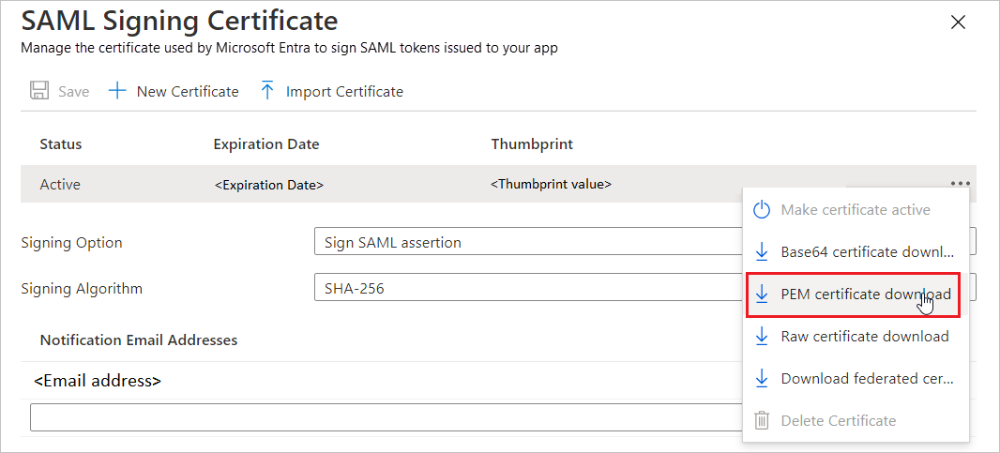
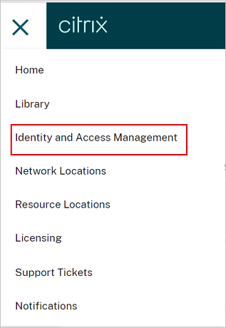
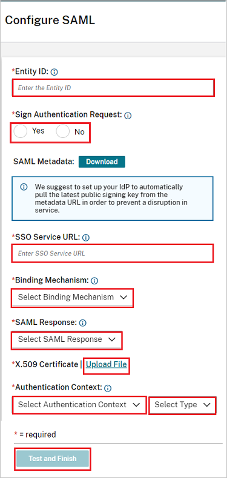

# Configure Citrix Cloud SAML SSO for Single sign-on with Microsoft Entra ID

In this article,  you learn how to integrate Citrix Cloud SAML SSO with Microsoft Entra ID. When you integrate Citrix Cloud SAML SSO with Microsoft Entra ID, you can:

* Control in Microsoft Entra ID who has access to Citrix Cloud SAML SSO.
* Enable your users to be automatically signed-in to Citrix Cloud SAML SSO with their Microsoft Entra accounts.
* Manage your accounts in one central location.

## Prerequisites

The scenario outlined in this article assumes that you already have the following prerequisites:

[!INCLUDE [common-prerequisites.md](~/identity/saas-apps/includes/common-prerequisites.md)]
* A Citrix Cloud subscription. If you don’t have a subscription, sign up for one. 

## Scenario description

In this article,  you configure and test Microsoft Entra SSO in a test environment.

* Citrix Cloud SAML SSO supports **SP** initiated SSO.

> [!NOTE]
> Identifier of this application is a fixed string value so only one instance can be configured in one tenant.

## Add Citrix Cloud SAML SSO from the gallery

To configure the integration of Citrix Cloud SAML SSO into Microsoft Entra ID, you need to add Citrix Cloud SAML SSO from the gallery to your list of managed SaaS apps.

1. Sign in to the [Microsoft Entra admin center](https://entra.microsoft.com) as at least a [Cloud Application Administrator](~/identity/role-based-access-control/permissions-reference.md#cloud-application-administrator).
1. Browse to **Entra ID** > **Enterprise apps** > **New application**.
1. In the **Add from the gallery** section, type **Citrix Cloud SAML SSO** in the search box.
1. Select **Citrix Cloud SAML SSO** from results panel and then add the app. Wait a few seconds while the app is added to your tenant.

 [!INCLUDE [sso-wizard.md](~/identity/saas-apps/includes/sso-wizard.md)]

## Configure and test Microsoft Entra SSO for Citrix Cloud SAML SSO

Configure and test Microsoft Entra SSO with Citrix Cloud SAML SSO using a test user called **B.Simon**. For SSO to work, you need to establish a link relationship between a Microsoft Entra user and the related user in Citrix Cloud SAML SSO. This user must also exist in your Active Directory that's synced with Microsoft Entra Connect to your Microsoft Entra subscription.

To configure and test Microsoft Entra SSO with Citrix Cloud SAML SSO, perform the following steps:

1. **[Configure Microsoft Entra SSO](#configure-azure-ad-sso)** - to enable your users to use this feature.
    1. **Create a Microsoft Entra test user** - to test Microsoft Entra single sign-on with B.Simon.
    1. **Assign the Microsoft Entra test user** - to enable B.Simon to use Microsoft Entra single sign-on.
1. **[Configure Citrix Cloud SAML SSO](#configure-citrix-cloud-saml-sso)** - to configure the single sign-on settings on application side.
1. **[Test SSO](#test-sso)** - to verify whether the configuration works.

## Configure Microsoft Entra SSO

Follow these steps to enable Microsoft Entra SSO.

1. Sign in to the [Microsoft Entra admin center](https://entra.microsoft.com) as at least a [Cloud Application Administrator](~/identity/role-based-access-control/permissions-reference.md#cloud-application-administrator).
1. Browse to **Entra ID** > **Enterprise apps** > **Citrix Cloud SAML SSO** > **Single sign-on**.
1. On the **Select a single sign-on method** page, select **SAML**.
1. On the **Set up single sign-on with SAML** page, select the pencil icon for **Basic SAML Configuration** to edit the settings.

   

1. On the **Basic SAML Configuration** section, perform the following step:

    In the **Sign-on URL** text box, type a URL using the following pattern:
    `https://<SUBDOMAIN>.cloud.com`

	> [!NOTE]
	> The value isn't real. Update the value with your Citrix Workspace URL. Access your Citrix Cloud account to get the value. You can also refer to the patterns shown in the **Basic SAML Configuration** section.

1. Citrix Cloud SAML SSO application expects the SAML assertions in a specific format, which requires you to add custom attribute mappings to your SAML token attributes configuration. The following screenshot shows the list of default attributes.

	

1. In addition to above, Citrix Cloud SAML SSO application expects few more attributes to be passed back in SAML response which are shown below. These attributes are also pre-populated but you can review them as per your requirements. The values passed in the SAML response should map to the Active Directory attributes of the user.
	
	| Name | Source Attribute |
	| -----|-----|
	| cip_sid | user.onpremisesecurityidentifier |
	| cip_upn | user.userprincipalname |
	| cip_oid | ObjectGUID (Extension Attribute) |
	| cip_email | user.mail |
	| displayName | user.displayname |

	> [!NOTE]
	> ObjectGUID must be configured manually according to your requirements.

1. On the **Set up single sign-on with SAML** page, in the **SAML Signing Certificate** section,  find **Certificate (PEM)** and select **Download** to download the certificate and save it on your computer.

	

1. On the **Set up Citrix Cloud SAML SSO** section, copy the appropriate URL(s) based on your requirement.

	

[!INCLUDE [create-assign-users-sso.md](~/identity/saas-apps/includes/create-assign-users-sso.md)]

## Configure Citrix Cloud SAML SSO

1. In a different web browser window, sign in to your up Citrix Cloud SAML SSO company site as an administrator

1. Navigate to the Citrix Cloud menu and select **Identity and Access Management**.

	 

1. Under **Authentication**, locate **SAML 2.0** and select **Connect** from the ellipsis menu.

1. In the **Configure SAML** page, perform the following steps.

	

	a. In the **Entity ID** textbox, paste the **Microsoft Entra Identifier** value which you copied previously.

	b. In the **Sign Authentication Request**, select **Yes**, if you want to use `SAML Request signing`, else select **No**.

	c. In the **SSO Service URL** textbox, paste the **Login URL** value which you copied previously.

	d. Select **Binding Mechanism** from the drop-down, you can select either **HTTP-POST** or **HTTP-Redirect** binding.

	e. Under **SAML Response**, select **Sign Either Response or Assertion** from the dropdown.

	f. Upload the **Certificate (PEM)** into the **X.509 Certificate** section.

	g. In the **Authentication Context**, select **Unspecified** and **Exact**  from the dropdown.

	h. Select **Test and Finish**.

## Test SSO 

In this section, you test your Microsoft Entra single sign-on configuration with following options. 

* Access your Citrix Workspace URL directly and initiate the login flow from there.

* Log in with your AD-Synced Active Directory user into your Citrix Workspace to complete the test.

## Related content

Once you configure Citrix Cloud SAML SSO you can enforce session control, which protects exfiltration and infiltration of your organization’s sensitive data in real time. Session control extends from Conditional Access. [Learn how to enforce session control with Microsoft Defender for Cloud Apps](/cloud-app-security/proxy-deployment-aad).
