# Configure Citrix ADC SAML Connector for Microsoft Entra ID (Kerberos-based authentication) for Single sign-on with Microsoft Entra ID

In this article,  you learn how to integrate Citrix ADC SAML Connector for Microsoft Entra ID with Microsoft Entra ID. When you integrate Citrix ADC SAML Connector for Microsoft Entra ID with Microsoft Entra ID, you can:

* Control in Microsoft Entra ID who has access to Citrix ADC SAML Connector for Microsoft Entra ID.
* Enable your users to be automatically signed in to Citrix ADC SAML Connector for Microsoft Entra ID with their Microsoft Entra accounts.
* Manage your accounts in one central location.

## Prerequisites

The scenario outlined in this article assumes that you already have the following prerequisites:

[!INCLUDE [common-prerequisites.md](~/identity/saas-apps/includes/common-prerequisites.md)]
* Citrix ADC SAML Connector for Microsoft Entra single sign-on (SSO) enabled subscription.

## Scenario description

In this article,  you configure and test Microsoft Entra SSO in a test environment. The article includes these scenarios:

* **SP-initiated** SSO for Citrix ADC SAML Connector for Microsoft Entra ID.

* **Just in time** user provisioning for Citrix ADC SAML Connector for Microsoft Entra ID.

* [Kerberos-based authentication for Citrix ADC SAML Connector for Microsoft Entra ID](#publish-the-web-server).

* [Header-based authentication for Citrix ADC SAML Connector for Microsoft Entra ID](header-citrix-netscaler-tutorial.md#publish-the-web-server).

## Add Citrix ADC SAML Connector for Microsoft Entra ID from the gallery

To integrate Citrix ADC SAML Connector for Microsoft Entra ID with Microsoft Entra ID, first add Citrix ADC SAML Connector for Microsoft Entra ID to your list of managed SaaS apps from the gallery:

1. Sign in to the [Microsoft Entra admin center](https://entra.microsoft.com) as at least a [Cloud Application Administrator](~/identity/role-based-access-control/permissions-reference.md#cloud-application-administrator).
1. Browse to **Entra ID** > **Enterprise apps** > **New application**.

1. In the **Add from the gallery** section, enter **Citrix ADC SAML Connector for Microsoft Entra ID** in the search box.

1. In the results, select **Citrix ADC SAML Connector for Microsoft Entra ID**, and then add the app. Wait a few seconds while the app is added to your tenant.

 [!INCLUDE [sso-wizard.md](~/identity/saas-apps/includes/sso-wizard.md)]

## Configure and test Microsoft Entra SSO for Citrix ADC SAML Connector for Microsoft Entra ID

Configure and test Microsoft Entra SSO with Citrix ADC SAML Connector for Microsoft Entra ID by using a test user called **B.Simon**. For SSO to work, you need to establish a link relationship between a Microsoft Entra user and the related user in Citrix ADC SAML Connector for Microsoft Entra ID.

To configure and test Microsoft Entra SSO with Citrix ADC SAML Connector for Microsoft Entra ID, perform the following steps:

1. [Configure Microsoft Entra SSO](#configure-azure-ad-sso) - to enable your users to use this feature.

    1. Create a Microsoft Entra test user - to test Microsoft Entra SSO with B.Simon.

    1. Assign the Microsoft Entra test user - to enable B.Simon to use Microsoft Entra SSO.

1. [Configure Citrix ADC SAML Connector for Microsoft Entra SSO](#configure-citrix-adc-saml-connector-for-azure-ad-sso) - to configure the SSO settings on the application side.

    1. [Create Citrix ADC SAML Connector for Microsoft Entra test user](#create-citrix-adc-saml-connector-for-azure-ad-test-user) - to have a counterpart of B.Simon in Citrix ADC SAML Connector for Microsoft Entra ID that's linked to the Microsoft Entra representation of the user.

1. [Test SSO](#test-sso) - to verify whether the configuration works.

## Configure Microsoft Entra SSO

To enable Microsoft Entra SSO by using the Azure portal, complete these steps:

1. Sign in to the [Microsoft Entra admin center](https://entra.microsoft.com) as at least a [Cloud Application Administrator](~/identity/role-based-access-control/permissions-reference.md#cloud-application-administrator).
1. Browse to **Entra ID** > **Enterprise apps** > **Citrix ADC SAML Connector for Microsoft Entra ID** application integration pane, under **Manage**, select **Single sign-on**.

1. On the **Select a single sign-on method** pane, select **SAML**.

1. On the **Set up Single Sign-On with SAML** pane, select the pencil icon for **Basic SAML Configuration** to edit the settings.

   

1. In the **Basic SAML Configuration** section, to configure the application in **IDP-initiated** mode, perform the following steps:

    1. In the **Identifier** text box, enter a URL that has the following pattern:
    `https://<YOUR_FQDN>`

    1. In the **Reply URL** text box, enter a URL that has the following pattern:
    `http(s)://<YOUR_FQDN>.of.vserver/cgi/samlauth`

1. To configure the application in **SP-initiated** mode, select **Set additional URLs** and perform the following step:

    * In the **Sign-on URL** text box, enter a URL that has the following pattern:
    `https://<YOUR_FQDN>/CitrixAuthService/AuthService.asmx`

	> [!NOTE]
	> * The URLs that are used in this section aren't real values. Update these values with the actual values for Identifier, Reply URL, and Sign-on URL. Contact the [Citrix ADC SAML Connector for Microsoft Entra client support team](https://www.citrix.com/contact/technical-support.html) to get these values. You can also refer to the patterns shown in the **Basic SAML Configuration** section.
    > * To set up SSO, the URLs must be accessible from public websites. You must enable the firewall or other security settings on the Citrix ADC SAML Connector for Microsoft Entra ID side to enable Microsoft Entra ID to post the token at the configured URL.

1. On the **Set up Single Sign-On with SAML** pane, in the **SAML Signing Certificate** section, for **App Federation Metadata Url**, copy the URL and save it in Notepad.

	

1. In the **Set up Citrix ADC SAML Connector for Microsoft Entra ID** section, copy the relevant URLs based on your requirements.

	

[!INCLUDE [create-assign-users-sso.md](~/identity/saas-apps/includes/create-assign-users-sso.md)]

## Configure Citrix ADC SAML Connector for Microsoft Entra SSO

Select a link for steps for the kind of authentication you want to configure:

- [Configure Citrix ADC SAML Connector for Microsoft Entra SSO for Kerberos-based authentication](#publish-the-web-server)

- [Configure Citrix ADC SAML Connector for Microsoft Entra SSO for header-based authentication](header-citrix-netscaler-tutorial.md#publish-the-web-server)

### Publish the web server 

To create a virtual server:

1. Select **Traffic Management** > **Load Balancing** > **Services**.
    
1. Select **Add**.

    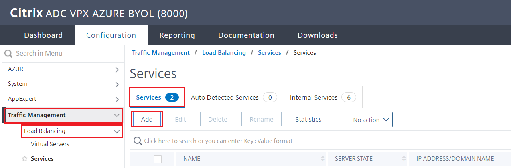

1. Set the following values for the web server that's running the applications:

   * **Service Name**
   * **Server IP/ Existing Server**
   * **Protocol**
   * **Port**

### Configure the load balancer

To configure the load balancer:

1. Go to **Traffic Management** > **Load Balancing** > **Virtual Servers**.

1. Select **Add**.

1. Set the following values as described in the following screenshot:

    * **Name**
    * **Protocol**
    * **IP Address**
    * **Port**

1. Select **OK**.

    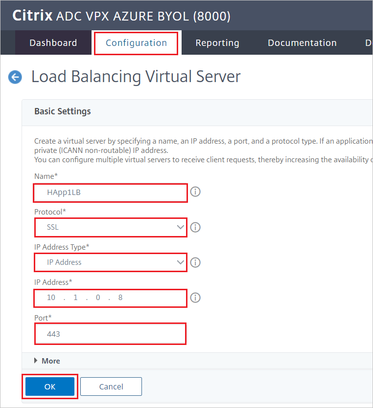

### Bind the virtual server

To bind the load balancer with the virtual server:

1. In the **Services and Service Groups** pane, select **No Load Balancing Virtual Server Service Binding**.

   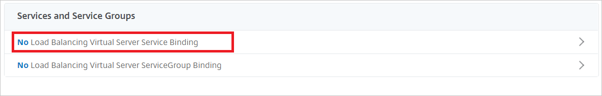

1. Verify the settings as shown in the following screenshot, and then select **Close**.

   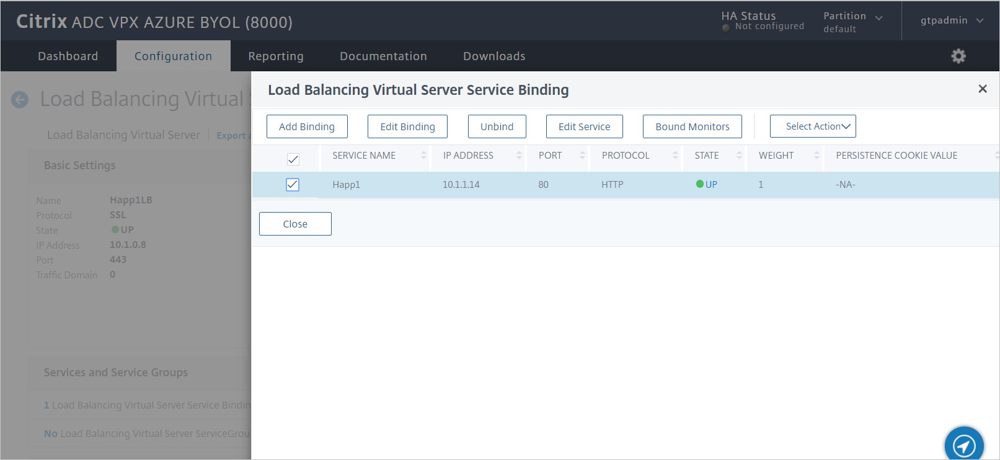

### Bind the certificate

To publish this service as TLS, bind the server certificate, and then test your application:

1. Under **Certificate**, select **No Server Certificate**.

   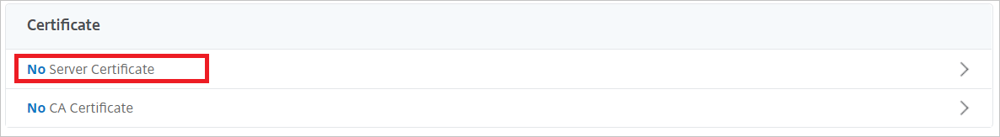

1. Verify the settings as shown in the following screenshot, and then select **Close**.

   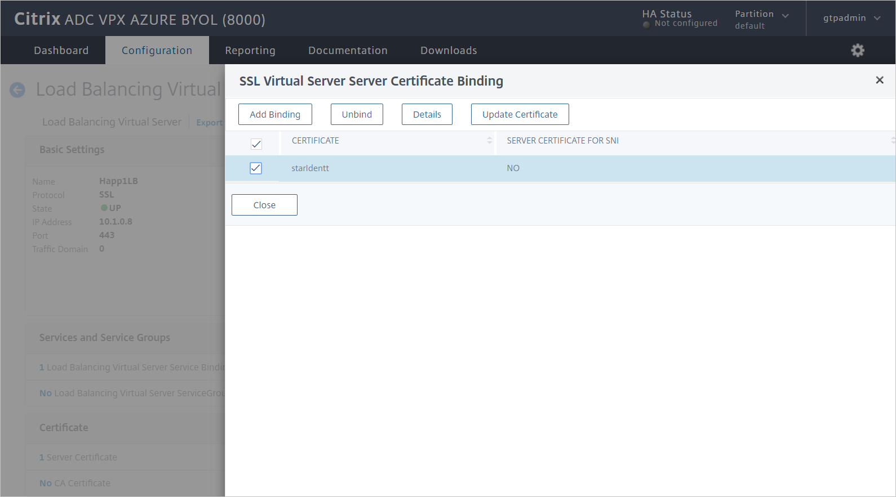

## Citrix ADC SAML Connector for Microsoft Entra SAML profile

To configure the Citrix ADC SAML Connector for Microsoft Entra SAML profile, complete the following sections.

### Create an authentication policy

To create an authentication policy:

1. Go to **Security** > **AAA – Application Traffic** > **Policies** > **Authentication** > **Authentication Policies**.

1. Select **Add**.

1. On the **Create Authentication Policy** pane, enter or select the following values:

    * **Name**: Enter a name for your authentication policy.
    * **Action**: Enter **SAML**, and then select **Add**.
    * **Expression**:  Enter **true**.     
    
    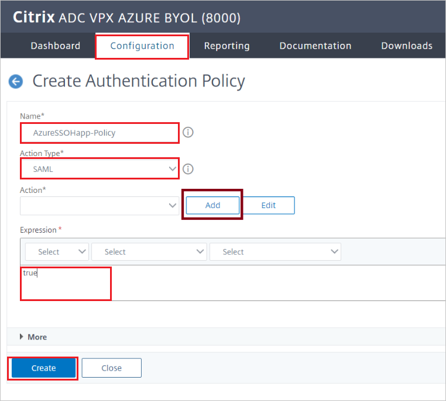

1. Select **Create**.

### Create an authentication SAML server

To create an authentication SAML server, go to the **Create Authentication SAML Server** pane, and then complete the following steps:

1. For **Name**, enter a name for the authentication SAML server.

1. Under **Export SAML Metadata**:

   1. Select the **Import Metadata** check box.

   1. Enter the federation metadata URL from the Azure SAML UI that you copied earlier.
    
1. For **Issuer Name**, enter the relevant URL.

1. Select **Create**.

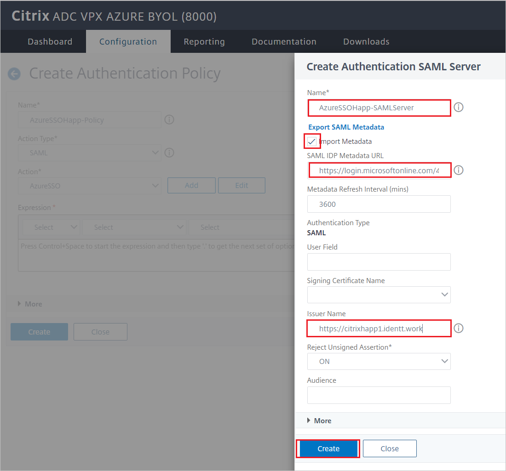

### Create an authentication virtual server

To create an authentication virtual server:

1.	Go to **Security** > **AAA - Application Traffic** > **Policies** > **Authentication** > **Authentication Virtual Servers**.

1.	Select **Add**, and then complete the following steps:

    1. For **Name**, enter a name for the authentication virtual server.

    1. Select the **Non-Addressable** check box.

    1. For **Protocol**, select **SSL**.

    1. Select **OK**.
    
1. Select **Continue**.

### Configure the authentication virtual server to use Microsoft Entra ID

Modify two sections for the authentication virtual server:

1.	On the **Advanced Authentication Policies** pane, select **No Authentication Policy**.

    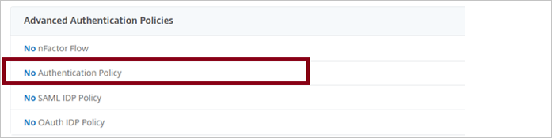

1. On the **Policy Binding** pane, select the authentication policy, and then select **Bind**.

    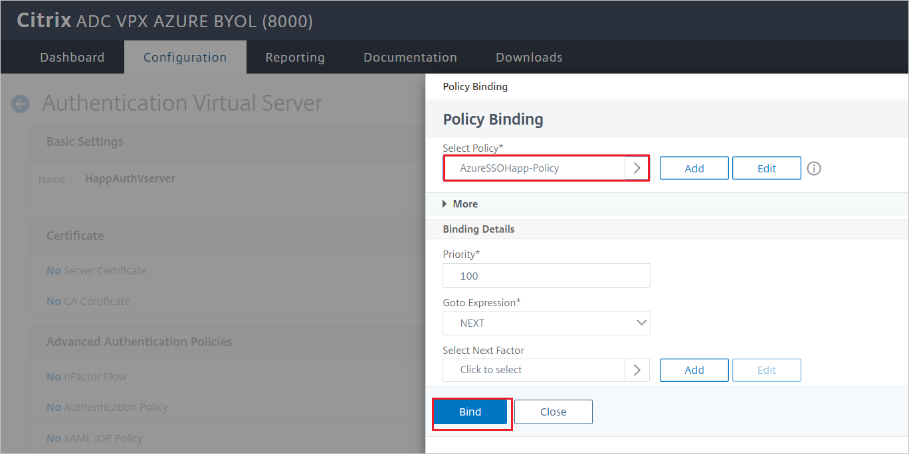

1. On the **Form Based Virtual Servers** pane, select **No Load Balancing Virtual Server**.

    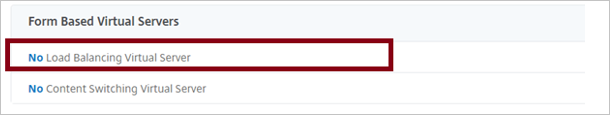

1. For **Authentication FQDN**, enter a fully qualified domain name (FQDN) (required).

1. Select the load balancing virtual server that you want to protect with Microsoft Entra authentication.

1. Select **Bind**.

    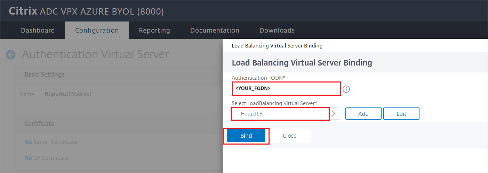

    > [!NOTE]
    > Be sure to select **Done** on the **Authentication Virtual Server Configuration** pane.

1. To verify your changes, in a browser, go to the application URL. You should see your tenant sign-in page instead of the unauthenticated access that you would have seen previously.

    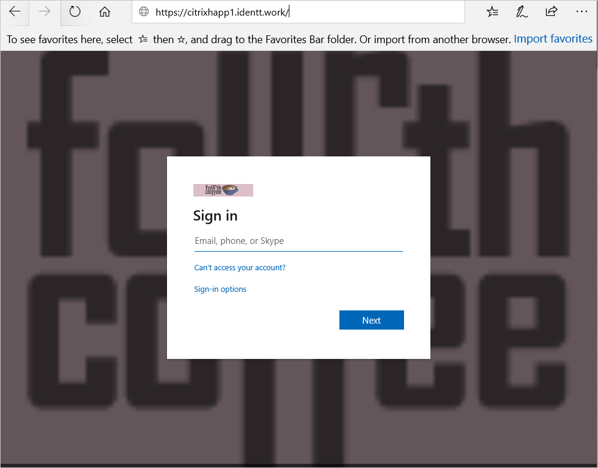

## Configure Citrix ADC SAML Connector for Microsoft Entra SSO for Kerberos-based authentication

### Create a Kerberos delegation account for Citrix ADC SAML Connector for Microsoft Entra ID

1. Create a user account (in this example, we use *AppDelegation*).

    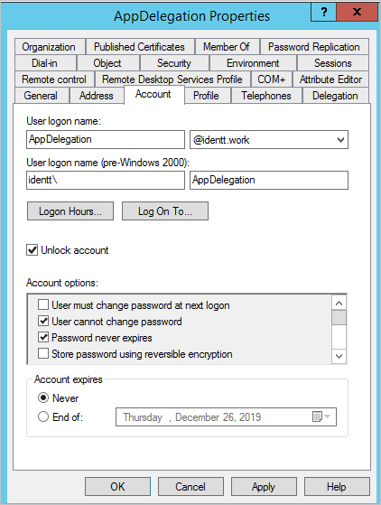

1. Set up a HOST SPN for this account. 

    Example: `setspn -S HOST/AppDelegation.IDENTT.WORK identt\appdelegation`
    
    In this example:

    * `IDENTT.WORK` is the domain FQDN.
    * `identt` is the domain NetBIOS name.
    * `appdelegation` is the delegation user account name.

1. Configure delegation for the web server as shown in the following screenshot:
 
    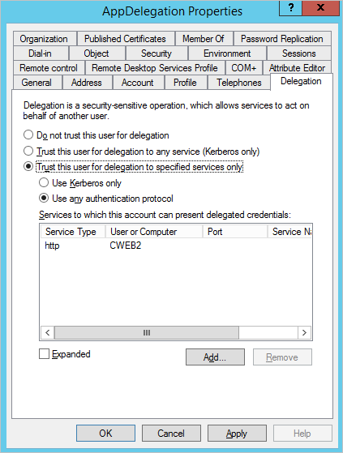

    > [!NOTE]
    > In the screenshot example, the internal web server name running the Windows Integrated Authentication (WIA) site is *CWEB2*.

### Citrix ADC SAML Connector for Microsoft Entra AAA KCD (Kerberos delegation accounts)

To configure the Citrix ADC SAML Connector for Microsoft Entra AAA KCD account:

1.	Go to  **Citrix Gateway** > **AAA KCD (Kerberos Constrained Delegation) Accounts**.

1.	Select **Add**, and then enter or select the following values:

    * **Name**: Enter a name for the KCD account.

    * **Realm**: Enter the domain and extension in uppercase.

    * **Service SPN**: `http/<host/fqdn>@<DOMAIN.COM>`.
    
        > [!NOTE]
        > `@DOMAIN.COM` is required and must be uppercase. Example: `http/cweb2@IDENTT.WORK`.

    * **Delegated User**: Enter the delegated user name.

    * Select the **Password for Delegated User** check box, and enter and confirm a password.

1. Select **OK**.

### Citrix traffic policy and traffic profile

To configure the Citrix traffic policy and traffic profile:

1.	Go to **Security** > **AAA - Application Traffic** > **Policies** > **Traffic Policies, Profiles and Form SSO ProfilesTraffic Policies**.

1.	Select **Traffic Profiles**.

1.	Select **Add**.

1.	To configure a traffic profile, enter or select the following values.

    * **Name**: Enter a name for the traffic profile.

    * **Single Sign-on**: Select **ON**.

    * **KCD Account**: Select the KCD account you created in the preceding section.

1. Select **OK**.

    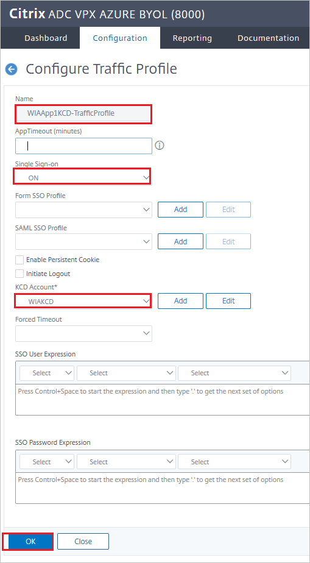
 
1.	Select **Traffic Policy**.

1.	Select **Add**.

1.	To configure a traffic policy, enter or select the following values:

    * **Name**: Enter a name for the traffic policy.

    * **Profile**: Select the traffic profile you created in the preceding section.

    * **Expression**: Enter **true**.

1. Select **OK**.

    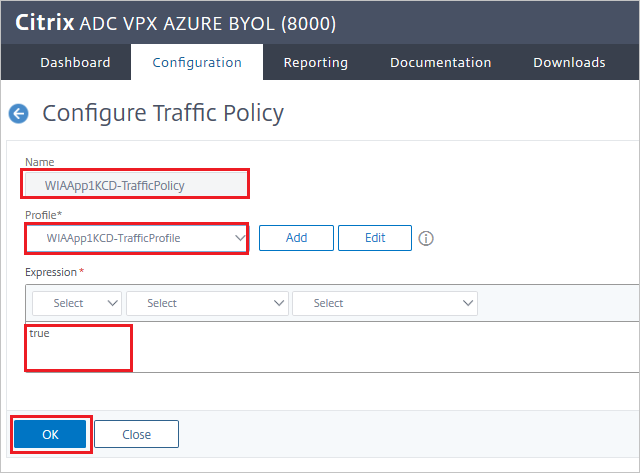

### Bind a traffic policy to a virtual server in Citrix

To bind a traffic policy to a virtual server by using the GUI:

1. Go to **Traffic Management** > **Load Balancing** > **Virtual Servers**.

1. In the list of virtual servers, select the virtual server to which you want to bind the rewrite policy, and then select **Open**.

1. On the **Load Balancing Virtual Server** pane, under **Advanced Settings**, select **Policies**. All policies that are configured for your NetScaler instance appear in the list.
 
    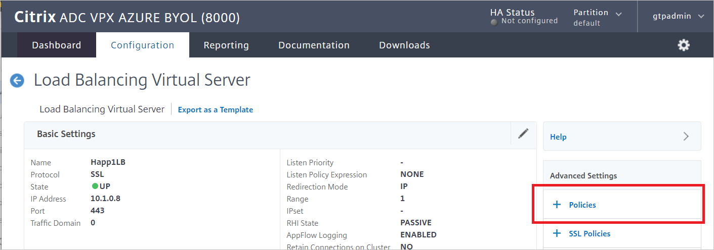

    

1.	Select the check box next to the name of the policy you want to bind to this virtual server.
 
    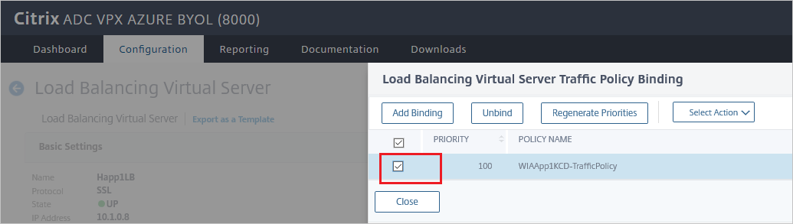

1. In the **Choose Type** dialog box:

    1. For **Choose Policy**, select **Traffic**.

    1. For **Choose Type**, select **Request**.

    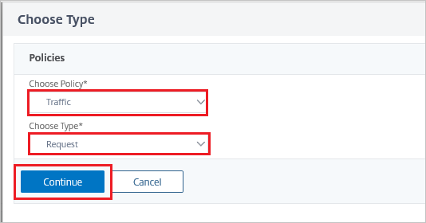

1. When the policy is bound, select **Done**.
 
    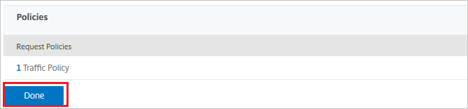

1. Test the binding by using the WIA website.

    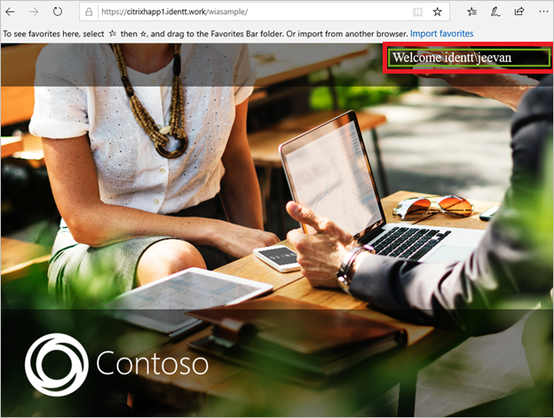    

### Create Citrix ADC SAML Connector for Microsoft Entra test user

In this section, a user called B.Simon is created in Citrix ADC SAML Connector for Microsoft Entra ID. Citrix ADC SAML Connector for Microsoft Entra ID supports just-in-time user provisioning, which is enabled by default. There's no action for you to take in this section. If a user doesn't already exist in Citrix ADC SAML Connector for Microsoft Entra ID, a new one is created after authentication.

> [!NOTE]
> If you need to create a user manually, contact the [Citrix ADC SAML Connector for Microsoft Entra client support team](https://www.citrix.com/contact/technical-support.html).

## Test SSO 

In this section, you test your Microsoft Entra single sign-on configuration with following options. 

* Select **Test this application**, this option redirects to Citrix ADC SAML Connector for Microsoft Entra Sign-on URL where you can initiate the login flow. 

* Go to Citrix ADC SAML Connector for Microsoft Entra Sign-on URL directly and initiate the login flow from there.

* You can use Microsoft My Apps. When you select the Citrix ADC SAML Connector for Microsoft Entra ID tile in the My Apps, this option redirects to Citrix ADC SAML Connector for Microsoft Entra Sign-on URL. For more information about the My Apps, see [Introduction to the My Apps](https://support.microsoft.com/account-billing/sign-in-and-start-apps-from-the-my-apps-portal-2f3b1bae-0e5a-4a86-a33e-876fbd2a4510).

## Related content

Once you configure Citrix ADC SAML Connector for Microsoft Entra ID you can enforce session control, which protects exfiltration and infiltration of your organization’s sensitive data in real time. Session control extends from Conditional Access. [Learn how to enforce session control with Microsoft Defender for Cloud Apps](/cloud-app-security/proxy-deployment-any-app).
