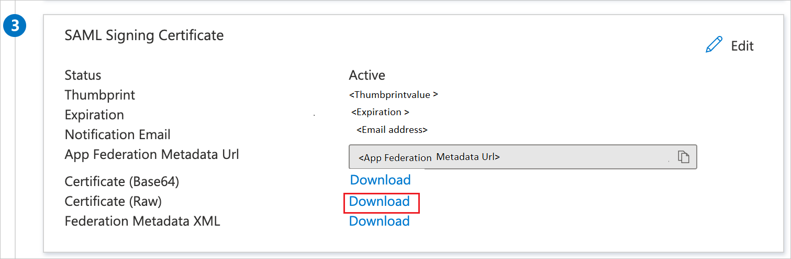

# Configure CivicEye SSO for Single sign-on with Microsoft Entra ID

In this article, you learn how to integrate CivicEye SSO with Microsoft Entra ID. Provide SSO functionality for our CivicEye Platform customers through their existing AD deployment. When you integrate CivicEye SSO with Microsoft Entra ID, you can:

* Control in Microsoft Entra ID who has access to CivicEye SSO.
* Enable your users to be automatically signed-in to CivicEye SSO with their Microsoft Entra accounts.
* Manage your accounts in one central location.

You'll configure and test Microsoft Entra single sign-on for CivicEye SSO in a test environment. CivicEye SSO supports **SP** initiated single sign-on.

## Prerequisites

To integrate Microsoft Entra ID with CivicEye SSO, you need:

* A Microsoft Entra user account. If you don't already have one, you can [Create an account for free](https://azure.microsoft.com/free/?WT.mc_id=A261C142F).
* One of the following roles: [Application Administrator](/entra/identity/role-based-access-control/permissions-reference#application-administrator), [Cloud Application Administrator](/entra/identity/role-based-access-control/permissions-reference#cloud-application-administrator), or [Application Owner](/entra/fundamentals/users-default-permissions#owned-enterprise-applications).
* A Microsoft Entra subscription. If you don't have a subscription, you can get a [free account](https://azure.microsoft.com/free/).
* CivicEye SSO single sign-on (SSO) enabled subscription.

## Add application and assign a test user

Before you begin the process of configuring single sign-on, you need to add the CivicEye SSO application from the Microsoft Entra gallery. You need a test user account to assign to the application and test the single sign-on configuration.

### Add CivicEye SSO from the Microsoft Entra gallery

Add CivicEye SSO from the Microsoft Entra application gallery to configure single sign-on with CivicEye SSO. For more information on how to add application from the gallery, see the [Quickstart: Add application from the gallery](~/identity/enterprise-apps/add-application-portal.md).

### Create and assign Microsoft Entra test user

Follow the guidelines in the [create and assign a user account](~/identity/enterprise-apps/add-application-portal-assign-users.md) article to create a test user account called B.Simon.

Alternatively, you can also use the [Enterprise App Configuration Wizard](https://portal.office.com/AdminPortal/home?Q=Docs#/azureadappintegration). In this wizard, you can add an application to your tenant, add users/groups to the app, and assign roles. The wizard also provides a link to the single sign-on configuration pane. [Learn more about Microsoft 365 wizards.](/microsoft-365/admin/misc/azure-ad-setup-guides). 

## Configure Microsoft Entra SSO

Complete the following steps to enable Microsoft Entra single sign-on.

1. Sign in to the [Microsoft Entra admin center](https://entra.microsoft.com) as at least a [Cloud Application Administrator](~/identity/role-based-access-control/permissions-reference.md#cloud-application-administrator).
1. Browse to **Entra ID** > **Enterprise apps** > **CivicEye SSO** > **Single sign-on**.
1. On the **Select a single sign-on method** page, select **SAML**.
1. On the **Set up single sign-on with SAML** page, select the pencil icon for **Basic SAML Configuration** to edit the settings.

   

1. On the **Basic SAML Configuration** section, perform the following steps:

	a. In the **Identifier** textbox, type a URL using the following pattern:
	`https://<CustomerName>.civiceye.com`

	b. In the **Reply URL** textbox, type a URL using the following pattern:
	`https://<CustomerName>.civiceye.com/consumer`

	c. In the **Sign on URL** textbox, type a URL using the following pattern:
	`https://<CustomerName>.civiceye.com`

	> [!Note]
	> These values aren't real. Update these values with the actual Identifier, Reply URL and Sign on URL. Contact [CivicEye SSO support team](mailto:help@civiceye.com) to get these values. You can also refer to the patterns shown in the **Basic SAML Configuration** section.

1. On the **Set up single sign-on with SAML** page, in the **SAML Signing Certificate** section, find **Certificate (Raw)** and select **Download** to download the certificate and save it on your computer.

    

1. On the **Set up CivicEye SSO** section, copy the appropriate URL(s) based on your requirement.

	

## Configure CivicEye SSO

To configure single sign-on on **CivicEye SSO** side, you need to send the downloaded **Certificate (Raw)** and appropriate copied URLs from the application configuration to [CivicEye SSO support team](mailto:help@civiceye.com). They set this setting to have the SAML SSO connection set properly on both sides.

### Create CivicEye SSO test user

In this section, you create a user called Britta Simon at CivicEye SSO. Work with [CivicEye SSO support team](mailto:help@civiceye.com) to add the users in the CivicEye SSO platform. Users must be created and activated before you use single sign-on.

## Test SSO 

In this section, you test your Microsoft Entra single sign-on configuration with following options. 

* Select **Test this application**, this option redirects to CivicEye SSO Sign-on URL where you can initiate the login flow. 

* Go to CivicEye SSO Sign-on URL directly and initiate the login flow from there.

* You can use Microsoft My Apps. When you select the CivicEye SSO tile in the My Apps, this option redirects to CivicEye SSO Sign-on URL. For more information, see [Microsoft Entra My Apps](/azure/active-directory/manage-apps/end-user-experiences#azure-ad-my-apps).

## Additional resources

* [What is single sign-on with Microsoft Entra ID?](~/identity/enterprise-apps/what-is-single-sign-on.md)
* [Plan a single sign-on deployment](~/identity/enterprise-apps/plan-sso-deployment.md).

## Related content

Once you configure CivicEye SSO you can enforce session control, which protects exfiltration and infiltration of your organization’s sensitive data in real time. Session control extends from Conditional Access. [Learn how to enforce session control with Microsoft Cloud App Security](/cloud-app-security/proxy-deployment-aad).
