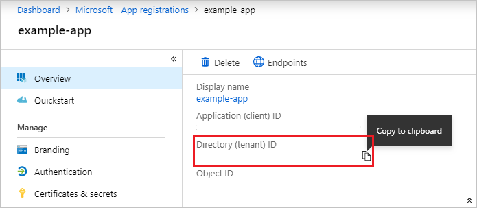
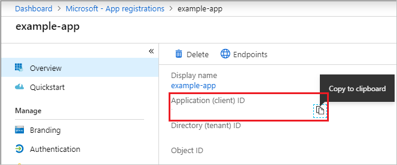
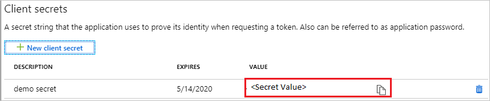
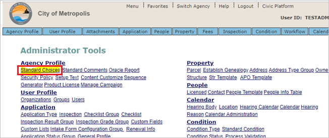
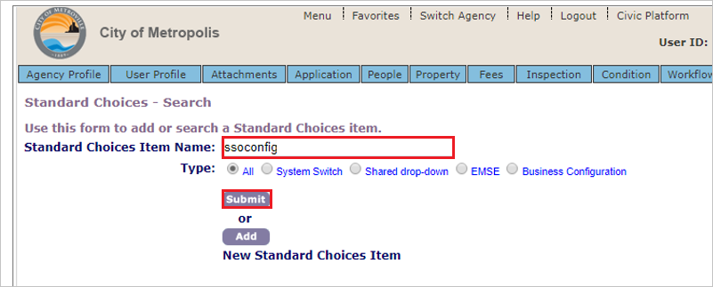
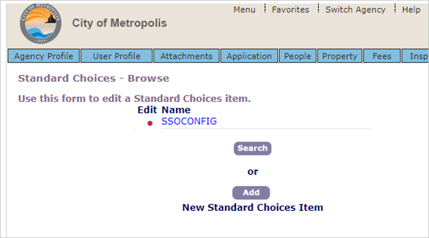
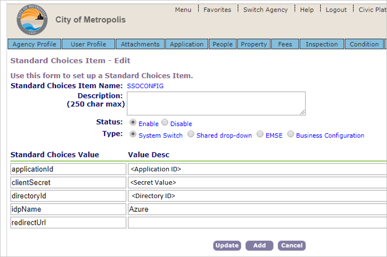

# Configure Civic Platform for Single sign-on with Microsoft Entra ID

In this article,  you learn how to integrate Civic Platform with Microsoft Entra ID. When you integrate Civic Platform with Microsoft Entra ID, you can:

* Control in Microsoft Entra ID who has access to Civic Platform.
* Enable your users to be automatically signed-in to Civic Platform with their Microsoft Entra accounts.
* Manage your accounts in one central location.

## Prerequisites

The scenario outlined in this article assumes that you already have the following prerequisites:

[!INCLUDE [common-prerequisites.md](~/identity/saas-apps/includes/common-prerequisites.md)]
* Civic Platform single sign-on (SSO) enabled subscription.

## Scenario description

In this article,  you configure and test Microsoft Entra SSO in a test environment.

* Civic Platform supports **SP** initiated SSO.

> [!NOTE]
> Identifier of this application is a fixed string value so only one instance can be configured in one tenant.

## Add Civic Platform from the gallery

To configure the integration of Civic Platform into Microsoft Entra ID, you need to add Civic Platform from the gallery to your list of managed SaaS apps.

1. Sign in to the [Microsoft Entra admin center](https://entra.microsoft.com) as at least a [Cloud Application Administrator](~/identity/role-based-access-control/permissions-reference.md#cloud-application-administrator).
1. Browse to **Entra ID** > **Enterprise apps** > **New application**.
1. In the **Add from the gallery** section, type **Civic Platform** in the search box.
1. Select **Civic Platform** from results panel and then add the app. Wait a few seconds while the app is added to your tenant.

 [!INCLUDE [sso-wizard.md](~/identity/saas-apps/includes/sso-wizard.md)]

## Configure and test Microsoft Entra SSO for Civic Platform

Configure and test Microsoft Entra SSO with Civic Platform using a test user called **B.Simon**. For SSO to work, you need to establish a link relationship between a Microsoft Entra user and the related user in Civic Platform.

To configure and test Microsoft Entra SSO with Civic Platform, perform the following steps:

1. **[Configure Microsoft Entra SSO](#configure-azure-ad-sso)** - to enable your users to use this feature.
    1. **Create a Microsoft Entra test user** - to test Microsoft Entra single sign-on with B.Simon.
    1. **Assign the Microsoft Entra test user** - to enable B.Simon to use Microsoft Entra single sign-on.
1. **[Configure Civic Platform SSO](#configure-civic-platform-sso)** - to configure the single sign-on settings on application side.
    1. **[Create Civic Platform test user](#create-civic-platform-test-user)** - to have a counterpart of B.Simon in Civic Platform that's linked to the Microsoft Entra representation of user.
1. **[Test SSO](#test-sso)** - to verify whether the configuration works.

## Configure Microsoft Entra SSO

Follow these steps to enable Microsoft Entra SSO.

1. Sign in to the [Microsoft Entra admin center](https://entra.microsoft.com) as at least a [Cloud Application Administrator](~/identity/role-based-access-control/permissions-reference.md#cloud-application-administrator).
1. Browse to **Entra ID** > **Enterprise apps** > **Civic Platform** application integration page, find the **Manage** section and select **Single sign-on**.
1. On the **Select a Single sign-on method** page, select **SAML**.
1. On the **Set up Single Sign-On with SAML** page, select the pencil icon for **Basic SAML Configuration** to edit the settings.

   

1. On the **Basic SAML Configuration** section, perform the following steps:

    a. In the **Identifier (Entity ID)** text box, type the value: `civicplatform.accela.com`

	b. In the **Sign on URL** text box, type a URL using the following pattern:
    `https://<SUBDOMAIN>.accela.com`

	> [!NOTE]
	> The Sign on URL value isn't real. Update this value with the actual Sign on URL. Contact [Civic Platform Client support team](mailto:skale@accela.com) to get this value. You can also refer to the patterns shown in the **Basic SAML Configuration** section.

1. On the **Set up Single Sign-On with SAML** page, In the **SAML Signing Certificate** section, select copy button to copy **App Federation Metadata Url** and save it on your computer.

	

1. Navigate to **Entra ID** > **App registrations**, select your application.

1. Copy the **Directory (tenant) ID** and store it into Notepad.

    

1. Copy the **Application ID** and store it into Notepad.

   

1. Navigate to **Entra ID** > **App registrations**, select your application. Select **Certificates & secrets**.

1. Select **Client secrets -> New client secret**.

1. Provide a description of the secret, and a duration. When done, select **Add**.

   > [!NOTE]
   > After saving the client secret, the value of the client secret is displayed. Copy this value because you aren't able to retrieve the key later.

   

[!INCLUDE [create-assign-users-sso.md](~/identity/saas-apps/includes/create-assign-users-sso.md)]

## Configure Civic Platform SSO

1. Open a new web browser window and sign into your Atlassian Cloud company site as an administrator.

1. Select **Standard Choices**.

    

1. Create a standard choice **ssoconfig**.

1. Search for **ssoconfig**  and submit.

    

1. Expand SSOCONFIG by selecting red dot.

    

1. Provide SSO related configuration information in the following step:

    

    1. In the **applicationid** field, enter the **Application ID** value, which you copied previously.

    1. In the **clientSecret** field, enter the **Secret** value, which you copied previously.

    1. In the **directoryId** field, enter the **Directory (tenant) ID** value, which you copied previously.

    1. Enter the idpName. Ex:- `Azure`.

### Create Civic Platform test user

In this section, you create a user called B.Simon in Civic Platform. Work with Civic Platform support team to add the users in the [Civic Platform Client support team](mailto:skale@accela.com). Users must be created and activated before you use single sign-on.

## Test SSO 

In this section, you test your Microsoft Entra single sign-on configuration with following options. 

* Select **Test this application**, this option redirects to Civic Platform Sign-on URL where you can initiate the login flow. 

* Go to Civic Platform Sign-on URL directly and initiate the login flow from there.

* You can use Microsoft My Apps. When you select the Civic Platform tile in the My Apps, this option redirects to Civic Platform Sign-on URL. For more information, see [Microsoft Entra My Apps](/azure/active-directory/manage-apps/end-user-experiences#azure-ad-my-apps).

## Related content

Once you configure Civic Platform you can enforce session control, which protects exfiltration and infiltration of your organization’s sensitive data in real time. Session control extends from Conditional Access. [Learn how to enforce session control with Microsoft Defender for Cloud Apps](/cloud-app-security/proxy-deployment-aad).
