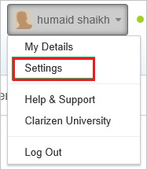
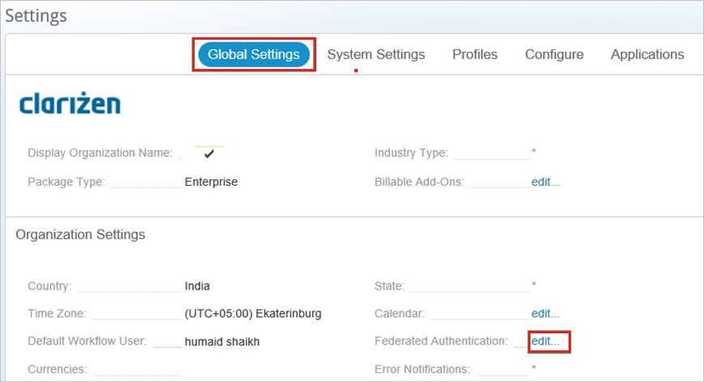
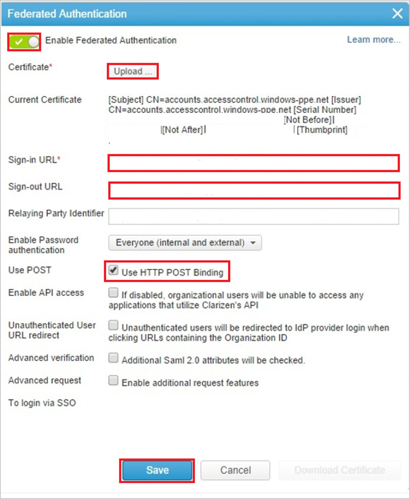
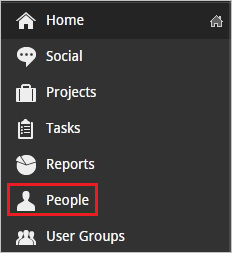
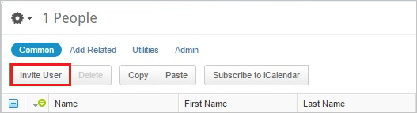
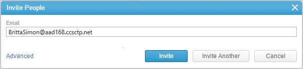

# Configure Clarizen One for Single sign-on with Microsoft Entra ID

In this article,  you learn how to integrate Clarizen One with Microsoft Entra ID. When you integrate Clarizen One with Microsoft Entra ID, you can:

* Control in Microsoft Entra ID who has access to Clarizen One.
* Enable your users to be automatically signed-in to Clarizen One with their Microsoft Entra accounts.
* Manage your accounts in one central location.

## Prerequisites

To get started, you need the following items:

* A Microsoft Entra subscription. If you don't have a subscription, you can get a [free account](https://azure.microsoft.com/free/).
* Clarizen One single sign-on (SSO) enabled subscription.
* Along with Cloud Application Administrator, Application Administrator can also add or manage applications in Microsoft Entra ID.
For more information, see [Azure built-in roles](~/identity/role-based-access-control/permissions-reference.md).

## Scenario description

In this article,  you configure and test Microsoft Entra single sign-on in a test environment.

* Clarizen One supports **IDP** initiated SSO.
* Clarizen One supports [**automated** user provisioning and deprovisioning](clarizen-one-provisioning-tutorial.md) (recommended).

> [!NOTE]
> Identifier of this application is a fixed string value so only one instance can be configured in one tenant.

## Add Clarizen One from the gallery

To configure the integration of Clarizen One into Microsoft Entra ID, you need to add Clarizen One from the gallery to your list of managed SaaS apps.

1. Sign in to the [Microsoft Entra admin center](https://entra.microsoft.com) as at least a [Cloud Application Administrator](~/identity/role-based-access-control/permissions-reference.md#cloud-application-administrator).
1. Browse to **Entra ID** > **Enterprise apps** > **New application**.
1. In the **Add from the gallery** section, type **Clarizen One** in the search box.
1. Select **Clarizen One** from results panel and then add the app. Wait a few seconds while the app is added to your tenant.

 [!INCLUDE [sso-wizard.md](~/identity/saas-apps/includes/sso-wizard.md)]

## Configure and test Microsoft Entra SSO for Clarizen One

Configure and test Microsoft Entra SSO with Clarizen One using a test user called **B.Simon**. For SSO to work, you need to establish a link relationship between a Microsoft Entra user and the related user in Clarizen One.

To configure and test Microsoft Entra SSO with Clarizen One, perform the following steps:

1. **[Configure Microsoft Entra SSO](#configure-azure-ad-sso)** - to enable your users to use this feature.
    1. **Create a Microsoft Entra test user** - to test Microsoft Entra single sign-on with B.Simon.
    1. **Assign the Microsoft Entra test user** - to enable B.Simon to use Microsoft Entra single sign-on.
1. **[Configure Clarizen One SSO](#configure-clarizen-one-sso)** - to configure the single sign-on settings on application side.
    1. **[Create Clarizen test user](#create-clarizen-one-test-user)** - to have a counterpart of B.Simon in Clarizen One that's linked to the Microsoft Entra representation of user.
1. **[Test SSO](#test-sso)** - to verify whether the configuration works.

## Configure Microsoft Entra SSO

Follow these steps to enable Microsoft Entra SSO.

1. Sign in to the [Microsoft Entra admin center](https://entra.microsoft.com) as at least a [Cloud Application Administrator](~/identity/role-based-access-control/permissions-reference.md#cloud-application-administrator).
1. Browse to **Entra ID** > **Enterprise apps** > **Clarizen One** > **Single sign-on**.
1. On the **Select a single sign-on method** page, select **SAML**.
1. On the **Set up single sign-on with SAML** page, select the pencil icon for **Basic SAML Configuration** to edit the settings.

   

1. On the **Basic SAML Configuration** section, perform the following steps:

    a. In the **Identifier** text box, type the value:
    `Clarizen`

    b. In the **Reply URL** text box, type a URL using the following pattern:
    `https://<SUBDOMAIN>.clarizen.com/Clarizen/Pages/Integrations/SAML/SamlResponse.aspx`

    > [!NOTE]
	> This value isn't real. Update this value with the actual Reply URL. You can also refer to the patterns shown in the **Basic SAML Configuration** section.

4. On the **Set up Single Sign-On with SAML** page, in the **SAML Signing Certificate** section, select **Download** to download the **Certificate (Base64)** from the given options as per your requirement and save it on your computer.

    

1. On the **Set up Clarizen One** section, copy the appropriate URL(s) as per your requirement.

    

[!INCLUDE [create-assign-users-sso.md](~/identity/saas-apps/includes/create-assign-users-sso.md)]

## Configure Clarizen One SSO

1. In a different web browser window, sign in to your Clarizen One company site as an administrator.

1. Select your username, and then select **Settings**.

    

1. Select the **Global Settings** tab. Then, next to **Federated Authentication**, select **edit**.

    

1. In the **Federated Authentication** dialog box, perform the following steps:

    

    a. Select **Enable Federated Authentication**.

    b. Select **Upload** to upload your downloaded certificate.

    c. In the **Sign-in URL** box, enter the value of **Login URL** from the Microsoft Entra application configuration window.

    d. In the **Sign-out URL** box, enter the value of **Logout URL** from the Microsoft Entra application configuration window.

    e. Select **Use POST**.

    f. Select **Save**.

### Create Clarizen One test user

The objective of this section is to create a user called Britta Simon in Clarizen One.

**If you need to create user manually, please perform following steps:**

To enable Microsoft Entra users to sign in to Clarizen One, you must provision user accounts. In the case of Clarizen One, provisioning is a manual task.

1. Sign in to your Clarizen One company site as an administrator.

2. Select **People**.

    

3. Select **Invite User**.

    

1. In the **Invite People** dialog box, perform the following steps:

    

    a. In the **Email** box, type the email address of the Britta Simon account.

    b. Select **Invite**.

    > [!NOTE]
    > The Microsoft Entra account holder will receive an email and follow a link to confirm their account before it becomes active.

## Test SSO 

In this section, you test your Microsoft Entra single sign-on configuration with following options.

* Select **Test this application**, and you should be automatically signed in to the Clarizen One for which you set up the SSO.

* You can use Microsoft My Apps. When you select the Clarizen One tile in the My Apps, you should be automatically signed in to the Clarizen One for which you set up the SSO. For more information about the My Apps, see [Introduction to the My Apps](https://support.microsoft.com/account-billing/sign-in-and-start-apps-from-the-my-apps-portal-2f3b1bae-0e5a-4a86-a33e-876fbd2a4510).

## Related content

Once you configure Clarizen One you can enforce session control, which protects exfiltration and infiltration of your organization’s sensitive data in real time. Session control extends from Conditional Access. [Learn how to enforce session control with Microsoft Defender for Cloud Apps](/cloud-app-security/proxy-deployment-any-app).
