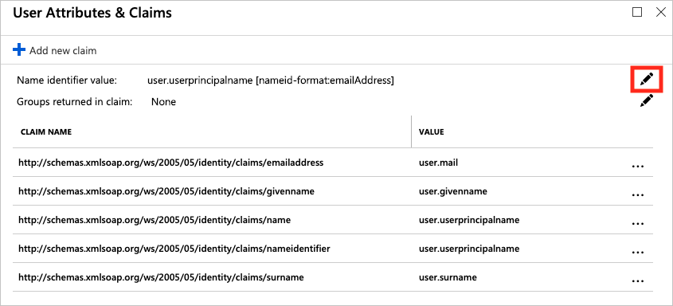
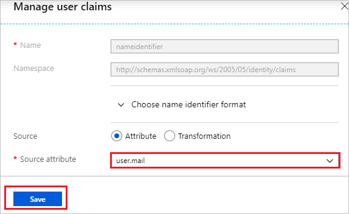
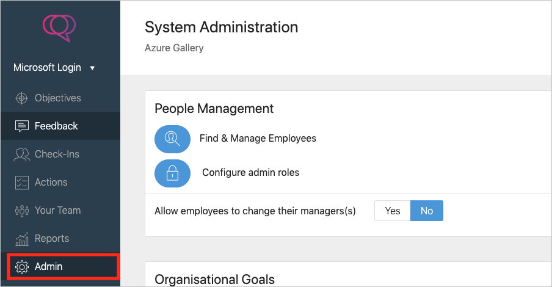
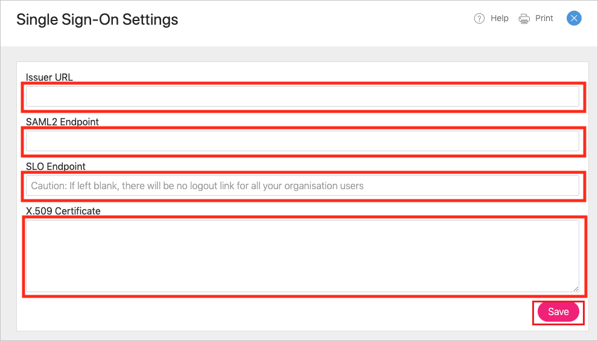

# Configure Clear Review for Single sign-on with Microsoft Entra ID

In this article,  you learn how to integrate Clear Review with Microsoft Entra ID. When you integrate Clear Review with Microsoft Entra ID, you can:

* Control in Microsoft Entra ID who has access to Clear Review.
* Enable your users to be automatically signed-in to Clear Review with their Microsoft Entra accounts.
* Manage your accounts in one central location.

## Prerequisites

The scenario outlined in this article assumes that you already have the following prerequisites:

[!INCLUDE [common-prerequisites.md](~/identity/saas-apps/includes/common-prerequisites.md)]
* Clear Review single sign-on enabled subscription.

> [!NOTE]
> This integration is also available to use from Microsoft Entra US Government Cloud environment. You can find this application in the Microsoft Entra US Government Cloud Application Gallery and configure it in the same way as you do from public cloud.

## Scenario description

In this article,  you configure and test Microsoft Entra single sign-on in a test environment.

* Clear Review supports **SP and IDP** initiated SSO.

## Add Clear Review from the gallery

To configure the integration of Clear Review into Microsoft Entra ID, you need to add Clear Review from the gallery to your list of managed SaaS apps.

1. Sign in to the [Microsoft Entra admin center](https://entra.microsoft.com) as at least a [Cloud Application Administrator](~/identity/role-based-access-control/permissions-reference.md#cloud-application-administrator).
1. Browse to **Entra ID** > **Enterprise apps** > **New application**.
1. In the **Add from the gallery** section, type **Clear Review** in the search box.
1. Select **Clear Review** from results panel and then add the app. Wait a few seconds while the app is added to your tenant.

 [!INCLUDE [sso-wizard.md](~/identity/saas-apps/includes/sso-wizard.md)]

## Configure and test Microsoft Entra SSO for Clear Review

Configure and test Microsoft Entra SSO with Clear Review using a test user called **B.Simon**. For SSO to work, you need to establish a link relationship between a Microsoft Entra user and the related user in Clear Review.

To configure and test Microsoft Entra SSO with Clear Review, perform the following steps:

1. **[Configure Microsoft Entra SSO](#configure-azure-ad-sso)** - to enable your users to use this feature.
    1. **Create a Microsoft Entra test user** - to test Microsoft Entra single sign-on with B.Simon.
    1. **Assign the Microsoft Entra test user** - to enable B.Simon to use Microsoft Entra single sign-on.
1. **[Configure Clear Review SSO](#configure-clear-review-sso)** - to configure the single sign-on settings on application side.
    1. **[Create Clear Review test user](#create-clear-review-test-user)** - to have a counterpart of B.Simon in Clear Review that's linked to the Microsoft Entra representation of user.
1. **[Test SSO](#test-sso)** - to verify whether the configuration works.

## Configure Microsoft Entra SSO

Follow these steps to enable Microsoft Entra SSO.

1. Sign in to the [Microsoft Entra admin center](https://entra.microsoft.com) as at least a [Cloud Application Administrator](~/identity/role-based-access-control/permissions-reference.md#cloud-application-administrator).
1. Browse to **Entra ID** > **Enterprise apps** > **Clear Review** > **Single sign-on**.
1. On the **Select a single sign-on method** page, select **SAML**.
1. On the **Set up single sign-on with SAML** page, select the pencil icon for **Basic SAML Configuration** to edit the settings.

   

1. On the **Basic SAML Configuration** section, if you wish to configure the application in **IDP** initiated mode, perform the following steps:

    a. In the **Identifier** text box, type a URL using the following pattern:
    `https://<CUSTOMER_NAME>.clearreview.com/sso/metadata/`

    b. In the **Reply URL** text box, type a URL using the following pattern:
    `https://<CUSTOMER_NAME>.clearreview.com/sso/acs/`

5. Select **Set additional URLs** and perform the following step if you wish to configure the application in **SP** initiated mode:

    In the **Sign-on URL** text box, type a URL using the following pattern:
    `https://<CUSTOMER_NAME>.clearreview.com`

    > [!NOTE]
    > These values aren't real. Update these values with the actual Identifier, Reply URL and Sign-on URL. Contact [Clear Review Client support team](https://clearreview.com/contact/) to get these values. You can also refer to the patterns shown in the **Basic SAML Configuration** section.

6. Clear Review application expects the SAML assertions in a specific format, which requires you to add custom attribute mappings to your SAML token attributes configuration. The following screenshot shows the list of default attributes, whereas **nameidentifier** is mapped with **user.userprincipalname**. Clear Review application expects **nameidentifier** to be mapped with **user.mail**, so you need to edit the attribute mapping by selecting **Edit** icon and change the attribute mapping.

    

7. On the **User Attributes & Claims** dialog, perform the following steps:

    a. Select **Edit icon** on the right of **Name identifier value**.

    

    

    b. From the **Source attribute** list, select the **user.mail** attribute value for that row.

    c. Select **Save**.

8. On the **Set up Single Sign-On with SAML** page, in the **SAML Signing Certificate** section, select **Download** to download the **Certificate (Base64)** from the given options as per your requirement and save it on your computer.

    

9. On the **Set up Clear Review** section, copy the appropriate URL(s) as per your requirement.

    

[!INCLUDE [create-assign-users-sso.md](~/identity/saas-apps/includes/create-assign-users-sso.md)]

## Configure Clear Review SSO

1. To configure single sign-on on **Clear Review** side, open the **Clear Review** portal with admin credentials.

2. Select **Admin** from the left navigation.

    

3. In the **Integrations** section at the bottom of the page select the **Change** button to the right of **Single Sign-On Settings**.

    

4. Perform following steps on **Single Sign-On Settings** page.

    

    a. In the **Issuer URL** textbox, paste the value of **Microsoft Entra Identifier**..

    b. In the **SAML Endpoint** textbox, paste the value of **Login URL**..	

    c. In the **SLO Endpoint** textbox, paste the value of **Logout URL**..	

    d. Open the downloaded certificate in notepad and paste the content in the **X.509 Certificate** textbox.	

    e. Select **Save**.

### Create Clear Review test user

In this section, you create a user called Britta Simon in Clear Review. Please work with [Clear Review support team](https://clearreview.com/contact/) to add the users in the Clear Review platform.

## Test SSO

In this section, you test your Microsoft Entra single sign-on configuration with following options. 

#### SP initiated:

* Select **Test this application**, this option redirects to Clear Review Sign on URL where you can initiate the login flow.  

* Go to Clear Review Sign-on URL directly and initiate the login flow from there.

#### IDP initiated:

* Select **Test this application**, and you should be automatically signed in to the Clear Review for which you set up the SSO. 

You can also use Microsoft My Apps to test the application in any mode. When you select the Clear Review tile in the My Apps, if configured in SP mode you would be redirected to the application sign on page for initiating the login flow and if configured in IDP mode, you should be automatically signed in to the Clear Review for which you set up the SSO. For more information about the My Apps, see [Introduction to the My Apps](https://support.microsoft.com/account-billing/sign-in-and-start-apps-from-the-my-apps-portal-2f3b1bae-0e5a-4a86-a33e-876fbd2a4510).

## Related content

Once you configure Clear Review you can enforce session control, which protects exfiltration and infiltration of your organization’s sensitive data in real time. Session control extends from Conditional Access. [Learn how to enforce session control with Microsoft Defender for Cloud Apps](/cloud-app-security/proxy-deployment-aad).
