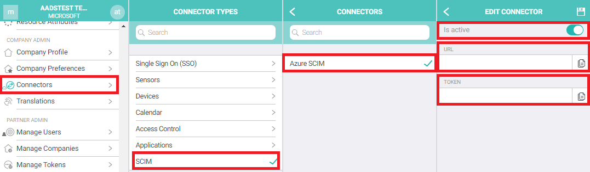

# Configure Clebex for automatic user provisioning with Microsoft Entra ID

This article describes the steps you need to perform in both Clebex and Microsoft Entra ID to configure automatic user provisioning. When configured, Microsoft Entra ID automatically provisions and de-provisions users and groups to [Clebex](https://www.clebex.com/en/index.html) using the Microsoft Entra provisioning service. For important details on what this service does, how it works, and frequently asked questions, see [Automate user provisioning and deprovisioning to SaaS applications with Microsoft Entra ID](~/identity/app-provisioning/user-provisioning.md). 

## Capabilities supported
> [!div class="checklist"]
> * Create users in Clebex
> * Remove users in Clebex when they don't require access anymore
> * Keep user attributes synchronized between Microsoft Entra ID and Clebex
> * [Single sign-on](./clebex-tutorial.md) to Clebex (recommended)

## Prerequisites

The scenario outlined in this article assumes that you already have the following prerequisites:

[!INCLUDE [common-prerequisites.md](~/identity/saas-apps/includes/common-prerequisites.md)]
* A user account in Clebex with create / edit permissions.

## Step 1: Plan your provisioning deployment
1. Learn about [how the provisioning service works](~/identity/app-provisioning/user-provisioning.md).
2. Determine who's in [scope for provisioning](~/identity/app-provisioning/define-conditional-rules-for-provisioning-user-accounts.md).
3. Determine what data to [map between Microsoft Entra ID and Clebex](~/identity/app-provisioning/customize-application-attributes.md). 

## Step 2: Configure Clebex to support provisioning with Microsoft Entra ID

1. Log in to Clebex HUB.

2. Navigate to **Connectors** > **SCIM** > **Azure SCIM**.

3. Toggle the **Is active** button.

4. Copy the **URL** and **Token**. This values are entered in the **Tenant URL** and the **Secret Token** field in the Provisioning tab of your Clebex application.

	

## Step 3: Add Clebex from the Microsoft Entra application gallery

Add Clebex from the Microsoft Entra application gallery to start managing provisioning to Clebex. If you have previously setup Clebex for SSO, you can use the same application. However, we recommend that you create a separate app when testing out the integration initially. Learn more about adding an application from the gallery [here](~/identity/enterprise-apps/add-application-portal.md). 

## Step 4: Define who is in scope for provisioning 

[!INCLUDE [create-assign-users-provisioning.md](~/identity/saas-apps/includes/create-assign-users-provisioning.md)]

## Step 5: Configure automatic user provisioning to Clebex 

This section guides you through the steps to configure the Microsoft Entra provisioning service to create, update, and disable users and/or groups in TestApp based on user and/or group assignments in Microsoft Entra ID.

### To configure automatic user provisioning for Clebex in Microsoft Entra ID:

1. Sign in to the [Microsoft Entra admin center](https://entra.microsoft.com) as at least a [Cloud Application Administrator](~/identity/role-based-access-control/permissions-reference.md#cloud-application-administrator).
1. Browse to **Entra ID** > **Enterprise apps**

	

1. In the applications list, select **Clebex**.

	

1. Select the **Provisioning** tab.

	

1. Set the **Provisioning Mode** to **Automatic**.

	

1. Under the **Admin Credentials** section, input your Clebex Tenant URL and Secret Token. Select **Test Connection** to ensure Microsoft Entra ID can connect to Clebex. If the connection fails, ensure your Clebex account has Admin permissions and try again.

 	

1. In the **Notification Email** field, enter the email address of a person or group who should receive the provisioning error notifications and select the **Send an email notification when a failure occurs** check box.

	

1. Select **Save**.

1. Under the **Mappings** section, select **Synchronize Microsoft Entra users to Clebex**.

1. Review the user attributes that are synchronized from Microsoft Entra ID to Clebex in the **Attribute-Mapping** section. The attributes selected as **Matching** properties are used to match the user accounts in Clebex for update operations. If you choose to change the [matching target attribute](~/identity/app-provisioning/customize-application-attributes.md), you need to ensure that the Clebex API supports filtering users based on that attribute. Select the **Save** button to commit any changes.

   |Attribute|Type|Supported for filtering|
   |---|---|---|
   |userName|String|&check;|
   |externalId|String||
   |active|Boolean||
   |emails[type eq "work"].value|String||
   |displayName|String||
   |preferredLanguage|String||
   |name.givenName|String||
   |name.familyName|String||
   |name.formatted|String||

1. To configure scoping filters, refer to the following instructions provided in the [Scoping filter article](~/identity/app-provisioning/define-conditional-rules-for-provisioning-user-accounts.md).

1. To enable the Microsoft Entra provisioning service for Clebex, change the **Provisioning Status** to **On** in the **Settings** section.

	

1. Define the users and/or groups that you would like to provision to Clebex by choosing the desired values in **Scope** in the **Settings** section.

	

1. When you're ready to provision, select **Save**.

	

This operation starts the initial synchronization cycle of all users and groups defined in **Scope** in the **Settings** section. The initial cycle takes longer to perform than subsequent cycles, which occur approximately every 40 minutes as long as the Microsoft Entra provisioning service is running. 

## Step 6: Monitor your deployment

[!INCLUDE [monitor-deployment.md](~/identity/saas-apps/includes/monitor-deployment.md)]

## Additional resources

* [Managing user account provisioning for Enterprise Apps](~/identity/app-provisioning/configure-automatic-user-provisioning-portal.md)
* [What is application access and single sign-on with Microsoft Entra ID?](~/identity/enterprise-apps/what-is-single-sign-on.md)

## Related content

* [Learn how to review logs and get reports on provisioning activity](~/identity/app-provisioning/check-status-user-account-provisioning.md)
