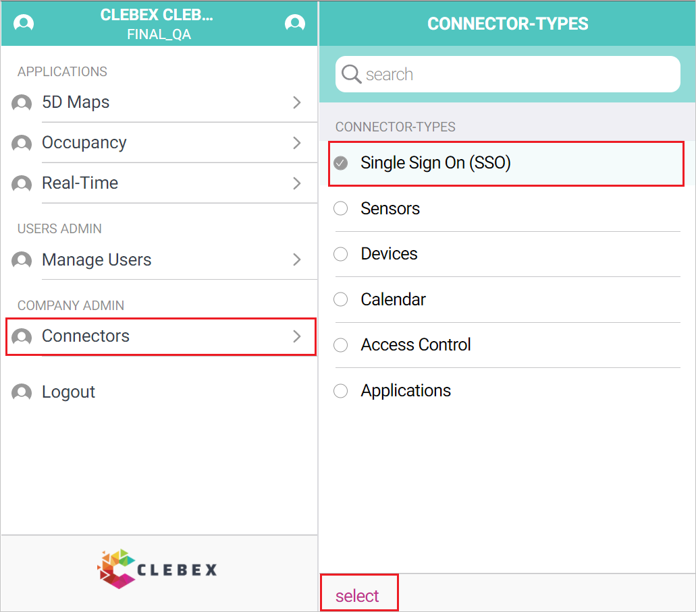
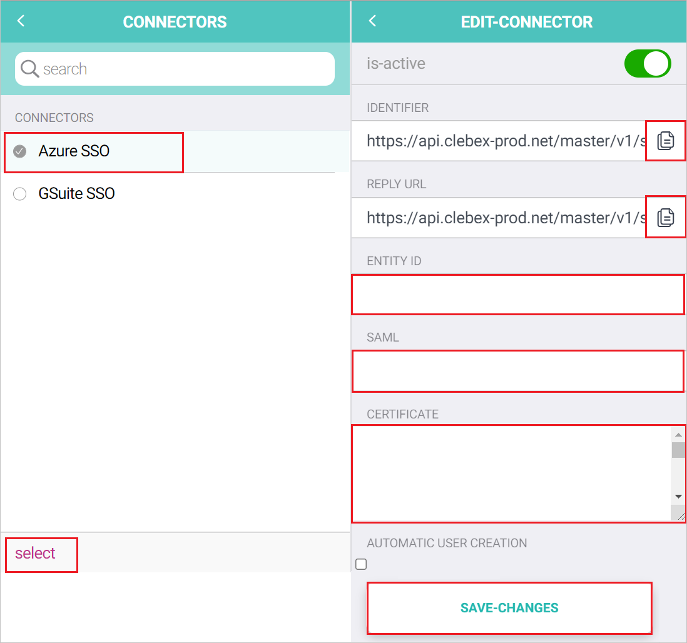

# Configure Clebex for Single sign-on with Microsoft Entra ID

In this article,  you learn how to integrate Clebex with Microsoft Entra ID. When you integrate Clebex with Microsoft Entra ID, you can:

* Control in Microsoft Entra ID who has access to Clebex.
* Enable your users to be automatically signed-in to Clebex with their Microsoft Entra accounts.
* Manage your accounts in one central location.

## Prerequisites

The scenario outlined in this article assumes that you already have the following prerequisites:

[!INCLUDE [common-prerequisites.md](~/identity/saas-apps/includes/common-prerequisites.md)]
* Clebex single sign-on (SSO) enabled subscription.

## Scenario description

In this article,  you configure and test Microsoft Entra SSO in a test environment.

* Clebex supports **SP** initiated SSO.

* Clebex supports **Just In Time** user provisioning.

* Clebex supports [Automated user provisioning](clebex-provisioning-tutorial.md).

## Add Clebex from the gallery

To configure the integration of Clebex into Microsoft Entra ID, you need to add Clebex from the gallery to your list of managed SaaS apps.

1. Sign in to the [Microsoft Entra admin center](https://entra.microsoft.com) as at least a [Cloud Application Administrator](~/identity/role-based-access-control/permissions-reference.md#cloud-application-administrator).
1. Browse to **Entra ID** > **Enterprise apps** > **New application**.
1. In the **Add from the gallery** section, type **Clebex** in the search box.
1. Select **Clebex** from results panel and then add the app. Wait a few seconds while the app is added to your tenant.

 [!INCLUDE [sso-wizard.md](~/identity/saas-apps/includes/sso-wizard.md)]

## Configure and test Microsoft Entra SSO for Clebex

Configure and test Microsoft Entra SSO with Clebex using a test user called **B.Simon**. For SSO to work, you need to establish a link relationship between a Microsoft Entra user and the related user in Clebex.

To configure and test Microsoft Entra SSO with Clebex, perform the following steps:

1. **[Configure Microsoft Entra SSO](#configure-azure-ad-sso)** - to enable your users to use this feature.
    1. **Create a Microsoft Entra test user** - to test Microsoft Entra single sign-on with B.Simon.
    1. **Assign the Microsoft Entra test user** - to enable B.Simon to use Microsoft Entra single sign-on.
1. **[Configure Clebex SSO](#configure-clebex-sso)** - to configure the single sign-on settings on application side.
    1. **[Create Clebex test user](#create-clebex-test-user)** - to have a counterpart of B.Simon in Clebex that's linked to the Microsoft Entra representation of user.
1. **[Test SSO](#test-sso)** - to verify whether the configuration works.

## Configure Microsoft Entra SSO

Follow these steps to enable Microsoft Entra SSO.

1. Sign in to the [Microsoft Entra admin center](https://entra.microsoft.com) as at least a [Cloud Application Administrator](~/identity/role-based-access-control/permissions-reference.md#cloud-application-administrator).
1. Browse to **Entra ID** > **Enterprise apps** > **Clebex** > **Single sign-on**.
1. On the **Select a single sign-on method** page, select **SAML**.
1. On the **Set up single sign-on with SAML** page, select the pencil icon for **Basic SAML Configuration** to edit the settings.

   

1. On the **Basic SAML Configuration** section, enter the values for the following fields:

    a. In the **Identifier** box, type a URL using the following pattern:
    `https://<CustomerName>.domain.extention/<ID>`

    b. In the **Reply URL** text box, type a URL using the following pattern:
    `https://<CustomerName>.domain.extention/<ID>`

    c. In the **Sign-on URL** text box, type a URL using the following pattern:
    `https://<CustomerName>.domain.extention/<ID>`

	> [!NOTE]
	> These values aren't real. Update these values with the actual Identifier, Reply URL and Sign-On URL. Contact [Clebex Client support team](mailto:support@clebex.net) to get these values. You can also refer to the patterns shown in the **Basic SAML Configuration** section.

1. On the **Set up single sign-on with SAML** page, in the **SAML Signing Certificate** section,  find **Certificate (Base64)** and select **Download** to download the certificate and save it on your computer.

	

1. On the **Set up Clebex** section, copy the appropriate URL(s) based on your requirement.

	

[!INCLUDE [create-assign-users-sso.md](~/identity/saas-apps/includes/create-assign-users-sso.md)]

## Configure Clebex SSO

1. In a different web browser window, sign in to your Clebex company site as an administrator

1. Go to the COMPANY ADMIN -> **Connectors** > **Single Sign On (SSO)** and select **select**.

    

1. In the CONNECTORS, select **Azure SSO** and perform the following steps in the EDIT-CONNECTOR section.

    

    a. Copy **IDENTIFIER** value, paste this value into the **Identifier** text box in the **Basic SAML Configuration** section.

    b. Copy **REPLY URL** value, paste this value into the **Reply URL** text box in the **Basic SAML Configuration** section.

    c. In the **ENTITY ID** textbox, paste the **Microsoft Entra Identifier** value which you copied previously.

    d. In the **SAML** textbox, paste the **Login URL** value which you copied previously.

    e. Open the downloaded **Certificate (Base64)** into Notepad and paste the content into the **CERTIFICATE** textbox.

    f. Select **SAVE-CHANGES**.

### Create Clebex test user

In this section, a user called Britta Simon is created in Clebex. Clebex supports just-in-time user provisioning, which is enabled by default. There's no action item for you in this section. If a user doesn't already exist in Clebex, a new one is created after authentication.

Clebex also supports automatic user provisioning, you can find more details [here](./clebex-provisioning-tutorial.md) on how to configure automatic user provisioning.

## Test SSO 

In this section, you test your Microsoft Entra single sign-on configuration with following options. 

* Select **Test this application**, this option redirects to Clebex Sign-on URL where you can initiate the login flow. 

* Go to Clebex Sign-on URL directly and initiate the login flow from there.

* You can use Microsoft My Apps. When you select the Clebex tile in the My Apps, this option redirects to Clebex Sign-on URL. For more information about the My Apps, see [Introduction to the My Apps](https://support.microsoft.com/account-billing/sign-in-and-start-apps-from-the-my-apps-portal-2f3b1bae-0e5a-4a86-a33e-876fbd2a4510).

## Related content

Once you configure Clebex you can enforce session control, which protects exfiltration and infiltration of your organization’s sensitive data in real time. Session control extends from Conditional Access. [Learn how to enforce session control with Microsoft Defender for Cloud Apps](/cloud-app-security/proxy-deployment-any-app).
