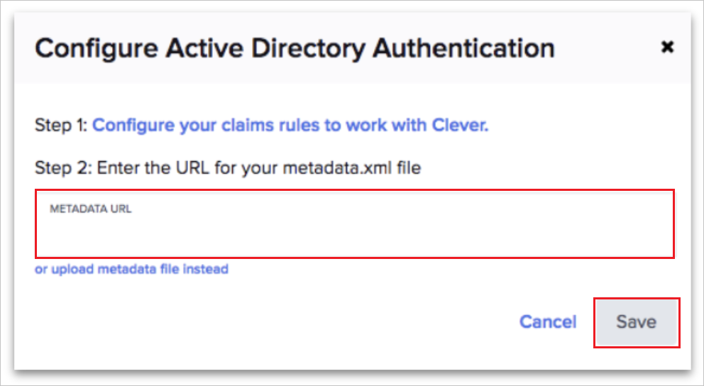

# Configure Clever for Single sign-on with Microsoft Entra ID

In this article,  you learn how to integrate Clever with Microsoft Entra ID. When you integrate Clever with Microsoft Entra ID, you can:

* Control in Microsoft Entra ID who has access to Clever.
* Enable your users to be automatically signed-in to Clever with their Microsoft Entra accounts.
* Manage your accounts in one central location.

## Prerequisites

The scenario outlined in this article assumes that you already have the following prerequisites:

[!INCLUDE [common-prerequisites.md](~/identity/saas-apps/includes/common-prerequisites.md)]
* Clever single sign-on (SSO) enabled subscription.

## Scenario description

In this article,  you configure and test Microsoft Entra SSO in a test environment.

* Clever supports **SP** initiated SSO.

> [!NOTE]
> Identifier of this application is a fixed string value so only one instance can be configured in one tenant.

## Add Clever from the gallery

To configure the integration of Clever into Microsoft Entra ID, you need to add Clever from the gallery to your list of managed SaaS apps.

1. Sign in to the [Microsoft Entra admin center](https://entra.microsoft.com) as at least a [Cloud Application Administrator](~/identity/role-based-access-control/permissions-reference.md#cloud-application-administrator).
1. Browse to **Entra ID** > **Enterprise apps** > **New application**.
1. In the **Add from the gallery** section, type **Clever** in the search box.
1. Select **Clever** from results panel and then add the app. Wait a few seconds while the app is added to your tenant.

 [!INCLUDE [sso-wizard.md](~/identity/saas-apps/includes/sso-wizard.md)]

## Configure and test Microsoft Entra SSO for Clever

Configure and test Microsoft Entra SSO with Clever using a test user called **B.Simon**. For SSO to work, you need to establish a link relationship between a Microsoft Entra user and the related user in Clever.

To configure and test Microsoft Entra SSO with Clever, perform the following steps:

1. **[Configure Microsoft Entra SSO](#configure-azure-ad-sso)** - to enable your users to use this feature.
    1. **Create a Microsoft Entra test user** - to test Microsoft Entra single sign-on with B.Simon.
    1. **Assign the Microsoft Entra test user** - to enable B.Simon to use Microsoft Entra single sign-on.
1. **[Configure Clever SSO](#configure-clever-sso)** - to configure the single sign-on settings on application side.
    1. **[Create Clever test user](#create-clever-test-user)** - to have a counterpart of B.Simon in Clever that's linked to the Microsoft Entra representation of user.
1. **[Test SSO](#test-sso)** - to verify whether the configuration works.

## Configure Microsoft Entra SSO

Follow these steps to enable Microsoft Entra SSO.

1. Sign in to the [Microsoft Entra admin center](https://entra.microsoft.com) as at least a [Cloud Application Administrator](~/identity/role-based-access-control/permissions-reference.md#cloud-application-administrator).
1. Browse to **Entra ID** > **Enterprise apps** > **Clever** > **Single sign-on**.
1. On the **Select a single sign-on method** page, select **SAML**.
1. On the **Set up single sign-on with SAML** page, select the pencil icon for **Basic SAML Configuration** to edit the settings.

   

1. On the **Basic SAML Configuration** section, perform the following steps:

    a. In the **Identifier (Entity ID)** text box, type the URL:
    `https://clever.com/oauth/saml/metadata.xml`

    b. In the **Reply URL** text box, type a URL using the following pattern:
    `https://clever.com/<COMPANY_NAME>`

	c. In the **Sign on URL** text box, type a URL using the following pattern:
    `https://clever.com/in/<COMPANY_NAME>`

	> [!NOTE]
	>  These values aren't real. Update these values with the actual Reply URL and Sign on URL. Contact [Clever Client support team](https://clever.com/about/contact/) to get the value. You can also refer to the patterns shown in the **Basic SAML Configuration** section.

1. On the **Set up single sign-on with SAML** page, In the **SAML Signing Certificate** section, select copy button to copy **App Federation Metadata Url** and save it on your computer.

	

[!INCLUDE [create-assign-users-sso.md](~/identity/saas-apps/includes/create-assign-users-sso.md)]

## Configure Clever SSO

1. In a different web browser window, log in to your Clever district dashboard as an administrator.

2. From the left navigation, select **Menu** > **Portal** > **SSO Settings**.

3. On the **SSO Settings** page, perform the following steps:
    
    a. Select **Add Login Method**.

    b. Select **Active Directory Authentication**. 

    c. Open the downloaded **App Federation Metadata Url** into Notepad and paste the content into the **Metadata URL** textbox in the **Configure Active Directory Authentication** dialog.

    

    d.Select **Save**.

### Create Clever test user

To enable Microsoft Entra users to sign to Clever, they must be provisioned into Clever.

In case of Clever, Work with [Clever Client support team](https://clever.com/about/contact/) to add the users in the Clever platform. Users must be created and activated before you use single sign-on.

> [!NOTE]
> You can use any other Clever user account creation tools or APIs provided by Clever to provision Microsoft Entra user accounts.

## Test SSO 

In this section, you test your Microsoft Entra single sign-on configuration with following options. 

* Select **Test this application**, this option redirects to Clever Sign-on URL where you can initiate the login flow. 

* Go to Clever Sign-on URL directly and initiate the login flow from there.

* You can use Microsoft My Apps. When you select the Clever tile in the My Apps, this option redirects to Clever Sign-on URL. For more information about the My Apps, see [Introduction to the My Apps](https://support.microsoft.com/account-billing/sign-in-and-start-apps-from-the-my-apps-portal-2f3b1bae-0e5a-4a86-a33e-876fbd2a4510).

## Related content

Once you configure Clever you can enforce Session control, which protects exfiltration and infiltration of your organization’s sensitive data in real time. Session control extends from Conditional Access. [Learn how to enforce session control with Microsoft Defender for Cloud Apps](/cloud-app-security/proxy-deployment-aad).
