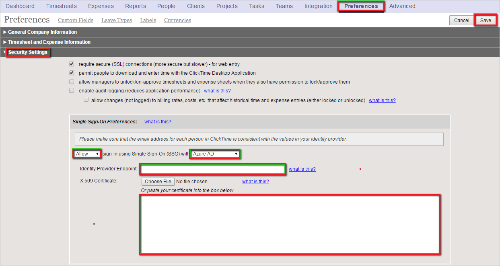
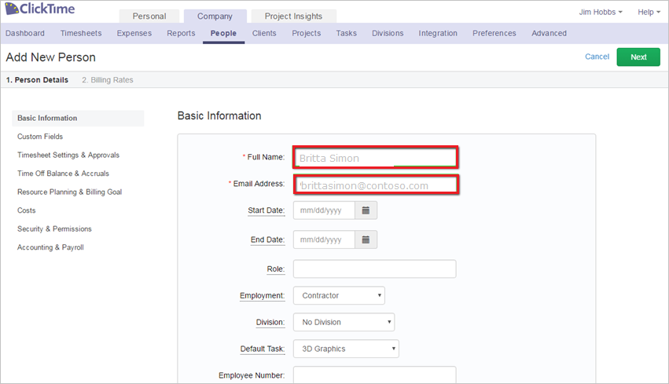

# Configure ClickTime for Single sign-on with Microsoft Entra ID

In this article,  you learn how to integrate ClickTime with Microsoft Entra ID. When you integrate ClickTime with Microsoft Entra ID, you can:

* Control in Microsoft Entra ID who has access to ClickTime.
* Enable your users to be automatically signed-in to ClickTime with their Microsoft Entra accounts.
* Manage your accounts in one central location.

## Prerequisites

The scenario outlined in this article assumes that you already have the following prerequisites:

[!INCLUDE [common-prerequisites.md](~/identity/saas-apps/includes/common-prerequisites.md)]
* ClickTime single sign-on (SSO) enabled subscription.

## Scenario description

In this article,  you configure and test Microsoft Entra single sign-on in a test environment.

* ClickTime supports **IDP** initiated SSO.

> [!NOTE]
> Identifier of this application is a fixed string value so only one instance can be configured in one tenant.

## Add ClickTime from the gallery

To configure the integration of ClickTime into Microsoft Entra ID, you need to add ClickTime from the gallery to your list of managed SaaS apps.

1. Sign in to the [Microsoft Entra admin center](https://entra.microsoft.com) as at least a [Cloud Application Administrator](~/identity/role-based-access-control/permissions-reference.md#cloud-application-administrator).
1. Browse to **Entra ID** > **Enterprise apps** > **New application**.
1. In the **Add from the gallery** section, type **ClickTime** in the search box.
1. Select **ClickTime** from results panel and then add the app. Wait a few seconds while the app is added to your tenant.

 [!INCLUDE [sso-wizard.md](~/identity/saas-apps/includes/sso-wizard.md)]

## Configure and test Microsoft Entra SSO for ClickTime

Configure and test Microsoft Entra SSO with ClickTime using a test user called **B.Simon**. For SSO to work, you need to establish a link relationship between a Microsoft Entra user and the related user in ClickTime.

To configure and test Microsoft Entra SSO with ClickTime, perform the following steps:

1. **[Configure Microsoft Entra SSO](#configure-azure-ad-sso)** - to enable your users to use this feature.
    1. **Create a Microsoft Entra test user** - to test Microsoft Entra single sign-on with B.Simon.
    1. **Assign the Microsoft Entra test user** - to enable B.Simon to use Microsoft Entra single sign-on.
1. **[Configure ClickTime SSO](#configure-clicktime-sso)** - to configure the single sign-on settings on application side.
    1. **[Create ClickTime test user](#create-clicktime-test-user)** - to have a counterpart of B.Simon in ClickTime that's linked to the Microsoft Entra representation of user.
1. **[Test SSO](#test-sso)** - to verify whether the configuration works.

## Configure Microsoft Entra SSO

Follow these steps to enable Microsoft Entra SSO.

1. Sign in to the [Microsoft Entra admin center](https://entra.microsoft.com) as at least a [Cloud Application Administrator](~/identity/role-based-access-control/permissions-reference.md#cloud-application-administrator).
1. Browse to **Entra ID** > **Enterprise apps** > **ClickTime** > **Single sign-on**.
1. On the **Select a single sign-on method** page, select **SAML**.
1. On the **Set up single sign-on with SAML** page, select the pencil icon for **Basic SAML Configuration** to edit the settings.

   

1. On the **Set up Single Sign-On with SAML** page, perform the following steps:

    a. In the **Identifier** text box, type the URL:
    `https://app.clicktime.com/sp/`

    b. In the **Reply URL** text box, type one of the following URLs:

    | **Reply URL** |
    |----|
    | `https://app.clicktime.com/Login/` |
    | `https://app.clicktime.com/App/Login/Consume.aspx` |

4. On the **Set up Single Sign-On with SAML** page, in the **SAML Signing Certificate** section, select **Download** to download the **Certificate (Base64)** from the given options as per your requirement and save it on your computer.

    

1. On the **Set up ClickTime** section, copy the appropriate URL(s) as per your requirement.

    

[!INCLUDE [create-assign-users-sso.md](~/identity/saas-apps/includes/create-assign-users-sso.md)]

## Configure ClickTime SSO

1. In a different web browser window, log into your ClickTime company site as an administrator.

1. In the toolbar on the top, select **Preferences**, and then select **Security Settings**.

1. In the **Single Sign-On Preferences** configuration section, perform the following steps:

    

    a.  Select **Allow** sign-in using Single Sign-On (SSO) with **Microsoft Entra ID**.

    b. In the **Identity Provider Endpoint** textbox, paste **Login URL**..

    c.  Open the **base-64 encoded certificate** downloaded from Azure portal in **Notepad**, copy the content, and then paste it into the **X.509 Certificate** textbox.

    d.  Select **Save**.

### Create ClickTime test user

In order to enable Microsoft Entra users to log into ClickTime, they must be provisioned into ClickTime.  
In the case of ClickTime, provisioning is a manual task.

> [!NOTE]
> You can use any other ClickTime user account creation tools or APIs provided by ClickTime to provision Microsoft Entra user accounts.

**To provision a user account, perform the following steps:**

1. Log in to your **ClickTime** tenant.

1. In the toolbar on the top, select **Company**, and then select **People**.

    

1. Select **Add Person**.

    

1. In the New Person section, perform the following steps:

    

    a.  In the **full name** textbox, type full name of user like **Britta Simon**. 

    b.  In the **email address** textbox, type the email of user like **brittasimon\@contoso.com**.

    > [!NOTE]
    > If you want to, you can set additional properties of the new person object.

    c.  Select **Save**.

## Test SSO

In this section, you test your Microsoft Entra single sign-on configuration with following options.

* Select **Test this application**, and you should be automatically signed in to the ClickTime for which you set up the SSO.

* You can use Microsoft My Apps. When you select the ClickTime tile in the My Apps, you should be automatically signed in to the ClickTime for which you set up the SSO. For more information, see [Microsoft Entra My Apps](/azure/active-directory/manage-apps/end-user-experiences#azure-ad-my-apps).

## Related content

Once you configure ClickTime you can enforce session control, which protects exfiltration and infiltration of your organization’s sensitive data in real time. Session control extends from Conditional Access. [Learn how to enforce session control with Microsoft Defender for Cloud Apps](/cloud-app-security/proxy-deployment-aad).
