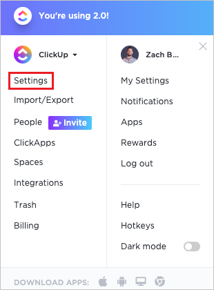
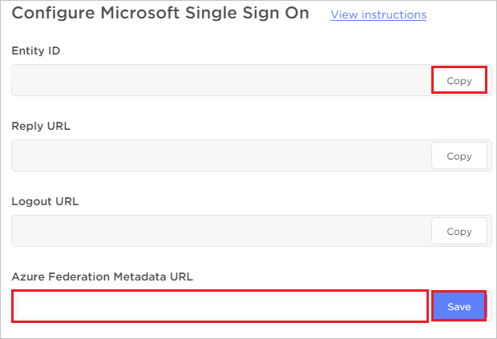
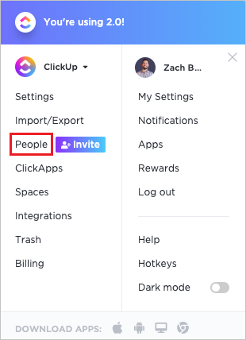

# Microsoft Entra integration with ClickUp Productivity Platform

In this article,  you learn how to integrate ClickUp Productivity Platform with Microsoft Entra ID. When you integrate ClickUp Productivity Platform with Microsoft Entra ID, you can:

* Control in Microsoft Entra ID who has access to ClickUp Productivity Platform.
* Enable your users to be automatically signed-in to ClickUp Productivity Platform with their Microsoft Entra accounts.
* Manage your accounts in one central location.

## Prerequisites
The scenario outlined in this article assumes that you already have the following prerequisites:
[!INCLUDE [common-prerequisites.md](~/identity/saas-apps/includes/common-prerequisites.md)]
* ClickUp Productivity Platform single sign-on (SSO) enabled subscription.

## Scenario description

In this article,  you configure and test Microsoft Entra single sign-on in a test environment.

* ClickUp Productivity Platform supports **SP** initiated SSO.

## Add ClickUp Productivity Platform from the gallery

To configure the integration of ClickUp Productivity Platform into Microsoft Entra ID, you need to add ClickUp Productivity Platform from the gallery to your list of managed SaaS apps.

1. Sign in to the [Microsoft Entra admin center](https://entra.microsoft.com) as at least a [Cloud Application Administrator](~/identity/role-based-access-control/permissions-reference.md#cloud-application-administrator).
1. Browse to **Entra ID** > **Enterprise apps** > **New application**.
1. In the **Add from the gallery** section, type **ClickUp Productivity Platform** in the search box.
1. Select **ClickUp Productivity Platform** from results panel and then add the app. Wait a few seconds while the app is added to your tenant.

 Alternatively, you can also use the [Enterprise App Configuration Wizard](https://portal.office.com/AdminPortal/home?Q=Docs#/azureadappintegration). In this wizard, you can add an application to your tenant, add users/groups to the app, assign roles, and walk through the SSO configuration as well. [Learn more about Microsoft 365 wizards.](/microsoft-365/admin/misc/azure-ad-setup-guides)

## Configure and test Microsoft Entra SSO for ClickUp Productivity Platform

Configure and test Microsoft Entra SSO with ClickUp Productivity Platform using a test user called **B.Simon**. For SSO to work, you need to establish a link relationship between a Microsoft Entra user and the related user in ClickUp Productivity Platform.

To configure and test Microsoft Entra SSO with ClickUp Productivity Platform, perform the following steps:

1. **[Configure Microsoft Entra SSO](#configure-azure-ad-sso)** - to enable your users to use this feature.
    1. **Create a Microsoft Entra test user** - to test Microsoft Entra single sign-on with B.Simon.
    1. **Assign the Microsoft Entra test user** - to enable B.Simon to use Microsoft Entra single sign-on.
1. **[Configure ClickUp Productivity Platform SSO](#configure-clickup-productivity-platform-sso)** - to configure the single sign-on settings on application side.
    1. **[Create ClickUp Productivity Platform test user](#create-clickup-productivity-platform-test-user)** - to have a counterpart of B.Simon in ClickUp Productivity Platform that's linked to the Microsoft Entra representation of user.
1. **[Test SSO](#test-sso)** - to verify whether the configuration works.

## Configure Microsoft Entra SSO

Follow these steps to enable Microsoft Entra SSO.

1. Sign in to the [Microsoft Entra admin center](https://entra.microsoft.com) as at least a [Cloud Application Administrator](~/identity/role-based-access-control/permissions-reference.md#cloud-application-administrator).
1. Browse to **Entra ID** > **Enterprise apps** > **ClickUp Productivity Platform** > **Single sign-on**.
1. On the **Select a single sign-on method** page, select **SAML**.
1. On the **Set up single sign-on with SAML** page, select the pencil icon for **Basic SAML Configuration** to edit the settings.

   

1. On the **Basic SAML Configuration** section, perform the following steps:

    a. In the **Sign on URL** text box, type the URL:
    `https://app.clickup.com/login/sso`

    b. In the **Identifier (Entity ID)** text box, type a URL using the following pattern:
    `https://api.clickup.com/v1/team/<team_id>/microsoft`

    > [!NOTE]
    > The Identifier value isn't real. Update this value with the actual Identifier, which is explained later in this article.

1. On the **Set up Single Sign-On with SAML** page, In the **SAML Signing Certificate** section, select copy button to copy **App Federation Metadata Url** and save it on your computer.

    

[!INCLUDE [create-assign-users-sso.md](~/identity/saas-apps/includes/create-assign-users-sso.md)]

## Configure ClickUp Productivity Platform SSO

1. In a different web browser window, sign-on to your ClickUp Productivity Platform tenant as an administrator.

2. Select the **User profile**, and then select **Settings**.

    

    

3. Select **Microsoft**, under Single Sign-On (SSO) Provider.

    

4. On the **Configure Microsoft Single Sign On** page, perform the following steps:

    

    a. Select **Copy** to copy the Entity ID value and paste it into the **Identifier (Entity ID)** textbox in the **Basic SAML Configuration** section.

    b. In the **Azure Federation Metadata URL** textbox, paste the App Federation Metadata URL value, which you have copied and then select **Save**.

5. To complete the setup, select **Authenticate With Microsoft to complete setup** and authenticate with microsoft account.

    

### Create ClickUp Productivity Platform test user

1. In a different web browser window, sign-on to your ClickUp Productivity Platform tenant as an administrator.

2. Select the **User profile**, and then select **People**.

    

    

3. Enter the email address of the user in the textbox and select **Invite**.

    

    > [!NOTE]
    > The user will receive the notification and must accept the invitation to activate the account.

## Test SSO

In this section, you test your Microsoft Entra single sign-on configuration with following options. 

* Select **Test this application**, this option redirects to ClickUp Productivity Platform Sign-on URL where you can initiate the login flow. 

* Go to ClickUp Productivity Platform Sign-on URL directly and initiate the login flow from there.

* You can use Microsoft My Apps. When you select the ClickUp Productivity Platform tile in the My Apps, this option redirects to ClickUp Productivity Platform Sign-on URL. For more information about the My Apps, see [Introduction to the My Apps](https://support.microsoft.com/account-billing/sign-in-and-start-apps-from-the-my-apps-portal-2f3b1bae-0e5a-4a86-a33e-876fbd2a4510).

## Related content

Once you configure ClickUp Productivity Platform you can enforce session control, which protects exfiltration and infiltration of your organization’s sensitive data in real time. Session control extends from Conditional Access. [Learn how to enforce session control with Microsoft Defender for Cloud Apps](/cloud-app-security/proxy-deployment-any-app).
