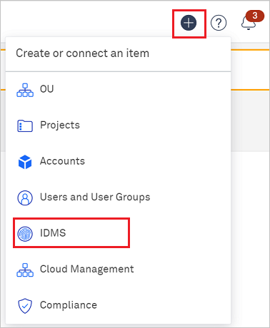
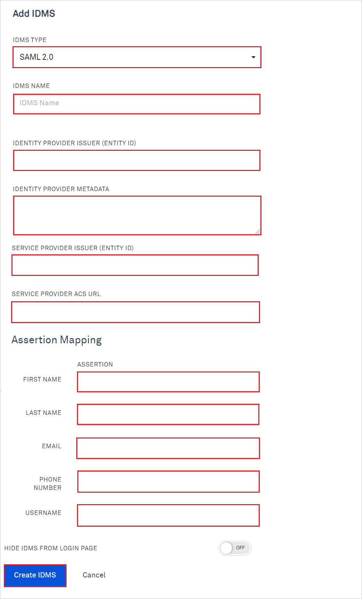

# Configure Kion (formerly cloudtamer.io) for Single sign-on with Microsoft Entra ID

In this article,  you learn how to integrate Kion with Microsoft Entra ID. When you integrate Kion with Microsoft Entra ID, you can:

* Control in Microsoft Entra ID who has access to Kion.
* Enable your users to be automatically signed-in to Kion with their Microsoft Entra accounts.
* Manage your accounts in one central location.

## Prerequisites

The scenario outlined in this article assumes that you already have the following prerequisites:

[!INCLUDE [common-prerequisites.md](~/identity/saas-apps/includes/common-prerequisites.md)]
* Kion single sign-on (SSO) enabled subscription.

## Scenario description

In this article,  you configure and test Microsoft Entra SSO in a test environment.

* Kion supports **IDP** initiated SSO.
* Kion supports **Just In Time** user provisioning.

## Add Kion (formerly cloudtamer.io) from the gallery

To configure the integration of Kion into Microsoft Entra ID, you need to add Kion from the gallery to your list of managed SaaS apps.

1. Sign in to the [Microsoft Entra admin center](https://entra.microsoft.com) as at least a [Cloud Application Administrator](~/identity/role-based-access-control/permissions-reference.md#cloud-application-administrator).
1. Browse to **Entra ID** > **Enterprise apps** > **New application**.
1. In the **Add from the gallery** section, type **Kion** in the search box.
1. Select **Kion** from results panel and then add the app. Wait a few seconds while the app is added to your tenant.

 [!INCLUDE [sso-wizard.md](~/identity/saas-apps/includes/sso-wizard.md)]

## Configure and test Microsoft Entra SSO for Kion (formerly cloudtamer.io)

Configure and test Microsoft Entra SSO with Kion using a test user called **B.Simon**. For SSO to work, you need to establish a link relationship between a Microsoft Entra user and the related user in Kion.

To configure and test Microsoft Entra SSO with Kion, perform the following steps:

1. **[Configure Microsoft Entra SSO](#configure-azure-ad-sso)** - to enable your users to use this feature.
    1. **Create a Microsoft Entra test user** - to test Microsoft Entra single sign-on with B.Simon.
    1. **Assign the Microsoft Entra test user** - to enable B.Simon to use Microsoft Entra single sign-on.
1. **[Configure Kion SSO](#configure-kion-sso)** - to configure the single sign-on settings on application side.
    1. **[Create Kion test user](#create-kion-test-user)** - to have a counterpart of B.Simon in Kion that's linked to the Microsoft Entra representation of user.
1. **[Test SSO](#test-sso)** - to verify whether the configuration works.
1. **[Group assertions](#group-assertions)** - to set group assertions for Microsoft Entra ID and Kion.

### Begin Kion SSO Configuration

1. Log in to Kion website as an administrator.

1. Select **+** plus icon at the top right corner and select **IDMS**.

    

1. Select **SAML 2.0** as the IDMS Type.

1. Leave this screen open and copy values from this screen into the Microsoft Entra configuration.

## Configure Microsoft Entra SSO

Follow these steps to enable Microsoft Entra SSO.

1. Sign in to the [Microsoft Entra admin center](https://entra.microsoft.com) as at least a [Cloud Application Administrator](~/identity/role-based-access-control/permissions-reference.md#cloud-application-administrator).
1. Browse to **Entra ID** > **Enterprise apps** > **Kion** > **Single sign-on**.
1. On the **Select a single sign-on method** page, select **SAML**.
1. On the **Set up single sign-on with SAML** page, select the pencil icon for **Basic SAML Configuration** to edit the settings.

   

1. On the **Basic SAML Configuration** section, perform the following steps:

    a. In the **Identifier** text box, paste the **SERVICE PROVIDER ISSUER (ENTITY ID)** from Kion into this box.

    b. In the **Reply URL** text box, paste the **SERVICE PROVIDER ACS URL** from Kion into this box.

1. On the **Set up single sign-on with SAML** page, in the **SAML Signing Certificate** section,  find **Federation Metadata XML** and select **Download** to download the certificate and save it on your computer.

	

1. On the **Set up Kion** section, copy the appropriate URL(s) based on your requirement.

	

[!INCLUDE [create-assign-users-sso.md](~/identity/saas-apps/includes/create-assign-users-sso.md)]

## Configure Kion SSO

1. Perform the following steps in the **Add IDMS** page:

    

    a. In the **IDMS Name** give a name that the users will recognize from the Login screen.

    b. In the **IDENTITY PROVIDER ISSUER (ENTITY ID)** textbox, paste the **Identifier** value which you copied previously.

    c. Open the downloaded **Federation Metadata XML** into Notepad and paste the content into the **IDENTITY PROVIDER METADATA** textbox.

    d. Copy **SERVICE PROVIDER ISSUER (ENTITY ID)** value, paste this value into the **Identifier** text box in the Basic SAML Configuration section.

    e. Copy **SERVICE PROVIDER ACS URL** value, paste this value into the **Reply URL** text box in the Basic SAML Configuration section.

    f. Under Assertion Mapping, enter the following values:

    | Field | Value |
    |-----------|-------|
    | First Name | `http://schemas.xmlsoap.org/ws/2005/05/identity/claims/givenname` |
    | Last Name | `http://schemas.xmlsoap.org/ws/2005/05/identity/claims/surname` |
    | Email | `http://schemas.xmlsoap.org/ws/2005/05/identity/claims/name` |
    |  Username | `http://schemas.xmlsoap.org/ws/2005/05/identity/claims/name` |

1. Select **Create IDMS**.

### Create Kion test user

In this section, a user called Britta Simon is created in Kion. Kion supports just-in-time user provisioning, which is enabled by default. There's no action item for you in this section. If a user doesn't already exist in Kion, a new one is created after authentication.

## Test SSO 

In this section, you test your Microsoft Entra single sign-on configuration with following options.

* Select **Test this application**, and you should be automatically signed in to the Kion for which you set up the SSO.

* You can use Microsoft My Apps. When you select the Kion tile in the My Apps, you should be automatically signed in to the Kion for which you set up the SSO. For more information, see [Microsoft Entra My Apps](/azure/active-directory/manage-apps/end-user-experiences#azure-ad-my-apps).

## Group assertions

To easily manage Kion user permissions by using existing Microsoft Entra groups, complete these steps:

### Microsoft Entra configuration

1. Sign in to the [Microsoft Entra admin center](https://entra.microsoft.com) as at least a [Cloud Application Administrator](~/identity/role-based-access-control/permissions-reference.md#cloud-application-administrator).
1. Browse to **Entra ID** > **Enterprise apps**.
1. In the list, select the enterprise application for Kion.
1. On **Overview**, in the left menu, select **Single sign-on**.
1. On **Single Sign-On**, under **User Attributes & Claims**, select **Edit**.
1. Select **Add a group claim**. 
   > [!NOTE]
   > You can have only one group claim. If this option is disabled, you might already have a group claim defined.
1. On **Group Claims**, select the groups that should be returned in the claim:
   - If you always have every group you intend to use in Kion assigned to this enterprise application, select **Groups assigned to the application**.
   - If you want all groups to appear (this selection can cause a large number of group assertions and might be subject to limits), select **Groups assigned to the application**.
1. For **Source attribute**, leave the default **Group ID**.
1. Select the **Customize the name of the group claim** checkbox.
1. For **Name**, enter **memberOf**.
1. Select **Save** to complete the configuration with Microsoft Entra ID.

### Kion configuration

1. In Kion, go to **Users** > **Identity Management Systems**.
1. Select the IDMS that you've created for Microsoft Entra ID.
1. On the overview page, select the **User Group Associations** tab.
1. For each user group mapping that you want, complete these steps:
   1. Select **Add** > **Add New**.
   1. In the dialog that appears:
      1. For **Name**, enter **memberOf**.
      1. For **Regex**, enter the object ID (from Microsoft Entra ID) of the group you want to match.
      1. For **User Group**, select the Kion internal group you want to map to the group in **Regex**.
      1. Select the **Update on Login** checkbox.
   1. Select **Add** to add the group association.

## Related content

Once you configure Kion you can enforce session control, which protects exfiltration and infiltration of your organization’s sensitive data in real time. Session control extends from Conditional Access. [Learn how to enforce session control with Microsoft Cloud App Security](/cloud-app-security/proxy-deployment-any-app).
