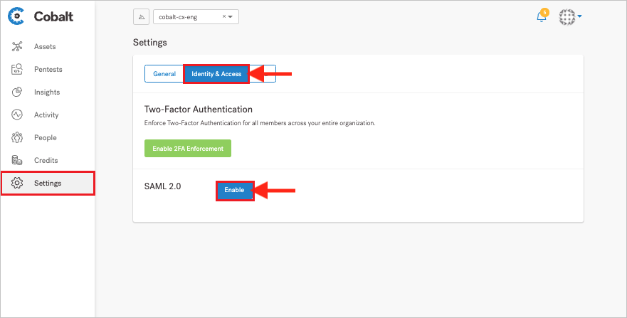
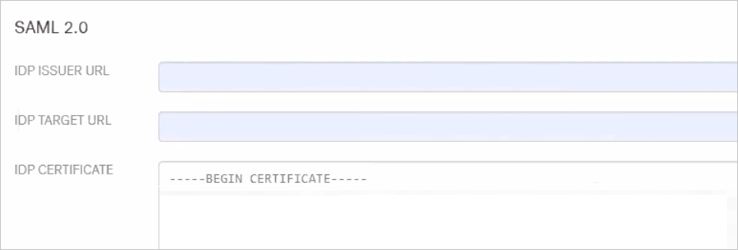

# Configure Cobalt for Single sign-on with Microsoft Entra ID

In this article,  you learn how to integrate Cobalt with Microsoft Entra ID. When you integrate Cobalt with Microsoft Entra ID, you can:

* Control in Microsoft Entra ID who has access to Cobalt.
* Enable your users to be automatically signed-in to Cobalt with their Microsoft Entra accounts.
* Manage your accounts in one central location.

## Prerequisites

The scenario outlined in this article assumes that you already have the following prerequisites:

[!INCLUDE [common-prerequisites.md](~/identity/saas-apps/includes/common-prerequisites.md)]
* Cobalt single sign-on (SSO) enabled subscription.

## Scenario description

In this article,  you configure and test Microsoft Entra SSO in a test environment.

* Cobalt supports **SP** initiated SSO.

> [!NOTE]
> Identifier of this application is a fixed string value so only one instance can be configured in one tenant.

## Add Cobalt from the gallery

To configure the integration of Cobalt into Microsoft Entra ID, you need to add Cobalt from the gallery to your list of managed SaaS apps.

1. Sign in to the [Microsoft Entra admin center](https://entra.microsoft.com) as at least a [Cloud Application Administrator](~/identity/role-based-access-control/permissions-reference.md#cloud-application-administrator).
1. Browse to **Entra ID** > **Enterprise apps** > **New application**.
1. In the **Add from the gallery** section, type **Cobalt** in the search box.
1. Select **Cobalt** from results panel and then add the app. Wait a few seconds while the app is added to your tenant.

 [!INCLUDE [sso-wizard.md](~/identity/saas-apps/includes/sso-wizard.md)]

## Configure and test Microsoft Entra SSO for Cobalt

Configure and test Microsoft Entra SSO with Cobalt using a test user called **B.Simon**. For SSO to work, you need to establish a link relationship between a Microsoft Entra user and the related user in Cobalt.

To configure and test Microsoft Entra SSO with Cobalt, perform the following steps:

1. **[Configure Microsoft Entra SSO](#configure-azure-ad-sso)** - to enable your users to use this feature.
    1. **Create a Microsoft Entra test user** - to test Microsoft Entra single sign-on with B.Simon.
    1. **Assign the Microsoft Entra test user** - to enable B.Simon to use Microsoft Entra single sign-on.
1. **[Configure Cobalt SSO](#configure-cobalt-sso)** - to configure the single sign-on settings on application side.
    1. **[Create Cobalt test user](#create-cobalt-test-user)** - to have a counterpart of B.Simon in Cobalt that's linked to the Microsoft Entra representation of user.
1. **[Test SSO](#test-sso)** - to verify whether the configuration works.

## Configure Microsoft Entra SSO

Follow these steps to enable Microsoft Entra SSO.

1. Sign in to the [Microsoft Entra admin center](https://entra.microsoft.com) as at least a [Cloud Application Administrator](~/identity/role-based-access-control/permissions-reference.md#cloud-application-administrator).
1. Browse to **Entra ID** > **Enterprise apps** > **Cobalt** > **Single sign-on**.
1. On the **Select a single sign-on method** page, select **SAML**.
1. On the **Set up single sign-on with SAML** page, select the pencil icon for **Basic SAML Configuration** to edit the settings.

   

1. On the **Basic SAML Configuration** section, perform the following step:

    In the **Sign-on URL** text box, type a URL using the following pattern:
    `https://brightside-prod-<INSTANCENAME>.cobaltdl.com`

	> [!NOTE]
	> The value isn't real. Update the value with the actual Sign-On URL. Contact [Cobalt Client support team](https://cobaltio.zendesk.com/hc/requests/new) to get the value. You can also refer to the patterns shown in the **Basic SAML Configuration** section.

5. Cobalt application expects the SAML assertions in a specific format, which requires you to add custom attribute mappings to your SAML token attributes configuration. The following screenshot shows the list of default attributes.

	

6. In addition to above, Cobalt application expects few more attributes to be passed back in SAML response which are shown below. These attributes are also pre populated but you can review them as per your requirement.

	| Name | Source Attribute|
	| ---------------| --------- |
	| Mail | user.mail |
	| Othermail | user.othermail |

1. On the **Set up single sign-on with SAML** page, in the **SAML Signing Certificate** section,  find **Certificate (Base64)** and select **Download** to download the certificate and save it on your computer.

	

1. On the **Set up Cobalt** section, copy the appropriate URL(s) based on your requirement.

	

[!INCLUDE [create-assign-users-sso.md](~/identity/saas-apps/includes/create-assign-users-sso.md)]

## Configure Cobalt SSO

1. Login to the Cobalt website as an administrator.

1. Select **Settings** on the left menu.

1. Select **Identity & Access**, and select **Enable** in SAML 2.0.

    

1. Perform the following steps in the SAML 2.0 section.

    

    1. In the **IDP ISSUER URL** textbox, paste the **Microsoft Entra Identifier** value which you copied previously.
    1. In the **IDP TARGET URL** textbox, paste the **Login URL** value which you copied previously.
    1. Open the downloaded **Certificate (Base64)** into Notepad and paste the content into the **IDP CERTIFICATE** textbox.

1. Select **SAVE**.

> [!NOTE]
> Please follow [this](https://cobaltio.zendesk.com/hc/articles/360058406992-Setting-up-SAML-for-Azure-AD) article for more information on how to configure SSO on Cobalt side.

### Create Cobalt test user

1. Login to the Cobalt website as an administrator.
1. Navigate to the **People -> Organization** and select Invite Users.
1. In the overlay that appears, specify the email addresses of users that you want to invite. Enter the email, and then select **Add** or press **Enter**.
1. Use commas to separate multiple email addresses.
1. For each user, select a role: **Member** or **Owner**.
1. Both members and owners have access to all assets and pentests of an organization.
1. Select **Invite** to confirm.

## Test SSO

In this section, you test your Microsoft Entra single sign-on configuration with following options. 

* Select **Test this application**, this option redirects to Cobalt Sign-on URL where you can initiate the login flow. 

* Go to Cobalt Sign-on URL directly and initiate the login flow from there.

* You can use Microsoft My Apps. When you select the Cobalt tile in the My Apps, this option redirects to Cobalt Sign-on URL. For more information, see [Microsoft Entra My Apps](/azure/active-directory/manage-apps/end-user-experiences#azure-ad-my-apps).

## Related content

After you configure Cobalt, you can enforce session control, which protects exfiltration and infiltration of your organization’s sensitive data in real time. Session control extends from Conditional Access. [Learn how to enforce session control with Microsoft Cloud App Security](/cloud-app-security/proxy-deployment-aad).
