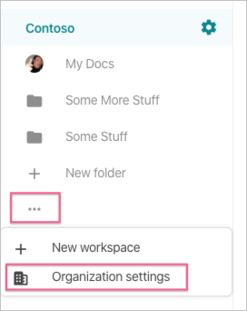
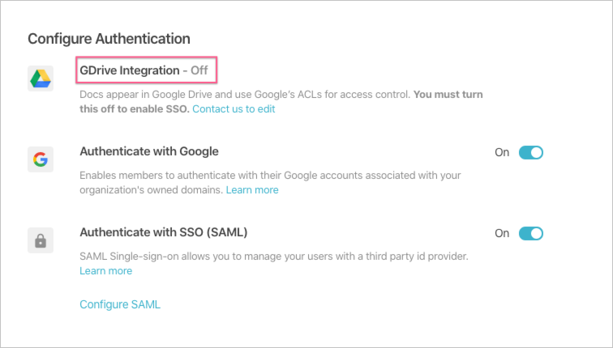
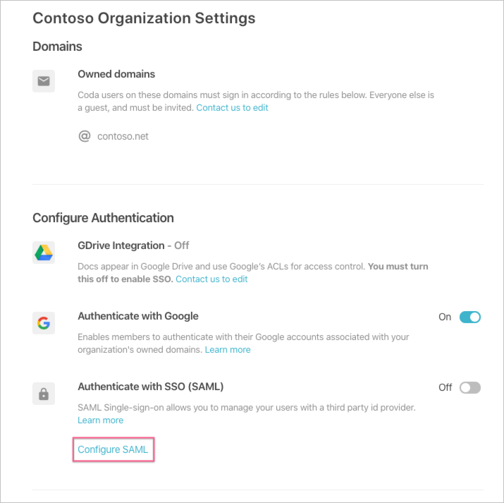
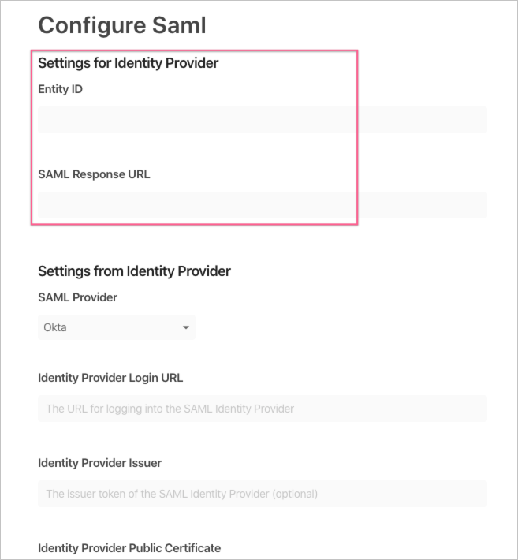

# Configure Coda for Single sign-on with Microsoft Entra ID

In this article,  you learn how to integrate Coda with Microsoft Entra ID. When you integrate Coda with Microsoft Entra ID, you can:

* Control in Microsoft Entra ID who has access to Coda.
* Enable your users to be automatically signed-in to Coda with their Microsoft Entra accounts.
* Manage your accounts in one central location.

## Prerequisites

The scenario outlined in this article assumes that you already have the following prerequisites:

[!INCLUDE [common-prerequisites.md](~/identity/saas-apps/includes/common-prerequisites.md)]
* Coda single sign-on (SSO) enabled subscription (Enterprise) with GDrive integration disabled. Contact [Coda support team](mailto:support@coda.io) to disable GDrive integration for your Organization if it's currently enabled.

## Scenario description

In this article,  you configure and test Microsoft Entra SSO in a test environment.

* Coda supports **IDP** initiated SSO.

* Coda supports **Just In Time** user provisioning.

* Coda supports [Automated user provisioning](coda-provisioning-tutorial.md).

## Add Coda from the gallery

To configure the integration of Coda into Microsoft Entra ID, you need to add Coda from the gallery to your list of managed SaaS apps.

1. Sign in to the [Microsoft Entra admin center](https://entra.microsoft.com) as at least a [Cloud Application Administrator](~/identity/role-based-access-control/permissions-reference.md#cloud-application-administrator).
1. Browse to **Entra ID** > **Enterprise apps** > **New application**.
1. In the **Add from the gallery** section, type **Coda** in the search box.
1. Select **Coda** from results panel and then add the app. Wait a few seconds while the app is added to your tenant.

 [!INCLUDE [sso-wizard.md](~/identity/saas-apps/includes/sso-wizard.md)]

## Configure and test Microsoft Entra SSO for Coda

Configure and test Microsoft Entra SSO with Coda using a test user called **B.Simon**. For SSO to work, you need to establish a link relationship between a Microsoft Entra user and the related user in Coda.

To configure and test Microsoft Entra SSO with Coda, perform the following steps:

1. **[Begin configuration of Coda SSO](#begin-configuration-of-coda-sso)** - to begin configuration of SSO in Coda.
1. **[Configure Microsoft Entra SSO](#configure-azure-ad-sso)** - to enable your users to use this feature.
   1. **Create a Microsoft Entra test user** - to test Microsoft Entra single sign-on with B.Simon.
   1. **Assign the Microsoft Entra test user** - to enable B.Simon to use Microsoft Entra single sign-on.
1. **[Configure Coda SSO](#configure-coda-sso)** - to complete configuration of single sign-on settings in Coda.
   1. **[Create Coda test user](#create-coda-test-user)** - to have a counterpart of B.Simon in Coda that's linked to the Microsoft Entra representation of user.
1. **[Test SSO](#test-sso)** - to verify whether the configuration works.

## Begin configuration of Coda SSO

Follow these steps in Coda to begin.

1. In Coda, open your **Organization settings** panel.

   

1. Ensure that your organization has GDrive Integration turned off. If it's currently enabled, contact the [Coda support team](mailto:support@coda.io) to help you migrate off GDrive.

   

1. Under **Authenticate with SSO (SAML)**, select the **Configure SAML** option.

   

1. Note the values for **Entity ID** and **SAML Response URL**, which you need in subsequent steps.

   

## Configure Microsoft Entra SSO

Follow these steps to enable Microsoft Entra SSO.

1. Sign in to the [Microsoft Entra admin center](https://entra.microsoft.com) as at least a [Cloud Application Administrator](~/identity/role-based-access-control/permissions-reference.md#cloud-application-administrator).
1. Browse to **Entra ID** > **Enterprise apps** > **Coda** > **Single sign-on**.
1. On the **Select a single sign-on method** page, select **SAML**.
1. On the **Set up single sign-on with SAML** page, select the pencil icon for **Basic SAML Configuration** to edit the settings.

   

1. On the **Set up single sign-on with SAML** page, perform the following steps:

   a. In the **Identifier** text box, enter the "Entity ID" from above. It should follow the pattern:
   `https://coda.io/samlId/<CUSTOMID>`

   b. In the **Reply URL** text box, enter the "SAML Response URL" from above. It should follow the pattern:
   `https://coda.io/login/sso/saml/<CUSTOMID>/consume`

   > [!NOTE]
   > Your values will differ from the above; you can find your values in Coda's "Configure SAML" console. Update these values with the actual Identifier and Reply URL.

1. On the **Set up single sign-on with SAML** page, in the **SAML Signing Certificate** section, find **Certificate (Base64)** and select **Download** to download the certificate and save it on your computer.

   

1. On the **Set up Coda** section, copy the appropriate URL(s) based on your requirement.

   

[!INCLUDE [create-assign-users-sso.md](~/identity/saas-apps/includes/create-assign-users-sso.md)]

## Configure Coda SSO

To complete the setup, you enter values from Microsoft Entra ID in the Coda **Configure Saml** panel.

1. In Coda, open your **Organization settings** panel.
1. Under **Authenticate with SSO (SAML)**, select the **Configure SAML** option.
1. Set **SAML Provider** to **Microsoft Entra ID**.
1. In **Identity Provider Login URL**, paste the **Login URL** from the Azure console.
1. In **Identity Provider Issuer**, paste the **Microsoft Entra Identifier** from the Azure console.
1. In **Identity Provider Public Certificate**, select the **Upload Certificate** option and select the certificate file you downloaded earlier.
1. Select **Save**.

This completes the work necessary for the SAML SSO connection setup.

### Create Coda test user

In this section, a user called Britta Simon is created in Coda. Coda supports just-in-time user provisioning, which is enabled by default. There's no action item for you in this section. If a user doesn't already exist in Coda, a new one is created after authentication.

Coda also supports automatic user provisioning, you can find more details [here](./coda-provisioning-tutorial.md) on how to configure automatic user provisioning.

## Test SSO

In this section, you test your Microsoft Entra single sign-on configuration with following options.

* Select **Test this application**, and you should be automatically signed in to the Coda for which you set up the SSO.

* You can use Microsoft My Apps. When you select the Coda tile in the My Apps, you should be automatically signed in to the Coda for which you set up the SSO. For more information about the My Apps, see [Introduction to the My Apps](https://support.microsoft.com/account-billing/sign-in-and-start-apps-from-the-my-apps-portal-2f3b1bae-0e5a-4a86-a33e-876fbd2a4510).

## Related content

Once you configure Coda you can enforce session control, which protects exfiltration and infiltration of your organization’s sensitive data in real time. Session control extends from Conditional Access. [Learn how to enforce session control with Microsoft Defender for Cloud Apps](/cloud-app-security/proxy-deployment-aad).
