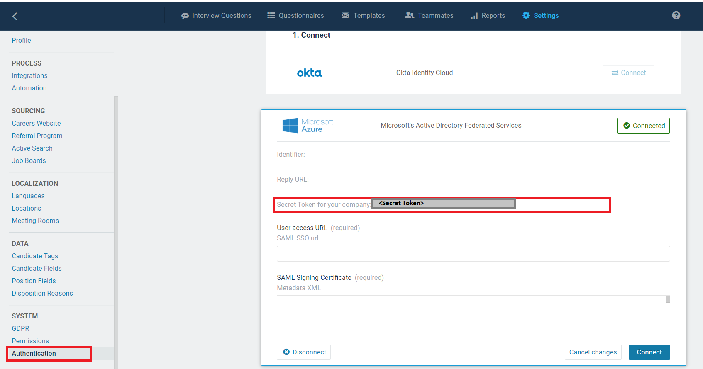
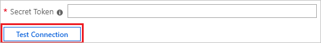
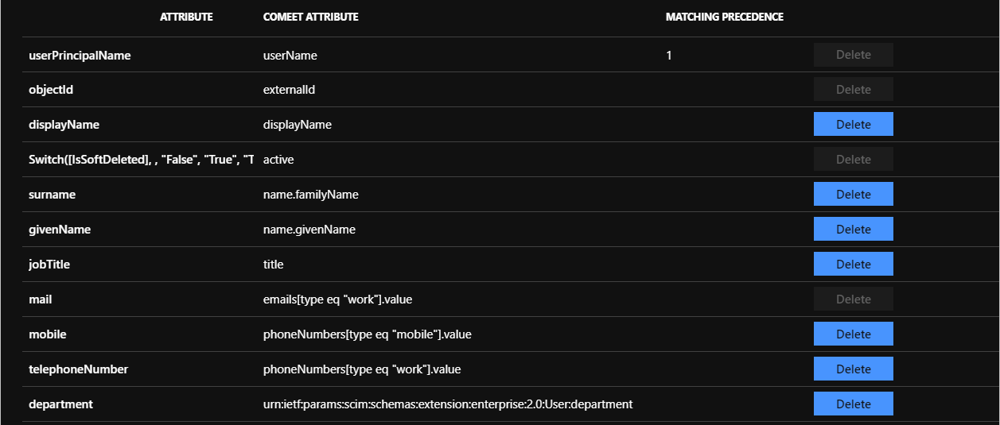

# Configure Comeet Recruiting Software for automatic user provisioning with Microsoft Entra ID

The objective of this article is to demonstrate the steps to be performed in Comeet Recruiting Software and Microsoft Entra ID to configure Microsoft Entra ID to automatically provision and de-provision users and/or groups to Comeet Recruiting Software.

> [!NOTE]
> This article describes a connector built on top of the Microsoft Entra user provisioning service. For important details on what this service does, how it works, and frequently asked questions, see [Automate user provisioning and deprovisioning to SaaS applications with Microsoft Entra ID](~/identity/app-provisioning/user-provisioning.md).
>

## Prerequisites

The scenario outlined in this article assumes that you already have the following prerequisites:

[!INCLUDE [common-prerequisites.md](~/identity/saas-apps/includes/common-prerequisites.md)]
* [A Comeet Recruiting Software tenant](https://www.comeet.co/)
* A user account in Comeet Recruiting Software with Admin permissions.

> [!NOTE]
> This integration is also available to use from Microsoft Entra US Government Cloud environment. You can find this application in the Microsoft Entra US Government Cloud Application Gallery and configure it in the same way as you do from public cloud.
## Add Comeet Recruiting Software from the gallery

Before configuring Comeet Recruiting Software for automatic user provisioning with Microsoft Entra ID, you need to add Comeet Recruiting Software from the Microsoft Entra application gallery to your list of managed SaaS applications.

**To add Comeet Recruiting Software from the Microsoft Entra application gallery, perform the following steps:**

1. Sign in to the [Microsoft Entra admin center](https://entra.microsoft.com) as at least a [Cloud Application Administrator](~/identity/role-based-access-control/permissions-reference.md#cloud-application-administrator).
1. Browse to **Entra ID** > **Enterprise apps** > **New application**.
1. In the **Add from the gallery** section, type **Comeet Recruiting Software**, select **Comeet Recruiting Software** in the search box.
1. Select **Comeet Recruiting Software** from results panel and then add the app. Wait a few seconds while the app is added to your tenant.
	

## Assigning users to Comeet Recruiting Software

Microsoft Entra ID uses a concept called *assignments* to determine which users should receive access to selected apps. In the context of automatic user provisioning, only the users and/or groups that have been assigned to an application in Microsoft Entra ID are synchronized.

Before configuring and enabling automatic user provisioning, you should decide which users and/or groups in Microsoft Entra ID need access to Comeet Recruiting Software. Once decided, you can assign these users and/or groups to Comeet Recruiting Software by following the instructions here:

* [Assign a user or group to an enterprise app](~/identity/enterprise-apps/assign-user-or-group-access-portal.md)

### Important tips for assigning users to Comeet Recruiting Software

* It's recommended that a single Microsoft Entra user is assigned to Comeet Recruiting Software to test the automatic user provisioning configuration. More users and/or groups may be assigned later.

* When assigning a user to Comeet Recruiting Software, you must select any valid application-specific role (if available) in the assignment dialog. Users with the **Default Access** role are excluded from provisioning.

## Configuring automatic user provisioning to Comeet Recruiting Software 

This section guides you through the steps to configure the Microsoft Entra provisioning service to create, update, and disable users and/or groups in Comeet Recruiting Software based on user and/or group assignments in Microsoft Entra ID.

> [!TIP]
> You may also choose to enable SAML-based single sign-on for Comeet Recruiting Software, following the instructions provided in the [Comeet Recruiting Software single sign-on  article](comeetrecruitingsoftware-tutorial.md). Single sign-on can be configured independently of automatic user provisioning, though these two features complement each other.

### To configure automatic user provisioning for Comeet Recruiting Software in Microsoft Entra ID:

1. Sign in to the [Microsoft Entra admin center](https://entra.microsoft.com) as at least a [Cloud Application Administrator](~/identity/role-based-access-control/permissions-reference.md#cloud-application-administrator).
1. Browse to **Entra ID** > **Enterprise apps**

	

1. In the applications list, select **Comeet Recruiting Software**.

	

3. Select the **Provisioning** tab.

	

4. Set the **Provisioning Mode** to **Automatic**.

	

5. Under the **Admin Credentials** section, input the **Tenant URL** and **Secret Token** of your Comeet Recruiting Software's account as described in Step 6.

6. In the [Comeet Recruiting Software admin console](https://app.comeet.co/), navigate to  **Comeet > Settings > Authentication > Microsoft Azure**, and copy the **Secret Token for your company** value to the **Secret Token** field in Microsoft Entra ID.

	

7. Upon populating the fields shown in Step 5, select **Test Connection** to ensure Microsoft Entra ID can connect to Comeet Recruiting Software. If the connection fails, ensure your Comeet Recruiting Software account has Admin permissions and try again.

	

8. In the **Notification Email** field, enter the email address of a person or group who should receive the provisioning error notifications and check the checkbox - **Send an email notification when a failure occurs**.

	

9. Select **Save**.

10. Under the **Mappings** section, select **Synchronize Microsoft Entra users to Comeet**.

11. Review the user attributes that are synchronized from Microsoft Entra ID to Comeet Recruiting Software in the **Attribute Mapping** section. The attributes selected as **Matching** properties are used to match the user accounts in Comeet Recruiting Software for update operations. Select the **Save** button to commit any changes.

	

12. To configure scoping filters, refer to the following instructions provided in the [Scoping filter  article](~/identity/app-provisioning/define-conditional-rules-for-provisioning-user-accounts.md).

13. To enable the Microsoft Entra provisioning service for Comeet Recruiting Software, change the **Provisioning Status** to **On** in the **Settings** section.

	

14. Define the users and/or groups that you would like to provision to Comeet Recruiting Software by choosing the desired values in **Scope** in the **Settings** section.

	

15. When you're ready to provision, select **Save**.

	

This operation starts the initial synchronization of all users and/or groups defined in **Scope** in the **Settings** section. The initial sync takes longer to perform than subsequent syncs, which occur approximately every 40 minutes as long as the Microsoft Entra provisioning service is running. You can use the **Synchronization Details** section to monitor progress and follow links to provisioning activity report, which describes all actions performed by the Microsoft Entra provisioning service on Comeet Recruiting Software.

For more information on how to read the Microsoft Entra provisioning logs, see [Reporting on automatic user account provisioning](~/identity/app-provisioning/check-status-user-account-provisioning.md).

## Connector Limitations

* Comeet Recruiting Software doesn't not currently support groups.

## More resources

* [Managing user account provisioning for Enterprise Apps](~/identity/app-provisioning/configure-automatic-user-provisioning-portal.md)
* [What is application access and single sign-on with Microsoft Entra ID?](~/identity/enterprise-apps/what-is-single-sign-on.md)

## Related content

* [Learn how to review logs and get reports on provisioning activity](~/identity/app-provisioning/check-status-user-account-provisioning.md)
